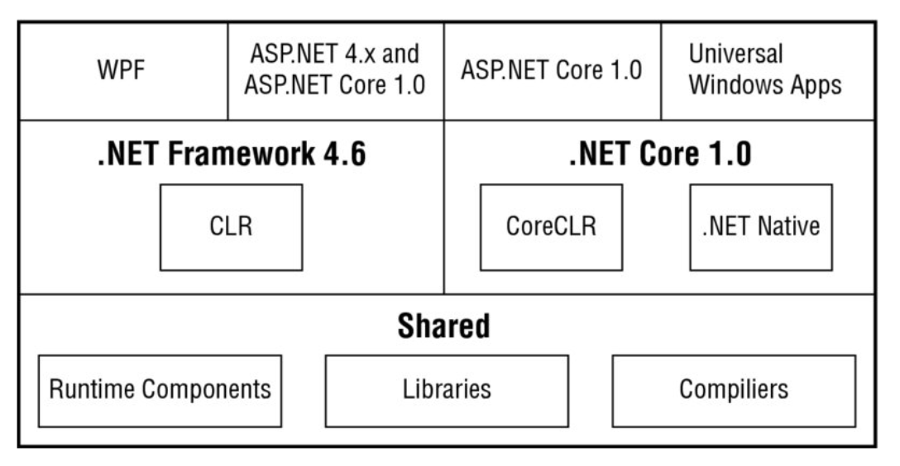

# C# and .NET basics
> Christian Nagel: Professional C# 6 and .NET Core 1.0, Wrox 2016 [PrC#6]: chapters 1, 2, 3, and 4.
> Peter Sestoft: C# Precisely Second Edition, MIT 2012 [C#P2]: chapters 1, 2, and 3.

### What's new with the Universal Windows Platform
With Windows 8, a new programming API called Windows Runtime came.
Applications using that could be made available via the Microsoft Store. These have been called *Metro apps*, *Modern apps*, *Windows Store apps* and *Universal apps*.

Now, they are just Windows apps, running on the *Universal Windows Platform (UWP)*.

#### UWP
The goals of UWP apps are:
- Must be easily found via the Microsoft Store.
- To Be touch-friendly.
- To have a modern user interface with smooth interactions.
- To be trustable.

The design guidelines were pretty strict in Windows 8 and 8.1.

Windows 10 made the design much more open. It is the developer who decides on what user interface best matches the users and apps.

#### Windows Runtime 3.0
Defines an XAML user interface, implements an application lifecycle and allows background functionality, sharing of data between apps and more.

#### Universal apps
You can now use the same binary not only for Windows and Windows Phone, but also for Xbox, IoT devices, HoloLens and more.

You can serve all windows platforms from one codebase.

## .NET 2015
.NET 2015 is an umbrella term for all the .NET technologies.

These can be divided into three main blocks:
- .NET Framework 4.6
- .NET Core 1.0
- Shared



#### .NET Framework 4.6
ASP.NET Core 1.0 and ASP.NET 4.x runs on the .NET Framework 4.6 (which is now considered legacy) as well as WPF (Windows Platform).

It uses the (old) CLR runtime.

#### .NET Core 1.0
ASP.NET Core 1.0 also runs on .NET Core 1.0. So does Universal Windows Apps.

It uses the CoreCLR runtime, *or* it can be compiled to native code (.NET Native).

UWP automatically makes use of this feature.

### Shared between .NET Framework 4.6 and .NET Core

- *Runtime components*: Such as the code for the garbage collector and the *RyuJIT* Just-In-Time compiler that compiles IL-code to native code are shared.
	- *RyuJIT* is used by CLR and CoreCLR.
	- The garbage collector is used by CLR, CoreCLR and .NET Native.

- *Libraries* can be shared between applications based on .NET Framework 4.6 and .NET Core 1.0.
	- NuGet packages helps put these libraries in a common package that is available on all .NET platforms.

- The .NET compiler platform is also used by all technologies.

### .NET Framework 4.6
Used for creating Windows Forms and WPF (Windows Platform) applications as well as working with ASP.NET Web Forms and ASP.NET 4.6.

### .NET Core 1.0
The new .NET. It is open source.
The runtime *CoreCLR* is the framework containing collection classes, file system access, console, XML and a lot more.

#### No external dependencies
**Unlike the .NET Framework where the specific version you needed had to be installed on the operation system, .NET Core includes the framework *and* runtime with the application.**

This means that you can deploy .NET applications such as ASP.NET without worrying about dependencies.

#### Modularity
Instead of bundling all class libraries with the framework, the framework instead splits chunks of class libraries up into NuGet packages.

You then decide what you need with each application. This also means that, as .NET Core grows, no longer will the amount of classes kept for legacy reasons stack up and put a huge load on the framework. One example of this in .NET Framework is the old collection classes which have become unneeded (but kept for legacy reasons) after the generic collection classes were added.

#### Faster release cycle and less legacy code
Since the runtime is bundled within the application, Microsoft doesn't need to worry about compatibility with existing applications when they commit changes to the language or class libraries.

This translates into faster release cycles and less need for them to have legacy considerations when they make breaking changes.

## Assemblies
Libraries and executables of .NET programs are known as *assemblies*.

### Assembly
An assembly (in the world of .NET) is the logical unit that contains compiled IL code target at the .NET Framework.

It is **completely self-describing** and is **a logical rather than a physical unit**.

### Library assemblies vs executable assemblies
Executable assemblies contains a main program entry point, whereas a library assembly does not.

### Metadata
Assemblies contain metadata that describes the types and methods defined in the corresponding code.

#### Manifest
It also contains metadata that explains "itself". This is known as the *manifest*, and it enables checks to be made on the version of the assembly and on its integrity.

### Private vs Shared assemblies
**Shared assemblies does not relate to UWP since all code is compiled to one native image!**.

#### Private assemblies
Private assemblies ship with software and are intended to be used only with that software.

Typically used when you supply an app in the form of an executable and a number of libraries, where the libraries contain code that should be used **only** with that app.

They are private since because an app may load only private assemblies located in the same folder that the main executable is loaded in (or in a subfolder of it).

This also means that there is no risk of some other software overwriting one of your assemblies with some new version of it (except if they are placed in the same folder).

### Shared assemblies
Not relevant for UWP as stated earlier.

Intended to be common libraries that any other application can use.

Because any other software can access a shared assembly, more precautions need to be taken against the risks:

- Name collisions: Where another company's shared assembly implements types that have the same names as those in a shared assembly. Client code *could* theoretically have access to both assemblies simultaneously, so this could be a problem.

- The risk of an assembly being overwritten by a different version of the same assembly.

#### What can you do about it
Use the *global assembly cache (GAC)* which is a special directory subtree in the file system.

Also, shared assemblies are given a name based on private key cryptography. The name is known as a *strong name*: It is guaranteed to be unique and must be quoted by apps that reference a shared assembly.

### NuGet
A NuGet package is a .zip file that contains the assembly (or multiple assemblies) as well as configuration information and PowerShell scripts.

NuGet packages enables not only the installation of official .NET class libraries, but also libraries from third parties.

## Common Language Runtime (CLR)
In all cases where the Native .NET compiler isn't used, a *Common Language Runtime* is needed.

Before an app can be executed by a CLR, source code needs to be compiled.

The runtime has a type loader, garbage collector, threading and other stuff.

### Compilation
In .NET, compilation happens in two steps:

1. Compilation of source code to Microsoft Intermediate Language (IL).

2. Compilation of IL to platform-specific native code by the CLR.

The IL code is available within a .NET assembly. It is during runtime that a JIT compiler compiles IL code and creates the platform-specific native code.

#### RyuJIT
A new shared compiler between CLR and CoreCLR.

It is faster and has better support for debugging, including an option for editing the code while debugging.

## Windows Runtime
A  new framework. This runtime is used by the Windows Universal Platform.

With the help of language projection, the Windows Runtime can be used with Javascript, C++ and .NET languages.

## Hello, World!

```csharp
using System;

class Program
{
	static void Main()
	{
		Console.WriteLine("Hello, World!");
	}
}
```

## How to compile
### How to compile with .NET 4.6
```shell
csc HelloWorld.cs
```

This produces an assembly that contains Intermediate Language (IL) code.

#### Reading the assembly
Using the Intermediate Language Disassembler (IL DASM) tool, you can read the assembly, including the manifest.
Run `ildasm.exe` and open the executable file to do so.

Opening up the assembly, you can click on for instance the `Main` method to reveal the IL code of the method.

It looks like a Microsoft-magic variant of Assembly:
```
.method private hidebysig static void Main() cil managed
{
	.entrypoint
	// Code size		13 (0xd)
	.maxstack 8
	IL_0000: nop
	IL_0001: ldstr	"Hello, World!"
	IL_0006: call		void [mscorlib]System.Console::WriteLine(string)
	IL_000b: nop
	IL_000c: relate
} // end of method Program::Main
```

### How to compile with .NET Core CLI
You need to install the .NET Core CLI tools and have `dotnet` in your path.

#### Creating a new project
Run `dotnet new` which:
- Creates a `Program.cs` file with some "Hello, World!" code.
- A `Nuget.config` file that defines the server from which the NuGet packages should be loaded.
- A `project.json` file which holds the project configuration.

#### `project.json`
Defines the framework application info such as version, description, author, tags, dependencies and frameworks:
```json
{
	"version": "1.0.0-*",
	"description": "blablabla",
	"authors": ["Bob Johnson"],
	"tags": ["foo", "bar", "baz"],
	"projectUrl": "https://fsfawdpoaw.com",
	"licenseUrl": "",
	"compilationOptions": {
		"emitEntryPoint": true
	},

	"dependencies": {
		"NetStandard.Library": "1.0.0-*"
	},

	"frameworks": {
		"netstandardapp1.5": {
			"imports": "dnxcore50"
		}
	},
	"runtimes": {
		"ubuntu.14-04-x64": {},
		"win7-x64": {},
		"win10-x64": {},
		"osx.10.10-x64": {},
		"osx.10.11-x64": {}
	}
}
```

- The `compilationOptions` has the `emitEntryPoint` key which can be set to `true` (default) if you create a `Main` method as a program entry point. This `Main` method is invoked when you run the app. It is not needed with libraries.

- The `dependencies` section lists all the dependencies of the program, such as additional NuGet packages needed to compile the program. The default dependency is the `NetStandard.Library`.

- The `frameworks` section lists the .NET frameworks that are supported by the app.

- The `runtimes` section lists the runtimes that should be supported by the app.

- The others adds metadata such as description, author info and such.

Version 1.0.0-* means version 1.0.0 and then the latest available version for that. For instance, 1.0.0.9

#### `dotnet restore`
Downloads all dependencies of the app. You must call it from the directory where the `project.json` file is located.

#### How to compile
Run `dotnet build` to compile the application.

After compilation, the assembly with the IL code of the `Program` class will be located in *bin/debug/[netstandardapp1.5|net46]*.

#### How to compile directly to native code
Run `dotnet build --native`.

Results in faster startup and less memory consumption.

#### How to run an application
Run `dotnet run` to start the app.

#### Packaging an app
To create a NuGet package, run `dotnet pack`.
If the app is called `HelloWorldApp`, it will create the file `HelloWorldApp.1.0.0.nupkg`. It will contain assemblies for all supported frameworks.

It is actually a .zip file (with a "wrong" file extension - you can simply rename it to ".zip").

#### Publishing an app
Run `dotnet publish`.

## Technologies
Here are some of the technologies associated with .NET (and terminology)

### Data Access
Has to do with access to data (duh).

#### ADO.NET
Allows you to read and write to databases.

#### ADO.NET Entity Framework
An abstraction layer which offers a mapping of object hierarchies to the relations of a database.

With the newest releases of the Entity Framework, mapping happens with a principle called *Code First* where you don't do the mapping via XML files but instead via attributes or a fluent API that can define the mapping programmatically.

Also, it now supports NoSQL as well as relational databases.

### Windows Desktop Applications
Two technologies are available:
- Windows Forms
- Windows Presentation Foundation (WPF)

#### Windows Forms
Consists of classes that wrap native Windows controls. It is based on pixel graphics.

#### Windows Presentation Foundation
A newer technology. Based on vector graphics (which also enables better scaling on different resolutions and screen sizes).

WPF makes use of XAML in building applications.

##### XAML
XAML stands for eXtensible Application Markup Language.

It is the XML declaration used to create a form that represents all the visual aspects and behaviors of the WPF application.
It is a step towards declarative programming, which the industry is moving to.

##### Declarative programming
Is development where instead of creating objects through programming in a traditional language, you declare everything through XML-type programming.

##### The future of WPF
As long as some of ones users have not upgraded to Windows 10, you still need to use WPF. You can create apps with both WPF and UWP by sharing as much code as possible.

### Universal Windows Platform
A Windows 10+ only platform. Allows development to not only the desktop version of Windows, but also phones, Xbox, HoloLens, etc.

Devices can then add their own SDK's on top of it for features that are specific for a given platform.

### SOAP Services with Windows Communication Foundation (WCF)
WCF is a powerful but complex way to connect disparate systems. Offers SOAP-based communication with all the features used by standards-based web services such as security, transactions, duplex and one-way communication, routing, discovery, etc.

### Web Services with the ASP.NET Web API
An easy solution for communication. The ASP.NET Web API is based on REST.

The client can receive JSON or XML data.

A great approach for creating microservices.

### WebHooks and SignalR
For real-time web functionality and bidirectional client-server communication.

SignalR allows pushing information to connected clients as soon as info is available (so it is a WebSocket technology) and falls back to a pull-based mechanism if WebSockets are not available.

WebHooks allows integration with public services which then can call into your public ASP.NET Web API service. It receives push notifications.

### Windows Services

Background processes that runs with the startup of Windows is a Windows Service.

For instance, the Internet Information Server (IIS), a server that can run a web service, runs as a Windows Service. But you can also build your own or use a third-party server.

### Web Applications
ASP.NET MVC is based on MVC, allows a clear separation for user interface code with HTML, CSS and JS. It only uses C# on the backend.

### Microsoft Azure
Microsoft Azure offers Software as a Service (SaaS), Infrastructure as a Service (IaaS) and Platform as a Service (PaaS), and sometimes offerings in between.

The most important one for developers are PaaS. You can access services for string and reading data, use computing and networking capabilities of app services and integrate developer services within the app.

## Core C#
### Solution
A solution enables you to group multiple projects and to open all the projects of a solution together.

### Namespace
A way to group associated classes.

The `namespace` keyword declares the namespace with which your class should be associated.

The `using` declaration specifies a namespace that the compiler should look at to find any classes that are referenced in the code but aren't defined in the current namespace. (So it's like the `import` statement).

### Static `using` statements
If you write:
```csharp
using static System.Console;
```

That enables you to refer to the static members of the class and omit the namespace and class names.
So, instead of having to write: `Console.WriteLine`, here you would be able to call `WriteLine` directly.

### Where code can go
All code must be contained within a class.

### The static `Main` method
This method is called when the program is started. It is the entry point of the executable. It must either return `void` or an integer `int`.

### Initializing Variables
**The C# compiler requires that any variable is initialized before it can be referred to in an operation.**

C# helps you out with this a couple of places:

- Fields in a class or struct are by default zeroed out when they are created (if not set to a value).

- Variables that are local to a method must be explicitly initialized before any operation that uses it, *but*, you can define the variable and then simply initialize it later *but before it is used in an operation*.

This means that the following is OK:
```csharp
Something objSomething;
objSomething = new Something();
```

### Type Inference
You can do type inference with the `var` keyword. It is the compiler that infers what the type of the variable is by what the variable is initialized to (The takeaway here is that it is *not* happening on runtime).

So:
```csharp
var someNumber = 0;
// Becomes
int someNumber = 0;
```

Some rules:

- The variable must be initialized.
- The initializer cannot be null.
- The initializer must be an expression.
- The initializer cannot be an object unless you create a new object in the initializer.

### Constants
You can declare a constant with `const`:
```csharp
const int a = 100;
```

## .NET Types
All C# keywords for data types are actually mapped from the compiler to .NET data types!

This means that an `int` in C# is actually an instance of a .NET struct: `System.Int32`.

**This means that you can treat primitive data types as if they were classes and thus call methods on them.**

### Integer types
If the type is inferred, it defaults to `int`.
<table>
	<tr>
		<td><strong>Name</strong></td>
		<td><strong>.NET Type</strong></td>
		<td><strong>Description</strong></td>
	</tr>
	<tr>
		<td><code>sbyte</code></td>
		<td><code>System.SByte</code></td>
		<td>8-bit signed integer</td>
	</tr>
	<tr>
		<td><code>short</code></td>
		<td><code>System.Int16</code></td>
		<td>16-bit signed integer</td>
	</tr>
	<tr>
		<td><code>int</code></td>
		<td><code>System.Int32</code></td>
		<td>32-bit signed integer</td>
	</tr>
	<tr>
		<td><code>long</code></td>
		<td><code>System.Int64</code></td>
		<td>64-bit signed integer</td>
	</tr>
	<tr>
		<td><code>byte</code></td>
		<td><code>System.Byte</code></td>
		<td>8-bit unsigned integer</td>
	</tr>
	<tr>
		<td><code>ushort</code></td>
		<td><code>System.UInt16</code></td>
		<td>16-bit unsigned integer</td>
	</tr>
	<tr>
		<td><code>uint</code></td>
		<td><code>System.UInt32</code></td>
		<td>32-bit unsigned integer</td>
	</tr>
	<tr>
		<td><code>ulong</code></td>
		<td><code>System.UInt64</code></td>
		<td>64-bit unsigned integer</td>
	</tr>
</table>

### Floating-Point types
If the type is inferred, it defaults to `double`.
<table>
	<tr>
		<td><strong>Name</strong></td>
		<td><strong>.NET Type</strong></td>
		<td><strong>Description</strong></td>
	</tr>
	<tr>
		<td><code>float</code></td>
		<td><code>System.Single</code></td>
		<td>32-bit single-precision floating point</td>
	</tr>
	<tr>
		<td><code>double</code></td>
		<td><code>System.Double</code></td>
		<td>64-bit double-precision floating point.</td>
	</tr>
</table>

#### The Decimal type.
Offers precision up to 28 digits. It is not implemented as a primitive type, so it is pretty expensive.

<table>
	<tr>
		<td><strong>Name</strong></td>
		<td><strong>.NET Type</strong></td>
		<td><strong>Description</strong></td>
	</tr>
	<tr>
		<td><code>decimal</code></td>
		<td><code>System.Decimal</code></td>
		<td>128-bit high-precision decimal notation</td>
	</tr>
</table>

### The Boolean type
<table>
	<tr>
		<td><strong>Name</strong></td>
		<td><strong>.NET Type</strong></td>
		<td><strong>Description</strong></td>
	</tr>
	<tr>
		<td><code>bool</code></td>
		<td><code>System.Boolean</code></td>
		<td>Represents true or false</td>
	</tr>
</table>

### The Character Type
For strong the value of a single character.
Literals of type `char` are signified by being enclosed in single quotation marks: `'A'`.

Can also be represented with four-digit hex Unicode values such as `\u0041`.

<table>
	<tr>
		<td><strong>Name</strong></td>
		<td><strong>.NET Type</strong></td>
		<td><strong>Description</strong></td>
	</tr>
	<tr>
		<td><code>char</code></td>
		<td><code>System.Char</code></td>
		<td>Represents a single 16-bit (Unicode) character</td>
	</tr>
</table>

### Predefined Reference types
<table>
	<tr>
		<td><strong>Name</strong></td>
		<td><strong>.NET Type</strong></td>
		<td><strong>Description</strong></td>
	</tr>
	<tr>
		<td><code>object</code></td>
		<td><code>System.Object</code></td>
		<td>The root type. All other types - including value types - are derived from object.</td>
	</tr>
	<tr>
		<td><code>string</code></td>
		<td><code>System.String</code></td>
		<td>Unicode character string.</td>
	</tr>
</table>

### Notes about string
Even though the `string` keyword appears to signify that `string` is a primitive type, it isn't. It is a reference type.
But, there *are* some Microsoft-Magic here:
- Strings are immutable. Making changes to one creates an entirely new `string` object.
- You can do `==` between strings which works like it would between primitive values (and *not* do an equality-check on reference, but on the actual held values).

### Escape characters in strings
If you do
```csharp
string myStr = "hello\goodbye";
```

The compiler will think that "\" is actually the beginning of an escape sequence (which it usually isn't). So, you must escape it with one more backslash:
```csharp
string myStr = "hello\\goodbye";
```

Or, you could prepend the string with "@" to state that the string should not interpret anything as escape sequences (and make it multi-line):
```csharp
string myStr = @"hello\goodbye";
string multiLine = @"hello,
how are you?";
```

#### String interpolation
Prepend the string with "$" to enable string interpolation:
```csharp
string myStr = "a string";
string interpolated = $"this is {myStr}";
```

### Do-While loop
Is the post-test version of the `while` loop which means that the `do` block will always be executed at least once and maybe more than that:
```csharp
do
{
	// Always happens at least once.
	someStuff();
} while (condition); // Will loop as long as condition is true.
```

### Foreach loop
Uses the following syntax:
```csharp
foreach (var thing in arrayOfThings)
{
	doStuff();
}
```

### Jump statements
Enables you to jump immediately to another line.

#### `goto`
The `goto` statement enables you to jump directly to another specified line, indicated by a *label*:
```csharp
goto Label1;
WriteLine("This won't be executed");
Label1:
WriteLine("Here we go again");
```

Some restrictions:
- You can't jump into a block of code such as a `for` loop.
- You can't jump out of a class.
- You can't exit a `finally` block after try-catch blocks.

## Namespaces
A namespace is a logical, rather than a physical grouping.
It prepends whatever classes it holds with the name of the namespace so that multiple distinct classes with the same short name can be used within the same program.

For instance:
```csharp
namespace DisneyCharacters
{
	class MickeyMouse
	{

	}
}
```
The *fully qualified name* for the `Mickey` class is then `DisneyCharacters.MickeyMouse`.

**Namespaces can be nested.**

## The `using` directive
Obviously, namespaces can grow rather long and tiresome to type, so C# allows you to abbreviate class's full name by listing the class's namespace at the top of the file, prefixed with the `using` keyword.

For instance:
```csharp
using DisneyCharacters
```

Allows you to use the `MickeyMouse` class directly.

This obviously only works as long as there are not two (or more) namespaces in the same file that holds classes with the same short name. In that case, you must refer to it with its fully qualified name (<namespace>.<short-name>).

### Namespace aliases
To avoid name space conflicts or to assign a shorter name to a namespace, you can provide an alias:
```csharp
using alias = namespaceName;
```
Where `alias` is the name of the alias. Compared to Javascript, its like `import Whatever as alias from "something"`;

## XML Documentation
Another type of comments beside C-style comments is `///` comments which can produce documentation in XML format automatically. Within these, you can place XML tags containing documentation of the types and type members in the code.

For instance:
```csharp
namespace whatever
{
	/// <summary>
	/// A summary here
	/// </summary>
	class Something
	{

	}
}
```

## C# Preprocessor Directives
There are commands that are never actually translated to any commands in executable code but does affect aspects of the compilation process. These are called *preprocessor directives*.

One of such things could be to prevent the compiler from compiling certain portions of your code.

**All preprocessor directives begin with the '#' symbol**.

### `#define`
`#define` is used like this:
```csharp
#define DEBUG
```
This tells the compiler that a symbol with the given name ("DEBUG") exists. It is like declaring a variable, except that it doesn't really have a variable - it just exists. It is not part of your actual code, it exists only for the benefit of the compiler, while the compiler is compiling the code.

`#define` has no effect if a symbol already exists with that name.

It must be placed at the beginning of the C# source file before any code.

### `#undef`

`#undef` does the opposite of `#define`: It *removes* the definition of a symbol:
```csharp
#undef DEBUG
```

`#undef` has no effect if the symbol is not defined.

It must be placed at the beginning of the C# source file before any code.

### `#if`, `#elif`, `#else`, `#endif`
These informs the compiler whether to compile a block of code or not.
For instance:
```csharp
int DoSomething ()
{
	#if DEBUG
	Console.WriteLine("Hello World!");
	#endif
}
```

Here we can see the strength of the `#define` directive. If DEBUG is defined, the compiler will compile the `Console.WriteLine` statement in the code example, otherwise it won't.

Then what you'd usually do is to comment out the `#define DEBUG` directive when you ship.

This is known as *conditional compilation*.

The `#elif` (else if) and `#else` directives have intuitively obvious meanings.

### `#warning` and `#error`
Will cause a warning or an error to be raised when the compiler encounters them.

If the compiler sees a `#warning` directive, it displays the subsequent text to the user as if it is a compilation error message and then continues compilation.

If the compiler sees a `#error` directive, it does the same thing except the compilation will stop.
For instance:
```csharp
#if DEBUG && RELEASE
#error"You can't both be in debug and release at the same time!"
#endif
```

### `#region` and `#endregion`
These are used to indicate that a certain block of code is to be treated as a single block with a given name:
```csharp
#region Member Field Declarations
int x;
double d;
Currency balance;
#endregion
```

It helps Visual Studio lay out your code better on the screen.

### `#line`
Used to alter the filename and line number information that is output by the compiler in warnings and error messages. Most useful when coding in conjunction with another package that alters the code you are typing before sending it to be compiler. You can also use `#line default` to restore the line to the default line numbering.

```csharp
#line 164"Filename.cs"
blablabla;
```
### `#pragma`
Can either suppress or restore specific compiler warnings. Can be implemented on the class or method level.

This disables the "Field not used" warning and then restores it after the MyClass class compiles:
```csharp
#pragma warning disable 169
public class MyClass
{
	int neverUsedField;
}
#pragma warning restore 169
```

## Code Style, Programming Guidelines and rules

### Identifiers
- They must begin with a letter or a underscore.
- C# keywords can't be used as identifiers.
- If the name clashes with a C# keyword, you can prefix it with the @ symbol to indicate to the compiler that what follows should be treated as an identifier, not as a C# keyword.
- They *CAN* contain Unicode characters. A valid identifier, though it looks pretty odd, could be: `\u005fIdentifier`. Calling `_Identifier` would be identical to calling `\u005fIdentifier` then, since `\u005f` is Unicode for the underscore character.

### Naming conventions
- The name of a variable should reflect the purpose of it, not its data type.
- Pascal casing for *all* names. This means that the first letter of each word in a name is capitalized: `EmployeeSalary`, `ConfirmationDialog`, etc. There are some exceptions to the rule:

	-	Names of all private member fields should be in camelCase. For instance, `private int subscriberId`.
	- Names of all parameters passed to methods: `void RecordSale(string salesmanName, int quantity)`.
	- To distinguish items that would otherwise have he same name:
	```csharp
		private string employeeName;
		public string EmployeeName;
	```
	This of course is only made possible because of the fact that C# is case-sensitive (otherwise, the compiler would see those two as the same name).

- Constant values should *also* be Pascal-cased, even though other languages suggest that they should be all-uppercased.

### Name styles
Be consistent.

### Namespace names
The convention is `<CompanyName>.<Technologyname>`.
For instance:
```csharp
namespace SomeCompany.SomeProduct
```

### Use of properties and methods
- Reading a value should not have any observable side-effect.
- Setting a value should not have any side-effect that is not directly related to the property.
- Successive reads of a property should give the same result.

It seems the point is that reading/writing properties should be atomic operations. So, getters and setters should avoid side-effects beyond what makes sense for that property (such as calling `PropertyChanged()` if using Observables).

### Use of fields
- Fields should always be private except for constants or read-only fields that should be public.

## Structs
Structs differ from classes because they do not need to be allocated on the heap (classes are reference types and are always allocated on the heap whereas primitive types are stored on the stack).

**Structs are value types and are usually stored on the stack. Also, structs cannot derive from a base struct.**

You typically use structs for smaller data types for performance reasons (for instance if you would like instances to be allocated on the stack rather than on the managed heap). Structs does look very similar to classes. The main difference is that you use the keyword `struct` instead of `class` to declare them.

Often, you can assume that code presented for a class would work equally well for a struct.

**But know that objects of type of a struct are passed by value!**

### Instantiating a `struct`
You use the `new` keyword to declare an instance just like classes.

## Properties (getters and setters / accessors)
To write accessors, you can do:
```csharp
private int _someProp;
public int SomeProp
{
	get { return _someProp; }
	set { _firstName = value; }
}
```

You can't give any parameters for a `set` accessor, but the compiler assumes it takes one parameter which is referred to with the keyword `value`.

### Access Modifiers for Properties
You can allow differing access modifiers on getters and setters:
```csharp
private int _someProp;
public int SomeProp
{
	get { return _someProp; }
	private set { _someProp = value; }
}
```

### Auto-Implemented properties
If there is not going to be any logic in the getter/setter, you can use a nice Microsoft-Magic powered shorthand version:
```csharp
public int SomeProp { get; set; }
```

You can also initialize properties with a *property initializer*:
```csharp
public int SomeProp { get; set; } = 42;
```

You can also use access modifiers for auto-Implemented properties:
```csharp
public int SomeProp { get; private set; }
```

## Methods
### Expression-Bodied methods
If the implementation of a method consists just of one statement, you can use arrow-expressions (or *expression-bodied methods*) for declaring the method:

```csharp
public bool IsIdentical (int num) => num == anotherNum;
```

Now *that's* nice. All languages should have arrow-functions for instance methods!

### Method Overloading
Several versions exist of the method but with different signatures. One overloaded method can invoke another. C# will figure out which version to use according to the types of arguments.

For instance:
```csharp
class MyClass
{
	public int DoSomething (int x)
	{
		return DoSomething(x, 10);
	}

	public int DoSomething (int x, int y)
	{
		return x + y;
	}
}
```

### Expression-Bodied Properties (Computed properties)

Expression-bodied properties are properties with the `get` accessor, but where you don't need to write the `get` keyword - Just the implementation of the `get` accessor follows the lambda operator:
```csharp
public class Person
{
	public string FirstName { get; }
	public string LastName { get; }
	public string FullName => $"{FirstName} {LastName}"
}
```

Very nice and clean!

### Named arguments in invoked methods
For strictly readability-related reasons, you can name the arguments you call a method with. For instance, say you had this method:
```csharp
public void CoolMethod (int x, int y) {};
```

You could then give names to the arguments you pass to the method when invoking it so it is immediately clear to the reader what is what:
```csharp
CoolMethod(x: 10, y: 20);
```

For the compiled code, there is no difference, *but* you can actually reorder the arguments in this way by referring to the names of the arguments in the named arguments!

For instance, I could have written:
```csharp
CoolMethod(y: 20, x: 10);
```

...And that would have been a-okay.

### Optional arguments
You can declare optional arguments as long as you assign default values to them.

Also, optional parameters must be the last ones defined.

```csharp
public void SomeMethod (int notOptionalNumber, int optionalNumber = 42) {}
```

This allows for the method to be called with only 1 argument.

But here comes the cool part:
Imagine you had this method signature:
```csharp
public void SomeMethod (int x, int optY = 2, int opZ = 3) {}
```

Then you could invoke it with a named argument, stating which of the optional arguments to override the default value for:
```csharp
SomeMethod(5, optZ: 10);
```

That is really nice. It avoids these scenarios where you have to fill-in a lot of values, either `null` in some languages or in other cases actually read the implementation and manually call the method with the default values from the implementation (which might change in the future without your knowledge when updating package dependencies, etc).

### Variable number of arguments
Like `aMethod(...restArguments)` in Javascript, we have this in C#:
```csharp
void SomeMethod (params int[] data) {}
```

Which then enables you to loop through the arguments or whatever you want. But also, it allows for the client to invoke the method with an arbitrary amount of arguments without the need for, say, providing lots of overridden methods for any amount of potential arguments (which was doomed from the start!)

## Calling constructors from other constructors
Say we have this scenario with two constructors:
```csharp
public class SomeClass
{
	private string _field1;
	private string _field2;

	public SomeClass (string arg1)
	{
		_field1 = arg1;
		_field2 = "lol, omg";
	}

	public SomeClass (string arg1, string arg2)
	{
		_field1 = arg1;
		_field2 = arg2;
	}
}
```

It would be nice to not need to write the same code twice. So Microsoft offers some Microsoft-Magic for us here:

```csharp
public class SomeClass
{
	private string _field1;
	private string _field2;

	public SomeClass (string arg1): this(arg1, "lol, whatever like")
	{
	}

	public SomeClass (string arg1, string arg2)
	{
		_field1 = arg1;
		_field2 = arg2;
	}
}
```

Which just causes the constructor with the nearest matching parameters to be called.

## Static Constructors
It is possible to write a static no-parameter constructor for a class. Such a constructor is executed only once, unlike other constructors (which are obviously called for each time an instance of a class is constructed).

Here's the syntax:
```csharp
class MyClass
{
	static MyClass()
	{
		// Initialization code here.
	}
}
```

One use-case could be that some static fields or properties need to be initialized from an external source before the class is used for the first time.

**The .NET runtime makes no guarantees about when a static constructor will be executed *but* it guarantees that it is run exactly once and before your code makes any reference to the class. It is usually executed immediately before the first call to any member of the class.**

## Static classes
If you give a class a `static` modifier, it cannot be instantiated - thus it may only contain static methods and fields. *However*, it *does* support a static constructor (obviously).

## Readonly members
The `readonly` keyword can be used if you do not want to change a data member after initialization.

### Readonly fields
Fields with the `readonly` modifier can be assigned only values from constructors (or be initialized to some value in the declaration, but then you should go for `const` instead.).

### Readonly properties
Easy with Microsoft-Magic. Just omit the setter and initialize the value:
```csharp
public string SomeProp { get; } = "This value will never change";
```

As you can see, the value can never be set again - but it *is* initialized to something.

This is pretty much shorthand for:
```csharp
private readonly string _someProp;
public string SomeProp
{
	get { return _someProp; }
}
```
...Except for the fact that `_someProp` would then need to be set directly in the constructor.

### `readonly` vs `constant`
`readonly` values are assigned during runtime from a constructor. This is useful if you want the value to be assigned *once*, but wants the value to be set dynamically according to some given arguments.

`const` are declared on compile-time and thus must be initialized to value in the declaration. This means that you must know which value to assign to the field when you declare the field.

Nice!

## Immutable types
If an object only have `readonly` members, it is an immutable type. The content can *only* be set on initialization time.

## Anonymous types
