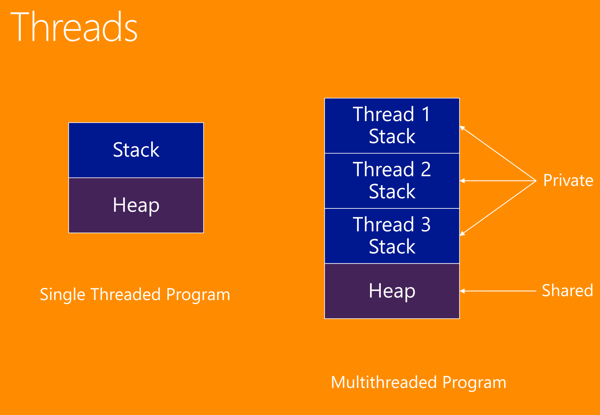

# Async and Parallel
> [PrC#6]: ch. 15, 21, and 22
>
> [C#P]: ch. 21, 22, and 23

## Microsoft deserves credit
Let me just say this:
`async/await` is one of the most fantastic things ever invented in the history of programming.

## `Task` to `Promise` Cheat sheet:
- `Task.WhenAll` => `Promise.all`
- `Task.WhenAll` => `Promise.race`
- `Task.ContinueWith` => `Promise.then`
- `Task.FromResult` => `Promise.resolve`

## Threads


## conventions
- Async methods have a suffix of *Async*. For instance, `DownloadAsync`

## Why asynchronous programming is important
With *asynchronous programming*, the calling thread is not blocked.

This is especially important when it comes to the UI thread which for long running tasks such as fetching things from the network should still be responsive.

## Asynchronous Patterns

The first one is simply called:
### Asynchronous pattern
Here, instead of a method called `Download`, you'd have a method called: `BeginDownloadAsync` which would take a callback as argument (a delegate).

This callback will be invoked as soon as the asynchronous call has completed.

Within it, you would then be able to extract the contents.

But callbacks lead to callback-hell, as we know all to well as seasoned Javascript developers.

### Event-Based Asynchronous Pattern
Here, instead of having the `BeginDownloadAsync` method take a delegate that should be invoked when the asynchronous method is completed, **an event is defined**. The `DownloadCompleted` event is invoked as soon as the asynchronous method has completed. That event can be described to.

### Task-Based Asynchronous Pattern
Using the `await` keyword. You know and love it already:
```csharp
string response = await client.DownloadAsync(req.Url);
```

This does *not* unblock the UI thread even though it looks perfectly synchronous. And it *is* synchronous in terms of the execution of the method body. The next line of code is not executed before the result come in. It's just that the thread is open for other parallel stuff.

The `await` keyword can only be used within methods that has `async` in its signature.

#### The magic of `async/await`
The `async` keyword creates a state machine similar to the `yield return` statement.

#### Creating background tasks for synchronous tasks
If you have synchronous tasks that may be long-running and thus block the UI thread, you can use `Task.Run()`:
```csharp
await Task.Run(() =>
{
	var something = stuff.ThatTakesALongTime();
});
```

This creates a background task which is awaitable and doesn't block the UI thread.

## Foundation of Asynchronous Programming

### Creating Tasks
Whenever you have something you want to make asynchronous, you can always wrap it in `Task.Run` which by the way is generic, so if whatever synchronous code you run has a return value, make sure to pop it in there:
```csharp
Task<string> SomethingAsync (string name)
{
	return Task.Run<string>(() =>
	{
		return SomeLongRunningStuff(name);
	});
}
```

This is now awaitable from the outside:
```csharp
string something = await SomethingAsync("Frederik");
```
Again, this does not block the thread, but ensures that the next line won't be executed before the async call has returned.

### Using `await` inside parameters
Yes, you can do that:
```csharp
WriteLine(await SomethingAsync());
```
This will instead pass in the return value of `SomethingAsync()` to `WriteLine`.

### Which methods can be `await`ed?
Every method that returns a `Task`.
You cannot declare the `Main` method as async and thus you can't await anything in there. The same goes for constructors which will never return a `Task`.

## The `Task` object
Is exactly like a `Promise` in Javascript.

A `Task` object contains information about the task created and allows waiting for its completion.

It has a method, `CompleteWith`, which defines the code that should be invoked as soon as the task is finished (you don't have to).

When you `await` something that returns a `Task`, the compiler transpiles the `await` keyword by putting all the code that follows within the `ContinueWith` block:
```csharp
Task<string> task = SomethingAsync();
task.ContinueWith(t =>
{
	// Access the result in the 'Result' property.
	var whatever = t.Result;
	// Do something with the result...
});
```

## Calling Asynchronous Methods Sequentially
This looks beautiful, but it is running sequentially, but doesn't have to, since the two operations are atomic:
```csharp
string s1 = await SomethingAsync(1);
string s2 = await SomethingAsync(2);
```

## Calling Asynchronous Methods in Parallel
### `Combinator`
Is a thing that accepts multiple parameters of the same type and returns a value of the same type. The passed parameters are "combined" to one.

Instead of doing that, we could also just run them in parallel with `Task.WhenAll` (which is a combinator):
```csharp
Task<string> t1 = SomethingAsync(1);
Task<string> t2 = SomethingAsync(2);
await Task.WhenAll(t1,t2);
```
We can access the resulting values in `t1.Result` and `t2.Result`;

There is also a `Task.WhenAny` which resolves as soon as *any* of the given Tasks resolve.

## Asynchronous Error Handling
Just place the call inside `try-catch` blocks and make sure to `await` the async method. Again, *exactly* like you know it from Javascript - 1 to 1.

## Cancellation
You can cancel `Task`s with a `CancellationTokenSource`. You make sure that those who should be able to cancel a `Task` holds a reference to an instance of a `CancellationTokenSource` that has been given to a Task. So, then you just call `Cancel()` on the `CancellationTokenSource` which then actually throws an `OperationCancelledException` that you should handle.
For instance:
```csharp
var cts = new CancellationTokenSource();
try
{
	var response = await SomethingAsync(cts);
} catch (OperationCancelledException ex)
{
	// Do something.
}
```
Anyone who had that cts would be able to invoke its `Cancel` method.

## How to make cancellable `Task`s
You can give `Task.Run` a `CancellationTokenSource`:
```csharp
Task.Run(() => {}, cts);
```

# Tasks and Threads (Parallelism)

### Concepts
- *task parallelism* is where different functions are executed simultaneously.
- *data parallelism* is where some data is processed simultaneously.

You can of course achieve parallelism with both options.

## Parallel class
It defines static methods for a parallel `for` and `foreach`: `Parallel.For` and `Parallel.ForEach`. These achieve data parallelism.

You can use `Parallel.Invoke` to invoke different methods concurrently (and thus achieve task parallelism).

So, for instance:
```csharp
var result = Parallel.For(0, 10, i =>
{
	// Does something in parallel for 10 iterations.
});
```

As you will quickly find out, there are no guarantees as to the order in which they execute.

### Breaking `Parallel.For` early.

Sure, no problem:
```csharp
Parallel.For(10, 40, (int i, ParallelLoopState pls)
{
	pls.Break();
});
```
*But*, all tasks that started before the `Break` method was called will continue running to the end.

## `Parallel.For` initialization
You can do an initialization for every thread with the generic for version of `For`:
```csharp
Parallel.For<string>(0, 10, () =>
{
	// Invoked once on each thread
	return "something";
},
{
	(i, pls, str1) =>
	{
		// The body. Invoked for each member.
		return str1;
	}
},
{
	str1 =>
	{
		// Final action on each thread
	}
});
```

### `Parallel.ForEach`
As you might expect, this one iterates through a collection:
```csharp
Parallel.ForEach<string>(data, s =>
{
	// Do something.
});
```

### `Parallel.Invoke`
This one enables you to run multiple methods in parallel:
```csharp
Parallel.Invoke(Foo, Bar);
```

## Tasks
These give you more control over the parallel actions.

**A *task* represents some unit of work that should be done.**

With `Task`, you can either start a task in a synchronized manner or in a separate thread. You are the boss.

### Starting Tasks
You can either use the `TaskFactory`, the constructor the `Task`, and the `Start` method.

Here's the different ways:
#### Tasks using the Thread Pool
The Thread Pool offers a **pool of background threads**.

It manages threads on its own, increasing or decreasing the amount of threads as needed. When a thread has fulfilled some actions, it is returned to the Pool

#### Using `StartNew()`
You can pass whatever task should be run to to  a `TaskFactory`'s `StartNew` method:
```csharp
var tf = new TaskFactory();
Tas t1 = tf.StartNew(TaskMethod, "blabla");
// or
Task.Factory.StartNew(TaskMethod, "blabla");
```

#### Using the `Task` constructor
You can also just do the same *with* the constructor of a `Task`, except you have to run `Start()` on it to start it:
```csharp
var t1 = new Task(TaskMethod, "blabla");
// You have to run 'Start'
t1.Start();
```

#### Using the `Run` method
This variant runs/starts the `Task` immediately:
```csharp
Task t1 = Task.Run(() => TaskMethod("blabla"));
```

## Synchronous Tasks
Tasks does **not** necessarily have to use a thread from a thread pool.

To run a `Task` synchronously, simply call `RunSynchronously` on the task:
```csharp
var t1 = new Task(TaskMethod, "run sync");
t1.RunSynchronously();
```

## Tasks using a separate thread
If the code of a task should run for a longer time, you can set `TaskCreationOptions.LongRunning`. This will make the task scheduler create a new thread rather than use one from the thread pool:
```csharp
var t1 = new Task(TaskMethod, "Long running", TaskCreationOptions.LongRunning);
t1.Start();
```

This way, the scheduler knows that it shouldn't wait for this one to finish and be returned to the pool if a new Task is instantiated that requires it - it should just spawn a new one.

## Futures: Results from Tasks (e.g. Generic tasks)
A task that returns a result is called a *future*.

If you use the generic variant of a Task, you can retrieve return values from the Task.

This means that you CANNOT do this:
```csharp
// This won't work since the Task must return void.
var t1 = new Task(() => true);
t1.Start();
```

This WILL work:
```csharp
var t1 = new Task<bool>(() => true);
t1.Start();
// The result is found in t1.Result.
```

## Returning Tasks from methods
You just need to make that the return type is `Task` or `Task<T>`.

If you need to return a Task due to practical reasons but have no need to actually do some asynchronous work, you can use `Task.FromResult`:

```csharp

void SomeMethod()
{
	var t1 = SomeOtherMethod();
	WriteLine(t1.Result); // "hello"
}

Task<string> SomeOtherMethod
{
	return Task.FromResult("hello");
}
```

## `Task.WaitAll()` and `Task.WaitAny()`
Is like `Task.WhenAll`/`Task.WhenAny` except it blocks the current thread of execution before proceeding.

## `Task.Delay`
You can do `Task.Delay(1000).Wait()` inside a method to block the thread for the given time.

If you're inside an async method, you can also just do `await Task.Delay(1000)`.

## Cancelling long-running Tasks
One easy way to do that is calling `CancelAfter` on an instance of a `CancellationTokenSource` and passing that to a `Task`.

```csharp
var cts = new CancellationTokenSource();
cts.CancelAfter(1000);
var t1 = Task.Run(() =>
{
	// do stuff
}, cts);


```

## Data parallelism with the Task Parallel Library Data Flow (TPL Data Flow)

### Data blocks
Data blocks act as a *source* to offer some data *or* as a target to *receive* some data.

It is pretty much thread-to-thread communication. I think of like `PostMessage` between workers in Javascript:
```csharp
var aThread = new ActionBlock<string>(s =>
{
	WriteLine(s);
});

aThread.Post("Hi there");
```

This way we can actually communicate with the thread directly.

### Source and Target Blocks
An `ActionBlock` uses a `Task` under the hood for its parallel execution work. **An `ActionBlock` is a target block and implements the interface `ITargetBlock`**.

And then we have the `ISourceBlock` interface which, not surprisingly, can be implemented by source blocks (blocks that act as a data source).

We also have a `BufferBlock` which can both be a source *and* a target (it implements both `ISourceBlock` and `ITargetBlock`).

So, if you have two block going on in your application, a producer and a consumer, you can run them in parallel with `Task.WaitAll`/`Task.WhenAll`.

# Task Synchronization
Synchronization issues can lead to race conditions and dead locks.

Using multiple tasks is easy as long as they don't access the same variables.

If you don't apply synchronization techniques, often you'll find that errors suddenly happen, and you don't know what caused it.

## Threading issues

### Race Conditions
A race condition can occur if two or more threads access the same objects and access to the shared state is *not* synchronized.

Obviously, if two threads are accessing the same variables, they might write to them at the same time.

To fix it, you need to `lock` the shared object.

#### The `lock` statement
With it, only one thread can exist inside the lock block for the state object.

You can only lock reference types, so if the resource of concern is a primitive type, you can use a reference type as condition:
```csharp
public class SomeSynchronizedClass
{
	readonly object _sync = new Object();
	int state = 0;

	public void SynchronizedMethod()
	{
		lock(_sync)
		{
			// Do stuff here with whatever needs to be synchronized, for instance access to the primitive value 'state'.
			state++;
		}

		// Everything down here can run concurrently
	}
}
```

Its a bit hacky, but it works.

### Deadlocks
If you use locks, you may run into deadlock situations.

This is because one thread might wait to access a resource held by another thread - but the other thread might then also wait for a resource held by the first thread.

This results in a cycle if we did a wait-for graph over it.

## The `lock` statement and Thread safety
```csharp
lock obj
{
	// Synchronized region
}
```

To lock a static member, you can do:
```csharp
lock (typeof(StaticClass))
{
	// Synchronized region
}
```

To simply lock the instance members of a class, you can do this:
```csharp
lock (this)
{
	// Synchronized region
}
```

Any thread wanting to access that region must then wait the lock to be released before being able to enter it.

## `Interlocked` class
This is a class that makes it easier to do incrementing, decrementing, exchanging and reading values in a thread-safe manner.

It is much faster than other synchronization techniques, but it only works for simple synchronization issues.

So, for instance, you could just do
```csharp
Interlocked.Increment(ref _state);
```
instead of having to wrap it inside a `lock` region.

## The `Monitor` class.
`lock` statements are resolved by the C# compiler into the `Monitor` class:
```csharp
// This:
lock (obj)
{
	// Synchronized region
}

// Becomes
Monitor.Enter(obj);
try
{
	// Synchronized region.
}
finally
{
	Monitor.Exit(obj);
}
```

If you use the `Monitor` class directly, you can add a timeout value for waiting to get the lock.

## The `Mutex` class (mutual exclusion)
This can offer synchronization between **processes**, meaning, it is application wide. This means that there is only one mutual exclusion section at a time.

For instance,

```csharp
bool ownedByCallingThread = false;
bool isNewlyCreated;
var mutex = new Mutex(ownedByCallingThread, "a name", out isNewlyCreated);
if (!isNewlyCreated) {
	WriteLine("An instance of this application is already running!");
}
```

Obviously this allows you to have mutual exclusion regions which can only be entered by one thread on one process at a time:
```csharp
if (mutex.WaitOne())
{
	try
	{
		// Synchronized region
	}
	finally
	{
		mutex.ReleaseMutex();
	}
}
```

## Semaphore
Very similar to a mutex, **but the semaphore can be used by multiple threads at once**.

You can then allow the amount of threads allowed to access at once.

This can be useful if you want to "load balance" the amount of threads given to do work in parallel. For instance, you could distribute 5 threads each for two parallel tasks. Very helpful!

## `Barrier`
Is great for joined together the work done by multiple tasks.

While the job is active, you can dynamically add participants such as child tasks created from a parent task. (So its like a merge-node in an UML activity diagram it seems, except tasks can be dynamically added to the parallel section in-between).

## `ReaderWriterLockSlim`
Allows multiple readers but only one writer. (So its like a shared lock that gets upgraded to an exclusive lock once in a while when a writer attempts to write to something - and then downgraded to a shared lock again, it seems).

## Timers
Timers allow you to do a repeat invocation of a method (like `setInterval`):
```csharp
var howLongBeforeFirstCall = TimeSpan.FromSeconds(1);
var intervalThenAfter = TimeSpan.FromSeconds(2);

// The first argument must be a method that takes an object. Probably some future version of Timer will support generics, don't you think?

var t1 = new Timer(o => {}, null, howLongBeforeFirstCall, intervalThenAfter);
```

## The life and death of a Thread
A thread is *alive* if it has been started and host not died.
A thread *dies* by exiting the delegate from which it was created, either by returning or by throwing an exception.

### Thread states
There are 6 of them:
- Enabled (ready to run)
- Running (actually running)
- Sleeping (waiting for a timeout)
- Joining (waiting for another thread to die)
- Locking (trying to obtain the lock on an object)
- Waiting (for a notification on an object)

### Operations on threads
- `(static) Thread.Sleep(n)`: Sleeps for `n` milliseconds. If 0 is given, it becomes `Enabled` immediately, but goes back in the execution chain, allowing for another thread to be `Enabled` first. Classical `setTimeout(0)` trick.

- `(static) Thread.CurrentThread()`: returns the current thread object.

- `Start()`: Changes the state of a thread to `Enabled`. It will run when a processor becomes available.

- `Interrupt()`: interrupts the thread.

- `Join()`: Waits for the thread to die.

- `Join(n)`: Like `Join`, but times out and returns after at most `n` milliseconds.

## Operations on Locked objects
Again, as I said, `lock(something) { /* Synchronized block */ }` is compiled into the `Monitor` class.

Here's its methods:

- `Monitor.Wait(o)`: Releases the lock on `o` (if it has it), changes its own state to `Waiting` and adds itself to the set of threads waiting for notification on `o`.

- `Monitor.Pulse(o)`: Chooses an arbitrary thread among the threads waiting for notification on `o`, if any, and changes the state of *that* thread to `Locking`.
