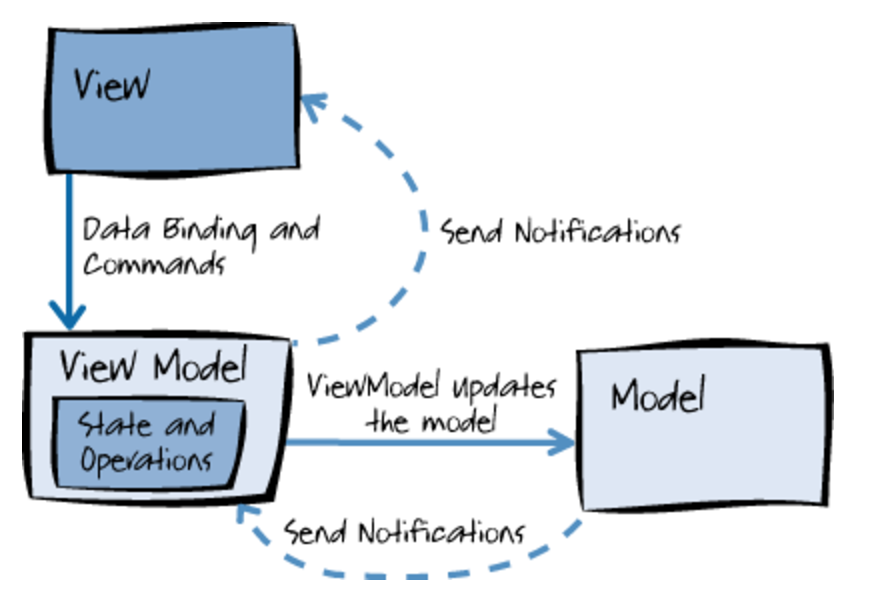
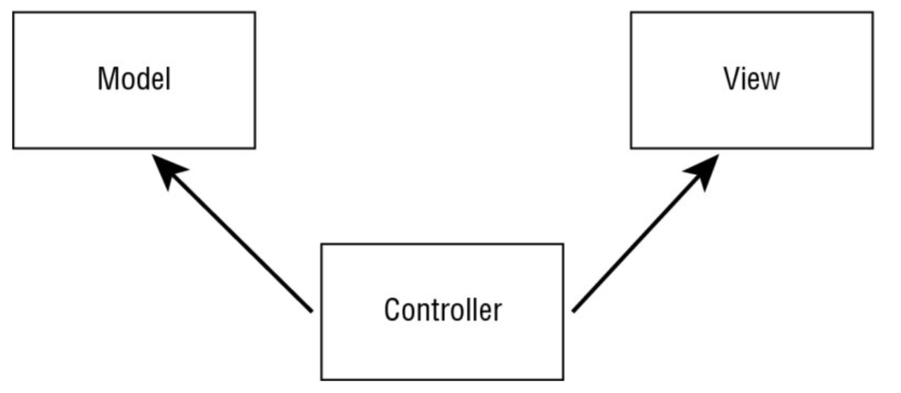
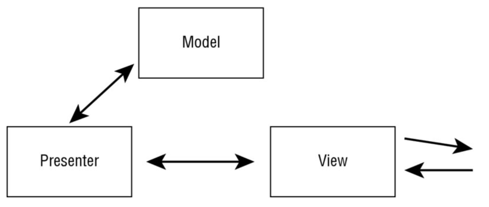
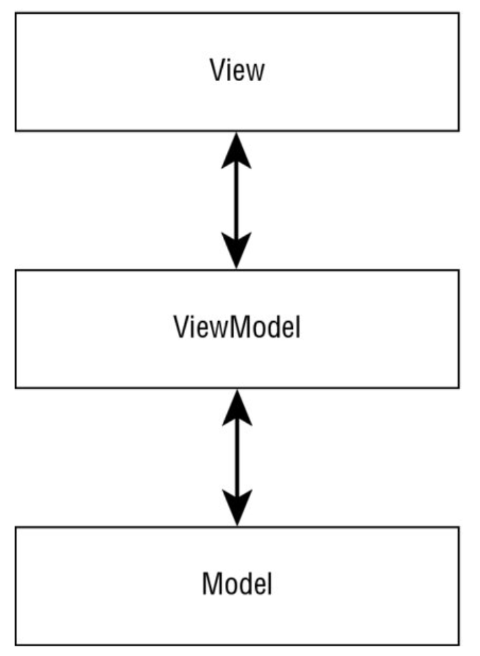

# GUI (XAML, UWP, WPF)
> [PrC#6] chapters 29, 30, 31, 32, and 33.

## Exam question:
*Describe data binding and the MVVM model. Explain how MVVM relates to events, the Command pattern and the Observer pattern. Compare this architecture to the ASP.NET MVC architecture.*

## Code-behind
Is a Microsoft-term for splitting the view from the logic behind the view. In terms of XAML, it means splitting the markup of the view from the logic behind the view.

## MVVM

It's all about separation of concerns. The View part is XAML based with a bit of *code-behind* and is data-bound to the ViewModel. The ViewModel then holds the actual state and operations. It receives change notifications from the model, and so does the View through declarative data binding. It then updates the Model accordingly upon user interactions and what not.

### Advantages:
- It is very easy to simply test the logic behind the View (the ViewModel).

- It is very easy to just swap out the actual view (the XAML-thingy) which makes it perfect for switching technologies or delivering different view components to different devices (which is perfect for Microsoft's Universal Platform strategy).

- It provides separation of concerns in a similar fashion to MVC.

### Difference from MVC
In MVC, The controller knows about the View and the Model.
It makes sure to update the view when the model changes. And that might happen as a result of a user interaction such as a button that was clicked or something like that.

In MVVM, the View knows about the ViewModel and the ViewModel knows about the Model, the model doesn't know anything about the ViewModel and the ViewModel doesn't know anything about the view. This on its own means that MVVM is less tightly coupled than MVC.


### Uses of XAML
If you write Universal Windows apps, Windows Presentation Foundation (WPF) apps, create XPS document or write Silverlight apps (who does that?!), you need to use XAML.

### exTensible Application Markup Language (XAML)
XAML is typically used to describe objects and their properties, possibly in a deep hierarchy.

XAML is based on XML, but it defines several "enhancements" to XML.

It is still valid XML, but some enhancements have special meaning.

For example, using curly brackets within XML attributes.

### Mapping Elements to classes with WPF
In WPF, XAML elements maps to .NET classes.

This also means that you would be able to implement the views imperatively (from code), without having to touch XAML:
```csharp
// Inside file "CodeIntroWPF.cs"
var b = new Button() { Content = "Hello" };
var window = new Window { Content = b };
new Application().run(window);
```

But, by using XAML, we can do the same thing:
```xml
<Window x:Class="XAMLIntroWPF.MainWindow">
	<Button Content="Hello" />
</Window>
```

### Mapping Elements to classes with UWP
Let's see the thing without XAML again:
```csharp
Application.Start(p =>
{
	var b = new Button { Content = "Hello" };
	Window.Current.Content = b;
	Window.Current.Activate();
});
```

Here are the same stuff in XAML:
```xml
<Page x:Class="XAMLIntroUWP.MainPage">
	<Button Content="Hello" x:Name="button1" />
</Page>
```

Notice how you use a `<Page>` instead of a `<Window>`.

## Using Custom .NET classes
You can even use .NET classes *within* XAML, simply by declaring the namespace within XAML. Also, an XML alias must be defined.

So, if the namespace is `DataLib` where you have a class `Person`, you can refer to it directory from XAML.

Here is an example in WPF:
```xml
<Window
x:Class="XAMLIntoUWP.MainPage"
xmlns:datalib="clr-namespace:DataLib;assembly=DataLib">
<datalib:Person FirstName="John" LastName="Johnson" />
</Window>
```

If you ran this app, it would just call `ToString()` on the `Person` generated by XAML. Notice how the FirstName and LastName attributes are assigned declaratively from markup. It translates into an instance of `Person`.

You could do the same from UWP:
```xml
<Page
x:Class="XAMLIntoUWP.MainPage"
xmlns:datalib="using:DataLib">
<datalib:Person FirstName="John" LastName="Johnson" />
</Page>
```

Here you do not need the `clr-namespace`.

### Setting Properties as Attributes
You can set properties as attributes **as long as the property type can be represented as a string or there is a conversion from a string to the property type.**

So, for instance:
```xml
<Button Background="LightBlue" />
```

The property type of *Background* is of type `Brush`, but it was given a string. But, the `Brush` type defines a `BrushConverter` class which can convert given strings to actual `Brush` types.

### Type converter
A type converter derives from the base class `TypeConverter`.

The type of the class that needs conversion defines the type converter with the `TypeConverter` attribute.

### Using properties as elements
You can assign property values with the same element syntax:
```xml
<Button>
	<Button.Background>
		<SolidColorBrush Color="LightBlue" />
	</Button.Background>
</Button>
```

## Dependency Properties (Data binding, etc.)
XAML uses dependency properties for data binding, animations, property change notifications, styling and so on.

Dependency properties makes sure, that memory is *not* allocated for every property and every instance.

Instead, the dependency property system manages a dictionary of all properties and allocates memory only if a value is changed.

With normal properties, you'd have to implement the interface `INotifyPropertyChanged` for change notifications. However, with dependency properties, this behavior is built-in.

Also, for data binding, the property of the UI element that is bound to the source of a .NET property *must* be a dependency property.

## Value Changed callbacks and events
Dependency properties also support value changed callbacks.

## Routed Events (event bubbling)
The event model is extended by routing events with XAML-based applications. It's just like you know from the browser. The event bubbles up from child to parent continuously either until it gets handled and is prevented from bubbling any further or that it cannot bubble any higher up.

## Event Tunneling
WPF also supports event tunneling. This is where events go in the direction opposite direction of bubbling - from outside to inside controls.

## Attached Properties
An attached property can accept properties for other elements. For instance:
```xml
<DockPanel>
	<Button DockPanel.Dock="Top" />
</DockPanel>
```

Here, the `<Button>` "accepts" a property for its parent, DockPanel, even though that property has nothing to do with it.

The same goes for stuff inside a grid. There, you can define as attributes on all children of a Grid which row and column they are located in:
```xml
<Grid x:Name="grid1">
	<Button Grid.Row="0" />
	<Button Grid.Row="1" />
</Grid>
```

## Markup Extensions
This is how you actually extend XAML with new elements or attributes.

If an XML attribute contains curly brackets, that's a sign of markup extensions.

### `StaticResourceExtension`
This is a markup extension which finds resources.

For instance:
```xml
<Button Background="{StaticResource gradientBrush1}" />
```
And then in another file:
```xml
<Page.Resources>
	<Something x:Key="gradientBrush1">
		<Foo />
		<Bar />
	</Something>
</Page.Resources>
```

It would then be possible to reference that extension by writing `StaticResourceExtension <key>` inside curly brackets when binding to an attribute.

## Creating Custom Markup extensions
WPF can create custom markup extensions whereas UWP cannot.

A markup extension is created by defining a class that derives from the base class `MarkupExtension`.

# Styling XAML Apps
WPF "Changed everything", the book wants me to believe, by being based on DirectX and by offering vector graphics which allow for easy resizing of Windows and Controls (and more importantly, I'd say, support for all high-dpi's).

## Shapes
Shapes are the core elements of XAML. With shapes you can draw two-dimensional graphics using rectangles, lines, ellipses, paths, polygons and polylines that are represented by classes derived from the abstract base class `Shape`.

So, think SVG.
```xml
<Canvas>
	<Ellipse Canvas.Left="10" Canvas.Top="10" Width="100" Height="100" />
</Canvas>
```

## Geometry
Where shapes participate with the layout system and render themselves, the `Geometry` class can **not** render itself and has fewer features and less overhead than `Shape`.
`Geometry` can be used by other stuff, for instance `Path`, which is also a `Shape` and thus can be rendered.

## Transformation
You can transform stuff easily. For instance, scale, rotate and skew stuff.

### Scaling
Adding the `ScaleTransform` element to the `RenderTransform` property of a `Rectangle` resizes the content of the complete rectangle.
```xml
<Rectangle>
	<Rectangle.RenderTransform>
		<ScaleTransform ScaleX="0.5" ScaleY="0.4" />
	</Rectangle.RenderTransform>
</Rectangle>
```

### Translating
This is for moving an element in *x* or *y* direction. Uses the `TranslateTransform` in the same way as in the previous example.

### Rotating
Uses a `RotateTransform`.

### Skewing
Uses a `SkewTransform`.

**I'm gonna skip ahead a bit, because I feel like all this stuff is too detailed to actually be relevant**

# Patterns with XAML Apps

## Why Model-View-ViewModel (MVVM)
For many years, Windows Forms was the technology of choice for wrapping native Windows controls to create desktop applications.

Then came WPF (Windows Presentation Foundation) in which the user interface is defined using XML for Applications Markup Language (XAML).

Silverlight offered a lightweight framework for XAML-based apps that run within the browser.

But then, Microsoft shifted its attention to bringing shared code to multiple platforms - Xbox, phone and PC from one code base.

### MVVM
The goal is to reuse as much code as possible and also to be able to easily switch from one technology to another.

With XAML-based applications, the Model-View-ViewModel (MVVM) design pattern is favored for **separating the view from functionality.**

With XAML-based applications, the XAML file and code-behind file are tightly coupled. This makes it hard to reuse the code-behind and also hard to do unit testing.

The MVVM pattern allows for a better separation of the code from the user interface.

## Defining the MVVM pattern

First some alternatives

### Model-View-Controller (MVC)

The MVC pattern separates the model, the view and the controller.

**The model** defines the data that is shown in the view as well as business rules about how the data can be changed and manipulated.

**The controller** is the manager between the model and the view, updates the model, and sends data for display to the view.

When a user request comes in, the controller takes action, uses the model and **updates the view.**

### Model-View-Presenter (MVP)

Here, the user interacts with **the view.**

**The presenter** contains all the business logic for the view.

The presenter can be decoupled from the view **by using an interface to the view as contract.
This allows easily changing the view implementation for unit tests**. With MVP, the view and model are completely shielded from each other.

### Model-View-ViewModel (MVVM)

This pattern takes advantage of the data-binding capabilities with XAML.

Here, the user interacts with the view. The view uses data binding to access information from the view model and invokes commands in the view model that are bound in the view as well.

**The view model doesn't have a direct dependency to the view.**

The view model itself uses the model to access data and gets change information from the model as well.

Alright so - the main point seems to be that the View knows about the ViewModel (and nothing else), but neither the ViewModel nor the Model knows about the View directly, which of course makes it easily replaceable.

### Model (declaring props for Data binding)
To support data binding, the properties where values are updated from the user interface need a change notification implementation.

Obviously, we only care about this for the properties that will actually change.

Any class that should be the object source of XAML elements needs either dependency properties *or* to implement `INotifyPropertyChanged` to allow change notification with data binding.

With model types, it makes sense to implement `INotifyPropertyChanged`.

```csharp
public class Book: INotifyPropertyChanged
{
	public event PropertyChangedEventHandler PropertyChanged;

	public void OnPropertyChanged([CallerMemberName]string propertyName = null)
	{
		PropertyChanged?.Invoke(this, new PropertyChangedEventArgs(propertyName));
	}

	private string _publisher;
	public string Publisher
	{
		get { return _publisher; }
		set
		{
			if (value != _publisher)
			{
				_publisher = value; OnPropertyChanged(nameOf(Publisher));
			}
		}
	}
}
```
So, anyway, *when* the property changes, a `PropertyChangedEvent` is fired.

So we can now conclude, that *any* model that implements `INotifyPropertyChanged` will spawn `PropertyChangedEvent`s when their observable properties change.

## View Models
It is important that `ViewModels` doesn't know anything about the view, since the view could come from either `WPF` or `UWP`.

A `ViewModel` contains properties for the items to show and commands for actions.

The properties of the `ViewModels` need to perform change notifications for UI updates. Thus, also ViewModels should implement `INotifyPropertyChanged`.

### Commands
ViewModels offer commands that implement the interface `ICommand`.

Commands allow a separation between the view and the command handler method via data binding.

This allows for binding actions such as clicks or whatever directly from XAML to specific commands in the ViewModel, even though the ViewModel doesn't know about the View.

### Services and Dependency Injection (in ViewModels)
If ViewModels want something, it should come from a dependency injected service.

For instance, if a `BookViewModel` wants to be able to get some `Book`s, it should be fed a `IBooksService` in the constructor which it can then use. That service will then be able to fetch and query `Book`s (the model item) or whatever it wants:

```csharp
public class BooksViewModel: INotifyPropertyChanged
{
	private readonly IBooksService _booksService;

	public BooksViewModel (IBooksService booksService)
	{
		_booksService = booksService;
		Book favoriteBook = booksService.GetFavoriteBook();
	}
}
```

## Views ("User controls")
The Views are defined as **user controls** within the `Views` subdirectory.

Obviously, these are done in XAML. There, you declare the namespace:
```xml
<Page ...
xmlns:uc="using:BooksApp.Views">
...
</Page>
```

### Injecting the View Models
This is the crucial part.

To map the ViewModel to the view, a `ViewModel` property is defined in the code-behind where the needed view model is instantiated:
```csharp
public sealed partial class BookView: UserControl
{
	public BooksViewModel viewModel { get; } = new BooksViewModel((App.Current as App).BooksService);
}
```

### Data binding with WPF
The data comes from the `DataContext` attribute:
```xml
<UserControl
	x:Name="booksView"
	DataContext="{Binding ElementName=booksView}" />
```

The tree of parent elements is checked to find the source of the finding. So, if the immediate parent doesn't have it, it will just keep "bubbling up" until it finds it.

#### OneTime bindings
```xml
<Button Command={Binding ViewModel.DoStuff, Mode=OneTime} />
```
The `Command` property is bound to a command in the view model. Because the commands do not change, we can just go for a one-time binding.

**This means that it doesn't register for a change notification.**

#### OneWay bindings
Here, we *do* receive change notifications which will update the UI accordingly.

#### TwoWay bindings
Here, not only do we receive change notifications which will update the UI, but we can also update the source from the UI.

A great example of a case where TwoWay bindings works particularly well is for `TextBox` elements. You (may) want to be able to change the value from the outside, but you (may) also want to bind the text value to a field in the model.

#### Default bindings
These differ between technologies. Binding with the `Text` property of a `TextBox` is TwoWay by default.

### Compiled Data Binding with UWP
You can do the same thing with UWP as with WPF. But, it has appeared to be slow.

So, the XAML team came up with something called *compiled data binding*.

Here, you use the `x:Bind` markup extension instead of `Binding`:

```xml
<!-- Without compiled bindings: -->
<TextBox Text="{Binding ViewModel.Book.Title, Mode=TwoWay}" />

<!-- With compiled bindings: -->
<TextBox Text="{x:Bind ViewModel.Book.Title, Mode=TwoWay}" />
```

So, behind the scenes, the `Text` property of the `TextBox` is directly accessed, and the `Title` property is retrieved on setting the `TextBox`.

This is faster and catches more error on compile-time whereas the old variant only catches errors on run-time (where they fail silently: you don't see the error).

With compiled bindings, you don't have to set the `DataContext`. Instead, the binding always maps directly to the root element.

## IoC Container
Use the `Microsoft.Framework.DependencyInjection` NuGet package.
Then, inside the `App` class, you can add the services to the `ServiceCollection`:
```csharp
public IServiceProvider Container { get; private set; }
private IServiceProvider RegisterServices()
{
	var serviceCollection = new ServiceCollection();
	serviceCollection.AddTransient<BooksViewModel>();
	serviceCollection.AddSingleton<IBooksService, BooksService>();
	// etc
	return serviceCollection.BuildServiceProvider();
}

protected override void OnStartup(StartupEventArgs e)
{
	base.OnStartup(e);
	Container = RegisterServices();
}
```

## Compiled Data Bindings - More info
As stated, `x:Bind` is the replacement for `Binding` - its faster.

**Here, all bindings are OneTime by default!**

## Application lifetime
The TL;DR; is that you should hook up on the `OnSuspended` event and make sure to save the state, favorably also the current navigation state.
