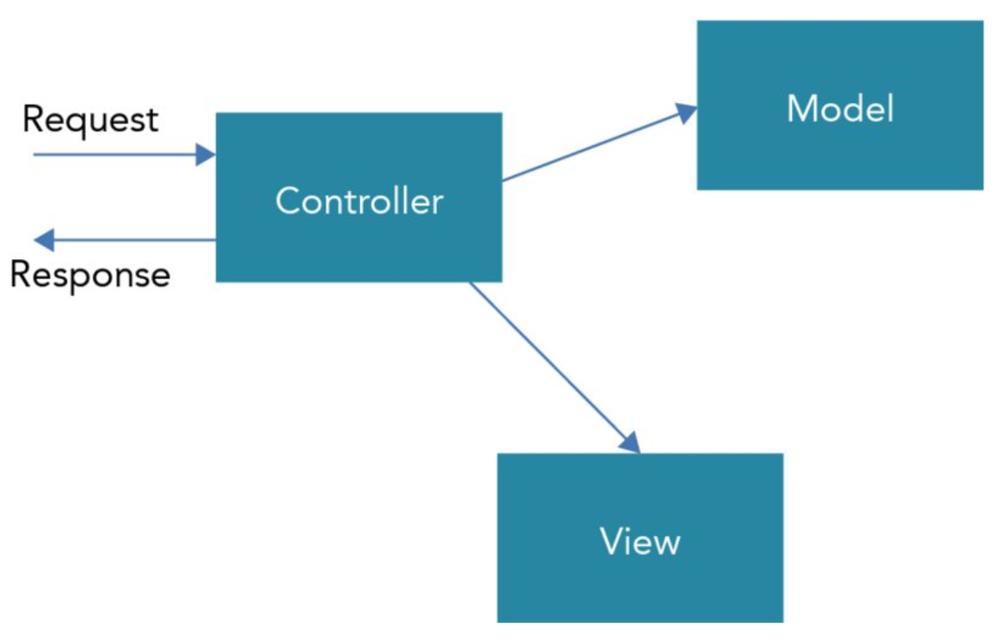

# REST and ASP.NET Core
> [PrC#6] chapters 40, 41, and 42.

## HTML
HTML is the markup language that is interpreted by web browsers. It defines elements such as headings, tables, lists and other stuff. Move on.

### HTML5
Put the nail in the coffin for Flash/Silverlight. The elements became more intuitive and could do more stuff (drag-n-drop, canvas, storage, web sockets, etc).

### The HTML standard
Now we just have the *living HTML standard*. And it keeps evolving. We have CustomElements, yay. Move on.

## (Cascading Style Sheets) CSS
Whereas HTML defines the content of web pages, CSS defines the look of them. We can use flexible selectors for selecting HTML elements and use CSS classes. You know this stuff. You go girl!

## JavaScript
JavaScript is rooted in C, but has both functional and object-oriented capabilities.

ECMAScript is the standard that defines current and upcoming features of JavaScript.

Again, you know this stuff. Move on.

## TypeScript
Is a superset of Javascript. "Enhances" the language with strongly typed code and new language features such as Enums and Interfaces.

TypeScript compiles to Javascript. You know this stuff.

Alright, alright. Lets move on.

# ASP.NET projects

### `global.json`
When you generate a new *solution* in Visual Studio, you get a so-called *global.json* file.

This one lists the directories of the solution as well as the SDK we're using
```json
{
	"projects": ["src", "test"],
	"sdk": {
		"version": "1.0.0-0"
	}
}
```

### *References* folder
This one contains all the referenced NuGet packages. (So its like *node_modules*).

### `project.json`
We already covered this. But, the referenced NuGet packages is also listed within the `project.json` file.

## `Startup.cs`
This class can hook up services as well as configure the app.

### `Configure` method.
This one receives a dependency injected internal application builder type that implements the `IApplicationBuilder` interface.

#### `Run` method on `IApplicationBuilder`
This one invokes the `Use` method and takes a delegate of type `RequestDelegate`. This type receives an `HttpContext` as parameter and must return a `Task`.

This is nice, because now you have access to the request information from the browser (HTTP headers, cookies, form data) and can send a response.

#### Logging
Configure also receives an `ILoggerFactory` as the second argument. You can add logging to the app by invoking `loggerFactory.AddConsole()` which adds a provider tow rite log information to the console. `loggerFactory.AddDebug()` adds a provider to write log information the debugger.

#### Adding Static content
To enable static files served from the web server, you can add the extension method `UseStaticFiles()` in the `Configure` method. This will be useful if you want to send other stuff than just simple strings back to the client.

**You will need the NuGet package `Microsoft.AspNet.StaticFiles` to do so!**

#### Default folder for static content
That will be `wwwroot`.

## `Program.cs`
The entry point of the application. Hooks up the `Startup` class from the `WebHostBuilder`:
```csharp
var host = new WebHostBuilder()
	.UseDefaultConfiguration(args)
	.UseStartup<Startup>()
	.Build();
host.Run();
```
When `Run` is executed, the hosting engine is started and the server is listening and waiting for requests.

## Using NPM
The Node Package Manager (*npm*) is the package manager we know and love for JavaScript libraries.

To add NPM to the project, just write a `package.json` file and place it in the root.

Visual Studio runs `npm install` every time you save the `package.json` file it seems.

## Using gulp
Gulp is a build system (like grunt, rollup, webpack, you know this stuff). You can set up tasks, for instance linting and SASS compiling. Transpiling with babel. Yeah-yeah.

It is a bit weird that he didn't just set up NPM scripts for the stuff he actually use gulp for.

## Request and response
The request consists of a header and in many cases body information.

We can of course reply with HTML by building up whatever HTML contents we want (I don't see the point in going into details here) before finally responding:
```csharp
app.Run(async (context) =>
{
	await context.Response.WriteAsync(SomeStringWithHTML);
});
```

You can of course return different stuff depending on the path.
Take a look at this ugly stuff:
```csharp
app.Run(async (context) =>
{
	string result = string.Empty;
	string path = context.Request.Path.Value.ToLower();
	switch (path)
	{
		case "/header":
			result = Something;
			break;
		case "/add":
			result = BomBom;
			break;
		default:
			result = HeheHaha;
			break;
	}
	await context.Response.WriteAsync(result);
});
```

## Request headers
You know this stuff. But some reminders:
- `Accept-Encoding: gzip, deflate` is the encoded formats that the browser understands. Some browsers understand other compression formats than others.

- `Accept-Language`: Which locales the browser will accept. Pretty useful for localization (if server-rendering is being used).

- `Connection: Keep-Alive`: The HTTP1.1 thingy where the connection can stay open (*persistent connection*) for multiple requests.

### Query string
ASP handles these pretty nicely, actually.
Every request has a `request.Query` dictionary with an indexer. So you can do:
```csharp
var someParam = request.Query["someParam"];
```

## Encoding
Remember to encode the stuff you send back.

## Form Data
Is accessible through the `request.Form` property. This is also a dictionary, (well actually I think its a `IKeyValuePair<K,V>`) which you can then `foreach` and do stuff with.

## Cookies
Use Cookies to remember user data between multiple requests.

By default cookies are not stored on the client, but the browser will send it back to the server if the URL is the same domain where the cookie was coming from.

### Persistent Cookies
*If* you set an `Expires` property on a Cookie, it will be persistent and stored on the client. Obviously it will be removed when it expires (or the user removes it).

Here's how to add a cookie:
```csharp
response.Cookies.Append(
	"color",
	"red",
	// Optional
	new CookieOptions
	{
		Path = "/cookies",
		Expires = DateTime.Now.AddDays(1)
	}
);
```

It can then be read from a request:
```csharp
var cookies = request.Cookies;
foreach (var key in cookies.Keys)
{
	// Do something with the cookie.
}
```

## Sending JSON
You should add the `NewtonSoft.Json` NuGet package. Now, remember to set the `ContentType: application/json` in your responses and make sure to convert objects (e.g. serialize it) to Json.

# Dependency Injection
Dependency Injection is deeply integrated within ASP.NET Core.

It gives loose coupling as a service is used only within an interface.

ASP.NET has a build-in dependency injection mechanism (constructor-injection).

## Defining a service
Declare an interface for it, such as `ISampleService`.
Now, implement it with a class such as `SampleService: ISampleService`.

## Registering the Service
In the `ConfigureServices` part of the `Startup.cs` file, you can add the services that should be injected:
```csharp
public void ConfigureServices(IServiceCollection services)
{
	services.AddTransition<ISampleService, SampleService>();
}
```

- `AddTransient` instantiates the service *every time* the service is injected.

- `AddSingleton` instantiates the service *only once* and use the same instance for every injection.

- `AddInstance` requires you to instantiate a service and then pass that to the method. You have the control over the lifetime. If you don't do anything, it's practically a singleton.

- `AddScoped` bases the lifetime on the current context. The current context is based on the HTTP request. As long as actions for the same request are invoked, the same instance is used with different injections. with a new request, a new instance is created.

## Injecting the Service
It is injected inside the constructor arguments. You know this stuff.

## Adding Controllers
Easy enough. Just instantiate the controller via dependency injection. in the `ConfigureServices` method. You don't need an interface for that.

Though - if you use MVC, you won't have to do that, instead it will automatically look for controller classes inside the `Controllers` folder.

Anyway, you could then pass the request on to the controller service when a request arrives:
```csharp
app.Run(async (context) =>
{
	if (context.Request.Path.Value == "/foo")
	{
		var controller = app.ApplicationServices.GetService<FooController>();
		int statusCode = await controller.GetSomething(context);
		context.Response.StatusCode = statusCode;
		return;
	}
});
```

## Subapplications with Map
You can do this inside `Configure` instead:
```csharp
app.Map("/foo", fooApp =>
{
	fooApp.Run(async context =>
	{
		// This will execute for each request to "/foo".
	})
});
```

## Using Middleware
Middleware in ASP.NET Core **are modules that are invoked before the controller is invoked.**

They are *chained* one after the other until all connected middleware types have been invoked.

### Writing Middleware
Middleware classes receives a reference to the next middleware (lets call it `_next`) in the constructor and must as the last action of an `Invoke` method make sure to call `_next(httpContext)` to move on to the next Middleware.

We could use Middleware for all sorts of stuff like Authentication, but also to prepare some of the response contents.

## Session State
Session State enables temporarily remembering data from the client on the server. Session state is implemented as middleware.

A Session state is initiated when a user first requests a page from a server. This session will continue to live on for the duration of the session.

### Identifying a session
On the first request, a temporary cookie with a session identifier is created. This cookie is returned from the client with every request to the server until the browser is closed. (It could also just be a string with a session token or whatever).

### `Microsoft.AspNet.Session`
Of course there is a Microsoft-developed NuGet package for that. This is a service that must be called within `ConfigureServices`:
```csharp
services.AddSession(options => options.IdleTimeout = TimeSpan.FromMinutes(10));
```

You also need to call `UseSession` in the `Configure` method - and before **any** response is written to the request. Also before all other middleware that alters the response it seems.

# Configuring ASP.NET
Where `project.json` is used to define assembly references, application settings and connection strings are not found in there.

Instead, application settings are typically stored within `appsettings.json`, but you could also do so with environment variables (or user secrets, as we did in ReviewIT).

An example of `appsettings.json` could be:
```json
{
	"AppSettings": {
		"SiteName": "Hello world!"
	},
	"Data": {
		"DefaultConnection": {
			"ConnectionString": "Server=(localdb)..."
		}
	}
}
```

You then need to tell ASP.NET which configuration file to be used.

This happens in the constructor of the `Startup` class.
For instance,
```csharp
public IConfigurationRoot Configuration { get; }
public Startup (IHostingEnvironment env)
{
	var builder = new ConfigurationBuilder()
		.AddJsonFile("appsettings.json");

		// And then later on...
		Configuration = builder.Build();
}
```

### Adding User Secrets
Also happens in the constructor. Just make sure to call `builder.AddUserSecrets();` before the final `builder.Build()` method is called.

You could also have written `AddEnvironmentVariables` if that is your thing.

## Reading the configuration
You can just use the Configuration object as an indexer: `Configuration["SomeJSONKeyOrEnvironmentVariableName"]`. Very cool.

### Different configurations based on the environment.
Easy:
```csharp
builder.AddJsonFile("appsettings.json");
builder.AddJsonFile($"appsettings.{env.EnvironmentName}.json", optional: true);
```

## User Secrets
Stuff like secret keys and connection strings should never be part of VCS.

User Secrets are basically a json configuration file that are not stored in a configuration file of the project, instead it is stored in a configuration file associated with your account (on your local computer).

Otherwise, it works like you'd expect:
```json
{
	"secret1": "this is a secret"
}
```

But as I said, remember to call `builder.AddUserSecrets()` before calling `builder.Build()` in the constructor of `Startup.cs`.

# ASP.NET MVC
ASP.NET MVC is based on Model-View-Controller


### Controller
The controller receives a request from the browser and returns a response.

To build a response, the controller can make use of a model to provide some data, and a view to define the HTML that is returned.

### View
The view is HTML code with JavaScript and just a little C# code for accessing server-side information.

### Advantage
We can unit test more easily. Separation of concerns always results in better testing capabilities.

### Setting up ASP.NET MVC
You need the NuGet package `Microsoft.AspNet.Mvc`.

In `ConfigureServices`, make sure to add: `services.AddMvc()`.

In `Configure`, make sure to add: `services.UseMvc()`.

### What does it do
It adds core services such as configuration features, *controller factories* and *controller activators*.

It also adds services to support authorization, CORS, data annotations, views and more.

## Defining routes
With the `UseMvc` method inside `Configure`, you can extend it:
```csharp
app.UseMvc(routes =< with => routes.MapRoute(
	name: "default",
	template: "{controller}/{action}/{id?}",
	defaults: new {controller = "Home", action = "Index"}
));
```

So, given a URL: `http://localhost:[port]/foo/bar`, `foo` would map to the name of the controller, because the `Controller` suffix is automatically added: `FooController`. `GetSampleStrings` is the action, which represents a public method in the controller.

### Adding routes
You can just chain them:
```csharp
app.UseMvc(routes => routes
	.MapRoute(
		name: "default",
		template: "{controller}/{action}/{id?}",
		defaults: new {controller = "Home", action = "Index"}
	)

	.MapRoute(
		name: "language",
		template: "{language}/{controller}/{action}/{id?}",
		defaults: new {controller = "Home", action = "Index"}
	)
);
```

## Route Constraints
You can add constraints to routes, for instance you can add a language constraint so that only the routes `http://<server>/en/home/something` and `http//<server>/de/home/something` are valid:
```csharp
app.UseMvc(routes => routes
	.MapRoute(
		name: "language",
		template: "{language}/{controller}/{action}/{id?}",
		defaults: new {controller = "Home", action = "Index"},
		constraints: new {language = @"(en)|(de)"}
	)
);
```

## Creating Controllers
A controller reacts to requests from the user and sends a response.

A view is not necessarily required.

### Conventions
- Controllers are located in the directory `Controllers`

- The name of the controller must be suffixed with the name `Controller`.

To write a controller class:
```csharp
public class SomethingController: Controller
{
	public IActionResult SomeMethod ()
	{
		// Implementation
	}
}
```

Apparently, it "Just Works". As stated, when you request an action as defined by the route, a method within the controller is invoked. Pretty Microsoft-Magical stuff.

This method, for instance, would be invoked by `http://<server>/Something/SomeMethod`.

### Return values
You can return anything. It "Just Works". But, you should state a return type of `IActionResult`. Use instance methods from the base class (`Controller`) to return `ActionResults`.

For instance:
- `Content()` is used to return text content. Here you can also specify the MIME type and encoding.

- `Json()` is used to return JSON-formatted data. It will serialize stuff for you.

- `Redirect` returns an HTTP redirect request to the client.

- `RedirectToRoute` redirects to a specific route.

- `File` can return file contents, for instance an image. This also takes a mime-type.

## Creating Views
Views are located inside a `Views` folder by convention. And, inside that, create *another* subfolder with the same name as the controller (minus the suffix).

For instance, if we have a `FooController`:
```
/Controllers
--> FooController.cs
/Views
--> /Foo
-----> Index.cshtml
```

### Passing Data to Views
The view is directly created from within the controller. So, you can just pass data from the controller to it.

To do that, you use a `ViewDataDictionary`. It stores keys as strings and enables object values.

There is a `ViewData` property of the controller class which can be used: `ViewData["Name"] = "John"`.

But it can be done easier with the `ViewBag` property which has dynamic keys.

So, you can do: `ViewBag.Name = "John"`. And then you can just return the View from the controller:
```csharp
ViewBag.Name = "John";
return View();
```

Inside the view, then, it has access to data passed from the controller:
```html
<div>
	<div>Hi, @(ViewBag.Name)</div>
</div>
```

### .cshtml (Razor Syntax)
What is this .cshtml stuff?
It uses the *Razor syntax* which uses the "@" character as a transition character.

It enables you to write C# code inside the view.

You can just write `@ViewBag.SomeProp` inside the cshtml file to bind simple types to the view.

But, if you need to do more complex stuff, you can even write C# code and define variables inside *Razor code blocks*:
```HTML
@{
	string name = "Angela";
}
<div>@name</div>
```

Also, if you need to data bind inside a block with text, you can't just do `@something`. Instead, you must write `@(something)` to let the compiler know where the statement begins and ends.

#### `@foreach`
You can do `foreach` statements:
```html
@foreach(var item in list)
{
	<li>This is an @(item).</li>
}
```

### Strongly typed Views
Strongly typed views are ones where you pass a *model* to them:
```csharp
// Inside constructor:
public IActionResult GetStuff()
{
	return View(someModel);
}
```

Now you can use the razor keyword `model` from the view to describe which kind of model it is using:
```html
@using Something.Models
@model IEnumerable<Something>

@foreach(var item in Model)
{
	<li>@item.Text</li>
}
```

## View components
View components are not related to a specific controller. Instead, they act as primitive components that can be reused (so, like CustomElements).

They have two parts:
- The actual markup
- A controller which derives from `ViewComponent`.

You can then invoke the component from the view:
```html
@await Component.InvokeAsync("ComponentName");
```

It will then be injected inside the DOM.

### Dependency Injection in views
```html
@inject ISampleService sampleService

<!-- later on -->
<div>sampleService.GetStuff()</div>
```

## Implementing Authentication And Authorization
There are some strategies:
- **Work and School accounts**: Great for using cloud authentication for software with a "closed" user group.

- **Individual User Accounts**: Great for software with an open user group. Here, users can register and log in as well as use existing accounts from other services such as Facebook and Google.

- **Windows Authentication**: Here, the user account of the host machine is used to authenticate the user. This is obviously only for Windows users.

## Storing and Retrieving User Information

### `IdentityUser`
For adding application users, you can use the `IdentityUser` type.

It requires the use of the Entity Framework.
You can make a database connection via `IdentityDbContext<TUser>` which defines the properties `Roles` and `Users` of type `IDbSet<TEntity>`.

You can then provide, say, an `ApplicationUser` that derives from `IdentityUser`.

And, the main `DbContext` of your application would then derive from `IdentityDbContext<ApplicationUser>`:
```csharp
public class ReviewITDbContext: IdentityDbContext<ApplicationUser>
{
	// Implementation.
}
```

### Starting up the Identity system
Inside `ConfigureServices`, you can now add users:
```csharp
services.AddIdentity<ApplicationUser, IdentityRole>()
	.AddEntityFrameworkStore<ReviewITDbContext>()
	.AddDefaultTokenProviders();

// And then, however you like:
services.Configure<FacebookAuthenticationOptions>(options =>
{
	options.AppId = Configuration["foo"];
	options.AppSecret = Configuration["bar"];
});
```

### Performing User Registration
#### `[Authorize]` attribute
This attribute restricts all action methods to authenticated users only.

#### User Registration
You can define a `RegisterViewModel` which declares which stuff the user needs to enter on registration:
```csharp
public class RegisterViewModel
{
	[Required]
	[Display(Name = "Email")]
	public string Email { get; set; }

	// And so on...
}
```

### Authenticating users
As I said, we use the `[Authorize]` attribute on all Controller methods (or, if put above the class, *all* method calls require Authorization).

If the caller is **not** authorized, a 401 HTTP status code is returned with a redirect to the login action.

### Role-based Authorization
`[Authorize(Roles="Admin")]` is an example of how you can restrict access to only those users with the role `Admin`.

# ASP.NET Web API
ASP.NET Web API is based on Representational State Transfer (REST).

### REST
REST services are always stateless whereas SOAP can also be stateful.

REST maps HTTP verbs such as POST, GET, PUT, DELETE to CRUD operations (CREATE, READ, UPDATE, DELETE) - in that order.

### Models
The `Models` directory is for the data model. Here, entity types can be added as well as repositories that return model types.

A model could simply be:
```csharp
public class BookChapter
{
	public int Id { get; set; }
	public string Title { get; set; }
	public int Pages { get; set; }
}
```

And a repository could be:
```csharp
public interface IBookChaptersRepository
{
	void Add(BookChapter bookChapter);
	// And so on...
}
```

We could then implement it in a class, preferably collections would use thread-safe versions such as `ConcurrentList`.

We'd then add the repository as a service inside `ConfigureServices`:
```csharp
services.AddSingleton<IBookChaptersRepository, BookChaptersRepositoryImpl>();
```

## Creating a Controller
We'd use the `[Route]` attribute for mapping URLS to specific Controller methods.

For instance, `[Route("api/[controller]")]`. This one takes the name of the controller minus the `Controller` suffix.

We'd then have a controller **for each repository**. All of these would then take the corresponding repository interface in the constructor and serve the clients accordingly.

There are some attributes that can be used to override how ASP.NET will try to resolve the right methods to call.

By default, ASP looks for stuff with the name of the method followed by the name of the controller, like `PutCustomer`.

So, use the `[HttpGet]`, `[HttpPost]`, `[HttpPut]` and `[HttpDelete]` attributes to override this behavior.

Use these inherited methods for return stuff:
- `NoContent()`: Returns a 203 status code.
- `NotFound()`: Returns a 404 status code.
- `Ok()`: Returns a 200 status code.
- `CreatedAtRoute()`: Returns a 201 status code.

and so on.

### Changing the response format
You can go for JSON or XML. JSON is the default.

If you want the ability to return XML (For instance, if it states to in the accept-headers of the request), you should install the NuGet package `Microsoft.AspNet.Mvc.Formatters.Xml` and add a call to `AddXmlSerializerFormatters` in the `Startup` class under `ConfigureServices`.

You can then use the following attribute: `Produces("application/json", "application/xml")` to state which formats can be accepted.

## Creating Metadata
You can describe your API with *Swagger* comments. I think it's called *OpenAPI* now.

Install the NuGet Swagger packages `Swashbuckle.SwaggerGen` and `Swashbuckle.SwaggerUI` and hook them up in the `ConfigureServices` method:

```csharp
services.AddSwaggerGen();
services.ConfigureSwaggerDocument(options =>
{
	options.SingleApiVersion(new info
	{
		Version = "v1",
		Title = "Book Chapters",
		Description = "Something"
	})
});

services.ConfigureSwaggerSchema(options =>
{
	options.DescribeAllEnumsAsStrings = true;
	options.IgnoreObsoleteProperties = true;
});
```

And then finally hoop Swagger up in the `Configure` method:
```csharp
app.UseSwaggerGen();
app.UseSwaggerUi();
```
