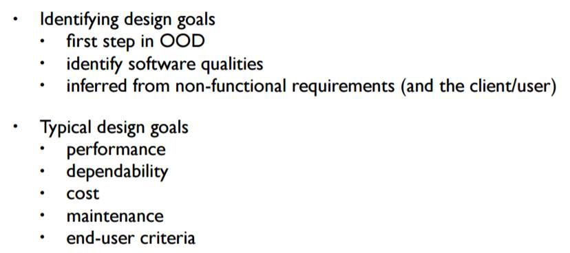

## Design Workshop and Testing
>[OOSE] ch. 11
>
>(Optional) [SE9] ch. 8
>
>(Optional) [SE9] ch. 24 relevant, but covered in the lecture and not part of the curriculum

### Design goals
Prioritizing non-functional requirements makes up design goals for an application. Group them in pairs, e.g.:

*Data Integrity vs Performance*

*Maintainability vs Cost*

Some design goals may go against each other. That is part of the task of prioritizing them in relation to each other and with the non-functional requirements at the core of it.

### Data Integrity
Data replication (in a physical sense) is great. Redundancy is good. If disk A fails, disk B has a replica of the data.

### *ReviewIT*-specific considerations
- **Data Integrity** vs **Performance**.
	-	Data Integrity meaning the existence of it and the how certain we can be that we won't lose data.
- **Availability** vs **Cost**
- **Scalability** (There can the hundreds of thousands of concurrent tasks (unit of work))
- **Concurrency** (is an issue, addressed by design).
- **Maintainability** vs **Time/Scope**
	- This specific project won't have any support post-release, but nevertheless it should be structured and maintainable, just like any real-world application.)
	-	Documentation (for developers, for clients)

## Quality assurance and Testing
- Faults in interface spec
	-	Mismatch between client needs and whats offered.
	- Mismatch between requirements and implementation.
- Algorithmic faults.
	-	Missing init
	- Incorrect branching condition.
	- Missing test for null
- Mechanical faults.
	-	Operating temp outside equipment spec
	- Power failure
- Errors
	-	Wrong user input
	- Null ref Errors
	- Concurrency Errors
	- Exceptions
