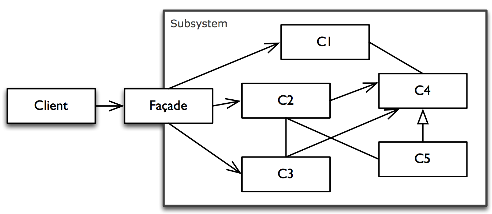
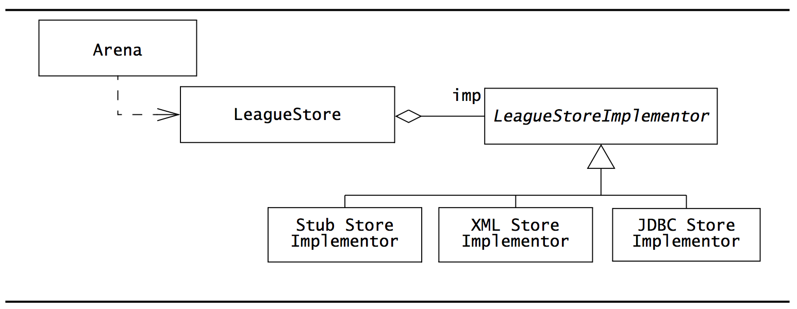
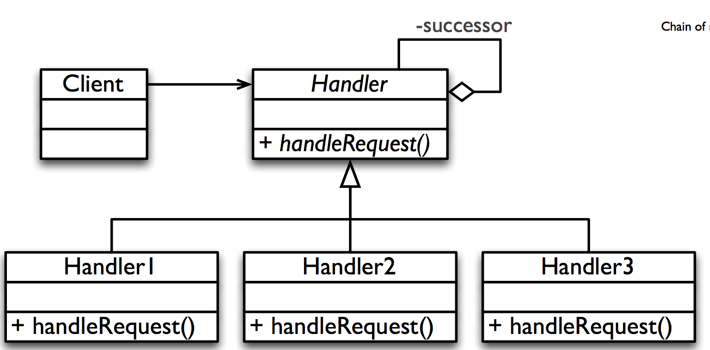

## Exam Question C01
*Explain how parallel and asynchronous processes are handled in the .NET architecture and C#. Explain how the Task Parallel Library and the async and await keywords solve problems related to parallel and asynchronous programming.*

### Presentation
Asynchronous programming is incredibly important for a great user experience.
With *asynchronous programming*, the calling thread is not blocked.

This is especially important when it comes to the UI thread for which long running tasks such as fetching things from the network should still be responsive.

But it can also be complex to wrap your head around.

For instance, imagine doing async work using what's called the Asynchronous pattern where you pass a callback delegate function to
an asynchronous method call:
```csharp
	void DoStuff()
		{
			DownloadAsync(str =>
			{
				WriteLine(str);

				DoSomethingWithStringAsync(str, () =>
				{
					WriteLine("Finished!");
				});
			});

			WriteLine("Foo");
		}
```
This leads to callback-hell.
Also, it is confusing for developers who might expect the execution to happen in an asynchronous fashion. Obviously, here
the `WriteLine` statement outside the async body is called first.

Many developers have chosen to always go with the synchronous version of a method if such one existed, simply to avid confusing and mindbuggling code as that.

Now lets see how this code could have been written instead:
```csharp
static async void DoStuff()
		{
			var str = await DownloadAsync();
			WriteLine(str);
			await DoSomethingWithStringAsync(str);
			WriteLine("Finished!");
			WriteLine("Foo");
		}
```
This looks completely identical to how you would have written the code synchronously.
This is called the Task-Based Asynchronous Pattern, and it is based on the idea that there is a need to allow long-running activities to occur without blocking the thread, but also to not lose the current execution context.

So this is great, but often times we need to do stuff concurrently. For instance, we might want to utilize more than one thread to perform parallel work. And by relying on `async/await` for each invocation, we would have sequential operation.

C# and .NET has the `Task` class which contains information about the task created and allows waiting for its completion by passing a delegate to its `ContinueWith` method. This is actually what the compiler converts an await statement to if a Task returns a value.

But Tasks are much more powerful than that. They can support task parallelism which means that we can perform multiple tasks in parallel.

We can either use its' `WhenAll` or `WhenAny` methods which are awaitable and allows concurrent operation of two Asynchronous methods. And whats great about it is that we don't have to perform any checks for whether or not both operations have successfully completed:
```csharp
await Task.WhenAll(SomethingAsync1, SomethingAsync2);
// Proceed
```

`Task` manages a thread pool which means that it is relatively cheap to delegate work to other threads with it, rather than having to create a new one.

But we can also achieve *data parallelism* with the `Parallel` class. When we talk about data parallelism, we usually refer to scenarios in which the same operation is performed concurrently on elements in a collection such as an array.

In particular, it has a `Parallel` variant of a `For` and `ForEach` loop.

Obviously, in such situations, we need to be really careful about race conditions which happens when two or more threads write to the same data concurrently.
This can be achieved with locking the blocks of code in which we write to resources that would otherwise be accessed by another thread and thus handling it as a critical section. We could also make use of Concurrent collections which are thread-safe by design.


## Exam Question C02:
*Explain the principles of Design Patterns and describe in detail the Bridge, Adapter, Façade, and Strategy patterns including how they can be implemented in C#.*

Design patterns are repeatable solutions to commonly occurring problems in object design. It isn't a finished design that can be transformed directly into code, but rather a template for how to solve a problem that can be used in many different situations.

Design patterns has had lots of field tests. We already know their pros and cons and are able to effectively communicate their value to other developers, who will know them already and be familiar with them. And, our object design will probably become stable earlier since reusing design patterns helps to prevent issues before they arise.

What many of these design patterns have in common is also an indirection communication serving the purpose of loosing up coupling between individual components which results in a more testable, maintainable system.

### Kinds of design patterns
We differentiate between 3 kinds:
- **Creational design patterns**: These has to do with the instantiation of instances of objects. *How* we get ahold of objects.
	-	Factory
	- Abstract Factory

- **Structural design patterns**: These identifies ways to realize relationships between objects.
	-	Adapter
	- Facade
	- Decorator
	- Bridge
	- Proxy

- **Behavioral design patterns**: These has to do with how the objects communicate.

### Adapter pattern

**STRUCTURAL DESIGN PATTERN**

The Adapter Design Pattern converts the interface of a (typically legacy) component into a different interface expected by the client, so that the client and the legacy class can work together without changes.

This is useful in scenarios where the class is sealed  (and thus can't be derived from) or is coming from another assembly (class library, .dll file).

To implement this in C#, we would first of all obviously write the actual interface that the client expects and then implement it with an Adapter class. When the client calls a method on it, the Adapter would then do the appropriate operations on the Adaptee and return the expected results to the client:
```csharp
// This is the interface the client expects
public interface IExpectedService
{
	bool Something();
}

// This is an implementation of that interface. Dependency injected, of course!
public class ExpectedAdapter: IExpectedService
{
	// Dependency injected (for extra points)
	private readonly IOldService _oldService;
	public ExpectedAdapter(IOldService oldService)
	{
		_oldService = oldService;
	}

	// This method wraps the old implementation.
	public bool Something ()
	{
		try {
			return _oldService.SomeOldThing() > 0;
		}
		catch (SomeException)
		{
			return false;
		}
	}
}
```

### Façade pattern

**STRUCTURAL DESIGN PATTERN**
It can be used to simplify the use of a system by providing a unified interface for a group of various functionalities from a multitude of **related** interfaces/classes.

This can be very useful when some complex functionality is split into several classes but they all work together against the same goal. For instance, lets say we want to want to handle an image file that a user just uploaded to our site. We want to generate a multitude of versions in different resolutions, maybe also do facial recognition analysis as well as backing up to an amazon s3 instance, We could then have a `ImageManipulator` facade, maybe with a `Handle(Image image)` method which would then hold a reference to instances of all of these classes and call the respective methods on them:
```csharp
public class ImageManipulator
{
	private readonly IUploadService _uploadService;
	private readonly IResizerService _resizerService;
	private readonly IRobotService _robotService;

	public ImageManipulator(
	IUploadService uploadService,
	IResizerService resizerService,
	IRobotService robotService
	)
	{
		_uploadService = uploadService;
		_resizerService = resizerService;
		_robotService = robotService;
	}
	static async Task Handle(Image image)
	{
		await Task.WhenAll(
			_robotService.FindOn(image),
			_resizerService.Resize(image),
			_uploadService.Upload(image)
		);
	}
}
```

### Strategy pattern
**BEHAVIORAL DESIGN PATTERN**
If we require dynamic switching between two or more implementations on runtime and also want to be able to deal with possible future extensions, the strategy pattern is the way to go.


This is useful if we are to choose between different *strategies*, hence the name, that conform to the same interface, but are complex enough that they are implemented separately. For instance, lets imagine that we could decide a sorting algorithm to go with at runtime. We'd then give the name of the required sorting algorithm such as mergesort or quicksort to a method, and it would then pick the algorithm to go with on runtime.

One way to do this in C# would be to a `Sorter` class with a `Sort` method that takes in a name for a sorting algorithm. It then uses a switch-statement to check for the given algorithm and calls the corresponding sort algorithm:
```csharp
public class Sorter
	{
		private readonly IMergeSorter _mergeSorter;
		private readonly IQuickSorter _quickSorter;
		public Sorter(IMergeSorter mergeSorter, IQuickSorter quickSorter)
		{
			_mergeSorter = mergeSorter;
			_quickSorter = quickSorter;
		}
		void Sort<T>(IEnumerable<T> arr, string strategy)
		{
			switch (strategy.ToLower())
			{
				case "mergesort":
					_mergeSorter.Sort();
					break;

				case "quicksort":
					_quickSorter.Sort();
					break;
				default:
					break;
			}
		}
	}
```

### Bridge pattern

**STRUCTURAL DESIGN PATTERN**

The bridge pattern provides a solution for dynamically substituting multiple realizations of the same interface for different uses.

Here, again, we have different concrete implementations, and we want to be able to change them dynamically on run-time.

Its very similar to the Strategy pattern, except here the user doesn't know about (or at least determine) the actual implementation strategy.

This would be a great pattern to use if, for instance, you want to store your data in persistent storage and the actual storage strategy should dynamically change at runtime depending on your connectivity.

So what you would do is first of all implement both the online and offline persistent storage classes so that they conform to the exact same interface.

You'd then have the Bridge class hold an instance of that interface as a field, for instance given by dependency injection and let the client invoke methods directly on the bridge. That way, neither the bridge nor the client knows about the actual implementations:
```csharp
public interface ISync
{
	void Sync();
}

public class OnlineSync: ISync
{
	public void Sync()
	{
		// Implementation.
	}
}

public class OfflineSync: ISync
{
	public void Sync()
	{
		// Implementation.
	}
}

public interface IBridge
{
	void StartSync();
}

public class Bridge: IBridge
{
	private readonly ISync _sync;
	public Bridge (ISync sync)
	{
		_sync = sync;
	}

	public void StartSync()
	{
		_sync.Sync();
	}
}
```


## Exam Question C03:
*Explain the principles of Design Patterns and described in detail the Template method, Factory method, and Chain of Responsibility patterns including how they can be implemented in C#.*

Design patterns are repeatable solutions to commonly occurring problems in object design. It isn't a finished design that can be transformed directly into code, but rather a template for how to solve a problem that can be used in many different situations.

Design patterns has had lots of field tests. We already know their pros and cons and are able to effectively communicate their value to other developers, who will know them already and be familiar with them. And, our object design will probably become stable earlier since reusing design patterns helps to prevent issues before they arise.

What many of these design patterns have in common is also an indirection communication serving the purpose of loosing up coupling between individual components which results in a more testable, maintainable system.

### Kinds of design patterns
We differentiate between 3 kinds:
- **Creational design patterns**: These has to do with the instantiation of instances of objects. *How* we get ahold of objects.
	-	Factory
	- Abstract Factory

- **Structural design patterns**: These identifies ways to realize relationships between objects.
	-	Adapter
	- Facade
	- Decorator
	- Bridge
	- Proxy

- **Behavioral design patterns**: These has to do with how the objects communicate.

### Template Design method

It defines the structure of an algorithm in one method - **but leaves some parts undefined.**

The actual implementation of the unspecified parts is contained in other methods which implementation is found in subclasses.

So, imagine for instance if we want to be able to generate some HTML markup, but where the body stays the same, but the header can change. With the template pattern, we would then declare an interface, `IHeadProvider` which can provide markup for the head part. We'd then also declare an interface `IMarkupProvider` which extends `IHeadProvider`, which can provide a body.

We would then implement an abstract base class, `MarkupProvider` which implements `IMarkupProvider` and declare the method for getting the head contents as `abstract`. Its important that it is abstract, because otherwise we would violate the Liskov Substitution principle of the SOLID principles. We would do so since the base class wouldn't be able to ever generate any head markup and thus we couldn't substitute a derived class with a base class.

It would then have a method for simply returning the body contents.

But then we'd subclass it with a `AwesomeProvider` which then implements the `IHeadProvider` interface. This one generates some awesome head contents and wraps the body inside of it.

The client would then simply expect an `IMarkupProvider` and call a `Provide` method on it. We could give it any implementation. For instance, if we want a less awesome header, we could just dependency inject that.

Here's some code for it:

```csharp
public interface IMarkupProvider: IHeadProvider
	{
		string ProvideBody();
	}

	public interface IHeadProvider
	{
		string Provide();
	}

	public abstract class MarkupProvider: IMarkupProvider
	{
		public string ProvideBody() => "<body></body>";
		public abstract string Provide();
	}

	public class AwesomeProvider : MarkupProvider
	{
		public override string Provide() => $"<head>{ProvideBody()}</head>";
	}


	public class Client
	{
		public static void Main(string[] args)
		{
			var client = new Client(new AwesomeProvider());
		}
		public Client(IHeadProvider markupProvider)
		{
			WriteLine(markupProvider.Provide());
		}
	}
```

### Chain of responsibilities pattern

**BEHAVIORAL DESIGN PATTERN**

This is a pattern that provides indirect communication between the sender of a request and the object that can actually handle it. by giving more than object a chance to handle the request.

A client submits a request to a *handler* which then decides if it can handle it. If it cannot, it will *pass on* the request to its successor, e.g. the next in the chain of responsibilities. And this continues until the request finally arrives at a concrete handler that can actually handle it. If none can (e.g. if the request arrives at the last link of the chain), that handler will know that the request can't be fulfilled and may reject it.

For instance, say we're on a business trip and request approval for something expensive, like taking a business partner out to dinner. We'd then pass that request to an *approver*, which could be a manager. If that manager cannot approve it (since its incredibly expensive), the manager then *pass on* the request to the vice president. If he cannot approve it either, it finally arrives at the CEO who gladly approves it.

To do this in C#, we would first create an interface called *IApprover*. We'd then make sure that the Manager, VicePresident and CEO also implement that interface.

And then we combine them in a Linked-List fashion where the manager is passed a reference to the VicePresident, and the VicePresident is passed a reference to the CEO.

I imagine they just pass a the request around to each other, and all of them simply return the value of their successor.

They all implement a method, `RequestApproval` which returns a boolean. If one can't approve the purchase, he simply return the result of calling the same method on the successor:

```csharp
public class Request
	{
		public int Amount { get; set; }
	}

	public interface IApprover
	{
		bool RequestApproval(Request request);
	}

	public class Requester
	{

		private readonly IApprover _approver;
		public Requester(IApprover approver)
		{
			_approver = approver;
		}

		public void Send(Request request)
		{
			WriteLine($"Is approved: {_approver.RequestApproval(request).ToString()}");
		}
	}

	public class Manager: IApprover
	{
		private readonly IApprover _successor;
		public Manager(IApprover successor)
		{
			_successor = successor;
		}
		public bool RequestApproval(Request request)
		{
			return request.Amount < 1000 || _successor.RequestApproval(request);
		}
	}

	public class CEO : IApprover
	{
		public bool RequestApproval(Request request)
		{
			return request.Amount < 2000;
		}
	}
```

### Factory pattern

**CREATIONAL DESIGN PATTERN**

The factory pattern can create instances of objects without exposing the creation logic to the client. This also means that you could call, for instance `shapeFactory.CreateShape("circle")` to get a circle, without having to rely on all sorts of import statements.

There are several ways to actually implement this. You could obviously wrap a huge `switch` statement inside the `CreateShape` method and manually create and return a new instance of the appropriate object based on the given string. If none exist, you could return null.

But if you want this to be extensible, you can use **reflection** to actually have C# figure out of such a code exists and if so create a new instance and return it to the user. This works by looking into the assembly and figuring out if there actually exists a type with such a name:
```csharp
public class ShapeFactory
{
	public IShape CreateShape(string name)
	{
		var shapes = typeof(IShape).GetTypeInfo();
		// Via linq
		var shape = shapes.Assembly
			.GetTypes()
			.Where(t => t.Name.Equals(name))
			.FirstOrDefault();

		if (shape == null) return null;
		return Something.CreateInstance(type) as IShape;
	}
}
```


## Exam question C04:
*Explain the concepts of unit testing with examples in C#. You should cover concepts like mocks, stubs, and the dependency injection pattern.*

## What is Testing
Testing is the process of finding differences between the expected behavior specified by system models and the observed behavior of the implemented system.

## What is Unit Tests
Unit Tests are automated tests which in computer programming terms is a technique for testing individual bits and pieces of source code to determine if they act as intended. We want to perform very isolated testing here, even down to a specific branch of an object method.

### Stubs vs Live testing
In order to do so, we may need to "fill-in" some of the logic that the object under test depends on.

For instance, if the method needs to perform a call do the database to fetch some persistent data and then performs some transformation on it, it would depend on access to a database.

We could obviously just hook up a database connection and pass that on in the `Arrange` step of the test method.

But that brings several disadvantages:
- You'll be testing against a live environment.

- There will be network delays.

- You can't rule out the possibility that the database returns faulty data. It might have a broken implementation. In any case, if you want to ensure full isolation of test method, you need to be in control of the dependent objects as well.

So what you do, then, is to provide a *dummy object* or a stub which is simply a placeholder for the real implementation.

All we care about is that the stub returns the anticipated values when the method under test actually uses it. Also, by doing so, we can test the method in even more detail by altering the return values of the dependent functionality to see how the method responds to that.

All of a sudden you can ask questions such as *"What happens if the database returns false here?"* and easily write a test for it.

This, by the way, is a great example of the reason why programming to interfaces is so well-suited for unit testing. If the method under test depends on a specific implementation, we need to provide an instance of that implementation. But, if it depends on an interface, we can provide our own implementation of it with a stub.

### Mocks
The thing about stubs, though, is that they are immensely time-consuming to write. You may need to write hundreds of stubs, and especially if you do TDD, you will end up with much more stub classes than actual classes.

To avoid this, we have this great concept of Mocks. These are smarter in the sense that they can auto-provide implementations of given interfaces with default values for everything using Reflection. This allows you to provide an implementation directly from the test method.

But you can also directly affect the actual return values of the properties and methods of the mock simply by setting it up:
```csharp
var mock = new Mock<IFooService>();
mock.Setup(m => m.Update(It.IsAny<Foo>())).Returns(true);
```

Here we say: *"When I invoke the Update method on the IFooService and gives it ANY instance of Foo, it will return true"*.

And now we can pass an implementation of that interface to the object under test with the `mock.Object` property and see how the method behaves under these circumstances.

### Dependency Injection
But we can only do that because we're using dependency injection! If the object under test is responsible for setting up its own implementation dependencies, we won't be able to do this. The most obvious way to do it is simply by using constructor dependency injection; We simply pass-in the mock object. That's the TL;DR; of the concepts behind dependency injection.

Typically, outside a test environment we'd then use an Inversion-of-Control container to constructor-inject concrete implementations of interfaces to instances of classes.

### The Assert step
So anyway, in the last step, the *Assert* phase, we then compare the result of the operation with the expectation. For instance,
```csharp
var result = ObjectUnderTest(mock.Object);
Assert.AreEqual("Hello World", result);
```

### Full example
So let's say we want to test a class `Foo` which implements an interface of type `IFoo` and expects an instance of an `IFooService`:
```csharp
public interface IFoo
{
	string Bar();
}

public interface IFooService
{
	bool Baz();
}

public class FooService: IFooService
{
	public bool Baz()
	{
		return true;
	}
}

public class Foo: IFoo
{
	private readonly IFooService _fooService;

	public Foo (IFooService fooService)
	{
		_fooService = fooService;
	}

	public string Bar()
	{
		return _fooService.Baz() ? "A" : "B";
	}
}
```

So now, lets' write a test method for it using Mocks:
```csharp
[Fact]
public void Foo_when_FooService_returns_false_returns_B
{
	// Arrange
	var mock = new Mock<IFooService>();
	mock.Setup(m => m.Baz()).Returns(false);

	// Act
	var foo = new Foo(mock.Object);
	var result = foo.Bar();

	// Assert
	Assert.AreEqual("B", result);
}
```

So, as you can see, it now becomes incredibly easy to just switch out `false` with `true` in the Mock and Assert that the result is "A". This is why dependency injection and Mocks are fantastic together!


## Exam Question C05:
*Explain C# delegates, including how to use anonymous methods and lambda expressions to implement them.*

Delegates are **addresses to methods**. But they are smarter than just being pointers as they are also type-safe.

Delegates are used **when you want to pass methods around to other methods**.

This allows us to simply say: *"the first argument must be a function that takes a number and returns a string"*.

What makes delegates particularly smart is that you can pass lambda expressions directly to a parameter that is of a delegate type.

So, for instance, if we declare a delegate type named `StringFromInt` that takes an `int` and returns a `string`, we can then expect an argument of type `StringFromInt` in a method like this:
```csharp
public class Program
	{
		public delegate string StringFromInt(int num);
		public static void Main()
		{
			DoStuff(delegate (int num)
			{
				return num.ToString();
			});
		}

		public static void DoStuff(StringFromInt callback)
		{
			var aString = callback(1);
			WriteLine(aString);
		}
	}
```
When we invoke the method, we could then pass in an *anonymous* method is written with `delegate (int num) {body}`.

But this could be made prettier with a lambda expression:

```csharp
public static void Main()
{
	DoStuff(num => num.ToString());
}
```

Delegates are actually types on their own with a one-parameter constructor that takes a method or lambda expression that conforms to the signature of the delegate.
For instance, you could write:
```csharp
StringFromInt method = new StringFromInt(num => num.ToString());
```
You could also just write:
```csharp
StringFromInt method = num => num.ToString();
```

Which is the short-hand version of the same.
So, this is immensely powerful, in numerous ways.

For instance, in asynchronous programming before `async/await` came along, you would typically do it by providing a callback delegate method to an asynchronous method. That would then be invoked when the results came in. For instance:
```csharp
BeginAsync("hello", result => {
	WriteLine(result);
});
```

Also, imagine a `Sort` method overload that takes in a Comparer delegate method that returns an `int`:
```csharp
var list = new List<int> { 3, 2, 1 };
list.Sort((x, y) => x.CompareTo(y));

foreach (var num in list) WriteLine(num);
```

.NET comes with a bunch of built-in delegate methods already. For instance we have the `IAction<T>` delegate which takes zero to many arguments and returns void. Or, we have a `Func<Ta, Tb>` which takes in something of type `Ta` and returns something of type `Tb`.

### Multicast delegates
We can also add more than one method to a delegate. This is called multicast delegates. For instance:

```csharp
Action operations = () => WriteLine("Foo");
operations += () => WriteLine("Bar");

operations(); // Prints "Foo" and then "Bar" on the next line.
```

This can be very useful if you want to perform indirect  one-to-many communication, for instance if you're implementing an event-based system where you want to dynamically add or remove handlers. When the delegate action is invoked, so is all the handlers that are attached to it.


## Exam Question C06:
*Explain the basic principles of generics and how IEnumerable relates to LINQ. Explain how LINQ relates to the var keyword and extension methods.*

Generic types and methods are great on many levels. They make our programs more reusable, readable and more performant.

With Generics, we can define classes, structs, interfaces or methods which can take in *some* type, `T` (or more), which we can optionally put some constraints on.

This enables us to achieve parametric polymorphism in the sense that we can reuse the same class "template" or so to speak, to work with various types in a type-safe manner.

For instance, say we want to provide a collection type that can be reused for any value or reference type. We would then go ahead and declare a `MyList<T>` ("MyList of T"):
```csharp
public class MyList<T>
	{
		private IList<T> _list { get; } = new List<T>();

		public void Add(T something)
		{
			_list.Add(something);
		}

		public void Print()
		{
			foreach (var item in _list) WriteLine(item.ToString());
		}
	}
```

Then, from the client code, we would be able to instantiate a `MyList` instance with any type we want:
```csharp
var list = new MyList<int>();
list.Add(1); // Okay!
list.Add(false); // Nope.
```

If we hadn't gone from a generic approach, we would have to implement a `MyIntList` and `MyBoolList` and so on. Hence this allows for parametric polymorphism.

### Multiple generic parameters
We can provide more generic arguments, for instance to implement a key-value based collection, we'd do `MyCollection<TKey, TValue>`:
```csharp
public class Program
	{

		public static void Main()
		{
			var myCollection = new MyCollection<string, int>();
			myCollection.Add("foo", 1);
		}
	}

	public class MyCollection<TKey, TValue>
	{

		public void Add (TKey key, TValue value)
		{
			WriteLine($"{key.ToString()} is associated with value: {value.ToString()}");
		}
	}
```

The fact that it works with value types is also pretty fantastic on its own. Otherwise, we'd have to box and unbox values all the time which can be pretty expensive.

For instance, if we used a normal `ArrayList`, which allows us to put whatever we want in it and sort of allows parameter polymorphism, it would be able to autobox the integer values we gave it, but when we took values out of it again, we'd have to cast it:
```csharp
var list = new ArrayList();
list.Add(44); // Boxing - converts a value type to a reference type.

int num = (int)list[0]; // unboxing - converts a reference type to a value type.
```

But it doesn't have to be the "wild-west". We can also declare constraints on the generic types with the `where` clause following the class signature:
```csharp
public class MyList<T> where T: ISomeInterface
{
}
```

This enables us to make sure that whatever we get as type for `T`, it will always conform to the `ISomeInterface` interface.


### Language Integrated Query (LINQ)
Alright, so moving on to LINQ or Language Integrated Query.

LINQ integrates query syntax inside C#, making it possible to access different data sources with the same syntax.

The query expression must begin with a `from` clause and end with a `select` or `group` clause.

In between you can use `where`, `orderby`, `join`, `let` and additional `from` clauses.

### Relation to `IEnumerable<T>`
LINQ offers various extension methods for the `IEnumerable<T>` interface, which allows you to use the LINQ query extension methods across any collection that implements this interface.

Because, LINQ *syntax* is just an easy way to perform operations with the LINQ extension methods, which by the way can do much more than the LINQ syntax allows for.
For instance, you can do:
```csharp
IEnumerable<int> list = new List<int>();
list.Where(x => x > 2);
```

But here we could also just do `var` in front of list and allow the C# compiler to infer the type, which would have been less code to write.

`var` actually becomes a necessity during LINQ expressions. Imagine we write:
```csharp
var results = from p in Person
where p.Age > 2
select p;
```

Here, we *infer* the type of p.

### Extension methods
Alright, so I talked about the fact that LINQ provides extension methods to the generic `IEnumerable` interface.

Extension methods make it possible to add new methods to a class that doesn't already offer the method at first without subclassing it and referencing it instead.

The way to do that is to write a new class, and then in any public method of it, we can use the `this` keyword in front of the type of an argument:
```csharp
public static class StringExtension
{
	public static int GetWordCount(this string s) => s.split().Length;
}
```
This enables you to to call `GetWordCount` on strings, which can be very useful when chaining method calls.


## Exam Question C07
*Explain ASP.NET Web API including how to implement REST-based web services, preferably with an example in C#.*

We can use the ASP.NET Web API to build WebServices based on REST.
So let's start with REST.

### REST
REST is great and is by far the most popular way to build distributed APIs right now.
What makes REST so easy to grasp is the fact that it maps HTTP verbs such as POST, GET, PUT, DELETE to CRUD operations (CREATE, READ, UPDATE, DELETE) - in that order.

Also, REST is always stateless whereas alternatives such as SOAP can be stateful.
So, say you are querying the server for the first 10 items of an article. When you've seen them, you're then gonna want to fetch the 10 next articles. In REST, there is no such thing as the "next" 10 articles. It is completely stateless which is also one of the reasons why REST is so easy to use and implement.

Instead, you're gonna want the client to pass, for instance, an offset/skip value as a query parameter to ask the API for the next articles.

There is A LOT of discussion about what makes a beautiful REST-API, but I won't delve in to them here unless of course you want me to.

### Back to ASP.NET Web API
So anyway, lets delve into ASP.NET Web API. This allows us to easily build a web service.

So, lets start with a simple version. Here, we could have a group of `Model` classes in the `Models` directory. For instance, lets say we have a `Book` model class. This one would simply contain getters and setters for the Id of the book (`int`), the Title of it (`string`) as well as the publisher (`string`).

Now we could write a `IBooksRepository` interface which describes the operations that can be performed to on Books. For instance, we could add a new `Book`, get all books from a given author and whatever else we want. For now, lets say we keep this all in-memory.

We could then write a concrete implementation of the `IBooksRepository`.
Now, we have a simple model and a means to read from or to alter it.

### Dependency Injection
The reason why we want the repository to conform to an interface will be clear once we know why dependency injection is the coolest thing ever.

Dependency Injection is a way for us to pass a concrete implementation of an interface to various components of our applications or services.

The point is - instead of having the various components of your app depend on an implementation, instead let them depend on an interface. Then pass the actual implementation to them in the constructor.

This is really awesome, because it allows us to very easily switch out an implementation. And it also makes our application very easily testable by allowing us to completely isolate the components under test by passing dummy objects of their dependencies to them in the constructor which beside giving us full control also allows us to very easily test how they behave depending on the behavior of their dependencies. But that's out of the scope of this. Feel free to ask if you want to know more about it, though.

And what's great about The ASP.NET Web API is that it comes with an Inversion-of-Control Container for doing constructor dependency injection built-in.

### Back to ASP
Son in the `Startup.cs` file under `ConfigureServices`, we can our `BooksRepository` to the IoCContainer as service that should be dependency injected. If we do `services.AddSingleton<IBooksRepository, BooksRepository>()`, we will only create one instance for the lifetime of the process, but we could also go for `AddScoped` if we want it to live on for the lifetime of a request. Let's go with that for now.

### Middleware
Before getting into the controllers, we could also implement some Middleware, for instance Authentication middleware. Middleware in terms of ASP.NET is great because it can do some stuff with an in-going request before it is passed on the controllers. So, if we want to do JWT-based authentication, we could catch the request in some authentication-middleware, verify the token before passing the request on to the next middleware (or the request router itself).

### Controllers
Now, we can implement the actual Controllers which will handle the incoming requests.
We can use `[Route]` attributes to let ASP.NET know which controller is responsible for which route.

So lets write a `BooksController` that derives from `Controller` and place it in the `Controllers` folder. And then lets annotate the class with a `[Route("/api/[controller]")]` attribute. This tells ASP.NET, that if a request arrives with the following URI: `http[s]://<host>:<port>/api/books`, it should be handled by the class `BooksController`.

Let's also make sure that it holds a `readonly` reference to an `IBooksRepository`. Remember, we already dependency inject a concrete implementation in the constructor, so lets handle it there.

And lets also place an `[Authorize]` attribute on the class. This tells ASP that all methods within this class requires the request to be Authenticated. If they aren't, a 401 status code will simply be returned to the client.

So now we're ready to write the actual controller methods. These should at the very least correspond to the CRUD-operations that should be able to be performed. For instance, let's write a `GetBooks` method that takes no arguments and returns all books in our collection. Let's annotate it with a `[HttpGet]` attribute to let ASP know, that this is where GET methods should be handled.

Also, we should at all times return an `IActionResult` or a `Task<IActionResult>` in case we´re doing asynchronous lookups which we definitely should, by the way.

We can respond to the client with Json by using the derived `Json()` method and passing in the collection of books we got from calling the appropriate method on the `IBooksRepository`.

And so it goes from there. We can use the `Http[Get|Put|Post|Delete]` attributes to declare what part of the URL is actually an Id, for instance, and then pass that on to the method arguments upon invocation. For instance, if we receive a request on `/api/books/1`, we can declare our HttpGet attribute as `HttpGet("{id:int}")` and then expect and id of type `int` as the first argument to the method.

We can also extract the body contents with the `[FromBody]` attribute which then pulls out the contents. If ASP can safely marshall the incoming JSON into an instance of `Book`, you can actually declare an input argument of type `Book` directly in the method signature:
```csharp
public async Task<IActionResult> CreateBook ([FromBody] Book book)
{
	var success = await _repository.SaveAsync(book);
	return success ? Json(book) : BadRequest(ModelState);
}
```

### Entity Framework
So, this example was pretty simple:

- We didn't consider persistent storage.

- We didn't consider the fact that if a relational database was being used, we should probably use an Object Relational Mapper such as the Entity Framework to handle that.

For instance, there is no concept of collections in relational databases, so here we would need to map the collections into associations. It would be preferable to instead implement the model as Entity Framework objects, derive from `DbContext` and add the models as `DbSet`s, but then these wouldn't be Json-serializable, so we wouldn't be able to easily send them over the network.

Instead, what we need to provide a robust API is to consider the notion of Data Transfer Objects (DTOs) and Entity Framework models. We would then map between them. So, when we try to retrieve something from the repositories, we would select the EF-models, but then map them to DTOs before passing them back to the client and vice versa.


## Exam question C08:
*Describe data binding and the MVVM model. Explain how MVVM relates to events, the Command pattern and the Observer pattern. Compare this architecture to the ASP.NET MVC architecture.*

### Presentation
Alright, so let's dive into MVVM.

It's all about separation of concerns. The View part is XAML based with a bit of *code-behind* and is data-bound to the ViewModel. The ViewModel then holds the actual state and operations. It receives change notifications from the model, and so does the View through declarative data binding. It then updates the Model accordingly upon user interactions and what not.

### Advantages:
- It is very easy to simply test the logic behind the View (the ViewModel).

- It is very easy to just swap out the actual view (the XAML-thingy) which makes it perfect for switching technologies or delivering different view components to different devices (which is perfect for Microsoft's Universal Platform strategy).

- It provides separation of concerns in a similar fashion to MVC.

### Keep the Code-Behind small
In order to achieve the separation properties of MVVM, we have to keep to footprint of the code-behind file as minimal as possible. This also means that we shouldn't place any event handlers there. Instead, the ViewModel should decide which actions should be handled by implementing the `ICommand` interface. The View should then bind to these actions to be able to relay the actual handling of the actions to the ViewModel instead.

(### Difference from MVC
In MVC, The controller knows about the View and the Model.
It makes sure to update the view when the model changes. And that might happen as a result of a user interaction such as a button that was clicked or something like that.

In terms of ASP.NET MVC, the controller receives requests and responds to requests. In MVVM. Staying with that analogy, here the View receives the request, but it never actually handles it.)

In MVVM, the View knows about the ViewModel and the ViewModel knows about the Model, the model doesn't know anything about the ViewModel and the ViewModel doesn't know anything about the view. This on its own means that MVVM is less tightly coupled than MVC.

### Relation to the Observer Pattern
It is very much related to the Observer Pattern, but the abstraction is a bit different. Here, the View observes the ViewModel through the abstraction of data binding. It can, however, also directly manipulate the `ViewModel` through TwoWay binding, but let's get back to that.

When the ViewModel change, it will notify the view which will update accordingly.

The ViewModel observers the model as well. This means that if the model changes something that the ViewModel is observing, and the View happens to bind that property, it too will be updated.

### Relation to the Command Pattern
By having the View completely isolated from the Model, we make sure that all requests to update the state happens through an intermediary. For instance, instead of having a button click directly alter the state of the model, we instead handle the request in the ViewModel. This also enables us to, for instance, introduce undo/redo or logging at a later point, because now we have full control over the request before fulfilling it.
