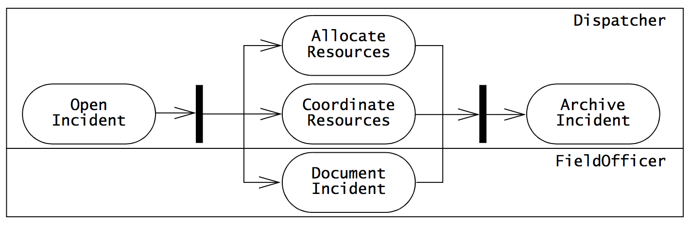

## Exam Question T01:
*Explain the processes and activities of requirement elicitation, specification, and documentation. You should cover topics like: (1) different software process models and their activities; (2) software qualities; (3) functional and non-functional requirements; (4) object-oriented software lifecycle activities and requirement elicitation; (5) UML and other documentation tool/methods for requirement specification. You may use your project as a case study.*

Remember:
- Functional model: use cases + scenarios
- Object model: class diagrams
- dynamic model: sequence diagrams + state machine diagrams
- FURPS
	-	Functionality
	- Usability
	- Reliability
	- Performance
	- Supportability

So, requirements elicitation is the practice of collecting the requirements of a system from the client(s) and defining the purpose of the system.

The result of this activity is a description of the system in terms of actors and use cases.

Its a challenging activity since clients and users are experts in their own domain and have a general idea of what the system should do, but have little experience in software development.

This is the reason why that it is of crucial important to be able to communicate effectively, because otherwise, misunderstandings or missing requirements will be extremely hard to correct later on.

## Software Lifecycle Activities
There are many different software process models and activities, but the typical activities are:

1. Requirements Elicitation, which I've already given a quick summary of,

2. Analysis, where we formalize the requirements specification during elicitation and build a model describing the application domain.

3. System Design, where the analysis object model is transformed into a system design model. Here we reflect on the solution domain.

4. Object Design, where define and refine the interfaces of identified subsystems, identify object design patterns and map models so they are ready for Implementation in source code,

5. Implementation, where we actually implement the stuff, and

6. Testing, where we attempt to find differences between the expected behavior specified by the system models and the actual behavior of the implemented code.

## Software process models
So, while these activities of software engineering are common to most development projects, there are different ways to about them.

### Waterfall pattern
One way is the waterfall pattern, where each step happens sequentially. It is criticized for taking the approach that the world is static, or at least that neither the application nor solution domain change.

Also, by deferring validation and testing to late in the process can result in major issues. It's not what the clients wanted, or it hasn't been properly usability tested

## Risk-Based development
Here, we attempt to anticipate surprises late in a project by identifying high-risk components and giving them special attention. Still suffers from a somewhat sequential approach

## Issue-based/Iterative development
Here, all activities happen in parallel. It is an iterative process where work in one area will influence another.

This approach is generally the one that is hardest to manage, but at the same time it leads to a much better fit between what the clients want and what we come up with.

## UML
But, even though we might take an iterative approach, we will still need to be able to communicate effectively and precisely with the clients.

One great way to do that is by agreeing on a notation to use that has well-defined semantics and is well understood among project participants.

And such a notation is UML.
Back in the day, there was all sorts of ideas about how to do notation in software engineering projects. UML bridges the gap by combining the best of several of them and has luckily been established as an industry standard.

We use UML create models.
- Functional models are represented with use case diagrams and describes the functionality of the system from the user's point of view.

- Object models are represented with class diagrams and describes structure. It may also be used in the analysis object model, still using application domain concepts in a fashion that is understandable to clients.

## Software qualities
Okay, so what makes good software?
The FURPS model gives a great overview:

- **Functionality**: That we actually deliver on the functional requirements.

- **Usability**: That the software is easy to learn and operate and otherwise follow the client's user interface guidelines.

- **Reliability**: That the system can actually perform its required functions under the agreed conditions. This also often covers **dependability**, that it works, even under load and if given invalid inputs.

- **Performance**: That the throughput is large and response time is swift.

- **Supportability**: That the system can be easily maintained and adapted to changes in the application domain.

## Functional and non-functional requirements

### #Functional requirements
A functional requirement **is a specification of a function that the system must support.**

Examples:
- *The user must be able to purchase tickets*
- *The user must be able to access tariff information*

#### Nonfunctional requirements
A nonfunctional requirement is a constraint on the operation of the system that is not related directly to a function of the system.

Nonfunctional requirements can also be related to using a specific hardware platform for the system, security requirements, how the system should deal with failures and how to provide backward compatibility with an old system, etc.

Examples:
- *The user must be provided feedback in less than one second*
- *The colors used in the interface should be consistent with the company colors*

## Documentation
The activities of requirements elicitation and analysis is documented in the Requirements Analysis Document, which describes the system in terms of functional and nonfunctional requirements. This documented is for the developers *and* the clients to see and it contains scenarios and use cases that is written from the user's, or so-called Actor's, point of view.

## Exam Question T02:
*Explain and describe the concepts, methods, activities, and UML diagrams involved in object-oriented analysis (OOA). You should cover topics like: (1) OOA concepts; (2) OOA activities; (3) dynamic and static modeling; (4) UML diagrams used in OOA; (5) OOA in relation to requirement specification and design. You may use your project as a cases study.*

Remember:
- Functional model (use case + scenarios)
- Analysis object model (class diagram)
- Dynamic model (state machine, sequence diagrams)
- Correct / Complete / Consistent / Verifiable

During object-oriented analysis, we formalize the requirements specification obtained during requirements elicitation and build a model describing the application domain. We call this the **analysis model** and we want it to be:
- **correct**, // TODO: Define when it is this.
- **complete**,
- **consistent**, and
- **verifiable**.

Still having focus on the application also means that the client and end-users are usually also involved in this activity.

### The Analysis model
The Analysis model is composed of 3 models:
- **The functional model**: Which is represented by use cases and scenarios.

- **The Analysis object model**: Represented by class diagrams with entities from the application domain.

	-	This is an example of static modeling. This is about structuring the concepts and getting to know the structure of the application domain better.

- **The dynamic models**: Represented by **state machine and sequence diagrams**.

	-	This is dynamic modeling. This is about the interactions between actors and the actual system.

Doing this helps identify areas of ambiguity, omissions and inconsistencies in the requirements specification.

### Analysis object model
Let's dive into the Analysis object model.

It focuses on the individual concepts of the application domain that are manipulated by the system. This includes their properties and their relationships.

We depict this with UML class diagrams with classes that maps to concepts that the client is familiar with.

Specifically, we identify 3 kinds of entities and group them as

- **Entity objects**: Persistent information tracked by the system such as `Year`, `Month` or `Day`.

- **Boundary objects**: The objects through which the user interacts with the system. For instance, a `Button` is a boundary object. Typically, boundary objects are User Interface elements.

- **Control objects**: These represent application-specific business rules and generally have no actual counterpart in the real-world.

#### Why these 3 kinds?
This is called the three-object-type approach. And it helps with quickly distinguishing between different, but related concepts.

### Dynamic model
Here, we focus on the behavior of the system.

Interaction diagrams such as sequence diagrams and state machines help with that.

#### State Machine diagrams
These describe behavior in terms of **states of an individual object** and the possible transitions between states.

The TL;DR; of it:
- State machines has oval entities which represent **states**.
- A state **transition** happens due to some (usually) external event. It may also be triggered by conditions or time.
- **transitions are open arrows**
- A small back circle initiates the initial state.
- A circle surrounding a small black circle indicates a final state.

#### Sequence Diagrams
These diagrams focuses on the messages (or stimuli) exchanged between objects as a result of external events created by an actor.

Messages = method calls with/without arguments.

- We have *Time* on the vertical axis.
- Each column represents an object that participates in the interaction.
- **Messages are shown by solid arrows**.
- Labels on top of arrows represent the message names - They look like method invocations.
- Actor in upper left corner.
- Actor is described as an instance of a class in the application domain, so for instance <u><code>:Researcher</code></u>.

## Relation to requirements elicitation
Requirements elicitation is focused primarily on the functional model through use case diagrams, use cases and scenarios.

**Analysis is primarily focused on the analysis object model (the static application domain) and the dynamic model (behavioral application domain).**

## Exam Question T03:
*Outline and explain the methods, activities, and UML diagrams involved in object-oriented architecture design. You should cover topics like: (1) OOD activities and design goals; (2) subsystems, components, and classes; (3) services and subsystems interfaces; (4) coupling and cohesion; (5) layers and partitions; (6) architectural styles/patterns. You should explain how to document architecture design, including the use of UML diagrams. You may use your project as a case study.*

## Introduction
System design is the transformation of the analysis model into a system design model. This, along with object design and implementation are concerned with the solution domain and the actual construction of the system.

### Focus of system design.
In system design, we focus on defining the design goals of the project and  decomposing the system into manageable parts called subsystems. This is also where we consider where  and how to arrange those subsystems through hardware/software decomposition.

### Architecture analogy.
We call it object-oriented architecture design because the design of a floor plan in architecture is similar to system design in software engineering. You design the floor plan - where the walls, doors and windows should located, all according to the clients requirements, for instance, the kitchen should be close to the dining room and stuff like that.

Likewise, in system design, we can design the full structure of system, but without detailed knowledge of the individual components.

### Design goals
So first off, let's talk design goals.

These are the qualities of the system that developers should optimize for and focus on.

Many of those can be inferred directly from the nonfunctional requirements.
These can greatly influence the architectural patterns we will use in laying out the individual subsystems and their communication with one another.

There are lots of kinds of design goals, but we generally organize them into five main groups:

- **Performance**: Speed and space requirements.
	-	Should the maximize for responsiveness or throughput?
	- Is memory available for speed optimizations, or should we use memory sparingly?
	- **Response time**
	- **throughput**
	- **Memory**

- **Dependability**: How much effort should go into minimizing system crashes and their consequences.
	- How often can the system crash?
	- How available to the user must the system be?
	- **Robustness**: Survive invalid user input.
	- **Reliability**: Difference between specified and observed behavior.
	- **Availability**: Percentage of time the system is up.
	- **Fault tolerance**
	- **Security**
	- **Safety**: (there are lives at stake.)

- **Cost**: How the (often few) money should be spent. How to best invest them.
	-	**Development cost**
	- **Deployment cost**
	- **Maintenance cost**

- **Maintenance**: How difficult will it be to change the system after deployment.
	-	How easily can new functionality be added?
	- **Extensibility**: How easy is it to add functionality?
	- **Modifiability**: How easy is it to change existing functionality?
	- **Adaptability**: How easy is it to port the system to different application domains?

- **End-user criteria**: Qualities that are desirable from a user's point of view. Primarily usability related.
	-	**Usability**: How easy is it for the user learn and to understand the system?

**Often you will see that some goals are mutually exclusive**.
You probably can't have software that is safe, secure *and* cheap.
There are many things to weigh. Like delivery time vs performance, cost vs security and so on.

## Identifying Subsystems
Moving on to subsystems, we can typically start by looking at the functional requirements and derive some of it from them.

Simply by looking at the analysis object model, we can try to keep functionally related objects together and, as a start, define a subsystem for them.

For instance, if we need persistent storage, we might place all classes handling the actual fetching and manipulations of storage in a separate subsystem.

### Low Coupling, High Cohesion
#### Cohesion
We are very much interested in having as high cohesion as possible within a subsystem.

#### Gaining cohesion
Oftentimes, by looking at a class diagram of an individual subsystem, we see high cohesion in multiple regions of it, but overall low cohesion since there are 1 or at least few associations between them. To enhance cohesion, we could split that into two subsystems to improve cohesion.

#### Coupling
In terms of coupling we want as low coupling as possible. Meaning, two subsystems are loosely coupled if they are relatively independent. Or put in other words, if modifications to one will have little (to no) impact on the other.

#### Reducing coupling
Often we can identify high coupling because more than one subsystem is strongly coupled with another one. This means, that if the strongly coupled subsystem changes, then everyone else must change.

We can try to identify those subsystems and implement Architectural models to reduce coupling.

## Layering and Partitioning

Lets start by looking at how we can lay out subsystems with layering and partitioning.

A layer is a **a grouping of subsystems providing related services**. It may be realized using services from another layer.

For instance, consider the OSI reference model in networking. It is a closed architecture meaning that any layer can only access the layer strictly below it.

So, from the top we have the
- application layer
- presentation layer
- session layer
- transport layer
- network layer
- data link layer
- physical layer

If we go for a closed layered architecture, we'll have low coupling by design. As I said, high coupling generally comes from more than one subsystem referencing another one. This way, it will never happen.

With partitioning, we arrange the subsystems such that subsystem can communicate with each other on the same level of abstraction.

These can then be combined to provide an architecture that is layered in a closed architecture, but where classes on each layer of abstraction can communicate with one another.

**For instance, when we did our subsystem decomposition work during system design on ReviewIT, we had a closed layered architecture on the server, but went with a layered *and* partitioned architecture on the client.**

## Architectural design patterns
But lets look into some architectural software design patterns. Architectural design patterns are reusable solutions to common problems, and they bring some advantages:

We can better reason about their pros and cons from prior experience.
This means that we can anticipate problems early on and design for it.

### Repository

Here, we have a central subsystem called the **repository** which other subsystems communicate with.

This means that the subsystems are generally relatively independent since they interact only through the repository. The repository, on the other hand, does **not** know about the subsystems.

This is great for situations where we need to deal with concurrency and integrity issues among subsystems. The central location of the data makes it easier.

The disadvantage is of course that the central repository quickly becomes a bottleneck.

### Model-View-Controller
Here, we classify subsystems as
- *models* if they maintain domain knowledge.
- *views* if they display it to the user
- *controllers* if they manage the sequence of interactions with the user.

This is great for interactive systems when multiple views of the same model are needed.

### Client-Server
This is like the repository, except the central server is managed by a process. If you provide a centralized web service to the other subsystems, client-server is the way to go.

### Peer-to-Peer
This is a generalization o the client-server style in which all subsystems can act as clients or servers. All subsystems are managed processes that can request and provide services to one another.

### Three-tier
This one organizes subsystems into an
- *interface layer* with all boundary objects
- *application logic layer* with control *and* entity objects.
- *storage layer* which realizes the storage, retrieval and query of persistent objects.

## Defining services for subsystems
Another part of system design is defining the services that each subsystem provides. We only assign them names for now. It is during object design that we actually look into assigning names operations and arguments to the actual services.

## Documenting System Design
So, all of this gets documented in the system design document (The SDD).
This includes:
- The design goals,
- The subsystem decomposition (which uses UML deployment diagrams)
- Data management, do we go for SQL or NoSQL, etc.
- Access control, how to we provide security in terms of access to resources.
- Control flow, is the system event driven? How do we handle concurrency and so on.
- Boundary conditions, how do we start and shutdown the system and other exceptional situations.

## Exam Question T04:
*Outline and explain the methods, activities, and UML diagrams involved in object-oriented system design (OOD). You should cover topics like: (1) mapping subsystems to processors and components; (2) identifying and storing persistent data; (3) access control; (4) global control flow; (5) identifying services; (6) identifying boundary conditions. You should explain how to document system design, including the use of UML diagrams. You may use your project as a case study.*

## Introduction
System design is the transformation of the analysis model into a system design model. This, along with object design and implementation are concerned with the solution domain and the actual construction of the system.

### Focus of system design.
In system design, we focus on defining the design goals of the project and decomposing the system into manageable parts called subsystems. This is also where we consider where and how to arrange those subsystems through hardware/software decomposition.

### Architecture analogy.
We call it object-oriented architecture design because the design of a floor plan in architecture is similar to system design in software engineering. You design the floor plan - where the walls, doors and windows should located, all according to the clients requirements, for instance, the kitchen should be close to the dining room and stuff like that.

Likewise, in system design, we can design the full structure of system, but without detailed knowledge of the individual components.

## Mapping subsystems to processors and components

So let's start by considering how to map subsystems on to processors and components. This is also called hardware/software mapping.

We use UML Deployment Diagrams for this.

We use them to depict the relationship between run-time components and nodes.

*Components* are self-contained entities that provide services to other components or actors.

An example of a component is a web server. It is a component that provides services via HTTP.

Here we use nodes, which in UML are 3d-ish boxes, with a stereotype describing which *kind* of node it is as well as actual host instance (for example, <u><code>myMac:Mac</code></u>). Inside these boxes, the components are located. Examples of these could be a Web Server or a database.

We then draw lines between them, labeled with a stereo type describing the protocol they communicate with. For instance, HTTP or TCP.

### Selecting a hardware configuration and a Platform

Sometimes, the nonfunctional requirements may strictly require of us, that we go for a specific strategy. Other times the decision is more driven by our design goals.

For example, in ReviewIT we knew we had to implement the client-side with Universal Windows Platform which only supports Windows devices. So we modeled the client-side of things in a Windows host.

We were mostly concerned about maintainability and dependability and wanted to separate the hosting of the persistent storage from the WebAPI and decided to split it out onto a node of its own.

Another part of system design is identifying and storing persistent data.

## Identifying and storing persistent data
In most application development, some of the objects in the system model needs to be persistent.

But the way to go about it can be very different indeed. For ReviewIT, one of the requirements was for being able to work offline. We needed to come up with a persistent data solution which also enabled for a local persistence strategy.

But generally, sometimes the best storage option is a file on the clients local machine. In case of the loss of internet connectivity or something like that.

Other times, we may not need have complex relationships between entities. We might only store similar data. There, a schema-less NoSQL database such as MongoDB might me a far better match than going for a relational database management system.

Another thing we need to think about is providing access control.

## Access control
Defining access control for a multi-user system can be pretty complex.

We need to be able to decide which actors can perform which actions on our resources. To do this, we can use an *access matrix*.

Here, the rows of the matrix represent kinds of actors, while the columns represent classes whose access we control.

For instance, we might have two kinds of users, `Manager` and `Employee`. We can then permit `Employee`'s read-access to a `CustomerSales` class, but only permit the `Manager` to write to it.

There are 3 different approaches to access control in general:

- **Global access table**: This is a table that for all actors in the system holds every class and all the operations they can perform on it. To check if an actor may perform a specific operation on a specific object, you just perform a lookup in the global access table. If no entries exist, the access is denied.

	-	Takes up a lot of space.

- **Access control lists**: Here, an access list is associated with the individual classes. To see if an actor may perform a specific operation on it, its access list is checked for the corresponding actor and operation.

	- Makes it faster to answer the question "Who has access to this object?". But again, takes up a lot of space.

- **Capabilities**: Associates a class and a set of allowed operations with an actor. A capability allows an actor access to an object of the class described in the capability. So, if a capability is given to the server, it is effectively an access card to perform specific operations on a specific resource.

	-	Makes it faster to answer the question "Which objects has this actor access to?". It definitely has some security concerns. For instance, if I steal a capability from you, It is essentially the same as stealing a key to your house.

During the implementation of ReviewIT, we actually went for dynamic access control instead with the proxy pattern. For each request, we had authentication middleware check if the request had `Authorize` headers associated with it. If it didn't, the WebAPI returned a 401 status code to the client.

## Global control flow
Alright, so let's move on to global control flow. This has to do with the sequencing of actions in a system. There are generally 3 control flow mechanisms:

### Procedure-driven control
Operations wait for input whenever they need data from an actor.
Mostly used in legacy systems and systems written in procedural languages.

### Event-driven control
A main loop waits for an external event. When an event becomes available, it is dispatched to the appropriate object, based on information associated with the event.

It leads to a simpler structure than procedure-driven control and to centralizing all input in the main loop.

However, it does make the implementation of multi-step sequences more difficult to implement.

### Threads
Threads are the concurrent variation of procedure-driven control. The system can create an arbitrary number of threads, each responding to a different event.

If a thread needs additional data, it waits for input from a specific actor.

## Defining services for subsystems
Another part of system design is defining the services that each subsystem provides. We only assign them names for now. It is during object design that we actually look into assigning names operations and arguments to the actual services.

## Identifying Boundary Conditions
And so last up is identifying the boundary conditions of the system.

We need to decide how the system is started, initialized and shut down.

Also, we need to define how to deal with major failures such as data corruption and network outages, whether they are caused by software errors or a power outage.

To identify them, we can go through each subsystem and examine:

- **Configuration**: Where is it created, destroyed or archived.

- **Start-up/Shutdown**: How does it start, shutdown **and configure the component** (very confusing that the configuration check is here, but oh well).

- **Exception handling**: How should the system react (e.g. inform users of failure) upon failure. This is documented with an exceptional use case that extends the relevant common use cases identified way back during requirements elicitation.

## Documenting System Design
So, all of this gets documented in the system design document (The SDD).
This includes:
- The design goals,
- The subsystem decomposition (which uses UML deployment diagrams)
- Data management, do we go for SQL or NoSQL, etc.
- Access control, how to we provide security in terms of access to resources.
- Control flow, is the system event driven? How do we handle concurrency and so on.
- Boundary conditions, how do we start and shutdown the system and other exceptional situations.

## Exam Question T05:
*Described how Quality Assurance (QA) and testing is achieved in software engineering. You should cover topics like: (1) definition (and motivation) of QA and testing; (2) testing terminology and approaches; (3) testing activities test management; (4) test documentation; (5) test driven development; (6) testing technologies. You may use your project as a case study.*

Quality assurance is the planned and systematic activities implemented in a system so that quality requirements for a product or service will be fulfilled.

This is achieved primarily through a systematic approach to testing and validation.

If we look at software process models such as the waterfall model, it is questionable how a sequential approach to the activities of software development can offer quality guarantees. It is crucial that misunderstandings or omissions of functional and nonfunctional requirements become apparent as soon as possible, and these kind of things tend to show themselves only later, either through analysis or system design.

Beside fulfilling the requirements of our client, one desirable property of quality software is reliability

## Techniques for increasing reliability
#### Fault avoidance
Here, we try to prevent faults from ever occurring in the first place through development methodologies and verification.

#### Fault tolerance
Here, we allow some faults to happen, but design for being able to recover from them. This is especially important in distributed systems where a host may crash or lose its internet connection.

#### Fault detection
Through testing, we identify erroneous states and attempt to find the underlying faults that caused them

This is gonna be my main focus from here on out, because  testing is at the heart of quality assurance.

## Testing
The goal of testing is to maximize the number of discovered faults, which then allows developers to correct them and increase the reliability of the system.

Another way to put it is that testing is a systematic attempt to find faults in a planned way.

It is intentional that this definitions is kind of upside down from what you'd intuitively describe as testing. We want that mindset of "proving" that faults are there, not the other way around.

## Test planning
We should allocate at least 25% of our resources on testing and we should plan how we test very early on in the development phase. In theory, we can design test cases as soon as the models they validate become stable.

### TDD
With Test-Driven Development, we test before ever writing a single line of implementation code.

Here, we
- Write an intentionally failing test.
- Run it
- Assert that it actually failed.
- Then we actually implement it.
- Run it
- Assert that it passed.

Test-Driven development has the obvious benefit that we get great code coverage by simply not writing any code we haven't tested. This makes life easier in the long run. When we at a later point in time decide to refactor something, it becomes easy to verify that nothing broke when we do regression testing.

Another benefit is that when we *don't* go with the test-first approach, sometimes the tests we write actually pass, even though the intended behavior doesn't correlate with the functional or nonfunctional requirements. This can be due to a simple fault in our code.

So by running the test we wrote before ever implementing the method, we enhance the probability of not running into these kind of behaviors.

## Terminology
Lets define some terminology, from an implementation perspective:

1. **Failures** happen because something is in an **erroneous state**.

2. Something is in an **erroneous state** because of a **fault** which has happened (at run time).

3. A **fault** happens, either because it has been too long since the implementors last cup of coffee, or maybe it is due to bad communication between development teams or a wrong implementation of the specification. In any case, a fault can lead to erroneous states which may lead to failures.

There are several kinds of testing, so let's just dive right into it.

#### Usability testing
Tries to find faults in the user interface design of the system. Often, systems fail to accomplish their intended purpose simply because their users are confused by the user interface and unwillingly introduce erroneous data.

Usability testing can be hard to measure since it does not compare the system against a specification. Instead it focuses on finding differences between the system and the user's expectation of what it should do.

We don't have that much time, so I'm just gonna say that one popular way of performing usability tests is to do **scenario tests** where one or more users are presented with a realistic, detailed scenario of the system.

Developers then identify how quickly users are able to understand the scenario, how accurately it represents their model of work and how positively they react to the description of the new system.

## Unit testing

Unit testing focuses on the building block of the software system, that is, objects and subsystems.

- Unit testing reduces the complexity of overall test activities, allowing us to focus on smaller units of the system.

- Unit testing makes it easier to pinpoint and correct faults, given that few components are involved in the test.

- Unit testing allows parallelism in the testing activities: Each component can be tested independently of the others.

Also, executing unit tests doesn't require that much effort.

There are several unit testing techniques, but the two main approaches are blackbox and whitebox testing.

*Blackbox tests* focus on the **input/output** behavior of the component. These do not deal with the internal aspects of the component, nor with the behavior or the structure of the components.

*Whitebox tests* focus on the **internal structure** of the component.

## Test stubs and drivers
If we want to really isolate a single component, object or combinations of components, they typically have *some* dependent functionality.

We can provide so-called stubs for these "missing parts" which we *know* produces the outcome we expect. In that way, we always know that if something fails, it *is* happening in the specific thing we are testing.

### Test stubs
They simulate a component that is called by a tested component.

A test stub must provide the same API as the method of the simulated component and must return a value compliant with the return type of the method's type signature.

The thing about stubs, though, is that they are immensely time-consuming to write. You may need to write hundreds of stubs, and especially if you do TDD, you will end up with much more stub classes than actual classes.

Relating this to C# and .NET development, we have this great concept of Mocks. These are smarter in the sense that they can auto-provide implementations of given interfaces with default values for everything using Reflection. This allows you to provide an implementation directly from the test method.

This, of course, also highlights one of the key benefits of dependency injection where we can very easily control exactly which implementations of dependencies the methods under test should consume.

But, staying with the topic at hand, lets move on to integration testing:

## Integration testing
Is the activity of finding faults by testing individual components **in combination**.

This is really important since unit tests don't catch the kinds of faults that could lead to failures when combining two or more components.

There are 2 main strategies for integration testing:

- **Horizontal integration testing strategies**:
Here, components are integrated according to layers, following the subsystem decomposition.

This is very effective, but can not be done before relatively late in the project.

We have, for instance, bottom-up and top-down testing where each component is tested in isolation and then slowly integrated with components on the next layer up or down all layers respectively.

- **Vertical integration testing strategies or continuous integration**

This is an approach to integration testing where your system will *always* be in a runnable state.

Here, components are integrated according to **functions**, rather than layers.

Here, the needed parts of each component are identified and developed in parallel and integration tested.

But its just as much a strategy that states that integration should happen daily where an automated build executes the integration tests and detects errors before merging.

#### System testing
Tests *all* the components together, seen as a single system to identify faults with respect to the scenarios from the problem statement and the requirements and design goals identified in the analysis and system design, respectively:

	-	**Functional testing**: Tests the requirements from the RAD and user manual. Can users actually perform the tasks from start to finish?

	- **Performance testing**: Checks the nonfunctional requirements and additional design goals from the SDD. This is done by developers.

	- **Acceptance testing and installation testing**: Checks the system against the project agreement and is done by the client. Pretty important stuff, huh?

We also have *Regression testing* which includes the re-execution of prior tests after a change. This obviously ensures that stuff that worked before still works now.

This can obviously be very time consuming if this involve manual tests. And this is yet another reason why automated testing is of crucial importance.

## Managing testing
So, finally, lets talk about how we manage testing in a software development project.

In regards to documenting tests, there are various approaches.

### Test Plan
You can have a Test Plan, which defines the scope, resources and test schedule. This is where the requirements as well as the components to be tested are identified. Obviously it is written as soon as possible.

### Test Case Specification
You can also have a document that lists all test cases. This involves the names, how to run them and expected output.

### Test Incident Reports
Here, the actual results of the tests go, and thus also the differences between expected and actual output.

### Test Summary Reports
Here, all failures discovered during tests that need investigation are listed.

But managing testing is not only documenting it. Generally, the testing team should not be the same as the one that implemented it. The reasons for this is the same as for the advantages of code inspection: Sometimes it helps to get a second pair of eyes on your code. But, at the same time testing does require a significant insight in the application *and* solution domain.

## Exam Question T06:
*Explain the main challenges and approaches regarding the mapping of object-oriented models to a relational database system (OO to RDBMS mapping). Explain how this is done in the Entity Framework.*

When you do software development, you often need some objects to persist in-between sessions. In most projects, this is of huge importance.

But the Object-Oriented models don't translate very well into relational databases.

For example, a relational database doesn't support the notion of collections.

So we need a way to map objects to a data structure that can be stored by the persistent database management system.

### Relational database
A relational database is of course made up of tables, each conforming to a specific schema, which is sort of like interfaces in Object-Oriented programming languages - it defines a contract of which columns the table has, as well as the types of the attributes and whether or not they are nullable.

### Records
We then operate with the term *records* rather than instances of objects.

### Fields -> Attributes

To begin with, thankfully we can map fields of primitive types to their counterpart in SQL. We have a lot of flexibility when it comes to numeric types where we can map ints to ints and doubles to doubles and so on.

Thankfully, we can also map strings very easily to VARCHAR's and booleans to booleans.

### Primary keys
The first real action we have to take is to consider how to uniquely identify the data records in a table. We generally don't assign unique identifiers for the objects we instantiate in object-oriented programming as we instead focus on passing references around.

A column in a table that will always be unique can be the *Primary key* for that table. Any column which will always be unique is in principle a *candidate* for a Primary Key, but we should avoid making class fields the primary keys of tables since they might change. For instance, an email-address might be unique, but if a user changes his email, we'd have to find all the references to the old one in the database and change them.

So the first thing we'll do is to make sure that our objects have static ID's which will never change.

### Associations
Now, associations are hugely important in object-oriented programming. Instance fields frequently hold references to instances of other classes.

But in the world of relational databases, there is no such thing. Instead, we map associations to foreign keys.

### Foreign keys
A foreign key key is an attribute that references the primary key of another table. So to map an instance reference, we also need to make sure that the object we are referencing too is a persistent object.

So, if we had a class `Book` that holds a `Publisher`, we would then map that reference to an attribute `PublisherId` that has the primary key for that specific record and we then need to declare it as a foreign key.

**This is called a buried association.**

### One-to-many associations
We can to this for one-to-many associations, where we simply hold the primary key of the `one` association in the records of all `many` associations.

### One-to-one associations
Similarly, except it goes both ways.

### many-to-many associations
This is where it gets harder. Here, we need an *association table*, just like we know it from UML. This then holds a reference to the primary keys of both tables.

### Inheritance
Another *huge* limiting factor is the fact that relational databases have no notion of inheritance.

We can either do **vertical mapping**, where we hold a table for superclass *and* child and then hold a foreign key "link" to a subclass table, or we can do **horizontal mapping**, where we copy the attributes of the superclass and duplicate them in the table representing the derived class.

None of these are great solutions.

### Moving on
Alright, so the challenges are clear.

### Object-Relational Mapping (ORM)
What we want is an easy way to do Object-Relational mapping.

### Entity Framework
The Entity Framework really helps with that.

Not only can you create types in C# that maps to database tables, but you can also intuitively perform queries directly from code using LINQ.

So, using the Entity Framework, I can simply write a model class, lets call it `Book`, and give it a few fields. I can then annotate these fields with attributes:

- I can annotate the class with the `[Table]` attribute which I can use to pass in which table it should map to. SQL tables are typically in plural whereas the C# convention for model items is to have them in singular. So we could annotate our `Book` model with `[Table("Books")]`.

We can then also annotate the individual fields with attributes. For instance, the `[MaxLength]` attribute for strings, which dictates their VARCHAR length in SQL.

### Context
And then, to actually associate the `Book` class with the table, we need to provide a so-called `BooksContext` class which derives from `DbContext`.

Here, we can define a `DbSet<Book>`.

Now, if we want to actually add or query books in the database, we need to instantiate a `BooksContext` and then call methods on it, such as `Add`. When we're done, we can call `SaveChangesAsync`, await it and we're golden.

### Associations with Entity Framework
You need to make sure that you also have a `DbSet` of the referenced type in the context so that it too can operate with the Entity Framework.

### Migrations
But, we still need to run migrations. Migrations is a way for us to update the schema that SQL expects and create the tables we need. Obviously, we might change our model every so often, and then we will need to run new migrations.

## Exam Question T07:
*Explain the SOLID principles. In doing so, you should, for each of them: (1) define what the principle is; (2) provide an exemplary demonstration of the principle. You may use your project as a case study showcasing the concrete application of the principles.*

## SOLID Principles
### **Single Responsibility Principle**
- A class should have one, and only one reason to change.
- A class should have only a single responsibility.

Some great reasons for this:
- If a class do more things and one of the things change, there is a risk that the other thing will break too.
- If we respect this principle, it leads to much more modular code. We can use exactly the functionality we need various places.

- Functional programmers love to diss object-oriented programming with this saying: *"You wanted a banana but what you got was a gorilla holding the banana and the entire jungle."*. But actually, if we respect the Single Responsibility Principle, we just might end up getting just the banana.

- An example of this principle put into use is in the design our our Web API. Here, the controllers *only* call the relevant methods in the BusinessLogicLayer. The controllers themselves has one responsibility - to perform CRUD-operations and return appropriate contents to the requester.

### **Open/Closed Principle**
- Software entities should be open for extension, but closed for modification.

- Classes should be easily subclassed or specialized. It should not be modifiable.

- **An interpretation of this is that we should strive to write code that doesn't have to be changed every time the requirements change**.

- We need to support changing requirements without modifications. Meaning, say I have a payment method, `Pay(CreditCard creditCard)`. What if we want to support vouchers in the future? Instead we should first of all focus on thinking about requirements that may change in the future when we write classes, but we should also code against interfaces, so we can easily change the implementation.

### **Liskov Substitution Principle**
- Derived classes should be usable through the base class interface, without the need for the user to know the difference.

- Functions that has references to base classes must be able to use objects of derived classes without knowing it and without the derived class altering any of the desirable properties of the bass class.

- This enforces us to think of specializations in terms of **enhancing** the capabilities of the base class rather than altering them.

- For example, in ReviewIT, all of our EF-repositories derives from a base EF-repository without altering the behavior of it. That way, we can cleanly enhance the capabilities with additional methods for querying data, leaving the core intact.

### **Interface segregation principle**

- Many client-specific interfaces are better than one general-purpose interface.

- Instead of having lots of logic in the base class that may not be useful to all derived classes, place that logic in one of them or if some of them share the logic, provide a class that derives from the base class and them have the classes that depend on it derive from the new one.

- Again, this goes hand-in-hand with the Single Responsibility principle. Keep your code light. Provide the core functionality from the base class and then specialize from there.

### **Dependency inversion principle**

- Depend upon abstractions, do not depend upon concretions.

- High level modules should not depend upon low level modules. Both should depend upon abstractions.

- Use interfaces. Don't depend on submodules.

- And, submodules too should conform to an interface.

## Why SOLID
If we follow the SOLID principles, we can write code that ages well.

We eliminate:
- **Fragility**: You change something somewhere, and it breaks the software in unexpected areas that are entirely unrelated to the change you made.

- **Rigidity**: If you want to change something, you need to change it in a lot of places.

- **no-reusability**: The code is so tightly coupled that we can't use the desirable parts somewhere else.

## Exam Question T08:
*Describe the Unified Modeling Language (UML) and its purpose. Following focus on the: (1) Activity and State diagrams, how do they relate, and how they differ? (2) Component and Deployment diagrams, how do they relate, and how they differ?*

### Communication
One of the most (if not the most) important parts of Software Development is effective communication.

Not only between developers and clients but also between developers.

Take, for instance, requirements elicitation, which is the practice of collecting the requirements of a system from the client(s) and defining the purpose of the system.

Its a challenging activity since clients and users are experts in their own domain and have a general idea of what the system should do, but have little experience in software development.

This is the reason why that it is of crucial importance to be able to communicate effectively, because otherwise, misunderstandings or missing requirements will be extremely hard to correct later on.

But as we gain more and more insight in the application domain and the program we are about to build, things are also getting much more complex. And as we know, software engineering is a modeling activity. We deal with complex by focusing at any one time on only the relevant details and ignoring everything else.

So to do that, and still be able to communicate effectively and precisely with the clients, we need to agree on a notation to use that has **well-defined semantics** and is **well understood** among project participants.

And such a notation is UML.

## Unified Modeling Language (UML)
UML provides a spectrum of notations for representing different aspects of a system.

### What do we use UML for
We use UML create models.

- **Functional models** are represented with **use case diagrams** and describes the functionality of the system **from the user's point of view**.

- **Object models** are represented with class diagrams and describes the **structure**. We can use object models already during requirements elicitation and analysis to define the *analysis object model* which describes the application domain concepts that are relevant to the system.

	- During system design, the object model is then refined into the *system design object model* and includes descriptions of subsystem interfaces.

- **Dynamic models** are represented in UML with interaction diagrams (typically sequence diagrams), state machine diagrams and activity diagrams. These describe the *behavior* of the system.

## Activity diagrams
{
	*REMEMBER:
	- Rounded rectangles represent activities.
	- Arrows between activities represent control flow.
	- like state machines, it has a small black dot for entry and a small black dot with a white circle around it for exit
	- An activity can be executed only after all predecessor activities completed.
	- Thick bars represent the **synchronization of the control flow. (where they meet before proceeding)**.*
}
Let's take a look at an example of an Activity diagram.

Activity diagrams describe the behavior of a system in terms of **activities**. Activities represent the execution of **a set of operations**.

They are very helpful for describing control flow from a high level. How something proceeds.

For instance, lets say I want to model a situation where I want to post a message to 3 Web services in parallel, and then want to proceed when the message has been successfully sent to both of them.

1. I could start with a `PostMessage` activity which leads into a *fork-node*.

2. A fork-node splits the flow of control into multiple threads.
One of these threads would go to WebServiceA, another to WebServiceB and the last one to WebServiceC.

3. Then, we could draw an arrow from each of these services to a *join-node* which looks identical to a *fork*. This denotes the synchronization of multiple threads down to a single thread. Now, we can proceed.

4. Lets say that the outcome has been reduced to a boolean stating whether or not the operation was successful. We now draw an arrow from the *join-node* into a *decision-note.*

5. A *decision-note*. If the operation was successful, we can move on to the final state which is denoted by a small back circle with a white circle around it. Otherwise, we may go back to the original `PostMessage` activity and move on from there.

## State Machine Diagrams
Now lets compare that to a State Machine Diagram.

{
	*HUSK:
	- state is a rounded rectangle - LIKE ACTIVITY DIAGRAMS
	- start/end state THE SAME AS ACTIVITY DIAGRAMS*
}

A State Machine Diagram describe the dynamic behavior of **an individual object** with focus on the different *states* it can go through.

For instance, using the example from before, say the `PostMessage` activity came from an object called `MessagePoster`. And lets say it has 3 states: `Waiting For Input`, `Sending`, `Awaiting Acknowledgements`.

1. The first state is `Waiting For Input`, so lets draw a starting state and draw an arrow to the initial state.

2. Then, the next state is `Sending`. Let's label the transition with the name of the condition for moving to it.

3. Now, if sending fails, loop back to the `Sending` state to retry infinitely.

4. Draw an arrow to another state: `Awaiting Acknowledgements`. Label the transition condition with "messages sent".

5. Draw an arrow back up to the `Waiting for Input` state and label the transition with the condition "success".

6. Draw an arrow down up a exit-note and label it "explode".

So, as you can see, the State Machine diagram can be very useful for zooming in on an individual object whereas an Activity Diagram can be very useful for focusing on a higher-level concept of Activities which may or may not be directly tied to an individual object.

## Component Diagram
Now lets see move on to component diagrams.

Component diagrams provides an overview of how individual components are wired up to form software systems.

They can reflect lots of stuff. Logical components, physical components, etc, business components and so on.

They reflect their interdependencies in terms of which services they provide and/or consume.

So, lets say we have 3 components:
- UI
- DataManager
- DataProcessor

The DataProcessor provides an `IFooService` and the UI consumes an `IFooService`. Likewise, the UI provides an `IBarService` which the DataManger consumes.

We then draw dashed lines between them to show the dependency associations between the components.

## Deployment Diagrams
Deployment diagrams, while very similar, doesn't express the which services are provided or consumed by the components. Instead it is focused on their distribution in terms of physical notes.

1. So, to express a physical node, we paint a 3D-box.

2. We then assign a stereotype of <<device>> and define note note as an instance of <u><code>:Mac</code></u>

3. Inside it, we put a component with a executable in it. This is gonna be Chrome.

4. Now, we do the same thing, except this time its just a unix host. It has a component on it with an executable program, `node.js` - based on node.js.

5. Now, the line between them shows that they communicate. Not that they depend on each other. Meaning, the server can live without the client and vice versa. But they can communicate.

6. We assign the communication protocol as a stereotype label on the link between them.

And that's it!
