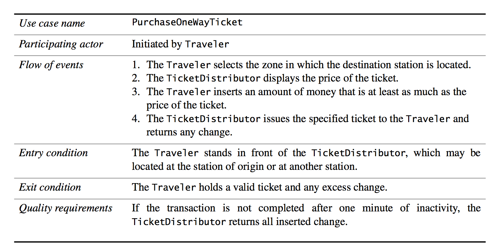
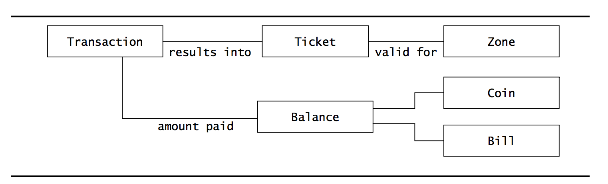
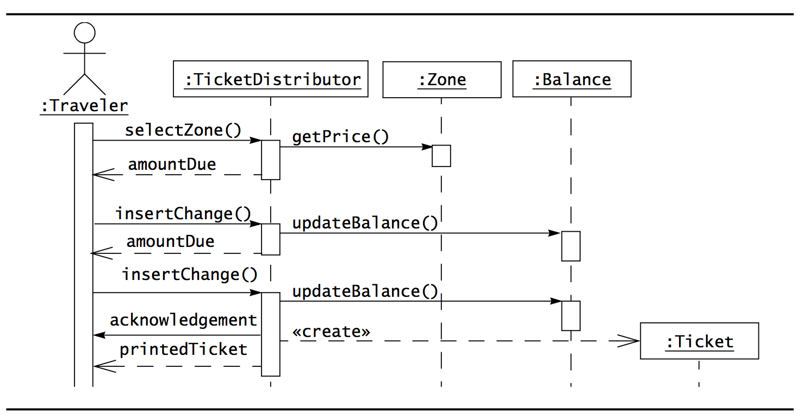
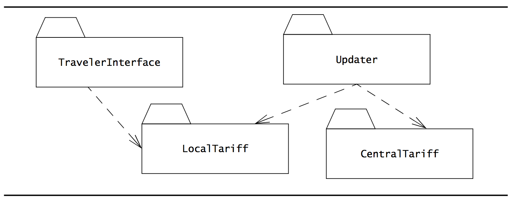

# Introduction to Software Engineering
> [OOSE] ch. 1
>
> (Optional) [SE9] ch. 1+2
>
> FP Jr, Brooks. "No Silver Bullet Essence and Accidents of Software Engineering." Computer 4 (1987)

## Software Engineering

Software engineering is a **modeling** activity.
Complexity is dealt with by focusing at any one time on only the relevant details and ignoring everything else.

Software engineering is a **problem-solving** activity.
Models are used to search for an acceptable solution (often driven by experimentation).

Software engineering is a **knowledge acquisition** activity. In modeling the application and solution domain, software engineers collect data, organize it into information and formalize it into knowledge.

Software engineering is a **rationale-driven** activity. When acquiring knowledge and making decisions about the system or its application domain, software engineers also need to capture the context in which decisions were made and the rationale behind these decisions. Rationale information (a set of issue models) enables software engineers to understand the implication of a proposed change when revisiting a decision.

The emphasis is on both words, *software* and *engineering*.

- An engineer is able to build a high-quality product using off-the-shelf components and integrating them under time and budget constraints.

- The engineer is often faced with ill-defined problems and partial solutions and then has to rely on empirical methods to evaluate solutions.

- Software systems are complex. They are built to achieve many different, and often conflicting objectives.

- Complex systems can be so difficult to understand, even during development, that they are never finished: these are called *vaporware*.

- Software development projects are subject to constant change. Not only does the requirements change, so does the technology - the time between technology changes is often shorter than the duration of the project.
	- If a project manager assumes that all changes have been dealt with and that the requirements can be frozen, when the software is finally ready for deployment, it has become irrelevant - the technology has changed.

## Modeling
A model is an abstract representation of a system that enables us to answer questions about it.

They really help when dealing with systems that are too large, too small, too complicated or too expensive to experience firsthand.

Through models, we can visualize and understand systems that either no longer exist or that are only claimed to exist.

### Sciences
The purpose of science is to describe and understand complex systems.

There are distinctions between *natural sciences*, *social sciences* and *artificial sciences* which computer science is part of.

Obviously, many methods of the natural and social sciences can be applied to the sciences of the artificial as well. We can learn a lot by looking at the other sciences.

### Difference between software engineering and problem solving in other sciences
In software development, change occurs in the application domain and solution domain while the problem is being solved. This is (usually) not the case in other sciences.

### Application Domain
Software engineers need to understand the environment in which the system has to operate.

- For a train traffic control system, software engineers need to know train signaling procedures.

- For a stock trading system, software engineers need to know trading rules.

But: **The software engineer does not need to become a fully certified train dispatcher or a stock broker; they only need to learn the application domain concepts that are *relevant* to the system. Thus, they need to build a model of the application domain.**

### Solution Domain
Software engineers need to understand the systems they *could* build, to evaluate different solutions and trade-offs. **They need to build a model of the solution domain.**

### Object-oriented modeling methods
Combines the application domain and solution domain modeling activities into one. The application domain is first modeled as a set of objects and relationships. This model is then used by the system to represent the real-world concepts it manipulates.

So, for instance, a train traffic control system includes train objects representing the trains it monitors.

Or, a stock trading system includes transaction objects representing the buying and selling of commodities.

Then, the solution domain concepts are also modeled as objects. The set of lines used to depict a train or a financial transaction are objects that are part of the solution domain.

**The idea of object-oriented methods is that the solution domain model is a *transformation* of the application domain model.**

## Problem solving
Engineers search for an appropriate solution, often by trial and error, evaluating alternatives empirically, with limited resources and incomplete knowledge.

The problem-solving activity of engineering involves five steps:

1. Formulate the problem.

2. Analyze the problem.

3. Search for solutions.

4. Decide on the appropriate solution.

5. Specify the solution.

## Development activities of Object-oriented software Development
There are typically six of them:

1. Requirements Elicitation

2. Analysis

3. System design

4. Object design

5. Implementation

6. Testing

### Requirements Elicitation and Analysis
During requirements elicitation and analysis, software engineers formulate the problem with the client and build the application domain model.

### System design
During system design, software engineers analyze the problem, break it down into smaller pieces and select general strategies for designing the system.

### Object design
During object design, developers select detail solutions for each piece and decide on the most appropriate solution.

**System design and Object design result in the solution domain model!**

### Implementation
Here, software engineers realize the system by translating the solution domain model into an executable representation.

### Evaluation on each step
Software development includes activities whose purpose is to evaluate the appropriateness of the respective models:
- During analysis review, the application domain model is compared with the client's reality, which in turn might change as a result of modeling.
- During design review, the solution domain model is evaluated against project goals.
- During testing, the system is validated against the solution domain model, which might be changed by the introduction of new technologies.

## Knowledge acquisition
**Knowledge acquisition is a nonlinear process.**
The addition of a new piece of information may invalidate all the knowledge we have acquired for the understanding of a system.

We must be mentally prepared to start from scratch.

### The waterfall model
The equivalent of the bucket theory of the mind (which states that learning is linear - just keep pouring stuff into a persons head for 6 hours straight and he will keep learning linearly - is equivalent to the sequential waterfall model for software development in which all steps of the engineering method are accomplished sequentially.

This model doesn't really fly in the real world where the requirements and technology changes all the time.

### Risk-based development
Attempts to anticipate surprises late in a project by identifying high-risk components.

### Issue-based development
Attempts to remove linearity altogether. Any activity, be it analysis, system design, object design, implementation, testing or delivery, - can influence any other activity. Here, all activities are executed in parallel. Difficult to manage, but definitely has some advantages to the linear approach as well.

## Rationale
This is hard. For lots of things, we can't derive "proofs" for the assumptions we make about a system. Also, the assumptions change constantly.

The application domain models eventually stabilize once developers acquire and adequate understanding of the problem, but the domain models are in constant flux.

Change introduced by new technology often allows the formulation of new functional or nonfunctional requirements.

To change an existing system, **it is not enough to understand its current components and behavior, it is also necessary to capture and understand the context in which each design decision was made. This knowledge is called the *rationale* of the system**.

Rationale represents a much larger amount of information than solution models. (For every decision, several alternatives may have been considered, evaluated and argued). Also, rationale information is often not explicit. Often, developers make many decisions based on their experience and their intuition without explicitly evaluating different alternatives.

When asked to explain a decision developers may have to spend a substantial amount of time recovering its rationale.

## Software Engineering concepts

### Project
A *project* has the purpose of developing a software system. It is composed of a number of *activities*.

### Activity
An activity is composed of a number of *tasks*.

### Task
A task consumes *resources* and produces a *work product*.

### Work product
Can either be a *system*, *model* or a *document*.

### Resource
A *resource* is either a *participant*, *time* or *equipment*.

### Participants and Roles
- The *client* orders and pays for the system.
- The *developers* construct the system.
- The *project manager* plans and budgets the project and coordinates the developers and the client.
- The *end-users* are supported by the system.

All persons involved in the project are **participants**.

A set of responsibilities in the project or system is referred to as a **role** which then has a set of **tasks**.

### Systems and Models
A *system* is a collection of interconnected parts. Modeling is a way to deal with complexity by ignoring irrelevant details.

### Work products
A *work product* is an artifact that is produced during development, such as a piece of software for other developers or for the client.

- A work product for the project's internal consumption is known as an *internal work product*.
- A work product that must be delivered to a client is known as a *deliverable*.

### Activities, Tasks and Resources
- An *activity* is a set of tasks that is performed toward a specific purpose. One such thing could be requirements elicitation. The purpose of that is to define with the client what the system will do. Another example is delivery, whose purpose is to install the system at an operational location. And so on... Activities can be composed of other activities. Activities are also sometimes called *phases*.

- A *task* is an atomic unit of work that can be managed: A manager assigns it to a developer, the developer carries it out, and the manager monitors the progress and completion of the task. Tasks consume resources, result in work products and depend on work products produced by other tasks.

- *Resources* are assets that are used to accomplish work such as time, equipment and labor.

## Functional and nonfunctional requirements

### Functional requirements
A functional requirement **is a specification of a function that the system must support.**

Examples:
- *The user must be able to purchase tickets*
- *The user must be able to access tariff information*

### Nonfunctional requirements
A nonfunctional requirement is a constraint on the operation of the system that is not related directly to a function of the system.

Nonfunctional requirements can also be related to using a specific hardware platform for the system, security requirements, how the system should deal with failures and how to provide backward compatibility with an old system, etc.

Examples:
- *The user must be provided feedback in less than one second*
- *The colors used in the interface should be consistent with the company colors*

## Notations, methods and methodologies
### Notation
A *notation* is a graphical or textual set of rules for representing a model.
The Roman alphabet is a notation for representing words.
UML is a notation for representing object-oriented models.

### Method
A *method* is a repeatable technique that specifies the steps involved in solving a specific problem. A recipe is a method for cooking a specific dish. A sorting algorithm is a method for ordering elements of a list. Rationale management is a method for justifying change. And so on.

### Methodology
Is a collection of methods for solving a class of problems and specifies how and when each method should be used.

For instance, a seafood cookbook with a collection of recipes is a methodology for preparing seafood if it also contains advice on how ingredients should be used and what to do if not all ingredients are available.

The Object Modeling Technique (OMT) is an object-oriented methodology for developing software.

## Software development methodologies
Software development methodologies decompose the process into activities.

The Object Modeling Technique (OMT) provides methods for three activities:
- *Analysis*, which focuses on formalizing the system requirements into an object model
- *System Design*, which focuses on strategic decisions
- *Object Design*, which transforms the analysis model into an object model that can be implemented

OMT assumes that requirements have already been defined and does not provide methods for eliciting requirements.

## Software Engineering Development activities
As stated, development activities include:
- Requirements Elicitation
- Analysis
- System Design
- Object Design
- Implementation
- Testing

## Requirements Elicitation
Here, the client(s) and developers define the **purpose of the system.**

The result of this activity is a description of the system in terms of actors and use cases.

Actors represent the external entities that interact with the system. These include roles such as end-users, other computers the system needs to deal with and the environment.

### Use cases

Use cases are general sequences of events that describe all the possible actions between an actor and the system for a given piece of functionality.

## Analysis
Here, developers aim to produce a model of the system that is correct, complete, consistent and unambiguous.

The use cases from the requirements elicitation are *transformed* into an object model that completely describes the system:

It is here that developers discover ambiguities and inconsistencies in the use case model that they resolve with the client.

The result of analysis is a system model annotated with attributes, operations and associations.

The system model can be described in terms of its structure and its dynamic interoperation. Here is an example of a dynamic model represented as a UML sequence diagram:

## System Design
Here, developers define the design goals of the project and decompose the system into smaller subsystems that can be realized by individual teams.

Developers also select strategies for building the system, such as the hardware/software platform on which the system will run, the persistent data management strategy, the global control flow, access control policy and handling of boundary conditions.

The result of system design is a clear strategy on each of these, as well as a subsystem decomposition and a deployment diagram representing the hardware/software mapping of the system.

**Analysis and system design both produce models of the system under construction, but only the analysis deals with entities that the client can understand. System design deals with a much more refined model that includes many entities that are beyond the comprehension and interest of the client.**

Here is an example of a subsystem decomposition with UML packages representing subsystems and dashed lines representing dependencies:

## Object Design
Here, developers define *solution domain objects* to bridge the gap between the analysis model and the hardware/software platform defined during system design.

This includes precisely describing object and subsystem interfaces, selecting off-the-shelf components, restructuring the object model to attain design goals and optimizing the object model for performance.

The result of Object Design is a detailed object model annotated with constraints and precise descriptions for each element.

## Implementation
Here, the solution domain model is translated into source code.

This includes implementing the attributes and methods of each object and integrating all the objects such that they function as a single system.

The activity spans the gap between the detailed object design model and a complete set of source code files that can be compiled.

## Testing
Here, developers find differences between the system and its models by executing the system (or parts of it) with sample input data sets.

### Unit testing
During unit testing, developers compare the object design model with each object and subsystem.

### Integration testing
Here, combinations of subsystems are integrated together and compared with the system design model.

### System testing
Here, typical and exception cases are run through the system and compared with the requirements model.
The goal is to discover as many faults as possible such that they can be repaired before the delivery to the client.

## Managing Software Development
Management activities focus on planning the project, monitoring its status, tracking changes and coordinating resources such that a high-quality product is delivered on time and within budget.

These kind of activities not only involve managers, but also most of the other project participants as well.

Activities include:
- Communication
- Rationale Management
- Software Configuration Management
- Project Management
- Software Life Cycle

### Communication
Very important. Misunderstandings and omissions lead to faults and delays that are expensive to correct later on in the development.

It includes the exchange of models and documents about the system and its application domain, reporting the status of work products, providing feedback on the quality of work products, raising and negotiating issues and communicating decisions.

To deal with communication issues, participants can agree on conventions for notations for representing information, tools for manipulating information and on procedures for raising and resolving issues.

### Rationale Management
Management of the justification of decisions. Given a decision, its rationale includes the problem that it addresses, the alternatives that developers considered, the criteria that developers used to evaluate the alternatives, the debate developers went through to achieve consensus, and the decision.

#### Advantages
- If/When a new alternative becomes available, it can be compared with all the other alternatives that were already evaluated.
- If a decision is questioned, the rational behind it can be recovered to justify it.

### Software Configuration Management (Version Control)
The process that monitors and controls changes in work products. Requirements change as the clients requests new features and as developers improve their understanding of the application domain.

Thus, changes during development can be dealt with using configuration management at all stages.

It enables developers to track changes.
The system is represented as a number of configuration items that are independently revised.

For each configuration item, its evolution is tracked as a series of versions. Selecting versions enable developers to roll back to a well-defined state of the system when a change fails.

It also enables developers to control change.
Any change can be set to require assessment and approval before being implemented.

## Project Management
Includes the oversight activities that ensure the delivery of a high-quality system on time and within budget.

This includes planning and budgeting the project during negotiations with the client, hiring developers and organizing them into teams, monitoring the status of the project and intervening when deviations occur.

## Software Life Cycle
A general model of the software development process is called a *software life cycle*. The same modeling techniques applied to software artifacts are used for modeling software processes.

## Exercises
##### 1.1 What is the purpose of modeling?
To provide a clear overview over some part of the full problem by only focusing on the details that are relevant for the focus.

##### 1.2 A programming language is a notation for representing algorithms and data structures. List two advantages and two disadvantages of using a programming language as the sole notation throughout the development process.

Advantages:
- You don't have to use multiple notations for expressing objects and their relations.
- In some cases, you can be more expressive in terms of the relations between entities.

Disadvantages:
- Projects may be composed of multiple languages. Languages may change. Using a notation-language such as UML standardizes the representation of objects and their relations and will survive potential changes of programming languages.
- Clients may not be able to read/understand code whereas they might understand simple UML diagrams.

##### 1.3 Consider a task you are not familiar with, such as designing a zero-emissions car. How would you attack the problem?
First, I would gain knowledge about the application domain through requirements elicitation and analysis. Then I would come up with a System Design. Then I would come up with an Object Design (and potentially adjust the System Design depending on my findings). All along, I would evaluate with the client through work products that describe the progress and assumptions made. Finally, when I had a clear idea of the solution domain, I would transform it into source code (e.g. implement it), writing unit and integration tests along the way.

##### 1.4 What is meant by "knowledge acquisition is not sequential"? Provide a concrete example of knowledge acquisition that illustrates this.

It is not the case that our understanding of a given problem or domain of problems improves linearly with the amount of information about it we are confronted with. Because, some of this new information might conflict with our existing knowledge and require us to readjust our current beliefs.

For instance, we've had natural sciences for thousands of years, but until relatively recently, we thought the earth was flat. We had to collectively readjust our beliefs and some of our fundamental theories about physics along the way.
