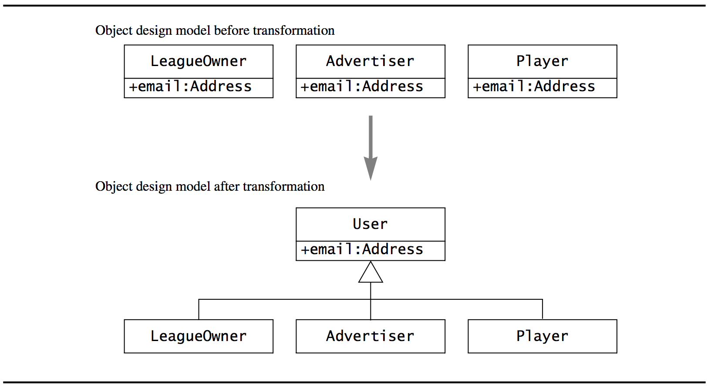

## Object Design (Mapping Models to Code)
>[OOSE] ch. 10

## An overview of Mapping
A *transformation* aims at improving one aspect of the model while preserving all of its other properties.

Hence, a transformation is usually localized, affects a small number of classes, attributes and operations, and is executed in a series of small steps.

These kinds of (typically) local transformations can result in a diversion from the intended model, even though the intensions are good.

## Mapping concepts

- **Model transformations**: These **operate on object models.** For instance, the conversion of a simple attribute (e.g. an address represented as a string) to a class (e.g. a class with street address, zip code, city, state).

- **Refactoring**: These are transformations that **operate on source code**. They are similar to object model transformations in that they improve a single aspect of the system without changing its functionality. They differ in that they *manipulate* the source code.

- **Forward engineering**: Produces a source code template that corresponds to an object model. Many of the things found in an object model can be mechanically mapped to source code constructs. It is then the bodies and additional private methods that are added by developers.

- **Reverse engineering**: Produces **a model that corresponds to source code**. This transformation is used when the design of the system has been lost and must be recovered from the source code.

## Model Transformation
A model transformation is applied to an object model and result in another object model. It may add, remove or rename classes, operations, associations or attributes.

So, practically, this is what we've been doing all along - transforming models to new models, iteratively (hopefully) improving the design along the way.

## Refactoring
Refactoring is a transformation of source code that (hopefully) improves its readability or modifiability without changing the behavior of the system.

To ensure that refactoring does not change the behavior, it is done in small incremental steps that are interleaved with tests (This is actually a thing where it is **REALLY** nice to have lots of unit tests).

Having lots of tests even encourages refactoring since we will always know if things go wrong (well, if we have enough code coverage in our tests, otherwise they prove nothing).

## Forward Engineering
Forward engineering is applied to a set of model elements and results in a set of corresponding source code statements (for instance, classes).

The purpose is to maintain a strong correspondence between the object design model and the code and to reduce the number of errors introduced during implementation.

## Reverse Engineering
Obviously much harder since programming languages are far more expressive than notation languages such as UML.

But anyway, it creates a UML class for each class declaration statement, adds an attribute for each field and adds an operation for each method.

Also, I suppose few UML class diagrams during object design lists *ALL* private operations and fields in each class. Very often during implementation, methods are split into several methods, but I don't see the point in having all that stuff inside a UML class diagram. But anyway, reverse engineering would result in just that.

## Transformation Principles
To ensure that no errors are introduced while doing transformations, you should follow these principles:

- *Each transformation must address a single criteria (design goal)*: A transformation should improve the system with respect to only *one* design goal. You should not attempt to optimize multiple criteria in a single transformation.

- *Each transformation must be local (to the subsystem)*: Only a few methods or few classes must be transformed at once. If you find yourself changing many subsystems at once, you are probably performing an architectural change rather than an object model transformation.

- *Each transformation must be applied in isolation to other changes*: Transformations should be applied one at the time. If you are adding new functionality, you should not optimize existing code. If you are optimizing the performance of a method, you should not add new functionality. And so on.

- *Each transformation must be followed by a validation step*: Double-check with the use case diagrams that you didn't break any functionality. Yeah right. Just run the unit tests and you're fine :-)

## Optimizing the Object Design Model

### Optimizing access paths
Reducing the amount of "paths" you have to take from an object to get to another. For instance, `person.Father.Sister.Hobbies` has 3 paths to the object of interest (`Hobbies`).

How to we identify inefficient paths?

#### Repeated association traversal
You should identify operations that are invoked often and examine the subset of these operations that requires multiple association traversal. Frequent operations should *not* require many traversals, but should have a direct connection between the querying object and queried object.

**If that direct connection is missing, you should add an association class between these two objects!**

Yeah, it might add some redundant associations, but that is usually acceptable due to enhanced performance.

#### "Many" associations
If there are associations with "many" multiplicity, see if you can reduce that to "one" to reduce search time. If it is not possible to reduce the multiplicity, you should consider ordering or indexing the objects on the "many" side to decrease access time.

#### Misplaced attributes
Some classes might turn out to have no interesting behavior in the long run. See if you can put their attributes into the calling class and then removing the classes. Or, they simply might be better placed in other classes than the ones they reside in.

### Collapsing objects into attributes
After transforming/restructuring the object model some times, there may be classes left with few attributes or behaviors left. These can easily be collapsed into an attribute to reduce system complexity.

### Delaying expensive computations
Some objects can be expensive to create.
Sometimes its better to delay their creation until they are actually needed.

### Caching expensive computations
Some computations are expensive, their values are relatively static, and are called multiple times. We should cache the values they return so that multiple invocations of the same method will result in O(1) performance.

## Mapping associations to code

### Unidirectional one-to-one associations
These are easy. If A *has a* B, just store a reference to B in a field on A.

### Bidirectional one-to-one associations
These are hard, since it introduces mutual dependencies.

One way to solve it is by letting A construct B and then pass itself to B's constructor and then storing the instance on A.

However, if A import B and B imports A, we have a problem (unless we bundle them in the same file :-)).

### One-to-many associations
Here we realize the "many" part using a collection.

What kind of collection depends on various stuff. For instance, should it be ordered? Should all items be unique? Stuff like that.

### Many-to-many associations
Here, both A and B have fields that are collections of instances of each other.

(but you should probably find an association class and place that between them).

### Qualified associations
We would you a Map, mapping the named attribute to the object.

A `League` would then have a `Map<string, Player>`, mapping a `nickName` to a `Player`.

This is an alternative to introducing a association class.

### Association class
Easy enough. If A and B are the classes and C are association class, both A and B would simply hold a reference to C.

## Mapping Contracts to Exceptions
Okay, a disclaimer: Who says that contracts should map to exceptions? I can think of a few situations where I do *not* want an exception to be thrown.

But anyway, we can definitely map some contracts to exceptions.

For instance, checking preconditions or postconditions.

## Mapping Object Models to a Persistent Storage Schema
We need to map persistent objects to a data structure that can be stored by the persistent data management system.

### Schema
A *schema* is a description of the data, that is, a meta-model for data. I think of it as an interface (as in the keyword `interface` in OO languages), just inside database terminology.

This is focused on relational databases.

You should map fields/attributes to **columns**-

### Primary keys
The primary key should always uniquely identify the data records in a table. You *could*, for instance, say that a user's nickname was the primary key - if it is unique.

Usually, though, we assign id's to stuff and use that as the primary key.

Attributes that could be used as primary keys (ones that are unique) is called *candidate keys*.

Because: What if we at some point decide that nicknames should *not* be unique? *Or*, more realistically, what if a user changes his nickname? Then we'd have to go through all records that holds a reference to that nickname and change them.

Generally, expect that all fields could change over time and always generate and id which will be used as primary key!

### Foreign keys
**A foreign key is an attribute that references the primary key of another table.**

We use that to link a data record in one table with one or more data records in another table.

### Mapping associations to persistent Storage

### Buried associations
This is just a fancy word for when we store the primary key of one table as foreign key in another.

This is examples of times where we do that:

#### One-to-many associations
These are easy. Just store the primary key of the associated class as foreign key in the table that *has* it.

#### One-to-one associations
The same as above, except it goes both ways.

### Separate tables
Here's examples of when we require multiple tables

#### Many-to-many associations
Here, we are actually forced to introduce an *association table* which holds a reference to the primary keys of each tables.

So, if A *has many* B's and B *has many* A's, a *ABAssociation* table could be generated with two columns: A's primary key and B's primary key.

## Mapping inheritance relationships
There *is* no concept of inheritance in relational databases.

But, some hacky concepts called *vertical/horizontal mapping* can be used to fake it.

### Vertical mapping
Here, each superclass has a foreign key "link" to a subclass table. When I think about it, it sounds awfully complex. Where to put what logic? How to ensure consistency between the records?

Anyway, we map the superclass and subclasses to individual tables.

### Horizontal mapping
Here, the attributes of the superclass are pushed down into the subclasses, essentially duplicating columns in the tables corresponding to subclasses (this sounds so much better).

## Documenting Transformations
If we had 100% sync between the object design model and source code, we wouldn't need any documentation.

However, there *are* things that gets lost in the process of transforming the object design model into source code (or back).

Such as:
- Association multiplicity and collections (which kind of collection should be used? How many is "many"?)

- Postconditions and invariants.

So its really about always making sure that the object design model, source code and documentation is synchronized.

## Responsibilities
The same as in the rest of object design.
