## Object Design (Reuse)
>[OOSE] ch. 8

Object design includes:

- *Reuse*: Here we identify off-the-shelf components and design patterns to make use of existing solutions. Class libraries are selected for basic data structures and services. Design patterns are selected for solving common problems and for protecting specific classes from future change. For all of these things, obviously the design goals are weighted, for instance time-vs-cost.

- *Service/Interface specification*: Here we precisely describe each class interface. In system design, we identified services and gave them names. Now we also give them operations and attributes and document their APIs.

- *Object model restructuring*: Here we transform the object design model to improve its understandability and extensibility. It often involves reducing many-to-many associations, for instance by identifying possible association classes. But also, collapsing classes with no significant behavior into attributes, splitting complex classes into simpler ones and stuff like that.

- *Object model optimization*: Here we transform the object design model to address performance criteria such as response time or memory utilization. Here we make good use of our Computer science degrees to in terms of asymptotic complexities as well as latency optimization in networked tasks and stuff like that.

## An Overview of the process so far
Conceptually, system development fills the gap between a given problem and an existing machine.

Analysis reduces the gap by identifying objects representing problem-specific concepts. The system is described in terms of external behavior such as its functionality (use case model), the application domain concepts it manipulates (object model), its behavior in terms of interactions (dynamic model) and its nonfunctional requirements.

System design reduces the gap by resulting in a virtual machine that provides a higher level of abstraction than the machine by selection off-the-shelf components for standard services such as middleware, user interface toolkits, application frameworks and class libraries and stuff like that.

After iterating some times, only few puzzles are missing. This is where object design comes in.

## Object Design
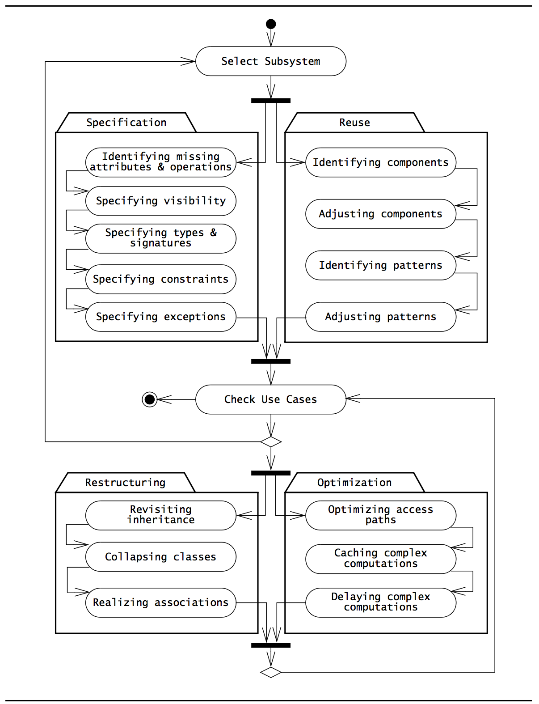

# Reuse Concepts: Solution Objects, Inheritance and Design Patterns

## Application Objects and Solution objects
During object design, we refine both application domain objects (identified in our analysis object model) and solution domain model.

## Specification Inheritance and Implementation Inheritance
During object design, the focus on inheritance is on reducing redundancy and enhancing extensibility.

This is essential because requirements change over time. So, if an existing functionality may be extended in the future, we should provide an inheritance hierarchy that supports it. For instance, instead of having a `Video` and `Image` class, we would have a `Media` class which `Video` and `Image` would then derive from. So, in a year when `Audio` should also be supported, we could just add that subclass.

Polymorphism would still work (any class that accepts a `Media` object would then also accept a `Audio` object).

### Implementation inheritance
The use of inheritance for the sole purpose of reusing code is called *implementation inheritance*. And if that is what you are doing **you should NOT extend a base class for achieving implementation inheritance**. That would break the Liskov substitution SOLID principle. Instead, use a *mixin* or give the class an instance of a class that has the functionality in the constructor.

For instance, you should never have a subclass `Cat` that derives from `Dog` if dog only holds functionality that `Cat` wants. Because the two concepts are not related. And if your code expects a `Dog` somewhere, it would then also accept a `Cat` due to polymorphism. And usually, you wouldn't want that.

### Specification/interface inheritance
The classification of concepts into type hierarchies is called *specification inheritance* (or *interface inheritance*).

So, for instance, a derived `Image` class of the base class `Media` would be specification inheritance since the two concepts are related to each other.

## Delegation
An alternative to implementation inheritance. Is better suited when simply reuse of code is desired.

**A class is said to delegate to another class if it implements an operation by resending a message to another class**.

This also means that the base class wouldn't be able to be substituted for the derived class in any of the client code. This is a good thing!!

Obviously, specification inheritance (where the concepts are related and defines a subclass hierarchy) is always preferable if the concepts are related.

### The Liskov Substitution principle
It essentially states that, if a client code uses the methods provided by a superclass, then developers should be able to add new subclasses without having to change the client code.

Or, if all classes are subtypes of their superclasses, **All inheritance relationships are specification inheritance relationships**.

## Design Patterns
A design pattern has four elements:
- A *name* that uniquely identifies the pattern.
- A *problem description* that describes the situations in which the pattern can be used.
- A *solution* stated as a set of collaborating classes and interfaces.
- A set of *consequences* that describes the trade-offs and alternatives to be considered with respect to the design goals being addressed.

Many design patterns will use a mix of inheritance and delegation and therefore look similar.

Here are some concepts that will be used in the definition of these patterns:
- The *client* class accesses the pattern.
- The *pattern interface* is the part of the pattern that is visible to the client class.
- The *implementor* class provides the lower-level behavior of the pattern. In many patterns, a number of collaborating implementor classes are needed to realize the pattern behavior.
- The *extender* class specializes an implementor class to provide a different implementation or an extended behavior of the pattern.

## Decorator pattern

**STRUCTURAL DESIGN PATTERN**

Allows for dynamically adding functionalities/behavior to an object.

It is a more flexible alternative to subclassing an object aimed at extending it.

For instance, say I wanted to **sometimes** provided border to my `TextArea`. Should I create `BorderedTextArea` subclass of `TextArea`?

The Decorator pattern says no.

Instead, have the `TextArea` derive from another object responsible for handling the decoration (and the client interaction).

Give that object the same interface as the, in this example, `TextArea` that the client wants to perform actions on.

The principle is that you can chain any number of decorators. So, now you can do stuff like `new BorderDecorator( new TextArea() );` or just `new TextArea()`.

### Decorator vs inheritance
The decorator pattern is dynamic (happens on run time).

Any combination of decorators can be created.

### Decorator vs composite
It *is* pretty much like a composite, except with one single component.

But, the *purpose* of the composite pattern is to aggregate objects while the purpose of the decorator pattern is to add behavior to an object.

### Decorator vs adapter
- Decorator enriches the functionalities **without modifying the interface.**

- Decorator modifies the responsibilities of an object, **not its interface**.

- Adapter modifies the interface of an object.

## Proxy pattern
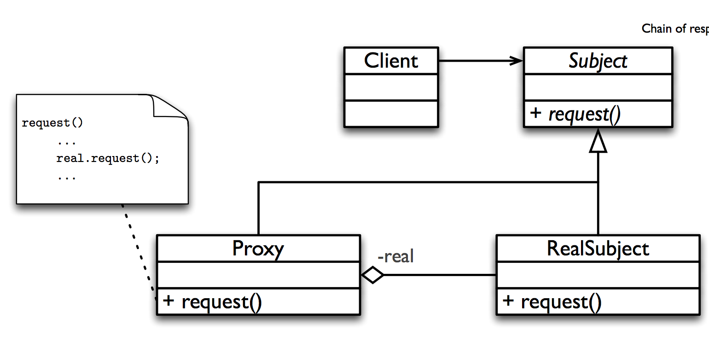
**STRUCTURAL DESIGN PATTERN**

It provides a surrogate or a placeholder for an object - to control its access. Without the user ever knowing it.

So, as you can see in the diagram, the user is *actually* communication with a Proxy class that implements the same interface as the `RealSubject` class (the requested action). The Proxy will then determine if the operation should execute (and optionally some other work like logging it) and manually delegate the execution of the operation to the "actual" implementation.

## Visitor pattern
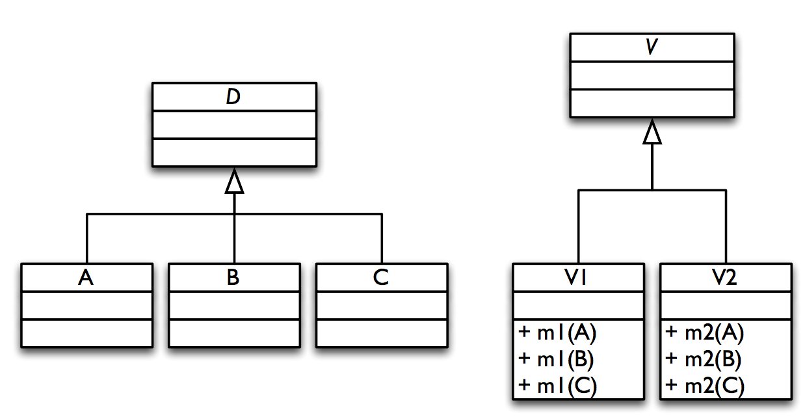
**BEHAVIORAL DESIGN PATTERN**

The visitor pattern allow the definition of a new operation for a hierarchy of classes without modifying the classes themselves.

It can be used in a class hierarchy.

It's pretty weird. You define a subclass **for each operation you want to add**. Each of these subclasses then has overloaded methods taking each of the parallel subclasses as arguments.

The takeaways are these:
- It has high coupling between the visitor and the visited hierarchy.

- It is pretty controversial

- Use an alternative

// TODO: Maybe understand this pattern better and come up with something that makes sense.
[Read this one](https://sourcemaking.com/design_patterns/visitor)

## Chain of responsibilities pattern
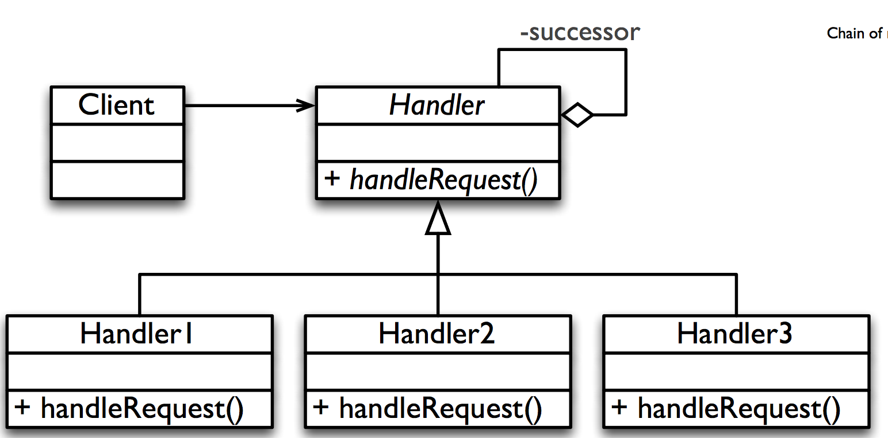
**BEHAVIORAL DESIGN PATTERN**

This is a pattern (like many others) for enforcing indirect communication between sender of a request and the receiver.

**<em>But</em>, what makes it special is that more than one object can satisfy the request**.

A client submits a request to an abstract base class (as always): the `Handler`.

The concrete derived handler class that first receives the request then checks if it can fulfill it. If not, it will *pass the request on* down the chain until it arrives at a concrete handler that can actually fulfill it. If none can (e.g. if the request arrives at the last link of the chain), that handler will know that the request can't be fulfilled.

When I think of an example of a chain of responsibilities, I think of event propagation which "bubbles up" until it reaches an event handler.

## Façade pattern
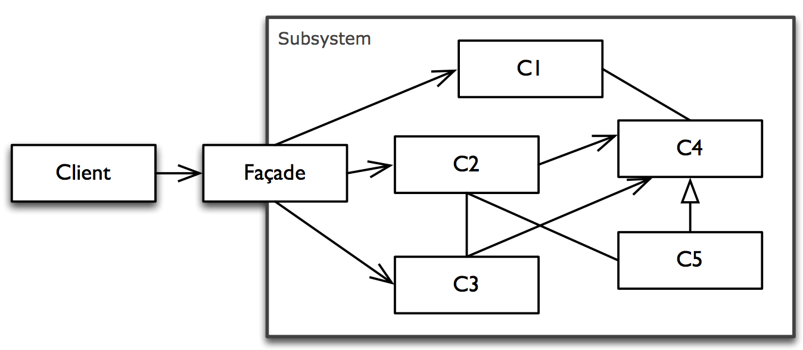
**STRUCTURAL DESIGN PATTERN**
It can be used to simplify the use of a system by providing a unified interface for a group of various functionalities from a multitude of interfaces/classes.

It then hides the components of the subsystem from the client.
However, the client can still, if necessary, use the classes of the subsystem directly (I guess this is open to interpretation. Is this a requirement?)

### Façade vs Adapter
Both of them are based on an interface, but
- Façade simplifies it
- Adapter converts it.

## Observer Design Pattern
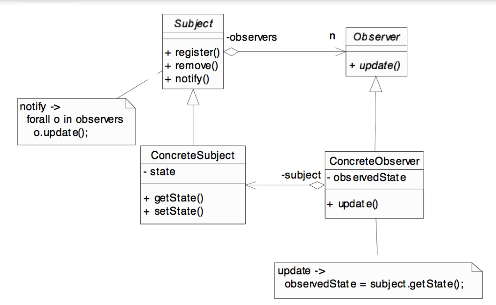
**BEHAVIORAL DESIGN PATTERN**

It has a set of objects "observing" the state of an object. They will be notified and updated immediately when the state changes.

All observers need to register themselves as observers. When the state changes, all observers will then be notified (by calling a method).

Its up to the observers to figure out what to do with that notice.

Typically, the observers are "views" which makes the observer pattern awesome for user interface design.

## Template Design method
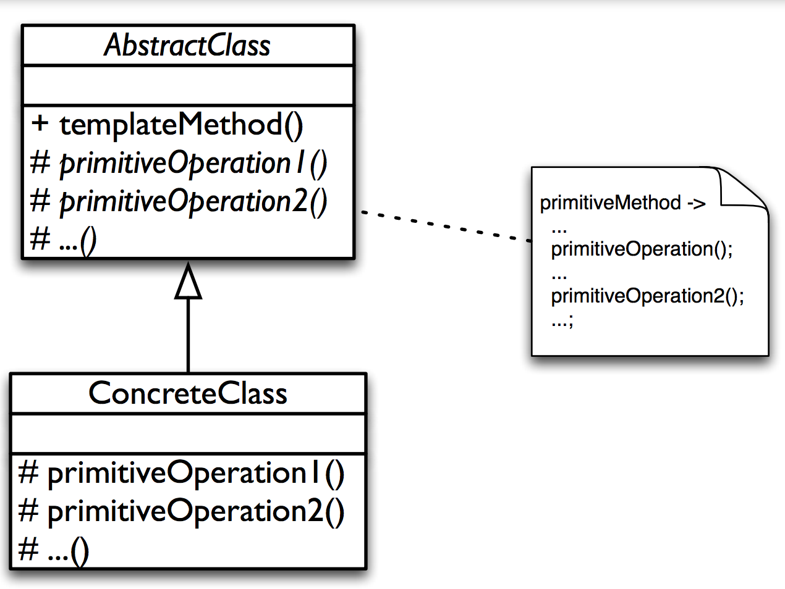
It defines the structure of an algorithm in one method - **but leaves some parts undefined.**

The actual implementation of the unspecified parts is contained in other methods which implementation is found in subclasses.

Very useful in frameworks.

## Adapter Design Pattern
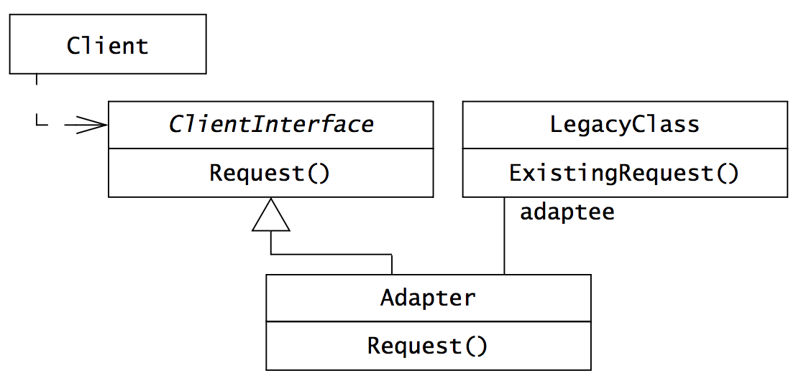
**STRUCTURAL DESIGN PATTERN**

The Adapter Design Pattern converts the interface of a (typically legacy) component into a different interface expected by the client, so that the client and the legacy class can work together without changes.

An `Adapter` class implements the `ClientInterface` expected by the client. The `Adapter` then delegates requests from the client to the `LegacyClass` and performs any necessary conversion.

Consequences:
- `Client` and `LegacyClass` work together (indirectly) without modification of neither `Client` nor `LegacyClass`.

- `Adapter` works with `LegacyClass` and all of its subclasses.

- A new `Adapter` needs to be written for each specialization (e.g. subclass) of `ClientInterface`.

### Inheritance and delegation in the Adapter pattern
- It uses specification inheritance between the `ClientInterface` and the `Adapter`.

- The `Adapter` in turn *delegates* to the `LegacyClass` implementor class to realize the operations declared in `ClientInterface`.

## Bridge Design Pattern
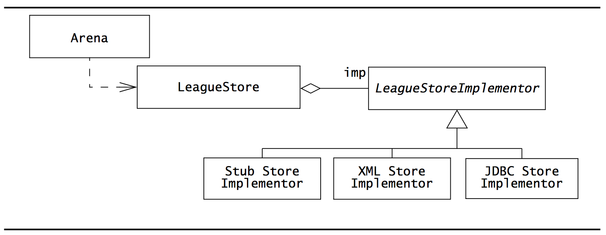
**STRUCTURAL DESIGN PATTERN**

The bridge pattern provides a solution for dynamically substituting multiple realizations of the same interface for different users. Its very similar to the Strategy pattern, except here the user doesn't know about (or at least determine) the actual implementation. (For instance, great for deciding for an Offline or Online strategy).

**Bridge is something that could be used in the early stages of a project whereas Adapter is more focused on backwards compatibility**.

When it comes to writing individual subsystems concurrently, some subsystems might be ready before others. Stubs are often used in place of missing subsystems to mock the functionality of it. Other times, multiple versions of the same subsystem are realized to test out their performance.

In the image above, the `LeagueStore` is the interface class to the pattern. The `LeagueStoreImplementor` is an abstract interface that provides the common interface for the 3 implementations: `StubStoreImplementor`, `XMLStoreImplementor` and `JDBCStoreImplementor`. It would be easy to just add one more if need be.

So, the client communicates with the high-level interface (`LeagueStore`). It then expects an implementation of the interface `LeagueStoreImplementor` which can be provided from several classes **at runtime**, as long as they conform to the interface.

### Inheritance and delegation in the Bridge pattern
- Specification inheritance is used between the abstract `Implementor` interface and the concrete classes that implements it.

- Delegation is used to decouple `Abstraction` (`LeagueStore`) and `Implementor` (`LeagueStoreImplementor`).

### Similarities between Bridge and Adapter
These two are similar in purpose *and* structure.
Both decouple an interface from an implementation, and both use a specification inheritance relationship and a delegation relationship.

But:
- The Adapter pattern uses inheritance first and *then* delegation, whereas
- The Bridge pattern uses delegation first and *then* inheritance.

## Strategy pattern
**BEHAVIORAL DESIGN PATTERN**
If we require dynamic switching between two or more implementations on runtime and also want to be able to deal with possible future extensions, the strategy pattern is the way to go.

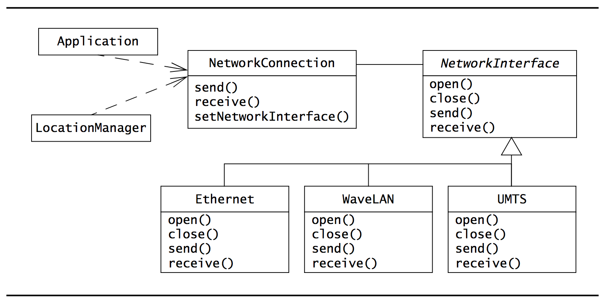

The Bridge and Strategy patterns are almost identical in a class diagram. The key difference is in the creator of the concrete implementation classes: In the Bridge pattern, the abstraction class creates and initializes the concrete implementations. In the Strategy pattern, however, the context is not aware of any concrete strategies. **Instead, a client creates the concrete strategy objects and configures the context.**

Also, the Strategy pattern are usually created and substituted several times during run time while the Bridge pattern are usually created at initialization time.

## Abstract factory pattern
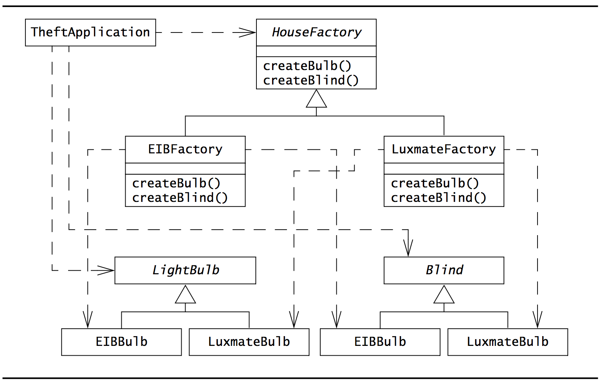
**CREATIONAL DESIGN PATTERN**

An *abstract* factory pattern can be used like the factory pattern, except for generation specialized factories, each responsible of being able to create their own kinds of objects.

So, for instance, you could have an abstract factory for constructing BMW or Mercedes factories which you'd then be able to use independently with the factory pattern.

## Factory pattern

**CREATIONAL DESIGN PATTERN**

The factory pattern can create instances of objects without exposing the creation logic to the client. This also means that you could call, for instance `shapeFactory.CreateShape("circle")` to get a circle, without having to rely on all sorts of import statements.

### Inheritance and delegation in the abstract factory pattern
It uses specification inheritance to decouple the interface of a product from its realization.

## Command pattern
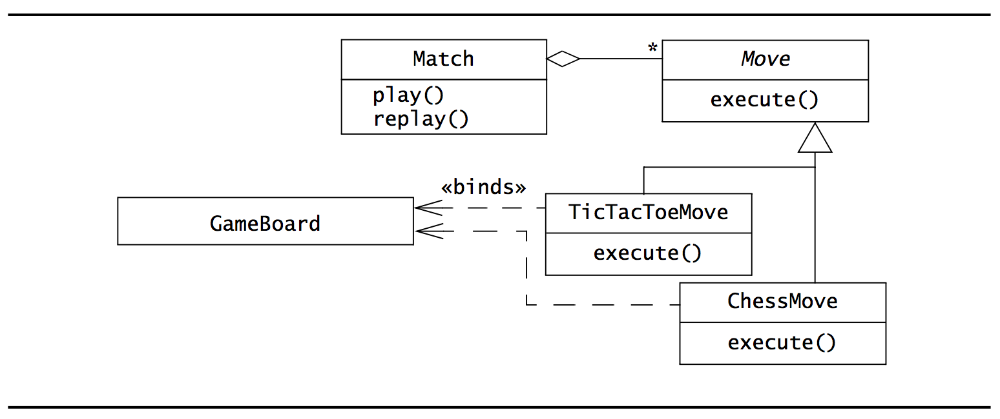
**BEHAVIORAL DESIGN PATTERN**
The point is, have an abstract class (command class) declares the possible operations, whereas concrete command classes (subclasses) **implement** the commands they can offer.
So, in the example, `Move` is the command class. It is abstract. It has a single method, `execute` which is implemented by `TicTacToeMove` and `ChessMove`.

### Inheritance and delegation in the Command pattern
- It uses specification inheritance between the command class and the concrete implementations.
- It uses delegation between the concrete commands and the receivers as well as between the invoker and the command object.

The Command pattern is often used in MVC where receivers are model objects, invoker and commands are controller objects and clients creating commands view objects.

## Composite pattern
**STRUCTURAL DESIGN PATTERN**
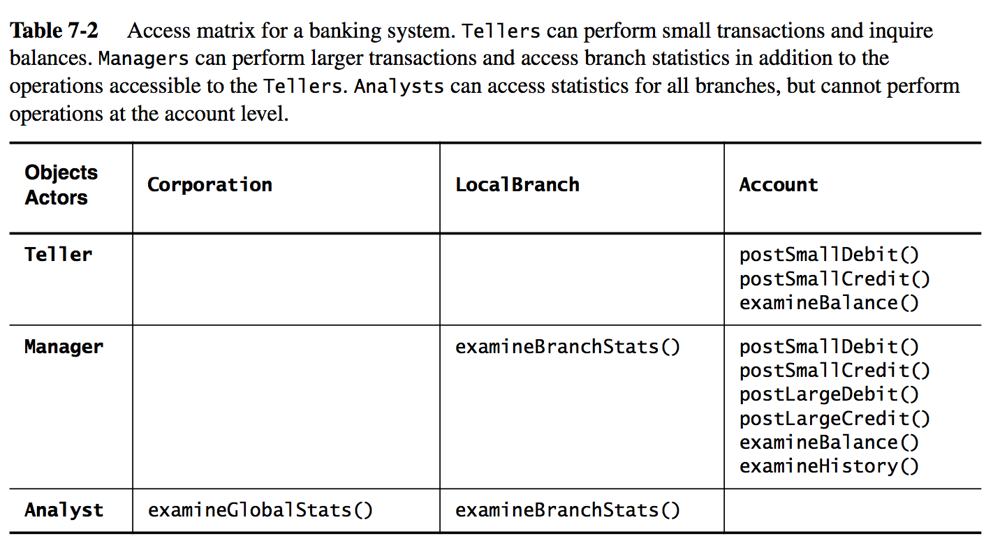
A recursive tree-based structural pattern.

We have an abstract base class `Component` which all objects derive from. It is like a directory. Each directory contains zero or more entries, each of which could be a directory on its own.

## Reuse activities: Selecting Design Patterns and Components
When selecting design patterns, **you must be able to anticipate change and design for it**. Some design patterns anticipate different changes than others.

Here is an overview:

<table>
	<caption>Selected design patterns and the changes they anticipate</caption>
	<tr>
		<td><strong>Design Pattern</strong></td>
		<td><strong>Anticipated change</strong></td>
	</tr>
	<tr>
		<td><strong>Bridge</strong></td>
		<td><em>New vendor, new technology new implementation.</em> This pattern decouples the interface of a class from its implementation. It serves the same purpose as the Adapter pattern <strong>except that the developer is not constrained by an existing component.</strong></td>
	</tr>
	<tr>
		<td><strong>Adapter</strong></td>
		<td><em>New vendor, new technology new implementation.</em> This pattern encapsulates a piece of legacy code that was not designed to work with the system. It also limits the impact of substituting the piece of legacy code for a different component.</td>
	</tr>
	<tr>
		<td><strong>Strategy</strong></td>
		<td><em>New vendor, new technology new implementation.</em> This pattern decouples an algorithm from its implementation(s). It serves the same purpose as the Adapter and Bridge patterns, <strong>except that the encapsulated unit is a behavior.</strong></td>
	</tr>
	<tr>
		<td><strong>Abstract Factory</strong></td>
		<td><em>New vendor, new technology</em> Encapsulates the creation of families of related objects. This shields the client from the creation process and prevents the use of objects from different (incompatible) families.</td>
	</tr>
	<tr>
		<td><strong>Command</strong></td>
		<td><em>New functionality.</em> This pattern decouples the objects responsible for command processing from the commands themselves. This pattern protects these objects from changes due to new functionality.</td>
	</tr>
	<tr>
		<td><strong>Composite</strong></td>
		<td><em>New complexity of application domain</em> This pattern encapsulates hierarchies by providing a common superclass for aggregate and leaf nodes. New types of leaves can be added without modifying existing code.</td>
	</tr>
</table>

## Heuristics for selecting design patterns
You could use key phrases from the RAD and SDD to select candidate patterns, similar to Abbot's natural language technique to extracting objects from use cases.

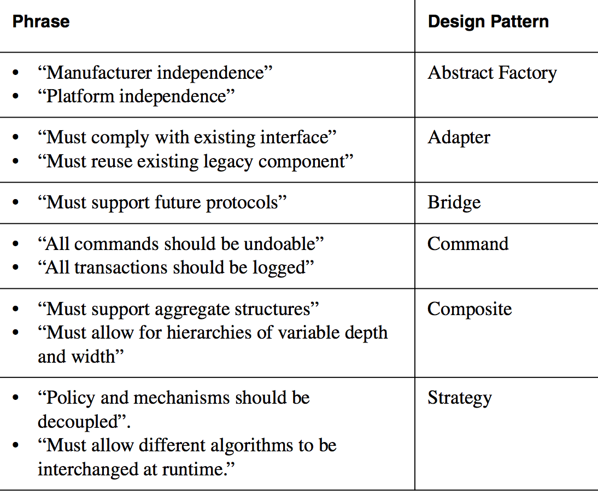

## Identifying and Adjusting Application Frameworks

An application framework is a reusable partial application that can be specialized to produce custom applications.

The advantages are reusability and extensibility.
Reusability comes from application domain knowledge and the prior effort of experienced developers.

Typically, application frameworks provides *hooks* which can then be overwritten by the application to extend the application framework.

### Kinds of frameworks
- **Infrastructure frameworks**: Aim to simplify the software development process. For instance, user interface design and communication tasks.

- **Middleware frameworks**: Used to integrate existing distributed applications and components.

- **Enterprise application frameworks**: These are application specific. Huge, ugly and all covered in Oracle and IBM logos. These are like reading this book. They know how to do *lots* of boring things, all of which takes forever to execute and few of which are even relevant anymore.

### Kinds of framework techniques
- **Whitebox frameworks**: Rely on inheritance and dynamic binding for extensibility. Existing functionality is extended by subclassing framework base classes.

- **Blackbox frameworks**: Defines interfaces for components that can be plugged into the framework. Existing functionality is reused by defining components that conform to a particular interface and integrating these components with the framework using delegation.

## Design patterns vs frameworks
The main difference is that frameworks focus on reuse of concrete designs, algorithms and implementations in a particular programming language.

In contrast, patterns focus on reuse of abstract designs and small collections of cooperating classes. Frameworks focus on a particular application domain whereas design patterns can be viewed more as building blocks of frameworks.

## Class libraries versus frameworks
Classes in a framework cooperate to provide a reusable architectural skeleton for a family of related applications. In other words, it OWNS you, your code, your life and all of your friends. Well, maybe not. But who knows?

In contrast, class libraries are less domain specific and provide a smaller scope of reuse. These potentially tiny bits and pieces can be combined together to form an application. Class libraries are typically passive: they do not implement or constrain the control flow.

Frameworks, however, control the flow of control within the application.

## Components vs frameworks
Components are self-contained instances of classes that are plugged together to form complete applications (I think of them as modules).

A component is a blackbox that defines an interface.

Components are less tightly coupled.

## Managing reuse
There are obvious advantages:
- *Lower development effort (+ fewer errors)*: When reusing a solution or a component, many standard errors are avoided. Also, you can use development resources on other parts of the application. this means lower cost, less effort.

- *Lower risk*: When reusing repetitively the same design pattern or component, the typical problems that will be encountered are known and can be anticipated.

- *Widespread use of standard terms*: A benefit of design patterns is that it enables everyone to use the same vocabulary. The concepts Adapter, Bridge, Command or Facade denote precise concepts that developers become familiar with over time.

The challenges for reuse are:

- *NIH (Not-Invented-Here) syndrome*: This is a disorder that I suffer from. But no medication helps. Looking into the source code of popular class libraries and frameworks, you sometimes wonder how it can be so terrible. Anyway, the book states that developers tend to believe that they can develop a completely new solution that is better adapted to their specific problem (which is usually true) in less time than what they need to understand the reused solution (which is usually not true).

- *Training*: Developers require training in reused code, for instance frameworks or libraries.

## Documenting reuse
To document reusable solutions, for instance a design pattern or a framework, you must describe it but also which problems it addresses, the trade-offs faced by the developer and alternatives you considered (remember, rationale).

## Assigning responsibilities (in terms of reuse)
- **Component expert**: The component expert is familiar with using a specific component. This would be a developer and usually has received third-party training in the use of the component.

- **Pattern expert**: The pattern expert is the analog of the component expert for a family of design patterns.

- **Technical writer**: The technical writer must be aware of reuse and document dependencies between components, design patterns and the system.

- **Configuration manager**: He/she must be aware of the versions of the components that are used. (goddamnit, doesn't the book expect people to use package managers and version control?)
