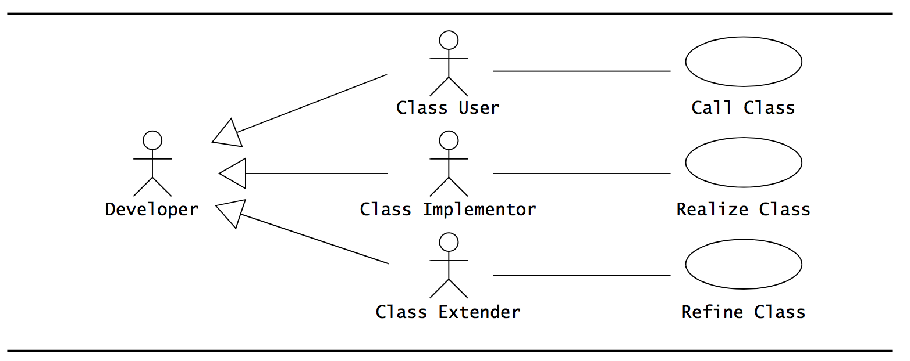
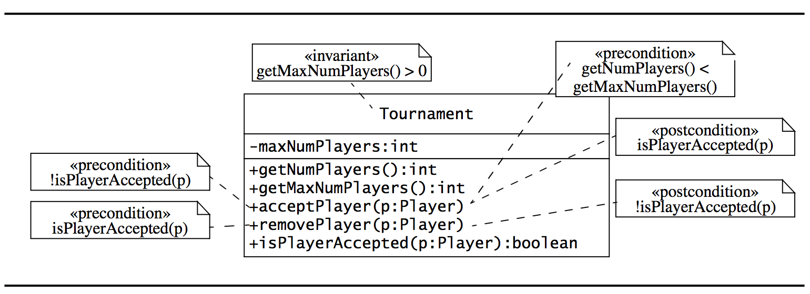
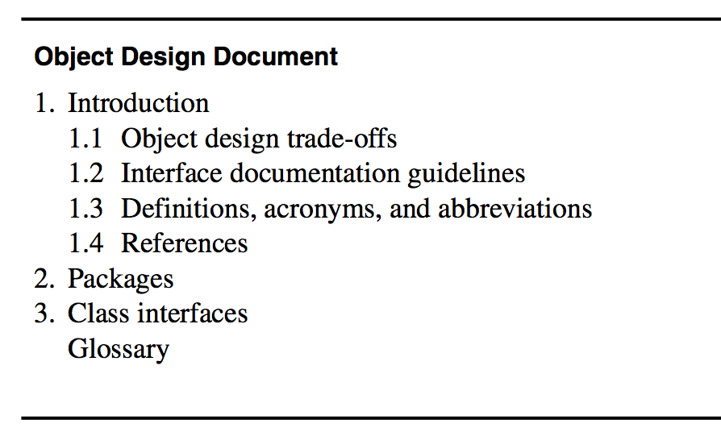

## Object Design (Specifying Interfaces)
>[OOSE] ch. 9

The interface specification part of object design include:
- Identifying missing attributes and operations.

	-	We examine each subsystem service and each analysis object. We identify missing operations and attributes that are needed to realize the subsystem service. We refine the current object design model and augment it with these operations.

- Specifying type signatures and visibility

	-	We decide which operations are available **to other objects and subsystems** (e.g. the interface) and which are used only within a subsystem. We also specify the return type of each operation as well as the number and type of its parameters. The goal is to reduce coupling and provide a small and simple interface that can be understood easily by any single developer.

- Specifying preconditions and postconditions:
	-	We describe in terms of constraints the behavior of the operations provided by each object. In particular, for each operation, the conditions that must be met before the operation is invoked and a specification of the result after the operation returns.

# Interface Specification concepts

## Class Implementor, Class Extender and Class User

(Oh, by the way, this is the first use case diagram with inheritance I've seen in the book!)

All developers are not equal. We need to differentiate developers based on their point of view:

### The Class implementor
The class implementor is responsible for realizing the class under consideration. Class implementors design the internal data structures and implement the code for each public operation.

### The Class user/consumer
The class user invokes the operations provided by the class under consideration during the realization of another class, called the *client class*.

### The class extender
The class extender develops specializations of the class under consideration. Like class implementors, class extenders may invoke operations provided by the class of interest, but focuses on specialized versions of the same services.

## Types, Signatures and Visibility
Doesn't really need much explaining. We identify the types of attributes and the signatures of the operations. The visibility is in terms of access modifiers (public|private|protected|[package|internal|protected internal]).

An attribute or operation with a visibility of *package* can be accessed by any class in the nearest enclosing package. This enables a set of related classes, for example the subsystem under consideration, to share a set of attributes or operations without having to make them public to the *entire* system.

### Visibility modifiers in UML
<table>
	<tr>
		<td><strong>Symbol</strong></td>
		<td><strong>Access</strong></td>
	</tr>
	<tr>
		<td><code>+</code></td>
		<td><code>public</code></td>
	</tr>
	<tr>
		<td><code>-</code></td>
		<td><code>private</code></td>
	</tr>
	<tr>
		<td><code>#</code></td>
		<td><code>protected</code></td>
	</tr>
	<tr>
		<td><code>~</code></td>
		<td><code>package</code></td>
	</tr>
</table>

## Contracts: Invariants, Preconditions and Postconditions

### Contracts
Contracts are constraints on a class that enable class users, implementors and extenders to share the same assumptions about the class.

It specifies constraints that must be met before using the class as we ll as constraints that are ensured by the implementor and extender when used.

### Three types of constraints

- *Invariant*: A predicate that is always true for all instances of a class. Used to specify consistency constraints among class attributes. (so for instance, an invariant could be static const/final members always return the same value, or that a given property will always return values >= 0).

- *precondition*: A predicate that must be true before an operation is invoked. These are associated with a specific operation! Used to specify constraints that a class user must meet before calling the operation.

- *postcondition*: A predicate that must be true *after* an operation is invoked. These are associated with a specific operation! Used to specify constraints that a class implementor/extender must ensure after the invocation of the operation.

## Object Constraint Language (OCL)
A constraint can be expressed in natural language or in a formal language such as OCL.

It simply allow constraints to be formally specified on single model elements such as attributes, operations or even whole classes.

### Constraints
**A constraint is expressed as a boolean expression returning either `True` or `False`**.

**A constraint *can* be depicted as a note attached to the constrained UML element by a dependency relationship**:



A less cluttered way to add constraints is by writing them in OCL:
```ocl
context Tournament inv:
	self.getMaxNumPlayers() > 0
```

The `context` keyword indicates the entity to which the expression applies. The `keyword` after the entity indicates the type of constraint (`inv|pre|post`).

`self` holds a reference to the specific class instsance.

### OCL operations on Collections
(I only add a description if it isn't self-explanatory).

- `size`
- `includes(object)`
- `select(expression)`: Returns a collection that contains only the elements of the original collection for which the given expression is `True`.
- union(collection)
- intersection(collection)
- asSet(collection)

## Inheriting Contracts
You would expect that a contract that holds for a base class also holds for derived classes. Especially given the polymorphism principles of Object-Oriented languages. This is called *contract inheritance*.

*But*, the answer is actually that it depends on the kind of constraints:

- *Preconditions* is allowed to be weakened in subclasses in the operations being overridden.

- *Postconditions* are inherited.

- *Invariants* are inherited.

## Documenting Object Design

### Object Design Document (ODD)

Object design is documented in the *Object Design Document (ODD)*.

It describes:
- Object design trade-offs made by developers,

- Guidelines they followed for subsystem interfaces,

- The decomposition of subsystems into packages and classes, and

- The class interfaces.

This document will be used to exchange interface information among teams and as a reference during testing. The audience of the ODD includes system architects and developers who implement each subsystem. Oh, and testers. Never forget the testers.

### Approaches to documenting object design
You can:

- Auto-generate a ODD from a model.
- Treat ODD as an extension of the RAD.
- Embed the ODD in the source code

### Coding conventions in the ODD
Especially the Interface documentation guidelines and coding conventions are obviously important. This is stuff that sometimes is embedded in a README file, for instance on github. Here, it is more formalized.

### Auto-generating (parts of) the ODD
Is something you can do directly from source code. For instance, with Java doc (Java), Swagger (C#) or ESDoc/JSDoc (Javascript) and so on.

**IT IS NOT A SUBSTITUTE FOR OBJECT DESIGN!**

### Forward engineering
Can generate source code (class stubs) from the object design model.

### Reverse engineering
Can "recreate" a UML model from source code. (I put that in quotation marks because who says there ever was one?)

Currently, there are no such thing as a tool that *"Just Works"* for this kind of stuff.

## Assigning responsibilities
These are the same as for `object_design_reuse.md`;
