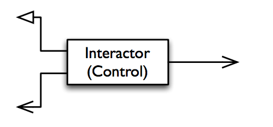
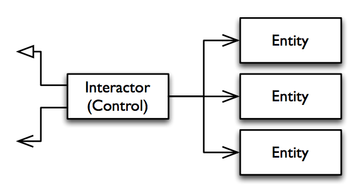
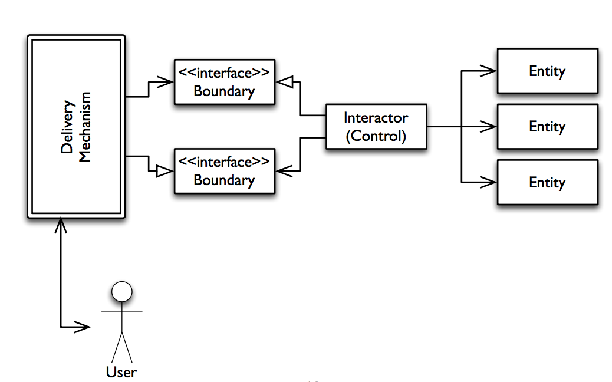
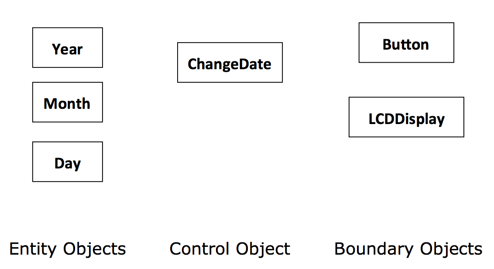
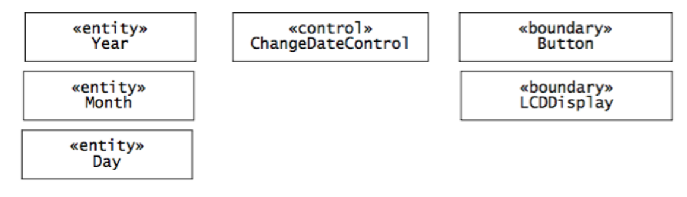
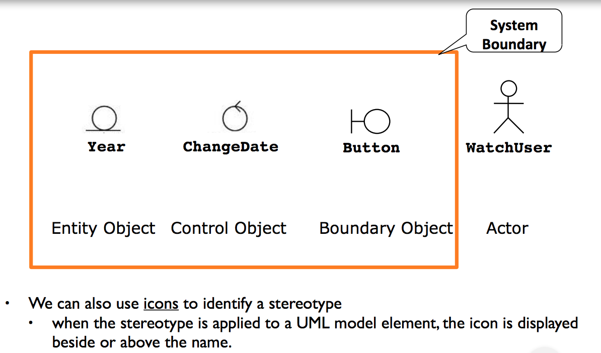
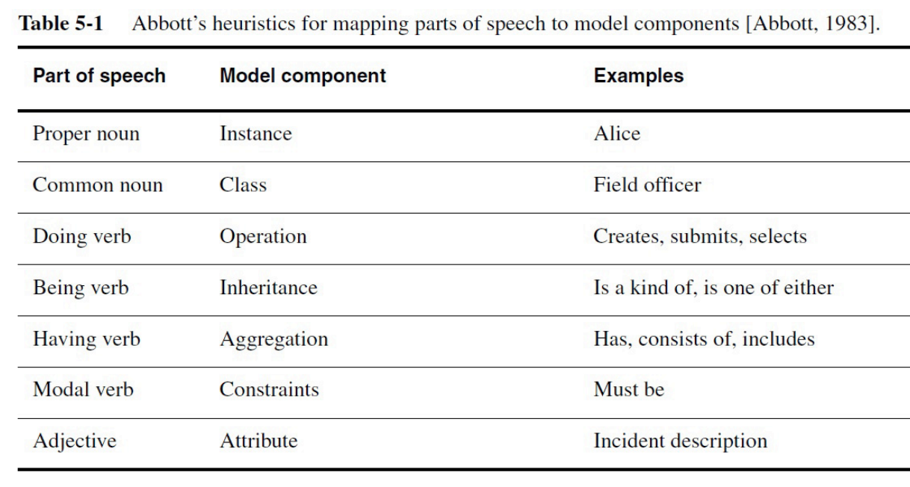
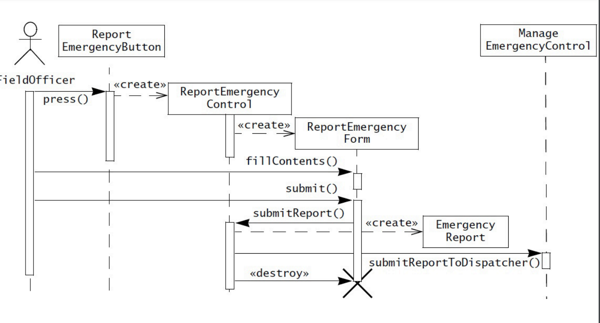

## Object-Oriented Analysis
> *[OOSE] chapter 5.*

### Overview
- **OOA focuses on creating a model of the system**
	-	That is complete, correct, consistent and verifiable.
	- By structuring formalizing requirements.
	- Which leads to revision of the requirements.

- **Analysis model consists of:**
	-	Functional model - use case model.
	- Analysis object model - class & object diagrams.
	- Dynamic model - sequence & state machine diagrams.

### Interactor (Control) - Entity - Boundary

- They map use cases
- Application specific business rules.
	- Cannot be used in another application.
	- An application independent business rule.

We have three objects:
- **Interactors**
	- Represent the control tasks performed by the system.
	- Often map uses cases.
	- Application specific business rules.

- **Entities**
	-	Represent the persistent information tracked by the system.
	- Application domain objects also called "Business objects".
	- Are application independent business rules.
	- Are often connected to a data persistence layer.

- **Boundary objects**
	- Those that exposes functionality to the user.

As an example, here's a `StopWatch` that utilizes those three object types:

Writing this in UML would look like the following with stereotypes.

The stereotypes can also be presented with icons:

### Analysis activities

- **Static modeling**:

	-	Identifying *interactor* (control) objects.
	- Identifying entity objects.
	- Identifying boundary objects.

- **Dynamic modeling**:

	-	Mapping use cases to objects using sequence diagrams.

- **Linking and refining**:

	-	Identifying *associations*.
	- Identifying *aggregates*.
	- Identifying *attributes*.
	- Modeling state-dependent behavior of individual objects.
	- Modeling inheritance relationships.

### Identifying entity objects.

### Finding participating objects in use cases

- Pick a use case and look at flow of events.

- Do a textual analysis (noun-verb analysis)

	-	Nouns are candidates for objects/classes.
	- Verbs are candidates for operations.
	- This is also called Abbott's technique.

- After objects/classes are found, identify their types:

	-	Identify *real world entities* that the system needs to keep track of (`FieldOfficer`: **entity** object).
	- Identify real world procedures that the system needs to keep track of (`EmergencyPlan`: **control** object)
	- Identify interface artifacts (`PoliceStation`: **boundary** objects).

### Identifying interactor objects

- *Interactor* objects represent the control tasks performed by the system.

- **Heuristics**:

	-	Make one control object pr. use case.
	- Make one control object pr. actor in the use case.
	- Life span of the control object should cover:
		-	The extent of the use case, or
		- The extend of a user session.

### Identifying entity objects

- *Entity* objects represent the persistent information tracked by the system

- **Heuristics**:
	-	Terms that the developer or users need to clarify to understand the use case.
	- Recurring nouns in the use cases.
	Real-world entities that the system needs to track/store.
	- Real-world activities that the system needs to track.
	- Data sources or sinks.

### Identifying boundary objects

- *Boundary* objects represent the system interface with the actors.

- **Heuristics**:
	-	User interface controls the user needs to initiate the use case.
	- Forms that the user needs to enter data into the system.
	- Notices and messages from the system to the user.
	- Actor terminals (if more than one).
	- Always use the end-users' terms for describing interfaces.

## Dynamic modeling

### Sequence diagrams

- **Sequence diagrams ties use cases with objects.**

	-	Describes the dynamic behavior between several objects over time.
	- Good for real-time specifications.

- **Heuristics**

	-	The first column corresponds to the initiating actor of the use case.
	- The second column should be a boundary object.
	- The third column should be the control object that manage the use case.
	- Control objects are created by boundary objects.
	- Boundary objects are created by control objects.
	- Entity objects are accessed by control and boundary objects.
	- Entity objects never access boundary or control objects.

For example:

### Modeling state-dependent behavior of an object

- Two UML diagram types for describing dynamic models:
	-	*Interaction* diagrams describe the dynamic behavior **between objects**.
	- *State chart* diagrams describe the dynamic behavior of **a single object**.
