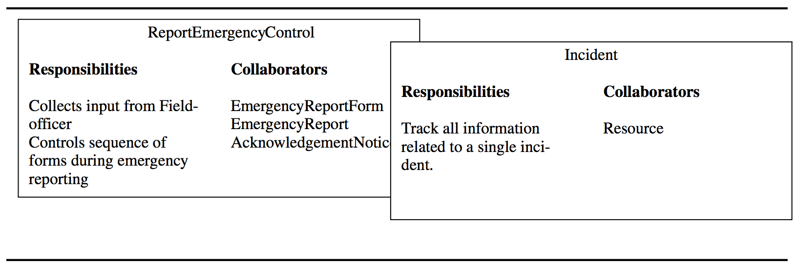

## (Object-Oriented) Analysis
> *[OOSE] chapter 5.*

**Analysis results in a model of the system that aims to be correct, complete, consistent and unambiguous**.

### Note-to-self #1
Remember, when you read about an object model, differentiate between "*analysis* object model" and just "object model". An *analysis object model* provides class diagrams of the application domain where as a "regular" *object model* provides, among other things, class diagrams of the solution domain.

### Note-to-self #2
When words such as *"Dynamic"* is being used, it often has to do with behavioral diagrams which shows something that goes from one state to another. Well, at least something that is not **static**, hence the name.

### Note-to-self #3
Requirements Elicitation has to do with primarily the functional model. That is, use case diagrams (which holds use cases which hold scenarios). Analysis is primarily focuses on the analysis object model (static application domain) and the dynamic model (behavioral application domain).

### Note-to-self #4
When working with either the analysis object model or the dynamic model, remember that these models represent user-level concepts - not actual software classes or components.

So, instead of having classes in the analysis object model's class diagram with the names `SessionManager` or `NetworkConfigurationProvider` or some other *foobar* talk, instead use stuff that people understand - concepts that are relevant to the "real world".

Here, developers formalize the requirements specification produced during requirements elicitation and examine in more detail boundary conditions and exceptional cases.

Developers validate, correct and clarify the requirements specification if any errors or ambiguities are found.

**The client and the user are usually involved in this activity when the requirements specification must be changed and when additional information must be gathered**.

### Developers build a model describing the application domain
In Object-Oriented analysis, developers build a model describing the application domain.

Developers use the analysis model together with nonfunctional requirements to prepare for the architecture of the system.

The analysis model is then extended to describe how the actors and the system interact to manipulate the application domain model: How can the user affect or manipulate various things?

**Also, formalization helps identify areas of ambiguity as well as inconsistencies and omissions in a requirements specification**.

Obviously, Requirements Elicitation and Analysis are iterative and incremental activities that occur concurrently.

## Overview of Analysis
Analysis focuses on producing a model of the system, called the analysis model, which is correct, complete, consistent and verifiable.

Developers focus on structuring and formalizing the requirements elicited from users. This leads to the discovery of errors and new insights.

## The Analysis model
It is composed of three individual models:

- The *Functional model*, represented by use cases and scenarios,

- The *Analysis Object model*, represented by class and object diagrams (remember, these are used for the application domain as well),

- The *Dynamic models*: Represented by state machine and sequence diagrams (also in the application domain).

### Overview

Here is the analysis model with its three models: The functional model, the analysis object model and the dynamic model.

The *Views* that can be constructed from these are then the use case diagrams, class diagrams, (object diagrams), state machine diagrams and sequence diagrams.

## Analysis concepts
### Analysis Object Models and Dynamic Models
#### Analysis object model
The *Analysis object model* is part of the analysis model **and focuses on the individual concepts that are manipulated by the system, their properties and their relationships**.

This is depicted with UML class diagrams with classes, attributes and operations. It is a visual dictionary of the main concepts visible to the user.

#### Dynamic model
The dynamic model then **focuses on the behavior of the system.**

The dynamic model is depicted with **sequence diagrams** and with **state machines**.

## Entity objects, Boundary objects and Control Objects
**This is called the three-object-type approach.**

### Entity Objects
These represent the persistent information tracked by the system.

For instance, `Year`, `Month` and `Day` could be entity objects.

### Boundary objects
These represent the interactions between the actors and the system.

For instance, `Button` and `TouchDisplay` are boundary objects.

**(This would be the interface of the system)**.

### Control Objects
These are in charge of realizing use cases.
**Represent application-specific business rules (couldn't be used in another application, generally speaking)**.

For instance, `ChangeDateControl` is a control object.

### Purpose of these 3 categories
The purpose is to provide developers with simple heuristics to distinguish different, but related concepts.

For example, the time that is tracked by a watch (an entity object) has different properties than the display that depicts the time (a boundary object). This allows us to instinctively create two objects - `Time` and `Display`.

Also, boundary objects (user interface) are much more likely to change than the entity objects and control objects, so by separating the interface from the basic functionality, we are able to keep most of a model untouched when the user interface changes but the entity objects does not.

### How three-object-types are depicted
Using stereotypes!

...or with icons:

### Naming conventions for three-object-types
- Control objects have *"Control"* suffixed their name. For instance, `ChangeDateControl`.

- Boundary objects may be named to clearly denote an user interface feature, for instance *"Button"* or *"Form"*.

- Entity objects do not have any suffix appended to their name. For instance, *"Year"*, *"Time"*, or *"Month"*.

This also allows us to differentiate between these three-object-types even without stereotypes.

## Generalization and Specialization
### Generalization
Generalization is the modeling activity that identifies abstract concepts from lower-level ones.

For instance, if we see a lot of different procedures in the application domain for handling emergencies such as earthquakes or traffic accidents, we could generalize the concept "Emergency" which all of these have in common.

So, in other words, we identify the base class from a range of derived classes (except its up to us to figure out what the base class could be).

### Specialization
The other way around. Here we identify more specific concepts from a high-level one. For example, say all we had was `Incidents`, but these could be pretty distinct from one another. For instance, it could be an emergency or it could be a disaster. We could then take these two concepts and make them specializations of an incident.

So, in other words, we would split an Incident up into a range of derived classes.

## Analysis activities: From Use cases to Objects

### Identifying Entity Objects
So how do we go about identifying entity objects?
Well, obviously, we can find the *participating* objects simply by looking at each use case and identifying candidate objects.

We can do that by analyzing the language used.
The following is called Abbot's heuristics for mapping parts of speech to model components:
<table>
	<tr>
		<td><strong>Part of speech</strong></td>
		<td><strong>Model component</strong></td>
		<td><strong>Examples</strong></td>
	</tr>
	<tr>
		<td>Proper noun</td>
		<td>Instance</td>
		<td>Alice</td>
	</tr>
	<tr>
		<td>Common noun</td>
		<td>Class</td>
		<td>Field officer</td>
	</tr>
	<tr>
		<td>Doing verb</td>
		<td>Operation</td>
		<td>Creates, submits, selects</td>
	</tr>
	<tr>
		<td>Being verb</td>
		<td>Inheritance</td>
		<td>Is a kind of, is one of either</td>
	</tr>
	<tr>
		<td>Having verb</td>
		<td>Aggregation/Composition</td>
		<td>Has, consists of, includes</td>
	</tr>
	<tr>
		<td>Modal verb</td>
		<td>Constraints</td>
		<td>Must be</td>
	</tr>
	<tr>
		<td>Adjective</td>
		<td>Attribute</td>
		<td>Incident description</td>
	</tr>
</table>

#### Heuristics for identifying entity objects
Use these in conjunction with Abbot's heuristics:

- Terms that developers or users need to clarify in order to understand the use case
- Recurring nouns in the use cases (e.g. `Incident`).
- Real-world entities that the system needs to track (e.g. `FieldOfficer`, `Dispatcher`, `Resource`).
- Real-world activities that the system needs to track (e.g. `EmergencyOperationsPlan`).
- Data sources or sinks (e.g. `Printer`).

#### What names to use
For entity objects, you should *always* start with the names used by end users and application domain specialists.

### Identifying Boundary Objects
Boundary objects represent the user interface (e.g. the system interface with the actors).

In each use case, each actor interacts with at least one boundary object. The boundary object collects the information from the actor and translates it into a form that can be used by both entity and control objects.

Boundary objects do not describe in detail the visual aspects of the user interface.

**For example, a "Menu item" or "Scroll bar" are too detailed.**

Primarily since the design of the user interface continues to evolve as a consequence of usability tests, even after the functional specification of the system becomes stable - updating the analysis model for every user interface change would be time consuming and wouldn't yield any substantial benefit.

#### Heuristics for identifying boundary objects
- Identify user interface controls the the user needs to initiate the use case (for instance, `Button`).

- Identify forms the users need to enter data into the system (for instance, `Form`).

- Identify notices and messages the system uses to respond to the user (for instance, `AcknowledgementNotice`).

- Do not model the visual aspects of the interface with boundary objects - use mock-ups instead.

- *Always* use the end user's terms for describing interfaces. Do not use terms from the solution or implementation domains.

### Identifying Control Objects
Control objects are responsible for **coordinating boundary and entity objects. They usually do *not* have a concrete counterpart in the real world.**

It is responsible for collecting information from the boundary objects and dispatching it to entity objects.

Examples are *undo* functionality as well as event emitting, though you should use a more user-friendly name for that.

#### Heuristics for identifying control objects
- Identify one control object per use case.
- Identify one control object per actor in the use case. (obviously, this and the previous heuristic are mutually exclusive)
- The life span of a control object should cover the extent of the use case or the extent of a user session.

## Mapping Use Cases to Objects with Sequence Diagrams
A *sequence diagram* ties use cases with objects.

It shows how the behavior of a use case (or scenario) is distributed among its participating objects.

Sequence diagrams *does* require more background about the notation than use cases, but for computer savvy clients they may be more intuitive and precise than use cases.

Anyway, they *do* represent a change of perspective which is always a good thing in terms of discovering missing functionality or errors.

In analysis, the dynamic model still covers the application domain, so a sequence diagram is not nearly as technical as sequence diagrams would be later on when the solution domain is covered. Take a look at this:

How do we know that this is in the application domain? Well, its pretty high-level and the names of the objects are the same as in the analysis object model.

Objects that are created during the interaction are depicted with the «create» stereotype as label for a message/stimuli. Likewise, «destroy» is used for when removing an object.

To show that an object is destroyed, use a big cross. (like a 'cancel' material icon.)

#### Heuristics for drawing sequence diagrams
- The first column should correspond to the actor who initiated the use case.
- The second column should be a boundary object (that the actor used to initiate the use case).
- The third column should be the control object that manages the result of the use case.
- **Control objects are created by boundary objects initiating use cases.**
- And also, Boundary objects are created by control objects
- Entity objects are accessed by control and boundary objects.
- Entity objects *never* access boundary or control objects.

## Modeling Interactions among Objects with CRC Cards

CRC cards stands for **Class**, **Responsibilities** and **Collaborators** cards.

Each class is represented with an index card (called a CRC card).

The name of the class is depicted on the top. Its responsibilities are written in the left column. The names of the classes it *depends on* are depicted in the right column.

CRC cards are great for group sessions and brainstorming.

## Identifying Associations
Class diagrams allow developers to describe the interdependencies of objects.

### Associations

An *association* shows a relationship between two or more classes.

**It enables the developer to discover boundary cases associated with links.**

Such cases are exceptions that must be clarified in the model.

For instance, its intuitive to think that an article *has * a* author. But could it have more than one author? This is easily discovered while doing multiplicity annotations in class diagrams.

### Properties of associations
- *name*: Describes the association between two classes. They are optional and need not be unique globally. In the image above, `writes` is an association name.

- *role*: At each end, a *role* can be added, identifying the function of each class with respect to the associations. For instance, a `FieldOfficer` will have more roles than just `author`, but in the association between `FieldOfficer` and `EmergencyReport`, the role is as an author. Again, this is optional.

- *multiplicity*: Already covered. In each end, multiplicity identifies the possible numbers of instances. Again, optional.

#### Heuristics for identifying associations
- Examine verb phrases (*has a*, *is part of*, *manages*, *reports to*, *is triggered by*, *is contained in*, *talks to*, *includes*)

- Name associations and roles precisely
- Use qualifiers as often as possible to identify namespaces and key attributes.
- Eliminate any association that can be derived fro mother associations.
- Do not worry about multiplicity until the set of associations is stable.
- Too many associations make a model unreadable.

## Identifying Aggregates (including composition)
These are special types of associations denoting a whole-part relationship.

An aggregation is shown as a association with a diamond on the side of the whole part.

There are two kinds of aggregation, *composition* and *shared*:

### Composition (or composition aggregation)
A solid diamond denotes composition.

**A composition aggregation indicates that the existence of the parts depends on the whole.**

So, in other words, if the whole is removed, so should all its parts.

For example, a leg (for a chair) is always part of exactly one chair. If the chair is removed, so is the legs. It would be nonsense to say otherwise.

### Shared aggregation (or just aggregation)
A hollow diamond denotes a shared aggregation relationship.

**It says that the whole and the part *can* exist independently.**

For instance, a `FireFighter` *can* exist without a `FireStation` (he/she would probably be unemployed, though).

### Purpose
Aggregation concepts such as shared aggregation and composition simply adds more useful information to especially one-to-many relationships. When you see a hollow diamond, you *know* that it definitely is not a composition - so it shouldn't be cascade deleted. If it is left out, you are wondering if it is an aggregation or a composition.

## Identifying Attributes
Attributes are properties of individual objects.
Properties that are represented by objects are not attributes.

I'd like to think about this way:
If a property is not a primitive value (e.g. it might hold attributes itself, it could not be reduced to a single value), it is *not* an attribute.

Obviously, when identifying properties of objects, only the attributes relevant to the system should be considered. (We probably don't care about a `FireFighter`s favorite movies if we are making a system for a `FireStation`. Well, unless he's on night-watch where he might want to watch some movies. Hmm, now that I think about it, maybe we should, actually!)

## Modeling State-Dependent Behavior of Individual Objects
Use State Machine diagrams for that. Only draw State Machine Diagrams for objects with an extended lifespan and state-dependent behavior.

## Reviewing the Analysis Model
The analysis model becomes *stable* once the number of changes to it are minimal and the scope of the changes are localized.

Once it is stable, it is reviewed.

First by developers (internal reviews), then jointly by the developers and the client.

### Goal of reviewing the analysis model
The goal is to make sure that the requirements specification is correct, complete, consistent and unambiguous. And, the requirements should be realistic and verifiable.

### Figuring out if the model is *correct*

- Is the glossary of entity objects understandable by the user?

- Do abstract classes correspond to user-level concepts?

- Are all descriptions in accordance with the user's definitions?

- Do all entity and boundary objects have meaningful noun phrases as names?

- Do all use cases and control objects have meaningful verb phrases as names?

- Are all error cases described and handled?

### Figuring out if the model is *complete*

- For each object: Is it needed by any use case? In which use case is it created? Modified? Destroyed? Can it be accessed from a boundary object?

- For each attribute: When is it set? What is its type? Should it be a qualifier?

- For each association: When is it traversed? Why was the specific multiplicity chosen? Can associations with one-to-many and many-to-many multiplicities be qualified (Please don't :-(!)?

- For each control object: Does it have the necessary associations to access the objects participating in its corresponding use case?

The following questions should be asked to ensure that the model is *consistent*:

- Are there multiple classes or use cases with the same name?

- Do entities (e.g. use cases, classes, attributes) with similar names denote similar concepts?

- Are there objects with similar attributes and associations that are not in the same generalization hierarchy?

The following questions should be asked to ensure that the system described by the analysis model is *realistic*:

- Are there any novel features in the system? Were any studies or prototypes built to ensure their feasibility?

- Can the performance and reliability requirements be met? Were these requirements verified by any prototypes running on the selected hardware?

## The flow of analysis
Here's a typical flow of activities during analysis (represented, by the way, with a UML Activity diagram):

## Managing analysis
The challenge in managing requirements in a group project is to maintain consistency while using so many resources.

In the end, the Requirements Analysis Document (RAD) should describe a single coherent system understandable to a single person.

## Documenting Analysis
The requirements elicitation and analysis activities are documented in the Requirements Analysis Document (RAD).

During analysis, we obviously revise sections 1 - 3.5.2 in it, but the main effort is focused on writing the sections documenting the analysis object model (RAD sections 3.5.3 - 3.5.4).

- Section 3.5.3, *Object models*, documents in detail all the objects we identified, their attributes, and, when we used sequence diagrams, operations. As each object is described with textual definitions, relationships among objects are illustrated with class diagrams.

- Section 3.5.4, *Dynamic models*, documents the behavior of the object model in terms of state machine diagrams and sequence diagrams.

The RAD, once completed and published, is put under configuration management (VCS). The revision history section of the RAD will provide a history of changes, including the author responsible for each change, the date of the change, and brief description of the change.

## Assigning Responsibilities
Analysis requires the participation of a wide range of individuals.

For large systems, many people may participate, introducing additional challenges for integration and communication.

To meet these challenges, well-defined roles and scopes must be assigned to individuals.

There are 3 main roles:
- Generation of information
- integration
- Review

- **The end-user** (generation of information) provides the application domain knowledge. He/she is the expert in the current system, the environment of the future system and the tasks it should support.

- The **client** (integration) funds the project and coordinates the user side of the effort. The users may have different interests or views. The client makes sure that the users are represented as one. Hence the integration thing. The client defines the scope of the system based on user requirements.

- The **analyst** (hmm, an integration role maybe?) elicits application domain knowledge and formalizes it. He/she slowly becomes an application domain export who models the current system and generates information about the future system. Analysts define use cases and for each of them a number of objects, their associations, attributes and so on. Typically a developer.

- The **architect**, an integration role, unifies the use case and object models from a system point of view. The role of the architect is necessary to provide a system philosophy and to identify omissions in the requirements.

- The **document editor** is responsible for the low-level integration of the document and for the overall format of the document and its index.

- The **configuration manager** is responsible for maintaining a revision history of the document as well as traceability information relating the RAD with other documents.

- The **Reviewer** (review role) validates the RAD for correctness, completeness, consistency and clarity. Users, clients, developers or other individuals may become reviewers during requirements validation. *Especially* individuals that have not yet been involved in the development represent excellent reviewers, because they are more able to identify ambiguities and areas that need clarification.

## Communication about Analysis
A few simple guidelines:

- Define clear territories (e.g. roles, but also the definition of *where* to communicate, privately and publicly).

- Define clear objectives and success criteria.

- Brainstorm (all stakeholders together).

## Client Sign-Off
The client sign-off represents the acceptance of the analysis model (as documented by the Requirements Analysis Document (RAD)).

In addition, they also agree on:

- A list of priorities:

	-	Finding out how to prioritize the functionality allows the developers to better understand the client's expectations, and also to separate bells and whistles from essential features.

	- It also allows developers to deliver the system in incremental chunks: Essential functions are delivered first, additional chunks are delivered depending on the evaluation of the previous chunk.

	- Assign each function a priority between **High**, **Medium** and **Low**.

- A revision process

- A list of criteria that will be used to accept or reject the system

- A schedule and a budget
