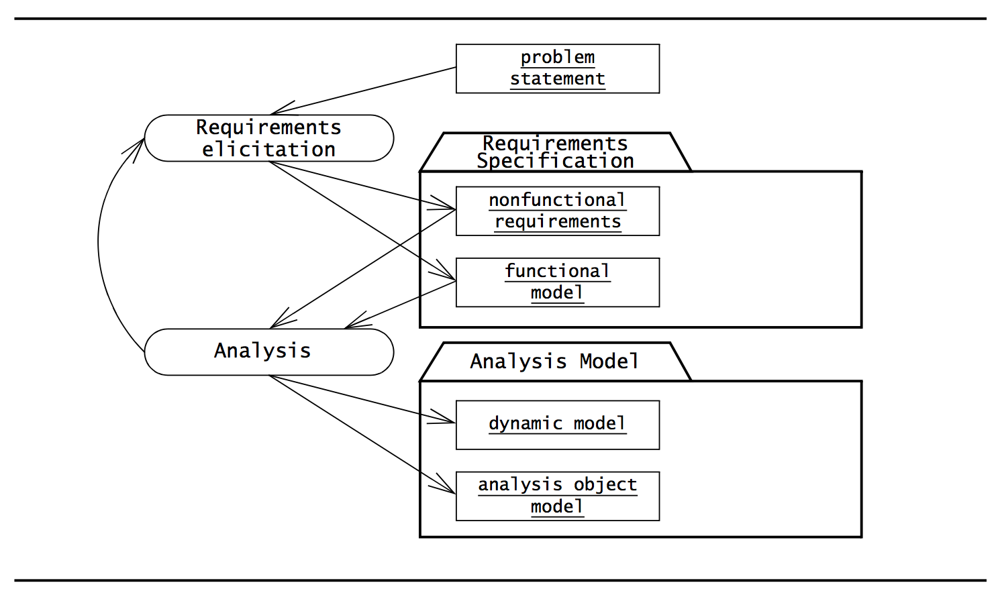
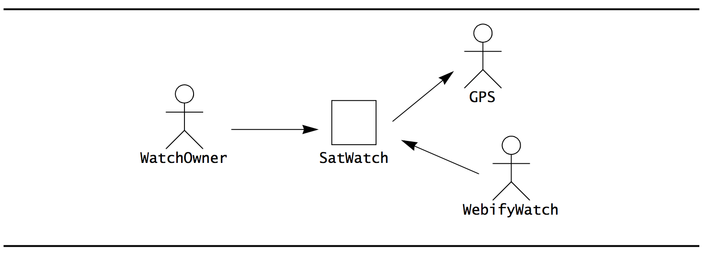
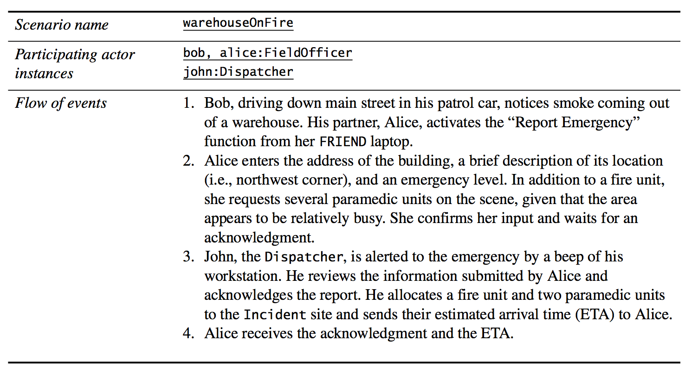
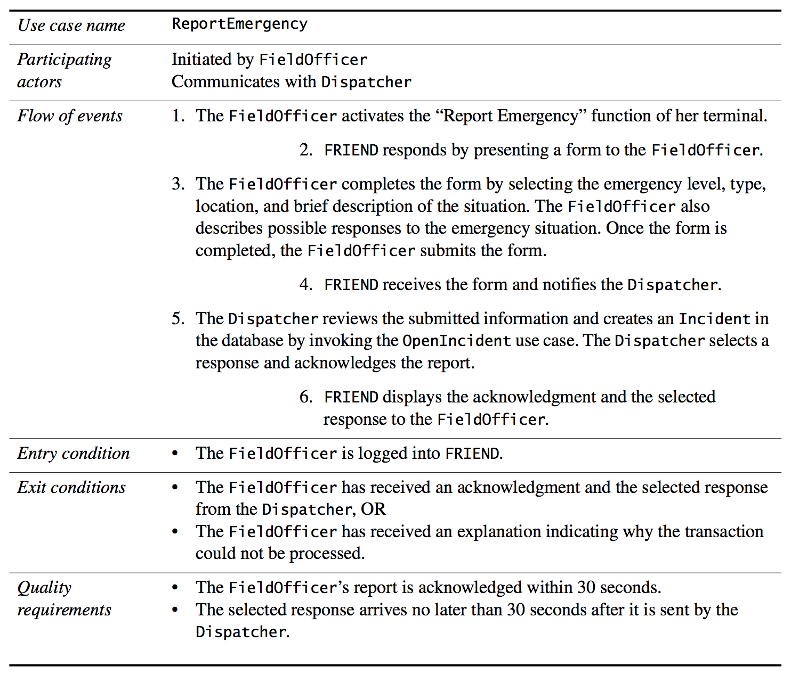
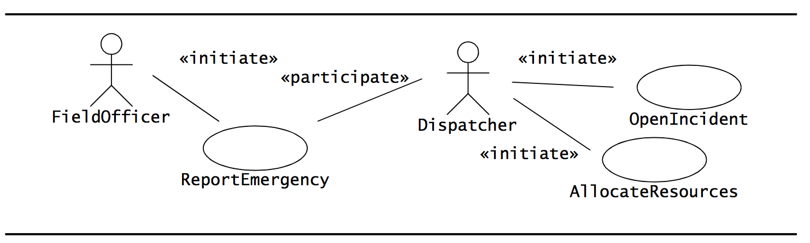
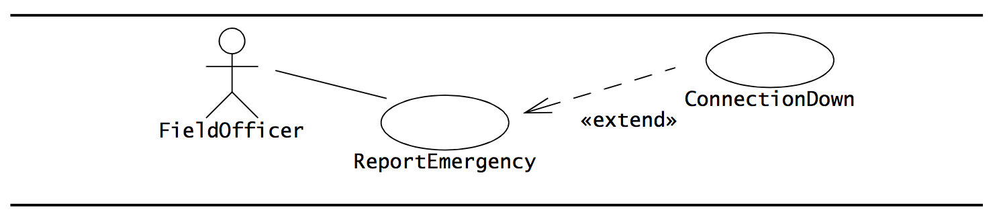
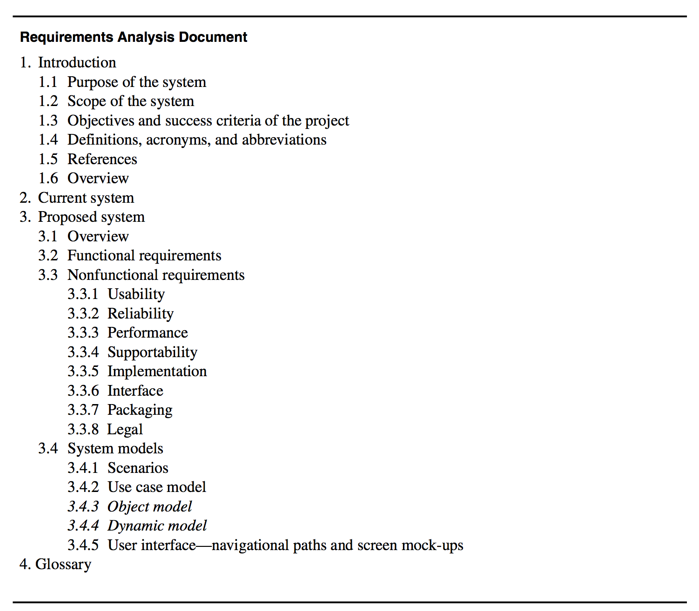

# Requirements engineering/elicitation
> [OOSE] ch.4
>
> (Optional) [SE] ch.4

### Requirements
A *requirement* is a feature that a system must have or a constraint that it must satisfy to be accepted by the client.

## Requirements engineering
Aims at defining the requirements of the system under construction.

It has two main activities:
- **Requirements Elicitation**: Results in the specification of the system that the client understands, and
- **Analysis**: Results in an analysis model that developers can unambiguously interpret.

## Requirements Elicitation
Can be challenging because it requires the collaboration of several groups of participants with different backgrounds.

Clients and users are experts in their domain and have a general idea of what the system should do, but they often have little experience in software development.

Developers have experience in building systems, but often have little knowledge of the everyday environment of the users.

Failure to communicate and understand each other's domains results in a system that is difficult to use or that simply fails to support the user's work.

The longer down the road that errors, misunderstood or missing requirements are identified, the harder they will be to support.

**A requirements elicitation serves as a contract between the client and the developers**.

### Scenarios and use cases
Scenarios and use cases provide tools for bridging the gap between clients and developers.

#### Scenarios
A *scenario* describes an example of system use in terms of a series of interactions between the user and the system.

#### Use cases
A *use case* is an abstraction that describes a class of scenarios.

**Both scenarios and use cases are written in natural language, a form that is understandable to the user.**

### Prototypes
Developers validate the application domain model by constructing simple prototypes of the user interface and collecting feedback from potential users.

### Requirements Elicitation vs Analysis
Given that both requirements elicitation and analysis both represent the same aspects of the system, they occur concurrently and iteratively. Here is a UML activity diagram providing an overview of the activities and their interactions:

Also, both of them focus only on the user's view of the system.
For example, the system functionality, the interaction between the user and the system, the errors that the system can detect and handle as well as the environmental conditions in which the system functions are part of the requirements.

## Activities of requirements elicitation

- *Identifying actors*: During this activity, developers identify the different types of users the future system will support.

- *Identifying scenarios*: During this activity, developers observe users and develop a set of detailed scenarios for typical functionality provided by the future system. These are concrete examples of the **future** system in use.

- *Identifying use cases*: Once developers and users agree on a set of scenarios, developers derive from the scenarios a set of use cases that completely represent the future system. **Whereas scenarios are concrete examples illustrating a single case, use cases are abstractions describing all possible cases**. When describing use cases, developers determine the scope of the system.

- *Refining use cases*: During this activity, developers ensure that the requirements specification is complete by detailing each use case and describing the behavior of the system in the presence of errors and exceptional conditions.

- *Identifying relationships among use cases*: During this activity, developers identify **dependencies among use cases**.

- *Identifying nonfunctional requirements*: During this activity, developers, users and clients agree on aspects that are visible to the user, but not directly related to functionality. For instance, constraints on performance, its documentation, the resources it consumes, its security and its quality.

## Requirements Elicitation Concepts

Here are the main requirements elicitation concepts:
- Functional requirements
- Nonfunctional requirements
- Completeness, Consistency, Clarity and Correctness
- Realism, Verifiability and Traceability
- Greenfield Engineering, Reengineering and Interface Engineering

### Functional requirements
Functional requirements describe the interactions between the system and its environment independent of its implementation. The environment includes the user and any other external system with which the system interacts.

For instance, both *"The Watch determines its location using GPS satellites"* and *"The watch corrects its time zone when entering a new region"* are examples of functional requirements - They do not focus on any implementation details such as processor, language or display technology.

### Nonfunctional requirements (FURPS+ model)
Describe aspects of the system that are not directly related to the functional behavior of the system. It covers a broad variety of aspects, from usability to performance.

Here are something called the FURPS+ model which provides the following categories of Nonfunctional requirements:

- *Usability*: The ease with which a user can learn to operate, prepare inputs for, and interpret outputs of a system or component. This could be conventions adopted by the user interface, online help and the level of user documentation. A classic usability requirement is for the developer to follow some user interface guidelines on color schemes, logos and fonts.

- *Reliability*: The ability of a system to perform its required functions under stated conditions for a specified period of time. This could be, for instance, an acceptable mean time to failure and the ability to detect specified faults or to withstand specified security attacks.

	- Oftentimes replaced by *Dependability*, which covers not only reliability but also *robustness* (The degree to which a system or component can function correctly in the presence of invalid inputs or stressful environment conditions) and *safety* (a measure of the absence of catastrophic consequences to the environment).

- *Performance*: Concerned with quantifiable attributes of the system such as *response time*, *throughput* (how much the system can accomplish within a specified amount of time), *availability* (the degree to which a system or component is operational and accessible when required for use) and *accuracy*.

- *Supportability*: Concerned with the ease of changes to the system after deployment. Including, for instance, *adaptability* (the ability to change the system to deal with additional application domain concepts), *maintainability* (the ability to the system to deal with new technology or to fix defects) and *internalization* (the ability to change the system to deal with additional international conventions such as languages, units and number formats).

The "+" in the FURPS+ model comes from some additional categories of requirements which are also typically labeled as nonfunctional requirements:

- *Implementation requirements*: Constraints on the implementation of the system, including the use of specific tools, programming languages or hardware platforms.

- *Interface requirements*: Constraints imposed by external systems, including legacy systems and interchange formats.

- *Operations requirements*: Constraints on the administration and management of the system in the operational setting.

- *Packaging requirements*: Constraints on the actual delivery of the system (for instance, the installation media).

- *Legal requirements*: Concerned with licensing, regulation and certification issues.

**Nonfunctional requirements that fall into the first 4 (URPS) categories are called *quality requirements* while the remaining additional ones are called *constraints* or *pseudo requirements*.**

You would then list them as:
"Quality requirements for <PROGRAM>:
blabla
blabla
blabla

Constraints for <PROGRAM>:
blabla
blabla
blabla"

## Completeness, Consistency, Clarity and Correctness
Requirement validation involves checking that the specification is complete, consistent, unambiguous and correct.

- *Completeness*: All features of interest are described by the requirements. Are all possible scenarios through the system represented in the requirements model? Also including exceptional behavior.

- *Consistency*: No two requirements of the specification contradict each other. Does the requirements specification contradict itself somewhere?

- *Unambiguity*: A requirement cannot be interpreted in two mutually exclusive ways. Is exactly one system defined? And, is there things that could be interpreted in different ways?

- *Correctness*: The requirements describe the features of the system and environment of interest to the client and the developer, but do not describe other unintended features. Does it accurately represent the system that the client needs and that the developers intend to build?

## Realism, Verifiability and Traceability
Requirement validation also involves checking that it is realistic, verifiable and traceable.

- *Realistic*: Can the system actually be implemented within given constraints?

- *Verifiable*: Once the system is built, will repeatable tests be able to demonstrate that the system actually fulfills the requirements specification?
	- For instance, consider the following non-verifiable requirements:
		- *The product shall have a good user interface*. That is a non-verifiable requirement. How do we measure "good"?
		- *The product shall be error free*. That is also non-verifiable. How do we know if there are no more errors?
		- *The product shall respond to the user with 1 second for most cases*. What does "most cases" mean?

- *traceable*: Can all requirements be traced throughout the software development to its corresponding system functions? Can each system function be traced back to its corresponding set of requirements?
	-	This also goes for dependencies between subsystems, etc.
	- This also helps with identifying which requirements are tested and which are not.

## Greenfield Engineering, Reengineering and Interface Engineering
There are 3 categories of requirements elicitation approaches, depending on the circumstances:

### Greenfield engineering
Here, the development starts from scratch. No prior system exists, - so the requirements are extracted from the users and the client.

Such a project is triggered by a user need or the creation of a new market.

### Reengineering
Here, the project is to redesign and reimplement an existing system triggered by technology enablers or by business processes.

Sometimes, the functionality of the new system is extended, but the essential purpose of the system remains the same.
Thus, the requirements of the new system are primarily extracted from the existing system.

### Interface engineering
Here, the project is to redesign the user interface of an existing system. The legacy system is left untouched except for its interface, which is redesigned and reimplemented.

In both greenfield engineering and reengineering, there needs to a lot of analysis of the application domain.

## Requirements Elicitation activities
The first step is to identify actors. This serves both to define the boundaries of the system and to find all the perspectives from which the developers need to consider the system.

### Identifying Actors
Actors represent external entities that interact with the system.

It can be a human or an external system, but all are illustrated as a stick figure:

All actors have specific interactions with the system/subsystem.

Actors are role abstractions and do not necessarily directly map to persons.

Generally, if the functionality between two external entities are substantially different, they should be modeled as different actors.

Any external software system using the system to be developed is an actor.

#### Questions for identifying actors
- Which user groups are supported by the system to perform their work?
- Which user groups execute the system's main functions?
- Which user groups perform secondary functions, such as maintenance and administration?
- With what external hardware or software system(s) will the system interact?

**The amount of actors should generally be small. See if you can combine actors that execute similar roles.**

Once the actors are identified, the actual functionality that will be accessible to each actor must be defined. This information can be extracted using scenarios and formalized using use cases.

### Identifying scenarios
A scenario is a "narrative description of what people do and experience as they try to make use of computer systems and applications".

It is a concrete, focused, informal description of **a single feature of the system from the viewpoint of a single actor**.

Here's an example:

#### Kinds of scenarios
- *As-is scenarios*: Describes a current situation. Great during reengineering, for instance, to make sure that the current system is understood correctly.

- *Visionary scenarios*: Describes a future system. Is pretty much an inexpensive prototype.

- *Evaluation scenarios*: Describes user tasks against which the system is to be evaluated.

- *Training scenarios*: Describes tutorials used for introducing new users to the system. These are step-by-step instructions designed to hand-hold the user through common tasks.

#### Questions for identifying scenarios
- What are the tasks that the actor wants the system to perform?
- What information does the actor access? Who creates that data? Can it be modified or removed? By whom?
- Which external changes does the actor need to inform the system about? How often? When?
- Which events does the system need to inform the actor about? With what latency?

### Identifying Use Cases
A *scenario* is an instance of a *use case*.

**A use case specifies all possible scenarios for a given piece of functionality.**

A use case is initiated by an actor. After its initiation, a use case may interact with other actors, as well.

A use case describes a flow of events through the system - a series of related interactions that result from its initiation.

An example of a use case is:

Generally, use cases are named. The name should be a verb phrase denoting what the actor is trying to accomplish.

A use case also has entry and exit conditions.

#### Simple Use Case Writing Guide
- Use cases should be named with verb phrases. The name should indicate what the user is trying to accomplish. For instance, `ReportEmergency` or `OpenIncident`.
- Actors should be named with noun phrases. E.g. `FieldOfficer`, `Victim`, etc.
- The boundary of the system should be clear. **Steps accomplished by the actor and steps accomplished by the system should be distinguished** (sometimes indentation is used for that).
- Use case steps in the flow of events should be phrased in the active voice. This makes it explicit who accomplished the step.
- The causal relationship between successive steps should be clear.
-A use case should describe a complete user transaction.
- Exceptions should be described separately.
- A use case should not describe the user interface. This takes away the focus from the actual steps accomplished by the user and is better addressed with visual mock-ups.
- A use case should not exceed two or three pages in length. Otherwise, use an `include` or `extend` relationship to decompose it in smaller use cases.

### Heuristics for developing scenarios and use cases
- Use scenarios to communicate with users and to validate functionality.
- First, refine a single scenario to understand the user's assumptions about the system. The user may be familiar with similar systems, in which case, adopting specific user interface conventions would make the system more usable.
- Next, define many not-very-detailed scenarios to define the scope of the system. Validate with the user.
- Use mock-ups as visual support only! User interface design should occur as a separate task after the functionality is sufficiently stable.
- Present the user with multiple and very different alternatives (as opposed to extracting a single alternative from the user).
- Detail a broad vertical slice when the scope of the system and the user preferences are well understood. Validate with the user.

### What is the whole point of scenarios and use cases
The focus is on completeness and correctness. Developers identify functionality not covered by scenarios and documents it by refining use cases or writing new ones.

## Identifying relationships among Actors and Use Cases

### The `«initiate»` and `«participate»` stereotypes
The `«initiate»` stereotype denotes the initiation of the use case by an actor. The `«participate»` stereotype denotes that an actor who did not initiate the use case communicates with the use case.

### The `«extend»` and `«include»` stereotypes
We can use `«extend»` to separate exceptional and common flows of events. A use case extends another use case if the extended use case may include the behavior of the extension under certain conditions.

Here, `ConnectionDown` is an extension of `ReportEmergency`.

We can use `«include»` to reduce redundancy among use cases. The purpose is to factor out shared behavior.
**It should only be factored out into a separate use case if it is shared across two or more use cases!**

Here, `OpenIncident` needs to consult the `ViewMap` when opening an incident.

### When to use extend and include relationships
- Use `«extend»` relationships for exceptional, optional or seldom-occurring behavior.
- Use `«include»` relationships for behavior that is shared across two or more use cases.

## Identifying initial Analysis objects
The developers must learn the users' terminology.

To establish a clear terminology, developers identify the **participating objects** for each use case.

Developers should identify, name and describe them unambiguously **and collate them into a glossary, also known as a *data dictionary*.**

This also means that new developers will be exposed to a consistent set of definitions, a single term is used for each concept (instead of a developer term and a user term), and each term has a precise and clear official meaning.

### Heuristics for identifying initial analysis objects
- Terms that developers or users must clarify to understand a use case
- Recurring nouns in the use cases. e.g. `Incident`.
- Real-world entities that the system must track. E.g. `FieldOfficer`, `Resource`.
- Real-world processes that the system must track. E.g. `EmergencyOperationsPlan`.
- Use cases.
- Data sources or sinks (e.g. `Printer`)
- Artifacts with which the user interacts (e.g. `Station`)
- **Always use application domain terms!**

## Identifying Nonfunctional requirements
Nonfunctional requirements can have as much impact on the development and cost of the system. They describe aspects of the system that are not directly related to its functional behavior.

#### Questions for extracting Nonfunctional requirements from the client

These follow the FURPS+ model. I must say, some of these questions are pretty stupid. But here goes:

##### Usability
- What is the level of expertise of the user?
- What user interface standards are familiar to the user?
- What documentation should be provided to the user?

##### Reliability (including robustness, safety and security)
- How reliable, available, and robust should the system be? (though if I received this question as a client, I would simply say "It should be very robust, very reliable and always available".)
- Is restarting the system acceptable in the event of a failure?
- How much data can the system loose?
- How should the system handle exceptions?
- Are there safety requirements of the system?
- Are there security requirements of the system?

##### Performance
- How responsive should the system be? (again, who wouldn't answer: "Very!" to this?)
- Are any user tasks time critical?
- How many concurrent users should it support?
- How large is a typical data store for comparable systems?
- What is the worst latency that is acceptable to users? (Stupid question. We have plenty of studies that states that users expect response to input within the first 300ms and even that is a lot.)

##### Supportability (including maintainability and portability)
- What are the foreseen extensions to the system?
- Who maintains the system?
- Are there plans to port the system to different software or hardware environments?

##### Implementation
- Are there constraints on the hardware platform?
- Are constraints imposed by the maintenance team?
- Are constraints imposed by the testing team?

##### Interface
- Should the system interact with any existing systems?
- How are data exported/imported into the system?
- What standards in use by the client should be supported by the system?

##### Operation
- Who manages the running system?

##### Packaging
- Who installs the system?
- How many installations are foreseen?
- Are there time constraints on the installation?

##### Legal
- How should the system be licensed?
- Are any liability issues associated with system failures?
- Are any royalties or licensing fees incurred by using specific algorithms or components?

## Managing Requirements Elicitation
Has to do with the actual process of eliciting information from the users and negotiating an agreement with a client.

### Negotiating specifications with clients: Joint Application Design (JAD)

A method where all elicitation work is done in a single workshop session (~3 to 5 days) in which all stakeholders participate: Users, clients, developers and a trained session leader.

The outcome of the workshop is a complete JAD document (which is a requirements specification) that includes definitions of data elements, work flows and interface screens.

JAD is composed of 5 activities:

1. *Project definition*: Here, the JAD facilitator interviews the project manager and the client to determine the objectives and the scope of the project.

2. *Research*: Here, the JAD facilitator interviews present and future users, gathers information about the application domain and describes a first set of high-level use cases. The facilitator also starts a list of problems to be addressed during the session. The results of this activity are a *Session Agenda* and a *Preliminary Specification* listing work flow and system information.

3. *Preparation*: Here, the facilitator prepares the session. A *Working Document* is created, which is the first draft of the final document. An agenda is set. The facilitator selects a team composed of the client, project manager, selected users and developers. All stakeholders are represented, decisions are binding.

4. *Session*: Here, the facilitator guides the team in creating the requirements specification. Such a session lasts for 3 to 5 days. The team defines and agrees on scenarios, use cases and user interface mock-ups. These things are documented.

5. *Final documented*: The facilitator prepares the *Final Document*, revising the working document to include all decisions made during the session. It represents a complete specification of the system agreed on during the session.

## Maintaining Traceability
Its all about the ability to follow the life of a requirement: Who did it come from, which aspects of the system and project does it affect, etc.

The simplest approach is to use cross-references among documents, models and code artifacts. Each individual element is then identified by a unique number.

## Documenting Requirements Elicitation (with a RAD)
The results of the requirements elicitation *and* the analysis activities are documented in a **Requirements Analysis Document (RAD)**.

### Requirements Analysis Document (RAD)

This document completely describes the system in terms of functional and nonfunctional requirements.

The audience for it includes the client, the users, the project management, the system analysts (e.g. developers participating in the requirements) and system designers (e.g. developers who participate in the system design).

**The first part of the document, including use cases and nonfunctional requirements, is written *during* requirements elicitation**.

The following sections are found:

1. *Introduction*: Provides a brief overview of the function of the system and the reasons for its development, scope and references to the development context (e.g. references to the problem statement written by the client, references to existing systems, feasibility studies).
	-	It also includes the objectives and success criteria of the project.

2. *Current System*: Describes the current state of affairs. If the new system will replace an existing system, this section describes the functionality and more importantly the problems of the current system. Otherwise, this section describes how the tasks supported by the new system are accomplished now.

3. *Proposed system*: Documents the requirements elicitation and analysis model of the new system.

It is divided into:

	-	*Overview*: Presents a functional overview of the system.

	- *Functional requirements*: Describes the high-level functionality of the system.

	- *Nonfunctional requirements*: Describes the user-level requirements that are not directly related to functionality, including usability, reliability, performance, supportability, implementation, interface, operational, packaging and legal requirements.

	- *System models*: Describes the scenarios, use cases, object model and dynamic models for the system. This also includes mock-ups.

The RAD is put under configuration management (Version Control) which also means that it can be revised along the way while tracking who changed what, when and why.
