## System Design
>[OOSE] ch. 6, 7

### Note-to-self
System Design is all about subsystem decomposition and identifying which services each subsystem provides.

### What is it
System design **is the transformation of an analysis model into a system design model**. So, now we move into the solution domain.

System Design, Object Design and Implementation constitute the construction of the system. **In System Design, we focus on decomposing the system into manageable parts.**

Here, developers define the design goals of the project and decompose the system into smaller subsystems that can be realized by individual teams.

This is also where the hardware/software decomposition takes place (where do we want to put this or that functionality) as well as the persistent data management strategy, global control flow, access control policy and the handling of boundary conditions.

The result of system design is a model that includes a subsystem decomposition and a clear description of each of these strategies.

System design is decomposed into several activities, each addressing part of the overall problem of decomposing the system:

- *Identifying design goals*: Developers identify and prioritize the qualities of the system that they should optimize.

- *Design the initial subsystem decomposition*: Developers decompose the system into smaller parts based on the use case and analysis models.

- *Refine the subsystem decomposition to address design goals*: Usually, the subsystem decomposition needs refinement until all goals are satisfied.

## Analogy
System design is like an architect designing a house.

After agreeing with the client on the number of rooms and floors, the size of the living area and the location of the house, the architect must design the floor plan - where the walls, doors and windows should be located. He must do so according to a number of functional requirements: the kitchen should be close to the dining room, etc.

**The design of a floor plain in architecture is similar to system design in software engineering.**. Once this is done, we have completed the design without detailed knowledge of the layout of each individual room.

<table>
	<caption>Mapping or architectural and software engineering concepts</caption>
	<tr>
		<td></td>
		<td><strong>Architectural concept</strong></td>
		<td><strong>Software engineering concept</strong></td>
	</tr>
	<tr>
		<td><strong>Components</strong></td>
		<td>Rooms</td>
		<td>Subsystems</td>
	</tr>
	<tr>
		<td><strong>Interfaces</strong></td>
		<td>Doors</td>
		<td>Services</td>
	</tr>
	<tr>
		<td><strong>Nonfunctional requirements</strong></td>
		<td>Living area</td>
		<td>Response time</td>
	</tr>
	<tr>
		<td><strong>Functional requirements</strong></td>
		<td>Residential house</td>
		<td>Use cases</td>
	</tr>
	<tr>
		<td><strong>Costly rework</strong></td>
		<td>Moving walls</td>
		<td>Change of subsystem interfaces</td>
	</tr>
</table>

## An overview of System Design
We have the analysis model to start from. It is completely from the actor's point of view, though. It does not contain information about the internal structure of the system, its hardware configuration, - how the system should be realized.

System design results in the following products:

- *Design goals*: The qualities of the system that developers should optimize.

- *Software architecture*: Describing the subsystem decomposition in terms of subsystem responsibilities, dependencies among subsystems, subsystem mapping to hardware, and major policy decisions such as control flow, access control and data storage.

- *Boundary use cases*: Describes the system configuration, startup, shutdown and exception handling issues.

**The design goals are derived from the Nonfunctional requirements**.

### Subsystem Decomposition.
We need to divide the system into manageable pieces to deal with complexity. Each subsystem is assigned to a team/developer(s) and realized independently.

This is why its really important that developers address system-wide issues when decomposing the system.

## System Design concepts
### Subsystems and Classes
Just like we reduce the complexity of the application domain by identifying smaller parts (classes) and organizing them into packages, we can do the same for the solution domain by decomposing a system into simpler parts called *subsystems*.

### Subsystems
A subsystem is **a replaceable part** of the system with well-defined interfaces that **encapsulates the state and behavior of its contained classes.**

### Subsystem decomposition
A subsystem typically corresponds to the amount of work that a single developer or a single development team can tackle.

A subsystem on its own can further decompose a subsystem into even simpler subsystem. We apply this principle recursively.

There are multiple ways to illustrate Subsystem decomposition, but here is one with UML components (in an UML component diagram). The associations between the components illustrate dependencies.

**In .NET development, a subsystem is typically a Project inside a Solution.**

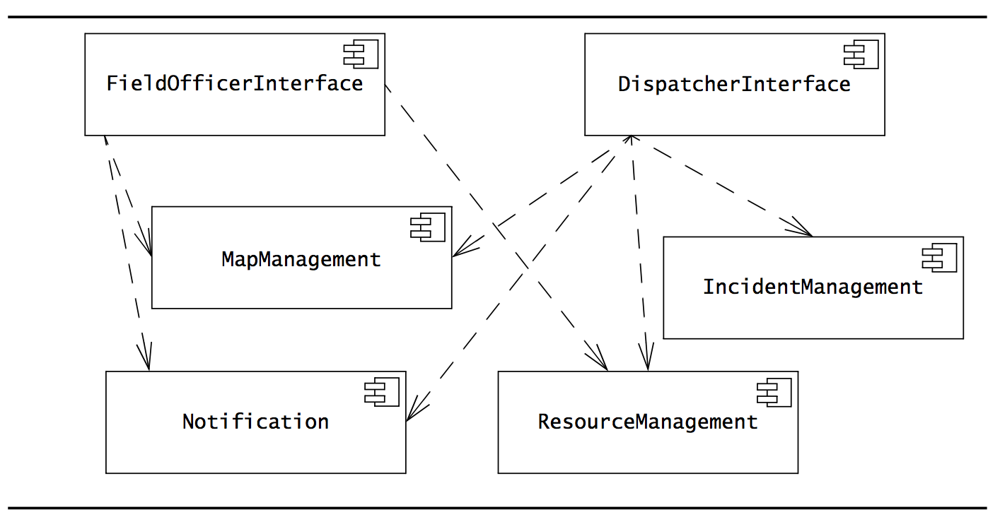

### Logical and Physical components
A *logical component* is a subsystem that is a collective name for grouped components that are composed together into a single layer. For instance, you can't instantiate a "BusinessLogicLayer".

A *physical component* is a subsystem which on its own *can* be instantiated, for instance a database.

## Services and Subsystem interfaces
A subsystem is characterized by the services it provides to other subsystems.

A *service* is a set of related operations that share a common purpose.

### Subsystem interfaces
The service(s) provided by a subsystem that are available to other subsystems form the *subsystem interface*.

Such an interface includes the name of operations, their parameters, their types and return values.

**System design focuses on defining the services provided by each subsystem**. In Object design, we will then make that into a fully-fleshed API.

Such subsystem interfaces can be depicted in UML with *assembly connectors* which is also called *ball-and-socket connectors*.

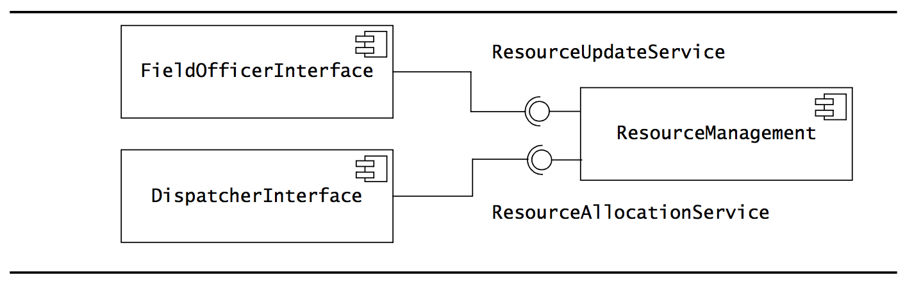
Here, the `ResourceManagement` subsystem provides the two services `ResourceUpdateService` and `ResourceAllocationService`.

Notice the *ball-and-socket* notation. Notice also that the "balls" are facing **away** from the subsystem. Being a sci-fi freak, I think of it more like a magnetic shield pointing *away* from the subsystem - or ship - it is protecting.

## Coupling and Cohesion
### Coupling
Coupling is how dependent subsystems are on each other.

If two subsystems are loosely coupled, they are relatively independent, so modifications to one of the subsystems will have little impact on the other.

If two subsystems are strongly coupled, modifications to one subsystem is likely to have impact on the other.

**A desirable property of a subsystem decomposition is that subsystems are as loosely coupled as reasonable!**

#### Reducing strong coupling
This usually happens, for instance, when more than one subsystem is strongly coupled with another one. For instance, 2 or more subsystems might be strongly coupled with a Database subsystem. And then, if the database provider is changed (and thus also the SQL queries), all subsystems need to change.

This is place where you can easily reduce coupling by instead introducing an additional Subsystem, `Storage` which then sits in front of the database, and handles all calls to the database. Then, *only* the Storage subsystem would need to change if the database changed to support it.

Though I must say I find it a bit silly - because you could use the same argument for the Storage subsystem. If that changed, you would require all subsystems to change too. And you could recursively apply the same logic we just used to make up the Storage subsystem. Because that too could have a subsystem in front of it and so on for all eternity.

**Anyway, high coupling is an issue only if it is likely that any subsystem changes.**. It *can* add a lot of complexity to attempt to defeat high coupling. So be wise about it.

### Cohesion
Cohesion is how related in responsibilities the objects in a single subsystem is. **We want that to be high!**

If a subsystem contains many objects that are related to each other and perform similar tasks, its cohesion is high. If a subsystem contains a number of unrelated objects, its cohesion is low.

The book says: "Cohesion is the number of dependencies between objects *within* a subsystem". And I guess you could say that - Because if there are few of them, then you should probably move some of these classes out into their own subsystem. Usually if cohesion is low, there *will* be a subset of classes within the subsystem which themselves have high cohesion with each other.

For instance, given this subsystem:
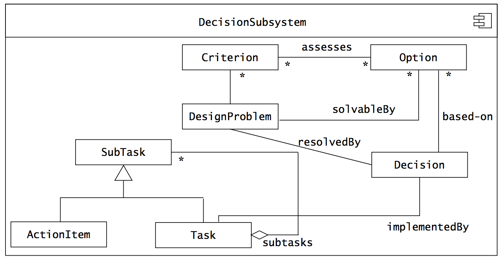

You can see that there is high cohesion between `SubTask`, `ActionItem` and `Task`, but low cohesion with the rest of the subsystem which on its own has high cohesion. So let's just split this into two subsystems:
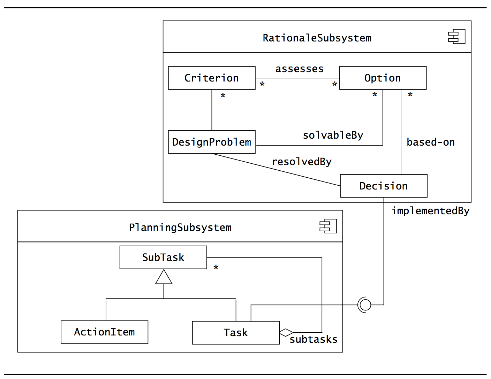

Also, in this example, these two subsystems are loosely coupled since there is only 1 association between them.

### Tradeoffs between cohesion and coupling
We can often increase cohesion by decomposing into smaller subsystems. *But*, this also increases coupling as the number of interfaces increases.

A good heuristic is the 7 ± 2 rule at any one level of abstraction. For instance, if there is more than nine subsystems at any given level of abstraction, or if a subsystem provides more than nine services, you should consider revising the decomposition.

## Layers and Partitions
### Hierarchical decomposition
A Hierarchical decomposition of a system yields an ordered set of layers.

### Layers
A *layer* is a **grouping of subsystems providing related services**, possibly realized using services from another layer.

So, a layer has subsystems which themselves may have subsystems and/or classes and so on it goes down the levels of abstraction.

**Layers can depend only on lower level layers and has no knowledge of the layers above it!**

The layer that does not depend on any others are known as *the bottom layer*. The layer that is not used by another layer is called *the top layer*.

### Open vs Closed architecture
In an closed architecture, each layer can access only the layer **immediately below it**.

In an open architecture, a layer can also access layers at deeper levels.

For instance, here we see subsystems depicted as packages but placed on 3 layers. It would appear to be closed. Well, at least no subsystem on any layer accesses a layer more than one layer down.
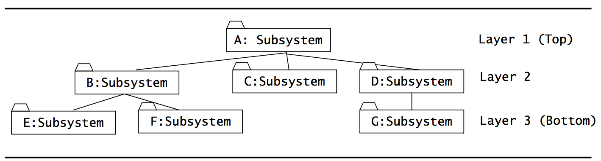

An example of a closed architecture is the OSI model for networks. You know it, score some easy points to the examination!

- Closed layered architectures lead to low coupling between subsystems by design.
- But, each level introduces speed and storage overhead (since messages must be passed down the stack one-by-one).

### Partitioning
Has to do with partitioning a system into peer subsystems, each responsible for different services.

**In general, we first partition a system into subsystems, figure out their services, and then we layer them**.

## (Software) Architectural Styles
A software architecture includes system decomposition, global control flow, handling of boundary conditions and intersubsystem communication protocols.

This is architectural styles just as an architect can go for a specific architectural style when designing a building.

Here are some software architectural styles:

### Repository
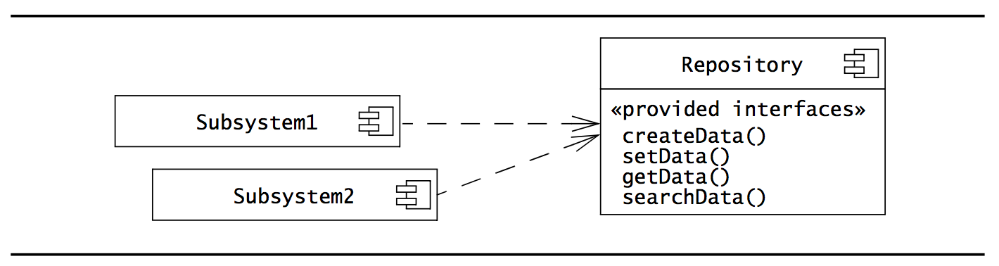

I like to think of it as a client-server architecture except where there many *kinds* of clients (subsystems) and one kind of (and instance of) server (repository). Advantages are the same as a centralized server in terms of control over concurrency and whatnot. The disadvantages are performance bottlenecks under load as well as high coupling with the central repository. If it fails or changes, everyone fails or must change with it.

In the *repository architectural style*, subsystems access and modify a single data structure **called the central *repository*.**

Subsystems are relatively independent and interact only through the repository.

The repository doesn't know about the subsystems.

#### When to use it
Typically used for database management systems. The central location of the data makes it easier to deal with concurrency and integrity issues between subsystems.

Compilers and software development environments also follow a repository architectural style.

##### Advantages
Repositories are well suited for applications with constantly changing, complex data-processing tasks. Once a central repository is well defined, we can easily add new services in the form of additional subsystems.

##### Disadvantages
The main disadvantage is that the central repository can quickly become a bottleneck (just like a central server in the client-server architecture).

Also, the coupling between the repository and the subsystems are extremely high (all subsystems know about the repository), so if the repository makes a breaking change, everyone needs fixing too.

### Model-View-Controller (MVC)

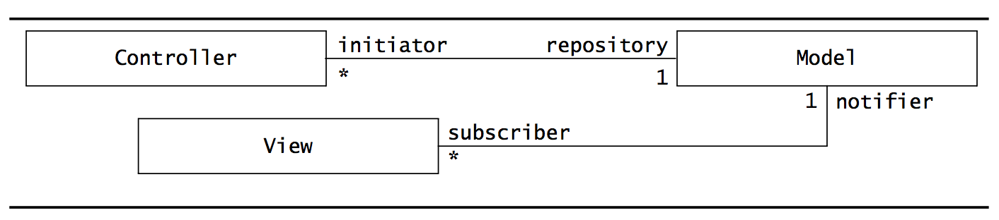

In this architectural style, subsystems are classified into three different types:
- *model* subsystems maintain domain knowledge.
- *view* subsystems display it to the user
- *controller* subsystems manage the sequence of interactions with the user.

MVC is a special case of the *repository architectural style* where `Model` implements the central data structure and control objects dictate the control flow.

##### Advantages
Well suited for interactive systems, **especially when multiple views of the same model are needed.**. Maintains consistency across distributed data.

##### Disadvantages
It introduces the same performance bottleneck as for other repository styles.

## Client/Server
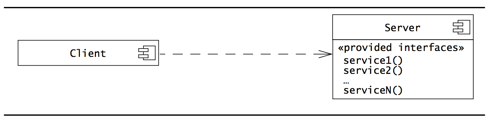

**Is a specialization of the *repository architectural style*.**
**What makes it different is that the central server (e.g. the repository) is managed by a process.**

An information system with a central database is an example of a client/server architectural style.

### Peer-To-Peer
A *peer-to-peer architectural style* is a generalization of the client/server architectural style in which subsystems can act both as client or as servers, in the sense that each subsystem can request and provide services.

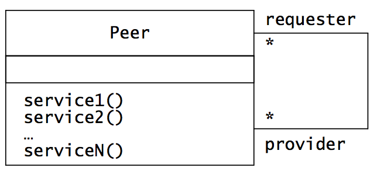

### Three-tier
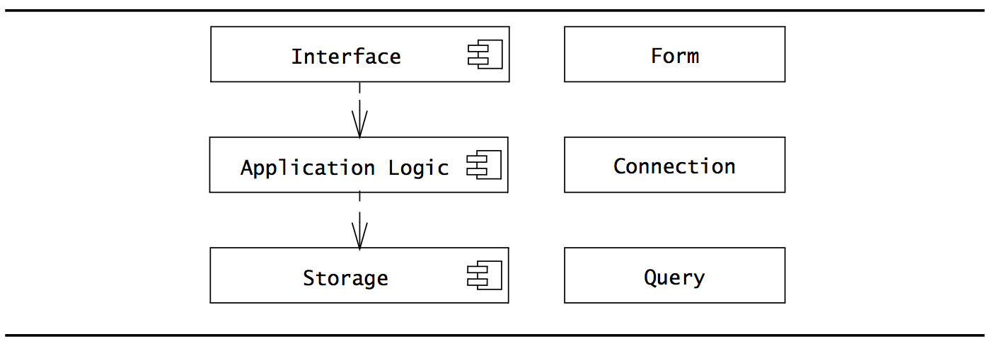

The *three-tier architectural style* organizes subsystems into three layers:

- The *interface layer* includes all boundary objects that deal with the user.

- The *application logic layer* includes all control and entity objects, realizing the processing, rule checking and notification required by the application.

- The *storage layer* realizes the storage, retrieval and query of persistent objects.

### Four-tier
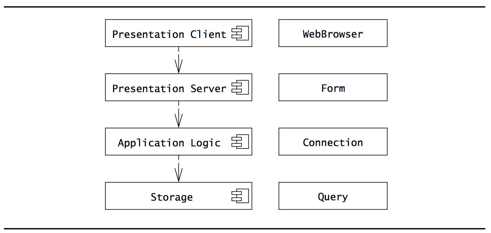

It is a three-tier architecture in which the Interface layer is decomposed into a *Presentation Client* layer and a *Presentation Server* layer.

- The *Presentation Client* layer is located on the user machines.
- The *Presentation Server* layer can be located on one or more servers.

### Pipe and Filter
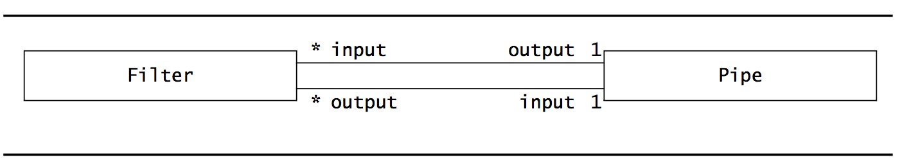

Here, subsystems process data received from a set of inputs and send results to other subsystems via a set of outputs.

The subsystems are called "filters", and the associations between the subsystems are called "pipes".

Each filter knows only the content and the format of the data received on the input pipes, not the filters that produced them.

Each filter is executed concurrently and synchronization is accomplished via the pipes.

One example of a pipe and filter architectural style is the Unix shell! When you do `ps aux | grep something` you are actually piping the results with the "|" operator into grep.

# System Design Activities: From Objects to Subsystems

## Identifying Design Goals
The first step of system design.
Here we identify the qualities that our system should focus on.

We can infer many of these from the Nonfunctional requirements or from the application domain. Others will have to be elicited from the client.

They must, however, be stated explicitly.

There are lots of *kinds* of design goals, but they are organized into five groups:
- Performance
- Dependability
- Cost
- Maintenance
- End user criteria

Often you will see that some goals are mutually exclusive.

#### Performance Criteria
These include the speed and space requirements imposed on the system.

Should the system be responsive, or should it accomplish a maximum number of tasks?

Is memory available for speed optimizations or should memory be used sparingly? And so on.

Examples of performance criteria are:
- **Response time**: How soon is a user request acknowledged after the request has been issued?

- **Throughput**: How many tasks can the system accomplish in a fixed period of time?

- **Memory**: How much space is required for the system to run?

#### Dependability Criteria
Determines how much effort should be extended in minimizing system crashes and their consequences. How often can the system crash? How available to the user should the system be? And so on.

Examples of dependability criteria are:
- **Robustness**: Ability to survive invalid user input

- **Reliability**: Difference between specified and observed behavior

- **Availability**: Percentage of time that system can be used to accomplish tasks.

- **Fault tolerance**: Ability to operate under erroneous conditions.

- **Security**: Ability to withstand malicious attacks.

- **Safety**: Ability to avoid endangering human lives, even in the presence of errors and failures.

#### Cost Criteria
Includes the cost to develop a system, deploy it and to administer it. Here there are many trade-offs since people like to pay as little as possible.

Examples of Cost criteria are:

- **Development cost**: Cost of developing the initial system.

- **Deployment cost**: Cost of installing the system and training users.

- **Upgrade cost**: Cost of translating data from the previous system.

- **Maintenance cost**: Cost required for bug fixes and enhancements to the system.

- **Administration cost**: Cost required to administer the system.

#### Maintenance Criteria
Determine how difficult it is to change the system after deployment. How easily can new functionality be added? And so on.

Examples are:

- **Extensibility**: How easy is it to add functionality?

- **Modifiability**: How easy is it to change the existing functionality?

- **Adaptability**: How easy is it to port the system to different application domains?

- **Portability**: How easy is it to port the system to different platforms?

- **Readability**: How easy is it to understand the system from reading the code?

- **Traceability of requirements**: How easy is it to map the code to specific requirements?

#### End user criteria
Include qualities that are desirable from a user's point of view, but is not covered by the other categories. Is the software difficult to use and learn? And such things.

Examples are:

- **Utility**: How well does the system support the work of the user?

- **Usability**: How easy is it for the user to use the system?

### Tradeoffs between design goals
It is simply unrealistic to develop software that is safe, secure *and* cheap.

Typically, some prioritizing must be done. You wouldn't have to put the categories up against each other, but instead the individual criteria. For instance:

- Space vs. speed
- Delivery time vs functionality.
- and so on...

After doing all of these considerations, you could end up with the following design goals:
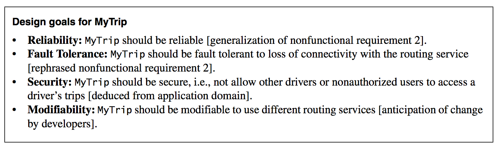

## Identifying Subsystems
**The initial subsystem decomposition should be derived from the functional requirements.**

Also, keeping functionally related objects together is way of identifying subsystems.

### Heuristics for grouping objects into subsystems
- Assign objects identified in one use case into the same subsystem.
- Create a dedicated subsystem for objects used for moving data among subsystems.
- Minimize the number of associations crossing subsystem boundaries.
- All objects in the same subsystem should be functionally related.

### Encapsulating subsystems with the Facade design pattern
The Facade design pattern allows us to further reduce dependencies between classes by encapsulating a subsystem with a simple, unified interface.

# Addressing Design Goals
If we should be able to give different development teams the responsibility for individual subsystems, there are some things we must agree on first. The decisions we make here must be driven by the design goals - especially when it comes to the tradeoffs that are to be made.

Here are the issues we need to address first:

- *Hardware/Software mapping*: What is the hardware configuration? Which node is responsible for what? How to they communicate?

- *Data management*: Which data should be persistent? And where do we store it?

- *Access control*: Who can access which data? How is access control specified and realized?

- *Control flow*: Is the system event driven? Can it handle more than one user interaction at a time?

- *Boundary conditions*: How are exceptional cases handled? How is the system initialized and shut down?

Here's what we still need to do in System Design:
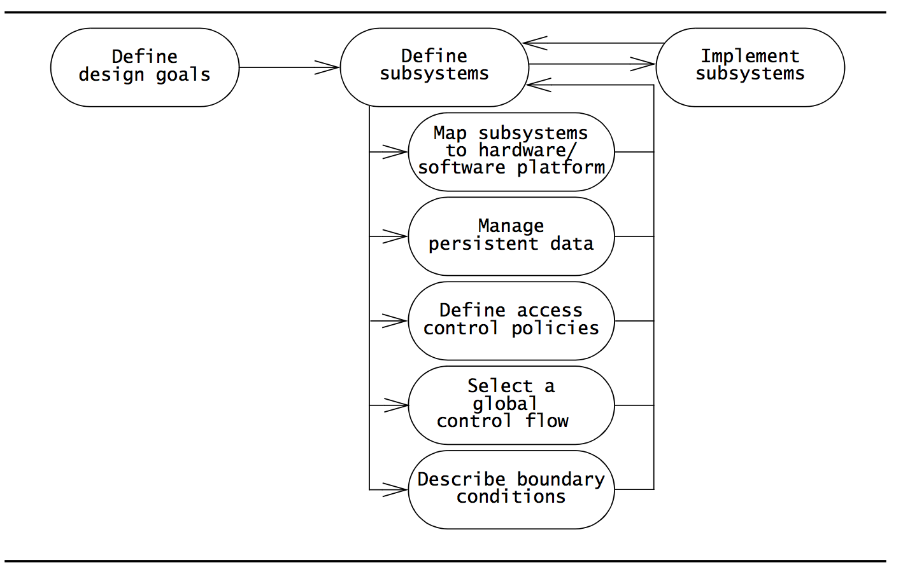

Let's get started.

## Mapping subsystems to processors and components (hardware/software mapping)

### UML Deployment Diagrams
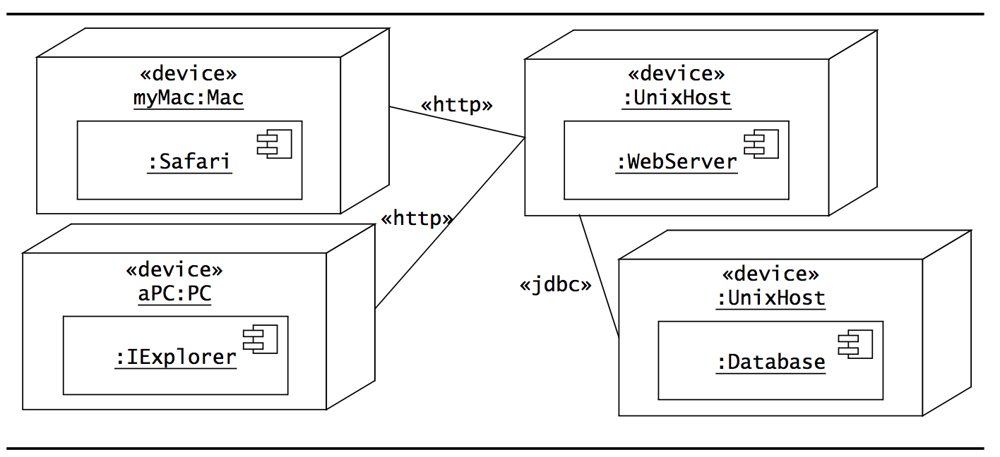
These are used to depict the relationship among run-time components and nodes.

Components are self-contained entities that provide services to other components or actors.

A Web server, for example, is a component that provides services via HTTP.

**The lines between the nodes are labeled with the protocol used by two nodes to communicate!**

### Selecting a hardware configuration and a platform
Hardware mapping has significant impact on the performance *and* complexity of a system, so we should probably do that immediately after the initial subsystem decomposition.

We need to figure out which kind of devices we are talking about as well as their operation system (what kind of host they are. Are we talking Windows NT or Unix?)

## Identifying and Storing Persistent Data
It is not always the answer to just throw a SQL server in there and call it a subsystem.

For instance, sometimes the best storage option is a file on the clients local machine, for instance in case of the loss of internet connectivity or something like that. So be wise with according to the device, host and also give a little bit of thought to the application domain here.

Also, who's to say that it should be SQL? Sometimes NoSQL might be better, if the task at hand can be easily solved without having to worry about complex relationships between entities. It will usually be much faster.

## Providing Access Control
Defining access control for a multi-user system can be pretty complex.

We need to define for each actor which operations they can access on each shared object.

To model this, we can use an *access matrix*.

### Access Matrix
The rows of the matrix represent actors of the system.

The columns represent classes whose access we control.

An entry `(class, actor)` in the access matrix is called an *access right* and lists the operations that can be executed on instances of the class by the actor.

There are 3 approaches:
- **Global access table**: Represents explicitly every cell in the matrix as a (actor, class, operation) tuple. Determining if an actor has access to a specific object requires looking up the corresponding tuple. If no such tuple is found, access is denied.

	-	Takes up a lot of space.

- **Access Control list**: Associates a list of (actor, operation) pairs with each class to be accessed. Empty cells are discarded. Every time an object is accessed, its access list is checked for the corresponding actor and operation. So, in other words, the access information is stored with each resource.

	-	Makes it faster to answer the question "Who has access to this object?". But again, takes up a lot of space.

- **Capabilities**: Associates a (class, operation) pair with an actor. A capability allows an actor access to an object of the class described in the capability. So, if a capability is given to the server, it is effectively an access card to perform specific operations on a specific resource.

	-	Makes it faster to answer the question "Which objects has this actor access to?". It definitely has some security concerns. For instance, if I steal a capability from you, It is essentially the same as stealing a key to your house.

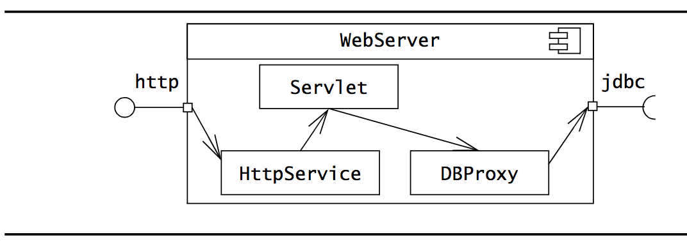

### Static access control
An access matrix only represents *static access control*. This means that a access rights can be modeled as attributes of the objects of the system.

### Dynamic access control
However, more often than not, the accesses each actor has to a resource depends on other factors. Like in the case of a social network, are person A friends with person B?

The Proxy design pattern can help with this. Upon requests to read/update/add/delete a post on a wall, a Proxy could protect the resource and first check it the person behind the message is actually friends with the person or not.

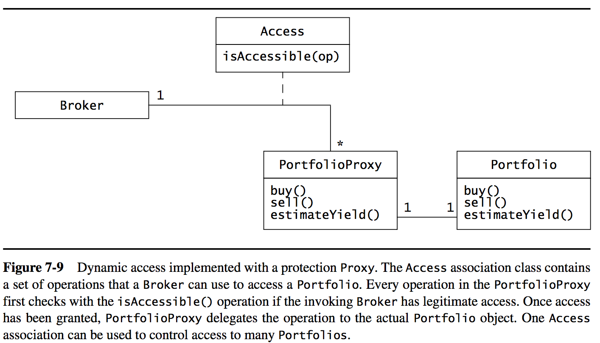

### Authentication
The process of verifying the association between the identity of the user or subsystem and the system.

One example is for the user to specify a user name and a password. Following that, the server can give a token to the user and then provide challenges to the user which can be met by sending a valid token along the request.

## Designing the Global Control Flow
Control flow is the sequencing of actions in a system.

This includes deciding which operations should be executed and in which order.

There are 3 possible control flow mechanisms:

### Procedure-driven control
Operations wait for input whenever they need data from an actor.
Mostly used in legacy systems and systems written in procedural languages.

### Event-driven control
A main loop waits for an external event. When an event becomes available, it is dispatched to the appropriate object, based on information associated with the event.

It leads to a simpler structure than procedure-driven control and to centralizing all input in the main loop.

However, it does make the implementation of multi-step sequences more difficult to implement.

### Threads
Threads are the concurrent variation of procedure-driven control. The system can create an arbitrary number of threads, each responding to a different event.

If a thread needs additional data, it waits for input from a specific actor.

### When to use what
Procedure-driven control can be great for testing subsystems but should be avoided in the final system because of the fact that a system usually has multiple subsystems and blocking *all* subsystems while waiting for user input can be pretty stupid.

Other than that, there is plenty of good things about event-driven control and threads.

## Identifying Services
This is when we begin identifying which services are offered by which subsystems.

Again, we only care about identifying the services by name. Only when we reach object design we assign parameters, operations and constraints to them.

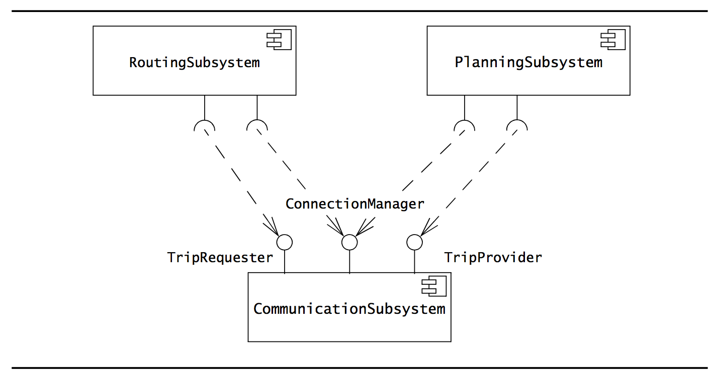

Here, the `CommunicationSubSystem` provides three services, and each of the other subsystems consumes two of them.

- Services should have noun phrases as names (for instance `TripRequester`), as they correspond to an interface including both attributes and operations.

- The operations of services should have verb phrases in camelCase (e.g. `requestTrip()`). Attributes the same.

## Identifying Boundary Conditions
We need to decide how the system is started, initialized and shut down - and we need to define how we deal with major failures such as data corruption and network outages, whether they are caused by software errors or a power outage.

To identify them, we examine each subsystem and each persistent object for the following things to generate boundary use cases:

- **Configuration**: Where is it created, destroyed or archived.

- **Start-up/Shutdown**: How does it start, shutdown **and configure the component** (very confusing that the configuration check is here, but oh well).

- **Exception handling**: How should the system react (e.g. inform users of failure) upon failure. This is documented with an exceptional use case that extends the relevant common use cases identified way back during requirements elicitation.

What can an exception be?
- A hardware failure.
- Changes in the operating environment (for instance, lost connectivity, power outage and stuff like that.)
- A software fault.

## Reviewing System Design
Here, there are no external agent (such as a client) to review successive iterations and ensure better quality.

(Well, you could have an external consultant I might say! But I get the point.)

Again, just like in the review of analysis, we need to ensure that the system design model is correct, complete, consistent, realistic and readable.

### When is it *correct*
It is correct if the analysis model can be mapped to the system design model.

Ask these questions:

- Can every subsystem be traced back to a use case or a Nonfunctional requirement?

- Can every use case be mapped to a set of subsystems?

- Can every design goal be traced back to a Nonfunctional requirement? (Because remember, subsystems are derived from functional requirements, design goals are derived from nonfunctional requirements, very roughly speaking).

- Is every nonfunctional requirement addressed in the system design model?

- Does each actor have an access policy?

- Is every access policy consistent with the nonfunctional security requirement?

### When is it *complete*
It is complete if every requirement and every system design issue has been addressed.

Ask these questions:

- Have the boundary conditions been handled?

- Was there a walkthrough of the use cases to identify missing functionality in the system design?

- Have all use cases been examined and assigned a control object?

- Have all aspects of system design (hardware allocation, persistent storage, access control, legacy code, boundary conditions) been addressed?

- Do all subsystems have definitions?

### When is it *consistent*
It is consistent if it does not contain any contradictions.

Ask these questions:

- **Are conflicting design goals prioritized?**

- Does any design goal violate a nonfunctional requirement?

- Are there multiple subsystems or classes with the same name?

- Are collections of objects exchanged among subsystems in a consistent manner?

### When is it *realistic*
It is realistic if the corresponding system can actually be implemented.

Ask these questions:

- Are any new technologies or components included in the system? Do we know if the robustness of these have been evaluated? How?

- Have performance and reliability requirements been reviewed in the context of subsystem decomposition?

- Have concurrency issues (congestion, deadlocks) been addressed?

### When is it *readable*
It is readable if developers not involved in the system design can understand the model.

Ask these questions:
- Are subsystem names understandable?

- Do entities (e.g. subsystems, classes) with similar names denote similar concepts?

- Are all entities described at the same level of detail?

## Managing System Design
As in analysis, its all about staying consistent while using as many resources as possible.

### Documenting System Design
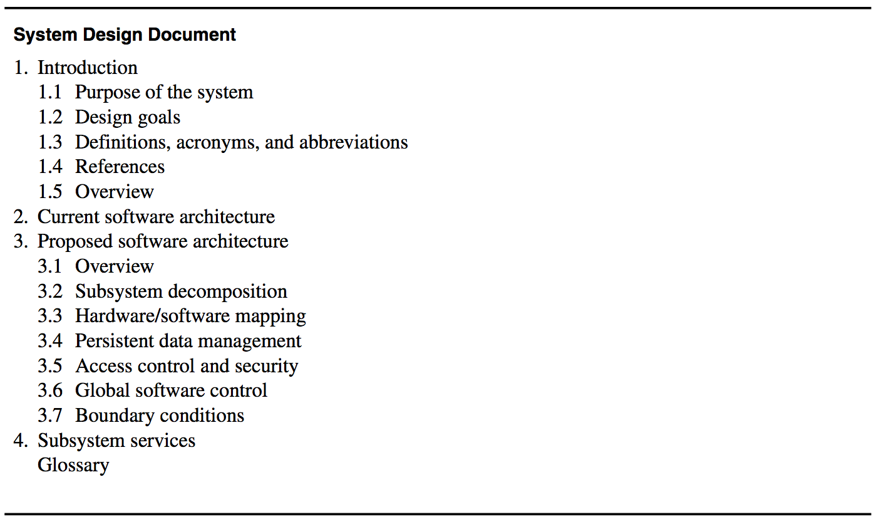

System Design is documented in the System Design Document (SDD).

It describes:
- Design goals set by the project,
- Subsystem decomposition (with UML class diagrams),
- Hardware/software mapping (with UML deployment diagrams),
- Data management,
- Access control,
- Control flow mechanisms, and
- Boundary conditions.

#### Sections

- *Introduction* provides a brief overview of the software architecture and the design goals. It also references other documents and traceability information if need be.

- *Current software architecture* describes the software architecture of the system being replaced. If there is none, it could provide an examination of existing similar solutions in the application domain.

- *Proposed system architecture* documents the system design model and is divided into subsections:

	-	*Overview* is a brief overview of the software architecture. Describes briefly the assignment of functionality to each subsystem.

	- *Subsystem decomposition* describes the decomposition into subsystems and the responsibilities of each. **This is the main product of system design**.

	- *Hardware/software mapping* describes how subsystems are assigned to hardware and off-the-shelf components. Also lists the issues introduced by multiple nodes and software reuse.

	- *Persistent data management* describes what data is stored and how it is stored.

	- *Access control and security* describes the user model in terms of an access matrix. Also describes security issues such as selection of an authentication mechanism, the use of encryption and such stuff.

	- *Global software control* describes how the global software control is implemented (duh). How requests are initiated and how subsystems synchronize. Concurrency. That stuff.

	- *Boundary conditions*: Describes start-up, shutdown and error behavior.

Then moving on to:

- *Subsystem services* describes the services provided by each subsystem. The interfaces of each subsystem is derived from this section and detailed in the Object Design Document.

The SDD is also put under configuration management/VCS with revision history.

## Assigning responsibilities
Here we are in the realm of developers.

The main roles are:

- *Architect*: Takes the main role. Ensures consistency in design decisions and interface styles. Mainly an integration role.

- *Architecture liaison*: Member of the architecture team. Representative from a subsystem team. Convey information from and to their teams and negotiate interface changes. They focus on subsystem services during system design.

- *Document editor*, *configuration manager* and *reviewer* roles are the same as for analysis.

## Communication
It should be easier than under decision since now we only need to consider developers.

But, there are new considerations:

- *Size*: The number of issues keeps increasing.

- *Change*: Subsystem decomposition and interfaces are very young and constantly in flux. They might change so fast that different developers or teams might not be discussing the same versions of subsystems.

- *Level of abstraction*: System design can be pretty abstract, and consequences of design decisions are felt only later.

- *Conflicting goals and criteria*: Individual developers often optimize different criteria. This is especially relevant in regards to implicit goals. It can lead to pulling the system decomposition in different directions.

So, to resolve this,
- Be sure to make as many design goals for the system as explicit as possible.

- Make sure that everyone always have the newest system decomposition available (for instance, using git).

- Maintain an up-to-date glossary (for instance, using git)

- Iterate!!

## Box&Line Diagrams
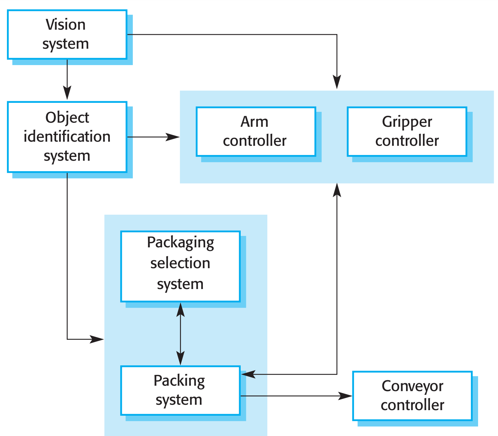

You might not know them by name, but you use them all the time for quick illustrations to fellow developers or clients.

These are very abstract.
