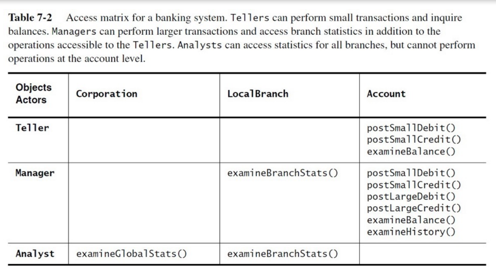
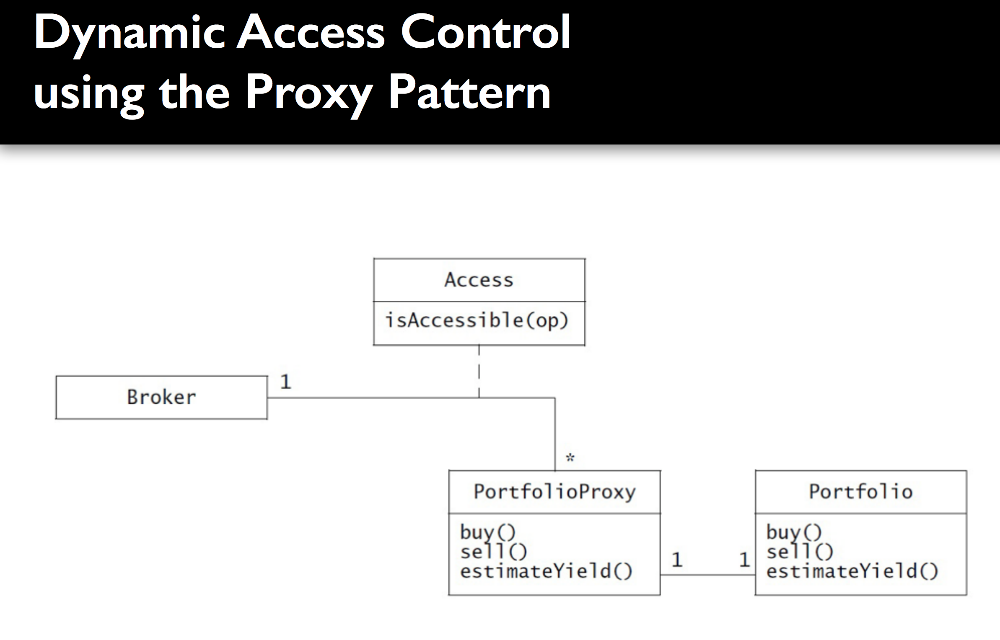
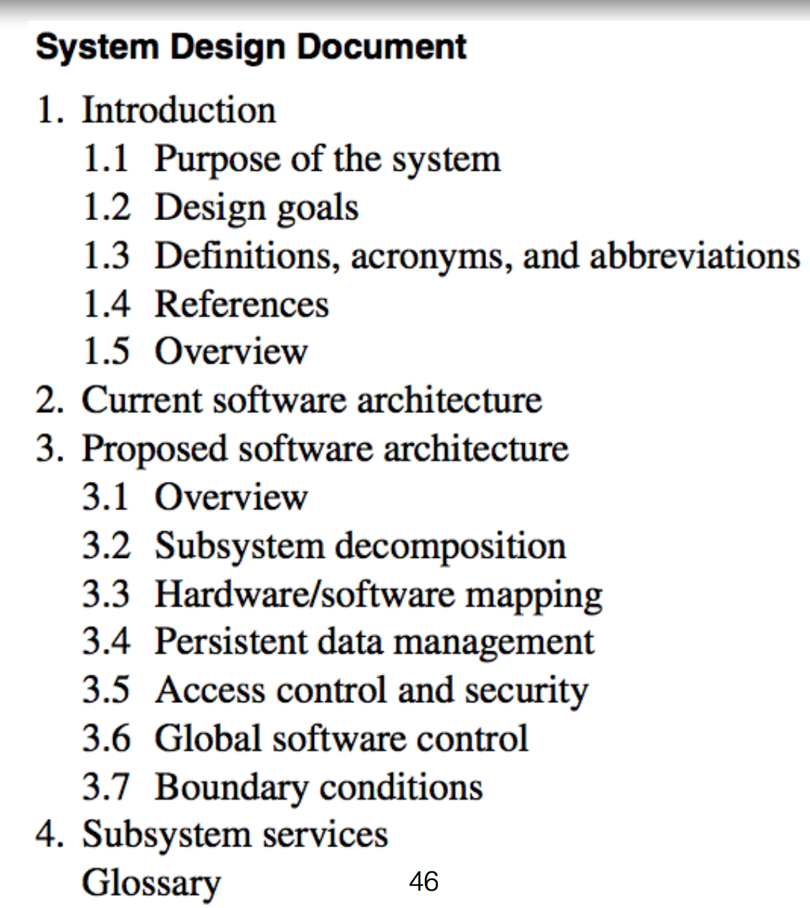

## System design and object design
> [OOSE] ch. 9+10
>
> (Optional) [SE9] ch. 7

### Mapping subsystems to processors and components
- Most systems run on multiple computers/VMs
- Hardware/VM mapping has significant impact on performance and complexity (is done early in a project)
- HW/VM mapping often leads to design of more components for data transport/mapping
- HW/VM distribution allow for exploit parallel processors, but comes with a cost in terms of handling
	-	concurrency
	storing, replicating, transferring data.

### Identifying and storing persistent data

#### Identifying persistent objects
-	Typically entity objects/classes.
- Data that should survive system shutdown/restart/crash
	-	Can be quite a lot

#### Storage management strategy

-	**Files**:
	- Binary data stored in the local filesystem.
	- No finer grained access/read/write control
	- Used for large/temporary data.

- **Relational DB (SQL)**:
	-	Data stored in table(s) in large, distributed RDMS system.
	- Fine-grained concurrency control.
	- Used for fine-grained data management in stable data models.

- **noSQL (Document DB, KeyValue)**:
	-	Data stored in large key-value pairs (essentially JSON)
	- Less constrained, simple design, horizontally scalable.

### Providing access control

- In a multi-user system, different actors have access to different functionality and data.
	-	Modelled during OOA in the use case diagram.
	- In OOD, we model how actors can control/access objects.
	- ... + authentication mechanisms.

- Access control list/matrix
	- Rows and actors of the system.
	- Columns are classes
	- Cells list the access rights.

### Access matrix
#### Global Access table
- global for a whole system, controlling access globally.
- (`actor`, `class`, `operation`)
- If no match, access denied.

#### Access Control list
- List pr. class controlling access on a class level
- (`actor`, `operation`)
- Every time an object is accessed, its access control list is checked.
- If no entry found, access denied.

#### Capability list
- list pr. actor controlling what an actor can do (*“invitation card”*)
- (`class`, `operation`)
- if no capability, no access

#### Procedure-driven control
- operations wait for input from actor(s)
- “old school” procedural, legacy systems
- pipe-and-filters architectures
- Event-driven control
- main loop wait for external event and dispatch them to interested parties
- modern UI / OOP systems
- MVC / event architectures
- Threads
- each event spawn a concurrent thread / event handler
- modern UI / web systems
- client/server architectures

#### Boundary conditions
How the system:
- Is started, initialized, shut down
- Behave during exceptions, faults, data corruptions, etc.
- Extend the OOA model with Boundary Use Cases
	- ... or extend existing ones
- Typical boundary cases
- Configuration (actor = system administrator)
- Start-up and Shut-down
- Exception handling—all components can fail!
- hardware, network, etc.
- operating environment (OS, DB, ...)
- software components
- your system

## System design document

## Contracts
#### Invariants
- predicate that is always true for all instances of a class
- associated with classes and/or interfaces
- `t.getMaxNumPlayers() > 0`
- Precondition
- predicate that must be true before an operation is invoked
- associated with a specific operation (can be specified on the interface)
- `!t.isPlayerAccepted(p) and t.getNumPlayers() < t.getMaxNumPlayers()`
- Postcondition
- predicate that must be true after an operation is done
- associated with a specific operation (can be specified on the interface)
- `t.getNumPlayers_afterAccept = t.getNumPlayers_beforeAccepts+1`

## Documenting object design
#### Fundamental challenge in OOA/OOD (!#€”%&#”€%§)
- how to maintain CONSISTENCY between UML models and Code????
- 3 approaches
- Self-contained OOD generated from model
- we write and maintain UML models and generate code
- problem : inaccurate OOA/OOD and out-of-date
- OOD as an extension of the RAD
- keep the OOA and OOD as “one” model
- problem: pollution of OOA with implementation details
- OOD embedded in source code
- start w. the OOD UML models and move into code
- use JavaDoc / XML Summary to describe the interfaces and classes
- problem: bloated UML
- advantage: less work

## Recommendations
#### OOA
- build and maintain the OOA model to reflect requirements and analysis
- Use cases, class diagrams, sequence diagrams, etc.
- keep it updated to always reflect current requirements/analysis
- document it in the RAD

#### OOD
- build an initial model to reflect architecture and design
- document it in the OOD

#### CODE
- build the system in code
- add exception handling (e.g. w. invariants and pre- & post conditions)
- maintain source code documentation
- extensive use of unit testing (and continuous integration)
- When the system code is stable [finished | released]
- go back and update the OOA and OOD documentation
- make it reflect what is actually implemented
- Release the code + documentation as one coherent package
