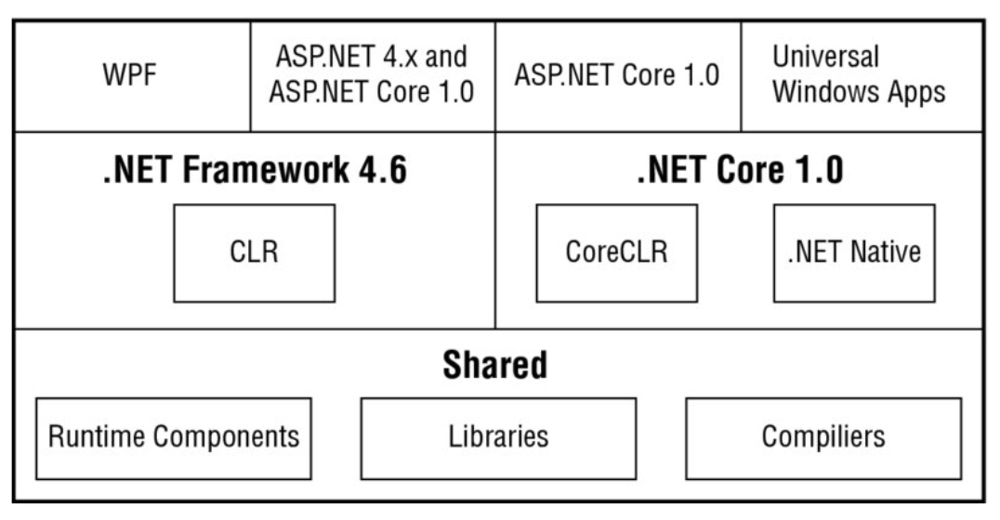

# Test driven C#
> Christian Nagel: Professional C# 6 and .NET Core 1.0, Wrox 2016 [PrC#6]: chapters 1, 2, 3, and 4.
> Peter Sestoft: C# Precisely Second Edition, MIT 2012 [C#P2]: chapters 1, 2, and 3.

### What is new in .NET Core
.NET Core is first and foremost open source and cross-platform.

A part of .NET Core is a new runtime: The CoreCLR. It is used from ASP.NET Core 1.0.
Instead of using the CoreCLR runtime, .NET can also be compiled to native code.
UWP (Universal Windows Platform) automatically makes use of this feature.
All UWP-apps are compiled to native code before being offered from the Windows Store.

### Difference between .NET Framework 4.6 and .NET Core

### Shared between .NET Framework 4.6 and .NET Core
*Runtime components* such as the code for the garbage collector and the *RyuJIT* Just-In-Time compiler that compiles IL-code to native code are shared. *Libraries* can be shared between applications. The .NET compiler platform is also used by all technologies.
