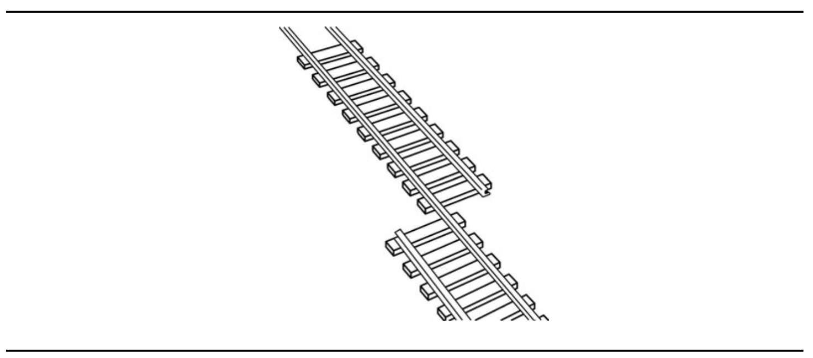

## Testing
>[OOSE] ch. 11

### Note-to-self
I keep forgetting: **Scenario testing is where you pick a typical usage scenario and use that to derive test cases.**

### What is testing
Testing is the process of finding differences between the expected behavior specified by system models and the observed behavior of the implemented system.

Another way to put is that testing is a systematic attempt to *find faults in a planned way.*

Unit testing is great for finding differences between a specification of an object and its realization as a component.

Structural testing is great for finding differences between the system design model and a subset of integrated subsystems.

Performance testing is great for finding differences between nonfunctional requirements and actual system performance.

When differences are found, developers identify and correct the reason for the failure - and in some cases, the system model might be identified as the cause of the difference and must be updated accordingly.

**Testing is aimed at breaking the system!**

Perhaps the most frightening thing about testing is that there is no such thing as a completely tested system. You can have lots of code coverage and such, but in theory you can never guard against "all" bugs.

### Testing is not easy
It is so typical to just assign the new guy or those who aren't that experienced yet to test something.

But to test a system effectively, a tester must have detailed understanding of the whole system, ranging from the requirements to system design decisions and implementation issues.

## An overview of testing

### Software reliability
Software reliability is the probability that a software will not cause system failure for a specified time under specified conditions.

### Failure
Failure is any deviation of the observed behavior from the specified behavior.

### Erroneous state
An erroneous state means the system is in a state such that further processing by the system will lead to a failure, which then causes the system to deviate from its intended behavior.

### Faults/bugs/defects
These are the mechanical or algorithmic causes of an erroneous state.

### The goal of testing
The goal of testing is to **maximize the number of discovered faults, which then allows developers to correct them and increase the reliability of the system.**

There are lots of people who would say that testing is all about demonstrating that faults are not present. But this is not the right attitude! We *want* to find faults, as many as possible, so that we can correct them. For each time we find a bug, we know that an end-user won't have to run into it (if we fix it ;-)).

Oh, and by the way, **it is *not* possible to demonstrate that faults are not present**. How would you do that? Sure, your tests paint the terminal green all over the place with checkmarks and whatnot, but the only thing it demonstrates is that your tests are not failing, not that there are no bugs present in your application.

Obviously, the more bugs we catch, the higher the reliability of our system.

## Techniques for increasing the reliability of a software system.

#### Fault avoidance
Here, we try to prevent faults from ever occurring in the first place through development methodologies and verification.

#### Fault detection
Through debugging and testing, we identify erroneous states and find the underlying faults that caused them.

#### Fault tolerance
These kind of techniques assume that faults may happen and that they should be recovered from at runtime. This is especially important in distributed systems where a host may crash or lose its internet connection. We have to assume that faults can happen and that it is out of our control - so what do we do about it? Recover from them!

### Some terminology
- *Review*: Manual inspection of parts or all aspects of the system without actually executing the system. There are two kinds of reviews:

	- *Walkthrough*: The developer informally presents the API, the code and associated documentation of the component to the review team.

	- *Inspection*: Similar, but the presentation of the component is formal. Here, the developer is *not* allowed to present the artifacts (models, code, documentation). This is instead done by the review team.

- *Debugging*: Assumes that faults can be found by starting from an unplanned failure. The developer moves the system through a succession of states, ultimately arriving at and identifying the erroneous state. Once it has been identified, the algorithmic or mechanical fault causing it must be determined.

	-	*Correctness debugging*: Finds any deviation between observed and specified functional requirements.

	- *Performance debugging*: Finds any deviation between observed and specified nonfunctional requirements related to performance, such as response time.

- *Testing*: Is a fault detecting technique that tries to create failures or erroneous states in a planned way. It is intentional that this definition is pretty upside-down from what you'd intuitively describe as testing. We want to have that mindset of "proving" that faults are there, not the other way around. It is relatively easy to find something that works, write a test and say "Hey, it works!" so that the boss is happy and you can go home and drink some beer, but that's not gonna help you in the long run.

## Testing activities

#### Test planning
Allocates resources and schedules the testing. The activity should occur early in the development phase.

#### Usability testing
Tries to find faults in the user interface design of the system. Often, systems fail to accomplish their intended purpose simply because their users are confused by the user interface and unwillingly introduce erroneous data.

#### Unit testing
Tries to find faults in participating objects and/or subsystems with respect to the use cases from the use case model (sure, lets go with that definition).

#### Integration testing
Is the activity of finding faults by testing individual components **in combination**

#### Structural testing
Is the culmination of integration testing, involving **all** components of the system.

#### System testing
Tests *all* the components together, seen as a single system to identify faults with respect to the scenarios from the problem statement and the requirements and design goals identified in the analysis and system design, respectively:

	-	**Functional testing**: Tests the requirements from the RAD and user manual. Can users actually perform the tasks from start to finish?

	- **Performance testing**: Checks the nonfunctional requirements and additional design goals from the SDD. This is done by developers.

	- **Acceptance testing and installation testing**: Checks the system against the project agreement and is done by the client. Pretty important stuff, huh?

## Some more terminology

#### Test component
A part of the system that can be isolated for testing. It can be a single object, a group of objects or entire subsystems.

#### Test case
A set of inputs and expected results that exercises a test component with the purpose of causing failures and detecting faults.

#### Test stub
**A partial implementation of components on which the tested component depends**.

#### Test driver
A test driver is a partial implementation of a component that depends on the test component.

**Test stubs and drivers enable components to be isolated from the rest of the system for testing.**

#### Correction
A change to a component so that the fault at hand won't happen again. It may introduce new faults. We see that all the time, by the way.

## Faults, Erroneous States and Failures

1. Failures happen because something is in an erroneous state.

2. Something is in an erroneous state because of a fault which has happened (at run time).

3. A fault happens because it has been too long since the developers last cup of coffee.

Obviously, the fault could also happen because of bad communication between development teams or because of a wrong implementation of the specification by one of the teams.

Obviously, something could also be in an erroneous state due to some component that crashes or whatever. But we could still call that a fault - because there hasn't been implemented some kind of fault tolerance.

## Test cases

A test case is a set of input data and expected results that exercises a component with the purpose of causing failures and detecting faults.

A test case has five attributes:
- *name*: Allows the tester to distinguish between different test cases. The book goes on to suggest heuristics for figuring out what to call a test, but really it is very language/framework specific.

- *location*: Describes *where* the test case can be found. Should be a path name or the URL to the executable of the test program and its inputs (now, this is just stupid. Why would anyone do that?)

- *input*: Describes the set of input data or commands to be entered by the actor of the test case (which can be the tester or a test driver).

- *oracle*: The expected behavior.

- *log*: A set of time-stamped correlations of the observed and expected behavior for various test runs.

### Relationships between test cases

We can model the relationships between test cases in UML with aggregation and `precede` associations.

A good test model has as few associations as possible. It should really not have any, I'd say.

### Blackbox vs Whitebox testing
*Blackbox tests* focus on the **input/output** behavior of the component. These do not deal with the internal aspects of the component, nor with the behavior or the structure of the components.

*Whitebox tests* focus on the **internal structure** of the component.

Whitebox testing is great for really getting around all branches of the possible control flow of some method.

## Test stubs and drivers
If we want to really isolate a single component, object or combinations of components, they typically have *some* dependent functionality.

We can provide so-called stubs for these "missing parts" which we *know* produces the outcome we expect. In that way, we always know that if something fails, it *is* happening in the specific thing we are testing.

### Test stubs
They simulate a component that is called by a tested component.

A test stub must provide the same API as the method of the simulated component and must return a value compliant with the return type of the method's type signature.

## Corrections
A correction is a change to a component whose purpose is to repair a fault.

It can be everything from a simple modification to a complete redesign of a data structure or a subsystem.

In all cases, the likelihood that the developer introduces new faults is high. This is one very good reason for writing tons of tests!!!

Remember do to *regression testing* after implementing your correction.

*Regression testing* includes the re-execution of *all* prior tests after a change. This ensures that stuff that worked before still works now.

Obviously this can be insanely time-consuming for everything else than unit tests. So if you can "fake it", do everything you can to do so to not have to do manual testing :-D.

# Testing activities

## Component Inspection (Code inspection)
Inspections find faults in a component by reviewing its source code in a formal meeting.

This inspection is conducted by a team of developers, one of which is the author of the piece of code. If it should be fully *by the book*, there will also be a facilitator.

An inspection method could consist of:

- *Overview*:  The author briefly presents the purpose and scope of the component as well as the goals of the inspection.

- *Preparation*: Reviewers become familiar with the implementation.

- *Inspection meeting*: A reader paraphrases the source code (hah, I'd love to hear that) and the inspection team raises issues with the component. The facilitator keeps the meeting on track by making sure that everyone has coffee and don't get caught up in discussing tabs vs spaces.

- *Rework*: The author revises the component.

- *Follow-up*: The moderator checks the quality of the rework. A new meeting may be planned if need be. (But that would be so evil!)

## Usability Testing
Here, we test the **user**'s understanding of the system.

It does not compare the system against a specification. Instead it focuses on finding differences between the system and the user's expectation of what it should do.

Typically it is more than one user who has application domain knowledge who are given some tasks to execute intuitively. And then they just do their thing.

There are many ways to conduct a usability test.
But all or most of them are based on the classical approach for conducting a controlled experiment:

1. Developers first formulate a set of test objectives, describing what they hope to learn in the test. This can be very abstract, but also *very* (too?) specific (like Google and their usability tests with a quadrillion shades of blue).

2. Then, objectives are evaluated in a series of experiments in which participants perform predefined tasks. (The book says that participants are *trained to perform*, but I can't get myself to agree with that. What's the point of usability testing an interface that requires training? We need to know if the users can figure out the system, or else we need to go back to the drawing board. We already know that the users have the application domain knowledge.)

3. Developers observe the participants and collect data measuring user performance (time to accomplish tasks, error rate, etc) and preferences (opinions and thought processes).

### When to usability test?
As soon as possible! Get started with paper scenario mock-ups if that is your thing. That may save you lots of time.

### Kinds of usability tests

#### Scenario test
Here, one or more users are presented with a visionary scenario of the system.

Developers identify how quickly users are able to understand the scenario, how accurately it represents their model of work, and how positively they react to the description of the new system.

**These scenarios should be as realistic and detailed as possible**.

##### Advantages
- Cheap
- Can be done right from the beginning

##### Disadvantages
- The user cannot interact directly with the system.

#### Prototype test
The end users are presented with a piece of software that implements key aspects of the system.

A *vertical prototype* completely implements a use case through the system. A vertical prototype is used to evaluate core requirements, for example, response time of the system or user behavior under stress.

A *horizontal prototype* implements a single layer in the system. For instance, a *user interface prototype*.

And then - behold the *Wizard of Oz prototype*.
Yeah, *this* Wizard of Oz:

A *Wizard of Oz prototype* is a user interface prototype in which a human operator behind the scenes pulls the levers. This could be done with paper mockups too.

#### Product test
Similar to the prototype except that a functional version of the system is used in place of the prototype.

## Unit Testing
Unit testing focuses on the building block of the software system, that is, objects and subsystems.

- Unit testing reduces the complexity of overall test activities, allowing us to focus on smaller units of the system.

- Unit testing makes it easier to pinpoint and correct faults, given that few components are involved in the test.

- Unit testing allows parallelism in the testing activities: Each component can be tested independently of the others.

Also, executing unit tests doesn't require that much effort. Its just `npm run test` and you're done.

### What to unit test
In principle *all* objects should be tested (100% code coverage is insane but awesome). This is often not feasible because of time and budget constraints.

## Unit testing techniques
The most important ones are:

### Equivalence testing
This is a blackbox testing technique. It minimizes the number of test cases. The possible inputs are partitioned into equivalence classes, and a test case is selected for each class.

The assumption of equivalence testing is that systems usually behave in similar ways for all members of a class. So, to test the behavior associated with an equivalence class, we only need to test **one** member of the class.

It has two steps:

1. Identify equivalence classes.

	-	Get as much coverage as possible.

2. Select test inputs

	-	Make sure that no input belongs to more than one equivalence class.

Pick at least two inputs for each equivalence class - a typical input and an invalid input.

### Boundary testing
A special case of equivalence testing where we focus on the conditions at the boundary of the equivalence classes.

The idea is that developers often forget special cases (like leap years, empty strings, negative values, etc). This would be boundary testing.

### Disadvantages of equivalence/boundary testing
They do not really explore *combinations* of test input data.

### Path testing
This is a whitebox testing technique that identifies faults in the implementation of the component that is being tested.

The assumption behind path testing is that, by exercising all possible paths through the code at least once, most faults will trigger failures.

It does require knowledge of the code to be able to identify all possible paths through it.

You would then construct a *graph* where the nodes are executable blocks and the edges represents the flow of control.

**Using graph theory, it can be shown that the minimum number of tests necessary to cover all edges is equal to the number of independent paths through the flow graph**.

#### Is Path testing the holy grail?
Well, it can only detect faults resulting from exercising a path in the program.

### State-based testing
Compares the resulting *state* of the system with the expected state.

Test inputs are *stimuli* and after each input, code checks if the watch is in the predicted state and reports a failure otherwise.

### Polymorphism testing
Here, we also need to make sure to test all dynamic bindings. For instance, if some implementation of an interface is provided at runtime (for instance, with the Strategy pattern), we need to test for all possible implementations of it.

For instance, if we used the Strategy pattern to decide for a network strategy, we would probably always run the test from an Ethernet connection or something like that - and never run into the "BadConnectionImplementation" or whatever the name of that could be.

### Integration testing
Where unit testing focuses on individual components, integration testing focuses on small groups of components.

#### Double/Triple/Quadruple tests
If two components are tested together, we call it a *double test*. And so it goes up from there.

#### Horizontal integration testing strategies
Here, components are integrated according to **layers**, following the subsystem decomposition.

The drawback here is that an operational system is usually first available very late during development.

There are some different strategies:
##### Big Bang testing
This assumes that all components are first tested individually and then tested together as a single system.

##### Bottom-up testing
Here, each component of the bottom layer is tested individually, and then they are integrated with components on the next layer up. This is repeated until all components from all layers are combined.

Test drivers are used to simulate the components of higher layers that have not yet been integrated. No test stubs are necessary during bottom-up testing.

##### Top-down testing
Here, components of the top layer is unit tested first. Then they are integrated with the components of the next layer down.

When all components of the next layer have been tested together, the next layer is selected. This is repeated until all layers are combined and involved in the test.

Test stubs *are* used to simulate the components of lower layers that have not yet been integrated, but test drivers are *not* needed.

Bottom-up testing is nice since interface faults can be found more easily.

Top-down testing is nice since it starts with user interface components. But, its pretty time-consuming since a large number of stubs is usually required for nontrivial systems.

##### Sandwich testing
This strategy combines the top-down and bottom-up strategies. Here, the subsystems must be able to be divided into three layers - the layer above, the target layer as well as the layer below.

Using the target layer as the focus of attention, it now performs bottom-up testing and top-down testing in parallel.

Problem: It does not thoroughly test the individual components of the target layer before integration.

##### Modified sandwich testing
This is a strategy that tests the three layers individually before combining them in incremental tests with one another. The individual layer tests consists of a group of three tests:
- A top layer test with stubs for the target layer.
- A target layer test with drivers and stubs replacing the top and bottom layers.
- A bottom layer test with a driver for the target layer.

The combined layer tests consist of two tests:
- The top layer accesses the target layer. This test can reuse the target layer tests from the individual layer tests, replacing the drivers with components from the top layer.
- The bottom layer is accessed by the target layer. This test can reuse the target layer tests from the individual layer tests, replacing the stub with components from the bottom layer.

**Overall, modified sandwich testing is pretty much the holy grail**.

#### Vertical integration testing strategies (Continuous integration)
Here, components are integrated according to **functions**. Its incredibly confusing that vertical integration testing is *not* the one with layers considering layering is typically illustrated vertically. But oh well.

A better name for it is **continuous integration**.

##### Continuous integration
If you develop with that in your test flow, **your system will always be in a runnable state all through development**.

Work is integrated frequently, often once per day. **Each integration is verified by an automated build which includes the execution of integration tests to detect errors as quickly as possible**.

This is possible to do early on and thus focuses on early integration.

Here, the needed parts of each component (user interface, business logic, middleware, etc) are identified and developed in parallel and integration tested.

**At the end of a vertical integration test, a Release Candidate is produced**.

## System testing
So now that we've unit and integration tested stuff for finding problems in individual components and the interfaces *between* components, we know that the system has been *integrated*.

System testing ensures that the complete system as a whole complies with the functional and nonfunctional requirements.

Here are the activities of system testing:

### Functional/Requirements testing
This is where we find differences between the functional requirements and the system.

It is a blackbox technique. Test cases are derived from the use case model.

The goal of the tester is to select those tests that are relevant to the user and have a high probability of uncovering a failure.

#### Difference from usability testing
Functional testing finds differences between the use case model and the **observed system behavior** whereas usability testing finds differences between the use case model and **the user's expectation of the system**.

### Performance testing
Here, we find differences between the design goals selected during system design and the system.

Because design goals are derived from nonfunctional requirements, the test cases can be derived from the SDD or from the RAD.

Here's how its done:

- **Stress testing**: Checks if the system can respond to many simultaneous requests. For instance, if the system is designed to be able to deal with 6000 concurrent connections, we stress test the system with 6000 or more to see what happens.

- **Volume testing**: Attempts to find faults associated with large amounts of data such as static limits imposed by the data structure or high disk fragmentation.

- **Security testing**: Finds security faults in the system. This can be done by "tiger teams" (paid hackers) who attempt to break into the system.

- **Timing testing**: Attempts to find behaviors that violate timing constraints described by nonfunctional requirements.

- **Recovery tests**: Evaluates the ability of the system to recover from erroneous states (e.g. network failures)

### Validated system
If all functional and performance tests have been performed successfully, the system is said to be validated.

### Pilot testing/Field test
This is where the system is installed and used by a selected set of users.

They won't get any explicit guidelines or test scenarios. They should just use it and see if it flies.

They are invited to use the system for a limited amount of time and give their feedback to the developers.

#### Alpha test
Here the users test the system in **a development environment.**

#### Beta test
Here the users test in the **target environment.**

**Beta tests do not test usability requirements as thoroughly as usability or alpha tests do since less logging is generally happening in the target environment**.

### Acceptance testing
This is where the clients evaluates the system.

Some different approaches are:

#### Benchmark tests
Here, the **client** prepares a set of test cases that represent typical conditions under which the system should operate.

#### Competitor testing
Here, the new system is tested against an existing system or competing product. Uh, frightening. *"The grass is always greener on the other side."*

#### Shadow testing
Here, the new and legacy system (yeah, it requires that) are run in parallel and their outputs are compared.

#### After acceptance testing
The client reports to the project manager which requirements are not satisfied. And then it goes through the standard phases of iteration until a new acceptance test.

Once the client is satisfied (if they ever will be), the system is accepted. Hurrah! 🍻🍻🍻

### Installation testing
Here it gets installed in the target environment.
The desired outcome is that the installed system correctly addresses all requirements.

Here, the test cases executed during function and performance testing are executed in the target environment (probably on IE8). Here, all the clients see is a white screen until this happens:

The client then informs the project manager about the need for IE8 support with IE6 docmode compatibility. This is an important point in the project manager's career. He realizes the importance of requirements elicitation and then goes on a long, long vacation.

## Planning testing
Planning of testing is extremely important.

It must start very early. Developers responsible for testing can design test cases as soon as the models they validate become stable.

Functional tests can be developed when the use cases are completed.

Unit tests of components can be developed when their interfaces are defined.

## Allocation of time on testing
**25 percent of all project resources should go to testing**.

Obviously, this number can go up (but not down) depending on the (especially on) safety and reliability requirements on the system.

## Documenting testing
There are four kinds of documents,
- *Test plan*: Focuses on the managerial aspects. The scope, approach, resources and schedule. The requirements and the components to be tested are identified in this document. This plan is written early on.

- *Test Case Specifications*: Each specific test case is documented here. Contains the inputs, drivers, stubs and expected outputs of the tests, as well as the tasks to be performed. This is written early on.

- *Test Incident Reports*: Here, the actual results of the tests and differences from the expected output are recorded.

- *Test Summary Report*: Here, all failures discovered during tests that need investigation are listed.

## Assigning Responsibilities
On large projects (read: if you work for IBM), a separate team (or more) is dedicated to testing.

The testing team is provided with the system models, the source code and the system for developing and executing test cases (apparently, that has a system of its own).

The test team then sends back *Test Incident Reports* ad *Test Report Summaries* to the subsystem teams for analysis and possible revision of the system.

And then again, once ready, the test team takes a new stab at it. And so it goes.

In real life, though, subsystem teams can double as a testing team for components developed by other subsystem teams.

The architecture team can define standards for test procedures, drivers and stubs and can perform as the integration test team.

And then we have usability tests and finding participants for it. Finding the right ones with enough application domain knowledge can be hard too. But one thing is for sure: It must *not* be developers who "pretend" to be the users. They already know the system. And the end-users aren't typically developers. So, even if a developer without direct relation to the project acted as user, he/she would have the same "mindset" as the developers who built it.

## Regression testing
Well, TL;DR;, the main point is: When you *correct* something and it solves the failing test, run all of your unit tests and integration tests again to ensure that nothing broke. If it was a big thing, then maybe do a system test of the *some* risky or frequent use cases.

## Automating testing
The benefit of automating test execution is that tests are (easily) repeatable. Again, in terms of regression testing, this is a **must**. We can just quickly run all tests to verify that nothing broke.

## Model-Based testing
Whatever infrastructure, manual or not, is used for executing tests are called the *test harness* or *test system*.

We can also model the test system in UML (holy crap, its all over the place) with something called U2TP (UML 2 Testing Profile)

### UML profile
A UML profile is a collection of new stereotypes, interfaces and constraints.

## U2TP

U2TP is a UML profile  which extends UML for modeling testing.

It provides the same advantages as when modeling the system under development: Test cases are modeled in a standard notation understood by all participants.

Test cases can then be auto-generated from test models. Test case execution and results can be automatically collected and recorded.

Here are the U2TP extensions to UML:

- **The stereotype «sut»**: Means the *system under test*. Can be the whole system, but *also* a subsystem or a single class.

- **The stereotype «testcase»**: Just a test case. A specification of behavior realizing one or more test objectives.

- **The stereotype «testObjective»**: Describes the goal of one *or* several test cases.

- **The stereotype «testComponent»**: Is test components such as stubs and utilities needed for executing a test case.

- **The stereotype «testContext»**: Include the set of test cases, the configuration of test components and the system under test needed for every test case.

It also defines two interfaces:
- An **arbiter**: Collects the local test results into an aggregated result.

- A **scheduler**: Creates and coordinates the execution of the test cases among test components and the system under test.

(Notice the expected return values on `getDisplay()`).
