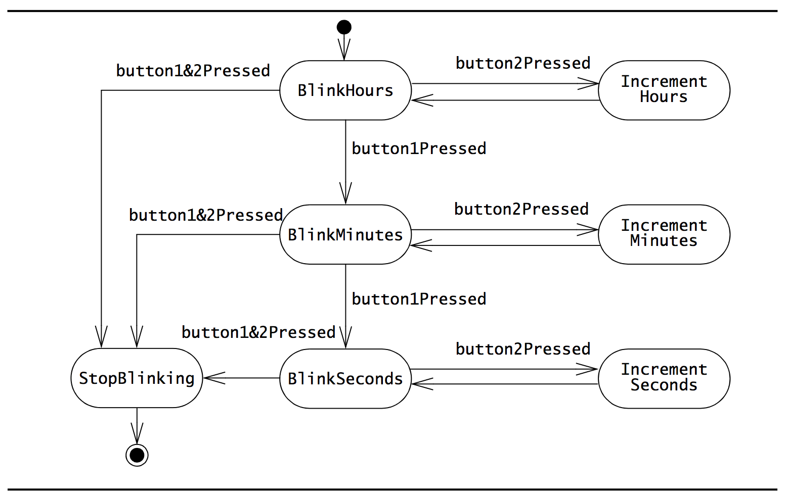
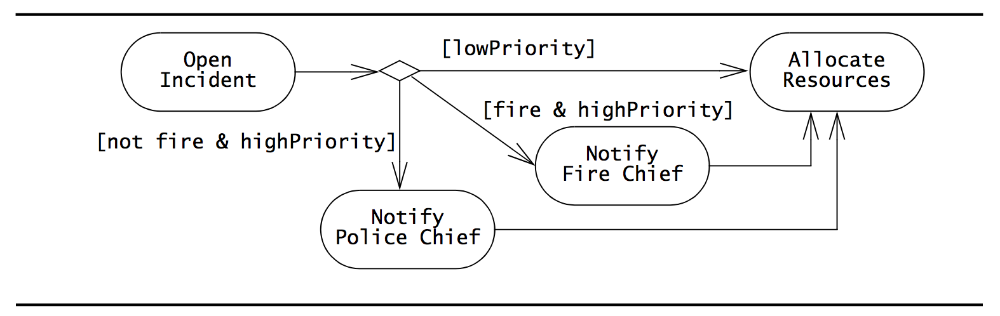

# UML
> [OOSE] ch.2

### Note-to-self
When you forget which way to point the arrows, then think of it as a directed edge *towards* the "owner" or "parent".

So, from subclass to base-class. From instance of class to the class itself. And so on. If some entity *has a* something, the arrow should point towards the owner.

### Notation
Notation enables us to articulate complex ideas precisely.
Accuracy and clarity are critical as the cost of miscommunication increases rapidly.

### Requirements of notation for accurate communication
- It must have **well-defined semantics**.
- It must be **well suited** for representing a given aspect of a system.
- It must be **well understood** among project participants.

With standards and conventions, we can get closer to the third requirement - that the notation is well understood.

Also, if many dialects of a notation exists or if a very specialized notation is used, the notation users are prone to misunderstandings as each user imposes its own interpretation.

## Unified Modeling Language (UML)
UML is great because it provides a spectrum of notations for representing different aspects of a system.

It has been accepted as a standard notation in the industry.

### History
It resulted from the unification of the Object Modeling Technique (OMT) and Object-Oriented Software Engineering (OOSE).

It has also been influenced by other Object-Oriented notations.

### Goal
To provide a standard notation that can be used by *all* Object-Oriented methods and to select and integrate the best elements of precursor notations.

For instance, it includes the use case diagrams introduced by OOSE.

## System models and their representation in UML

- *Functional model*: Represented in UML with use case diagrams. Describes the functionality of the system **from the user's point of view**.

- *Object model*: Represented in UML with class diagrams. Describes the **structure of the system** in terms of objects, attributes, associations and operations.

	-	During requirements elicitation and analysis, the object model starts as the *analysis object model* and describes the application concepts relevant to the system.

	- During system design, the object model is then refined into the *system design object model* and includes descriptions of the subsystem interfaces.

- *Dynamic model*: Represented in UML with interaction diagrams, state machine diagrams and activity diagrams. Describes the **internal behavior** of the system.

	-	**Interaction diagrams** describe behavior as a sequence of messages exchanged among a **set of objects**.

	- **State machine** diagrams describe behavior in terms of states of **an individual object** and the possible transitions between states.

	- **Activity diagrams** describe behavior in terms of control and data flows.

## Basics of 5 popular UML diagrams

## Use Case Diagrams
A use case diagram is a diagram of one or more uses cases (a use case is then sort of like a set of scenarios put together to solve a larger task).

Use cases are used during requirements elicitation and analysis to represent the functionality of the system. Use cases focus on the behavior of the system **from an external point of view** (through Actors).

**They describe functions provided by the system that yields visible results for an actor**.

Actor = entity that interacts with the system (a user, another system, etc).

**The identification of actors and use cases results in the definition of the boundary of the system**.

The actors are outside the boundary of the system whereas the use cases are inside the boundary of the system.

Behavior described by use cases is also called **external behavior**.

When actors and use cases exchange information, they are said to **communicate**.

Oh, and by the way, these lines between actors and use cases within the boundary are bidirectional (undirected), always, so its just as much from use case to actor as from actor to use case.

A specific use case can then be textually described with six fields:

- The *name* of the use case. Must be unique and explain the purpose of it (for instance, `ReportEmergency`).

- The *participating actors*: For instance: <code><u>alice, bob:Researcher</u></code>

- *Entry conditions* describe the conditions that need to be satisfied before the use case is initiated.

- The *flow of events* is the body of the use case.

	-	It describes the sequence of interactions of the use case which by the way must be numbered for reference.

	- Exceptional cases are described in separate use cases.

	- The steps should be organized into two columns, the left-most one representing the steps accomplished by the actor, the right-most column representing steps accomplished by the system.

	- Each pair of actor-system steps represents an interaction.

- *Exit conditions* describe the conditions satisfied after the completion of the use case.

- *Quality requirements* are requirements that are not related to the functionality, but instead include constraints on the performance, its implementation, the hardware platform and so on.

### Use case relationships
Use case diagrams can include four types of relationships:

- *Communication relationships*: Depicted by a solid lien between the actor and use case symbol.

- *Include relationships*: Some use case that must be executed as part of another one (typically one that is shared by other use cases as well) can be «include»d.
	-	**To represent a «include» in a textual use case, «include» should be written in bold and just with the word "Include"**!

- *Extend relationships*: A use case can extend another use case if it is a specification of exceptional behavior. It states that, if a use case «extend»s another, the behavior of the extended use case may execute under some circumstances. For instance, syncing with the database could have a «extend»s relation to a `OfflineSync` use case.
	-	 **To represent a «extend» in a textual use case, «extend» should be written in bold and just with the word "Exclude"**!

- *Inheritance relationships*: A use case can also **inherit** from another (be a specialized version of it). For instance, one use case can specialize a base use case if it adds more detail to it. For instance, logging in is a use case, but logging in with Facebook or Twitter could be two specializations of it.

	-	Illustrated with **directed** edges as seen here: 

	- To represent inheritance in a textual use case, write "<em><strong>Inherited</strong> from <<code>Use-case-name</code>></em>" in the *"Participating actors"*, *"Entry condition"* and *"Exit condition"* sections (and possibly also Quality requirements. Basically any section that is inherited completely.)

## Class Diagrams
These are used to **describe the structure of the system.**

Classes are abstractions that specify the common structure and behavior of a set of objects.

**These classes are then connected and have numbers on the ends of the associations denoting the number of links each object can have with an object of a given class. This is called multiplicity** Such associations are realized as references (pointers) to objects.

### Associations and links
A *link* represents a connection between two objects.
*Associations* are relationships between classes and represent groups of links.

Links can be symmetrical (bidirectional/undirected) or asymmetrical (unidirectional/directed).

For instance:

This shows that a `Polygon` *has zero or more* `Point`s. It is possible to go from `Polygon` to `Point`s, but not the other way around.

### Association class
Association classes are classes are classes that binds two classes together. They are are connected to the association symbol with a dashed line:

**These are usually used to defeat many-to-many relationships.**

For instance, without it in the example above, a `FieldOfficer` could have many `Incidents`, but `Incidents` could also have many `FieldOfficers`. So, defeat that, the association class `Allocates` is placed in-between them.

You *could* also just transform the association class into a regular one:

### Roles
You can label a *role* at the ends of associations (links) which is just text allowing us to distinguish among the multiple associations originating from a class. These can clarify the purpose of the association.

### Multiplicity
The numbers at the ends of associations as described before.

- For instance, `1..*` means *at least one*.
- `*` means *zero or more*.
- `*..10` means *zero or more up to max of 10*.
- `1` means exactly 1
- and so on...

You could even write `1, 2, 3, 5, 7, 11, 13` if there could only be a prime number multiplicity, but I've never seen that in practice.

### Aggregation
Aggregation can be used to represent a stronger kind of connection than regular connections. Its for the times where we want to say that some entities *are part of* another entity while, at the same time, the main entity is not *composed* of the entities that are part of it.

For instance, a `Directory` contains a number of `Files` and a `Class` contains many `Students`.

Or in other words, `Files` *are part of* a `Directory` and `Students` *are part of* a `Class`.

But, a `Directory` *can* exist without any `File`s in it. And, a `Class` *can* exist without any `Student`s in it (for that we would use **composition**).

So, its like a *one-to-many relationship*.

For instance:

Here, we say that `File`s *are part of* a `Directory`.

But yeah, its pretty much one-to-many relationships with an additional semantical meaning.

### Composition
"The whole can not exist without its parts".

This is a stronger connection than aggregation. To use the Files and Directories example from before, here we say that a `Directory` *is composed of* `File`s.

This means has the crucial difference that if the `Directory` has no files in it, it has no reason for existence and should be removed.

Great for cascade deletion design!

### Qualification
A technique for **reducing multiplicity by using keys**.

Its horribly ugly and confusing:

...But apparently some people think it is more readable to *remove* an attribute from an entity and place it in a box to the right of the entity it is *part of* as some kind of pseudo-association class which in turn then means that you can avoid having to model it as a one-to-many relationship and instead declare a one-to-zero-or-one mapping between the filename and the File. It all just looks weird to me.

### Interfaces
Interfaces can be modeled in two ways:
- As a class with a «interface» stereotype (and probably only public methods).
- With the lollipop notation (white, round circle with the interface name below it).

#### Implementing an interface
Denoted with a "extends" arrow like we know from subclasses in UML, except the arrow is dashed:

An interface can extend another interface (regularly, with a regular fat arrow just like regular extension.)

### Dependencies
If a class *depends* on another class to be able to function correctly, the association is a dashed directed edge.

In this example, A *depends on* B.

## Interaction Diagrams
These are used to formalize **the dynamic behavior of the system and to visualize the communication among objects**.

An interaction diagram represents the interactions that take place among these objects.

There are two kinds of Interaction diagrams in UML: *Sequence diagrams* and *Communication diagrams*:

### Sequence Diagrams
These are special forms of interaction diagrams.
**Focuses on the messages exchanged between objects as a result of external events created by actors.**

- Made up of columns with *Time* on the vertical axis.
- Each column on the horizontal axis represents an object that participates in the interaction.
- Messages are shown by solid arrows.
- Labels on top of the solid arrows represent the message names and may contain arguments.
- Activations (method invocations) are depicted by vertical rectangles
- The Actor who initiates the interaction is shown in the left-most column (the upper left corner)
- Also, it is usually interaction between instances of classes, so an actor could for instance be <code><u>:Person</u></code> and one of the participating objects could be <code><u>:TextArea</u></code>

### Communication Diagrams
Depict the same information as sequence diagrams. They represent the sequence of messages by numbering the interactions.

This removes the need for geometrical constraints on the objects. But, it can be pretty hard to follow the flow of events:

## State Machine Diagrams
Describe the dynamic behavior of **an individual object** as a number of states and transitions between these states.

- A *state* is a condition satisfied by the attributes of an object. For example, `Active`, `Inactive` `Closed`, etc.

- A state is depicted by a **rounded rectangle**.

- Given a state, a *transition* represents a future state the object can move to and the conditions associated with the change of state. This is triggered by events, conditions or time.

- A transition is depicted by an **open arrow connecting two states**.

- A small black circle initiates the initial state.

- A circle surrounding a small black circle indicates a final state.

**The state machine diagram focuses on the transitions between states as a result of external events for an individual object.**

UML state machines are extensions of the finite state machine model.

### Actions within states
It is possible to add *actions* to states to denote the behavior within them. Actions are fundamental units of processing that can take a set of inputs, produce a set of outputs and can change the state of the system.

Actions can occur in 3 places:

- When a transition is taken.
- When a state is entered.
- When a state is exited.

During a transition, the exit actions of the source state are executed first, then the entry actions of the destination state are executed.

An *internal transition* is a transition that does not leave the state. These are triggered by events and can have actions associated with them.

An *activity* is a coordinated set of actions. A state can be associated with an activity that is executed as long as an object resides in this state.

### Nested state machines
Can reduce complexity. Can be used instead of internal transitions.

// TODO: Read some about this. I didn't understand anything about this in the book.

## Activity Diagrams
**Represent the sequencing and coordination of lower level behaviors.**

Describes the behavior of a system in terms of activities.

Activities are modeling elements that represent the execution of a set of operations.

The execution of an activity can be triggered by the completion of other activities, by the availability of objects or by external events.

**Activity diagrams are similar to flowchart diagrams in that they can be used to represent control flow (the order in which operations occur) and data flow (the objects that are exchanged among operations)**.

- Rounded rectangles represent activities.
- Arrows between activities represent control flow.
- **An activity can be executed only after all predecessor activities completed.**
- Thick bars represent the **synchronization of the control flow. (where they meet before proceeding)**

### Control nodes
Control nodes coordinate control flows in an activity diagram, providing mechanisms for representing decisions, concurrency and synchronization.
We use *decisions*, *fork nodes* and *join nodes*.

#### Decision nodes
These are branches in the control flow. **They denote alternatives based on a condition of the state of an object or a set of objects.**

**Decisions are depicted by a diamond with one or more incoming open arrows and two or more outgoing arrows. The outgoing edges are labeled with the conditions that select a branch in the control flow.**

The set of all outgoing edges from a decision represents the set of all possible outcomes.

As seen here, all the possible ways to go from the decision nodes are labeled with brackets around them.

#### Fork nodes
Fork nodes denote the splitting of the flow of control into multiple threads

#### Join nodes
Join nodes then denotes the synchronization of multiple threads and their merging of the flow of control into a single thread.

### Swimlanes/Activity partitions
Swimlanes (or Activity partitions) denote the object or subsystem that implements the actions. These are represented as rectangles enclosing a group of actions.

In the picture, all of the activities in the middle must execute before proceeding to the last activity ("Archive Incident").

Also, notice the two blocks `FieldOfficer` and `Dispatcher`. These are two swimlanes. The left-most thick block is a *fork*-node. The right-most thick block, where they meet again, is a *join*-node.

## Object Diagrams
Object Diagrams are structure diagrams.

Object diagrams are snapshots of a system structure at any given point in time during execution.

It is like a class diagram, except everything is instances with values.

We use the term *links* rather than *associations* here.

Object names are <u>underlines</u> to indicate that they are instances (like always).

## Component Diagrams
Component diagrams are structure diagrams that shows components, required interfaces, ports and relationships between them.

Component diagrams also show the artifacts that implement them and the physical nodes on which they are deployed and executed.

### Components
Components could represent logical components, business components, process components, physical components etc.

// TODO: A little sparse with info on component diagrams. Maybe read some more?

## Modeling Concepts
The basic concepts of modeling.

### Systems, Models and Views
#### System
A *system* (in software engineering) is an organized set of communicating parts which are designed for a specific purpose.

## Package Diagrams
Package diagrams are Structure diagrams.

They are used to depict how various packages of a system are connected.

// TODO: A little sparse with info on package diagrams. Maybe read some more?

## Deployment Diagrams
Deployment Diagrams are Structure diagrams.

They are used to depict where the various elements of a system are located.

For instance, a distributed system based on a client/server architecture.

Deployment diagrams contain nodes and communication paths, components and dependancies.

// TODO: A little sparse with info on Deployment diagrams. Maybe read some more?

#### Subsystem
Parts of a system that are a system in their own rights are called *subsystems*.

Many systems are made of numerous subsystems that are interconnected in all sorts of ways. This can very complex.

#### Modeling
Modeling is a means for dealing with this complexity.
**Modeling means constructing an abstraction of a system that focuses on interesting aspects and ignores irrelevant details. What is interesting or irrelevant varies with the task at hand**.

##### Parts of a entity
**A general rule of thumb is that each entity should contain at most 7 ± 2 parts [Miller, 1956]**.

##### System model
The set of all models built during development is called the system model!

##### Views
A *view* focuses on a subset of a model to make it understandable. It depicts selected aspects of a model. Views and models of a single system may overlap each other.

**Notations are graphical or textual rules for representing views**.

**A UML class diagram is a graphical *view* of the object model.**

**Obviously, different notations can be used to represent the same view**.

## Data Types, Abstract Data Types and Instances
### Data Types
A *data type* is an abstraction in the context of a programming language. A data type has a unique name that distinguishes it from other data types. It denotes a set of values that are members of the data type (*instances* of the data type) and defines the structure and the operations valid in all instances of the data type.

An `int` is a data type.

### Abstract data types
A data type defined by an implementation-independent specification. These enables developers to reason about a set of instances without looking at a specific implementation of the abstract data type.

For instance, Sets and Sequences are abstract data types which can be mathematically defined.

**A system may provide different implementations of the abstract data types.**

For instance, a `Person` is most likely an abstract data type (unless a language actually comes with a primitive struct called `Person`, but I highly doubt it!)

## Classes, Abstract Classes and Objects
### Classes
Like abstract data types, a class encapsulates both structure and behavior.

**Unlike abstract data types, classes can be defined in terms of other other classes by using inheritance**.

### Abstract classes
When an inheritance relationship serves only to model shared attributes and operations (e.g. if the generalization is not meant to be instantiated), the resulting class is called **an abstract class**.

Such ones often represent generalized concepts in the application domain (You can't instantiate an Animal, but *can* instantiate a Cat since it *derives* from Animal. OO principles for dummies).

**The names of abstract classes are in *italic*!**.

### Inheritance
Here, `CalculatorWatch` *derives* from `Watch`. Both of them are *not* abstract classes (e.g. both of them could be instantiated - `CalculatorWatch` is simply a specialization of `Watch`).

**An inheritance relationship is displayed by a line with a triangle. The triangle points to the superclass, and the other end is attached to the subclass**. So in other words, its a directed edge towards the parent/base class.

### UML class
Such a entity has 3 compartments:

- The first depicts the name of the class (and its stereotype if it has one).
	-	If it is abstract, it will be in cursive (italic).

- The second depicts its attributes.
	- An attribute is a named slot (a *field*) in the instance where a value is stored. These have a unique name within the class and the type. (Hey now, they can also have access modifiers! *+* for public, *-* for private, *#* for protected and *~* for package.)

- The third depicts its operations.
	- **Operations can be inherited.**
	- For instance, `SetDate()`.

If a class doesn't have any methods, the third compartment can be left out.

### Objects
An object is an instance of a class.

**In UML, an instance is depicted by a rectangle with its name <u>underlined.</u>**.

It will have an identifying name for the instance (the variable name) followed with a ":" and then the class name.

For instance: <code><u>simpleWatch1234:Watch</u></code>.

## Event Classes, Events and Messages
### Event Classes
These are abstractions representing a kind of event for which the system has a common response.

Event classes describes groups of events for which the system has a common response.

### Events
These are **instances of event classes** and are relevant occurrences in the system. An event can be a stimuli from an actor (for instance, "pressed a button"), a time-out ("after 2 minutes") or the sending of messages between two objects.

In practice, the term "event" can refer to instances *or* classes.

### Messages
A message is the mechanism by which the sending object requests the execution of an operation in the receiving object.

A message has a name and a number of arguments. A receiver matches it with an operation and returns the results to the sender. So, it is pretty much a method invocation (well, it is).

**For instance, in sequence diagrams, the things that looks like method calls are actually called messages in UML terminology**:

Notice how the arrows go from sender to receiver and then back again. That is the return value.

## Object-Oriented Modeling
Much of it is covered already in other notes.

- The *application domain* represents all aspects of the **user**'s problem, including the physical environment, the users, other people, their work processes and so on. We need to understand the application domain to do our work. The better we know it, the better applications we can build for it.

- The *solution domain* is the modeling space of all possible systems. Represents the system design and object design activities of the development process. **The solution domain is usually modeled in much more detail than the application domain.**

### Object-oriented Analysis
*Object-oriented analysis* is concerned with modeling the application domain.

### Object-oriented design
*Object-oriented design* is concerned with modeling the solution domain.

**Both Object-oriented analysis and Object-oriented design use the same representations - classes and objects.**

#### Advantages of using the same notation
Solution domain classes that represent application concepts can be traced back to the application domain.

#### Disadvantages of using the same notation
Using a single notation can cause confusion because it removes the distinction between the real world and the model of it (The matrix!!)

## Falsification and Prototyping
### Falsification
Falsification is the process of demonstrating that relevant details have been **incorrectly** represented or not represented at all; That the model does *not* correspond to the reality it is supposed to represent.

### Prototyping
When designing the user interface, developers construct a prototype that only simulates the user interface of a system. The prototype is then presented to potential users for evaluation - **that is, falsification** - and modified subsequently.

Most likely, the initial prototype will be discarded. In other terms, users *falsify* the initial prototype, - a model of the future system - because it does not accurately represent relevant details.

## Diagram Organization
### Packages
Packages are used to deal with complexity in the same way a user organizes files and subdirectories into directories (or folders on smartphones, etc). **But note that the same class *can* appear in more than one package - so they are not necessarily hierarchical.**
Models of complex systems quickly become complex. This complexity can be dealt with by grouping related elements into **packages**.

A package is a grouping of model elements, such as use cases or classes, defining scopes of understanding.

This is an example of an "open" package (where you can see the contents).

It looks like a "folder". It is a rectangle with a tab attached to its upper-left corner.

It can also be closed, though:

#### Packages in use cases
You can them combine multiple related use cases in packages and reduce complexity in a use case diagram:

Each of these might hold several use cases and it might *not* be the case that the actor can access all of them.

### Notes
A *note* is a comment attached to a diagram. These are simply used to attach free-form information to models and model elements.

For instance, for clarifying a complex point or recording outstanding issues relevant to a model.

Here's a diagram with a note:

## Diagram Extensions
There are some *extensions* enabling the modeler to actually extend the language.

Two of those are *stereotypes* and *constraints*.

### Stereotypes
A stereotype is an extension mechanism that allows developers to classify model elements in UML. The syntax is: «stereotype-name», for instance: `«Enumeration»`.

Stereotypes can be attached to the model element to which it applies, such as a class or an association.

### Constraints
Another extension is constraints which are rules that can be attached to a UML model element to restrict its semantics. A constraint can be expressed as an informal string:

