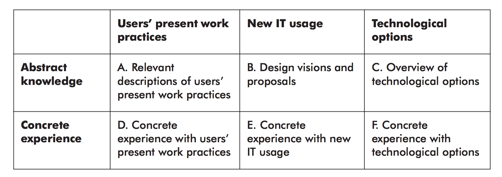

# Exam Questions

## Presentation (2-3 minutes)

I'd like to spend a few minutes describing how using the MUST principles ultimately redeemed an IT Design project that would produce visions that didn't serve any identified user needs, would reduce employee satisfaction, and wouldn't save the company money.

So, our company was Rambøll, which is an engineering, design and consultancy company.

After analyzing their Business strategy we found that an executive decision had been put forward to digitize knowledge sharing.

They were eager to further develop an already proposed system that supported this decision.

With the MUST principles in mind, as we understood them at the time, we pressed them for confirmation that they had identified problematic work processes that could be improved with new IT usage.

Specifically, that they had performed some flavor of ethnographic analysis, some level of user involvement, and that they had a plan for meeting the qualification requirements.

The answer was yes to all of this.

Our fault was accepting this confirmation and accepting to move into Innovation to produce mockups, but finally we did hit the breaks.

Knowing that the deadline was approaching, we decided to attack the project from a different angle. How were engineers at Rambøll sharing knowledge today? Did they like it? Were there elements of it that could be supported by IT?

We arranged unstructured interviews in the cantina in an attempt to identify problematic work processes. We conducted an online survey. We arranged a workshop with representatives from five different departments.

We found that it was an integral part of any Rambøll engineers day to share knowledge in-person, and they loved it. Each construction project were so different that the answers they did give changed each time and were tailored to the specific context it was asked within.

They would hate for this to change, but we did identify other problems that could serve as the foundation for an entirely new Design Project that might actually benefit the company.

Pressed for time, our proposal became a guide for them to use for future IT-Design projects based on Participatory IT Design.

Had we not used the MUST principles, we would have helped them build one more IT system that the users didn't want and didn't have the qualifications to use. In that way, I think the project was a success.

## What is an IT Design Project

- A project conducted at a company that reveals goals, defines problems, and indicates solutions
- Aim: To produce a foundation for deciding whether to undertake an implementation project or not.
- Result: A point of temperature for a subsequent call for tenders and an implementation of the design project's visions.

## Why an IT Design Project before an Implementation project

Well, because it is possible and much cheaper to remake decisions during the course of the design project rather than during the implementation project!

## What is involved in an IT Design project

- Analyzing the company's business and IT strategies
- Analyzing the company's present goals, needs, and potentials
- Designing one or more visions for overall change
- Weighing these visions in relation to the company's business and IT strategies in relation to different personnel groups, interdepartmental relation, and with regard to customers and suppliers
- Setting a strategy and plan for technical and organizational implementation
- Developing cost estimates for implementing the visions

## What are the results of an IT Design project

- The result is a Design Project Report
- Possibly supplemented by prototypes
- The report outlines one or more coherent visions for change.

## What are the four MUST principles

1. Coherent Vision
2. Genuine User Participation
3. Firsthand Experience with Work Practices
4. Anchoring Visions

## What are the four MUST phases

1. Initiation
   - Where we perform project establishment
	 - We must defined *which* problem we will try to solve.
	 - We will produce an overall plan for *how* and *when*, including what everyone will contribute with
2. In-Line Analysis
   - Where we perform strategic alignment analysis
	 - We determine what is most important for the organization.
	 - We clarify their strategies and goals and find out how the defined problem and possible IT solutions fits into it.
	 - We will find out which work areas to focus on as well as how to measure whether or not the problem has been solved.
3. In-Depth Analysis
   - Where we perform ethnographic analysis
	 - How are they doing it today? What do they like/dislike about it?
	 - Which requirements and needs to they have?
	 - To keep/not to keep?
4. Innovation
   - Where we develop visions for change
	 - This includes which qualifications it will require for the users
	 - A cost-benefit analysis (how much will it cost? Is it profitable?)
	 - How it will be rolled out
	 - Advantages/disadvantages for each proposed solution. Which one do we propose?

## How does MUST compare to other methods

- Prototyping and Waterfall approaches doesn't concern themselves with clarifying the relations between:
  - The current project and business strategies
	- The work processes and organizational context in which the IT system will operate.

## What are the primary MUST techniques

- Interviews
  - Structured
	- Unstructured
	- Semi-structured
- Observation
	- Participatory
	- Non-participatory
- Workshops

## Which MUST techniques did you use in the project

- Interviews
  - Semi-structured
	- Unstructured
- Observation
	- Non-participatory
- (Future) Workshops
	- Open notes on big sheets of paper

Additionally, we used:

- Surveys (which is essentially structured interviews on large scale for quantitative data)
- Voxpops (fully unstructured and quick interviews in the cantina)

## What are some reasons why IT projects are uncertain

- High complexity
- High mutability
- High situation-dependency
- High risk of value conflicts

## Tell me about MUST

[Principles](#what-are-the-four-must-principles)

[Phases](#what-are-the-four-must-phases)

[Techniques](#what-are-the-primary-must-techniques)

- It is a method that views IT systems within the work organization context of which they will be part of.

- It requires extensive participation of the people from the company.

- It is skeptical of ready solution proposals. It requires that proposed changes are based on a firm knowledge of a company's existing organizational- and work practices

## What is a MUST Phase

A phase is a collection of activities performed between two points in time, taking the design from one decision-making situation to the next.

## What is a MUST activity

An Activity is a defined work process with a specific aim. An activity may be supported by technique and representation tools.

## What is a MUST technique

The techniques suggest ways of approaching the various activities of the phases.

## What is a MUST representation tool

The representation tools support the processing and presentation of knowledge contributed by the activities.

## How did you approach using MUST in the project

(Use introduction)

## What is Coherent Vision

- Don't focus only on IT development and technology.
- Also take into account the required changes to work organization and the qualifications that users will need in order to perform their work

Ask yourself: How can I know what will work?

Many times when using one of the other methodologies such as waterfall or agile, so much focus is placed on the IT side of things that when the new IT arrive, the expected improvements don't materialize because it isn't aligned with the users of the system.

Many IT project designers underplay or completely ignore this kind of problems due to their blind faith in technological progress.

## In what phase is Coherent Vision most important

Coherent vision is especially important during the innovation phase.

In the final report, the decision-making foundation should consider the IT systems, the work organization, and the required qualifications.

## What is Genuine User Participation

- Have users participate - not just as informants, but actively participate.
- Mutual Learning
- We as IT designers need knowledge about the work environment that makes up the design projects field, and users need knowledge about technological options.
- Users want to feel involved. If you want change, you better make sure that the users' feel like they are part of it.

MUST recommends two or three users as part of the project group.

## How many users did you guys have as part of your project group

We had one engineer from the bridge- and tunnel division as part of the project group. This engineer had been in Rambøll for many years and was neither overenthusiastic about digitalization nor opposing it.

## How did you use the principle of Genuine User Participation in the Design Project

We had a rough time organizing meetings with the actual users we were designing for.

In the In-Depth phase, we succeeded with sending out a survey to validate the claims put forward from management that a lot of wasted time and effort went into knowledge sharing. We only received 8 responses, but it indicated that the costs of going forward with the project would not only exceed the benefits, but would also lead to employee dissatisfaction with a situation already filled with unused, unwanted new IT systems.

Deep within the In-Depth phase when we were already producing horizontal prototypes of the proposal that originated from management, we hit the reset button and did the following things:

- Unstructured interviews in the cantina with Rambøll employees. Asked about their day-to-day tasks and how they approached knowledge sharing at meetings.
- A workshop with 5 managers, each representing their own experiences with knowledge sharing.

We identified a few recurring pains that would be relevant to analyse more closely but would require that we went back and redefined the objectives of the project.

Thus we decided to move into the innovation phase to design visions not for new IT usage but instead for a new process which Rambøll can use for future IT design projects to make sure to support genuine user participation.

## What is Firsthand Experience with Working Practices

This is when you experience the subject perform one or more tasks firsthand. Often you rely on information told to you by a current user, but sometimes it helps a lot when you observe someone directly to gain concrete experience with users' present work practices.

This is also to avoid so-called Say/Do problems which highlights the difference between what people say they do and what an outsider may observe them actually doing.

It is mainly realized by Observation, as the designers experience the work practice(s) they are in the process of changing.

It is especially important to be aware of this principle during the **in-depth analysis phase**!

There are three techniques to accomplish this:

Observation
In situ interviews
Thinking-aloud experiments

## What is Anchoring Visions

This is about "getting everyone on-board".

When we anchor visions, we inform about the goals, visions, and plans. This is especially important to do with people who are not part of the project group. For example, end-users, the steering committee and the people actually implementing the visions.

Shouldn't only be used in the Innovation phase, but all through the project.

## What is a Baseline Plan

A Baseline plan is a representation tool that is really useful during the Initiation plan to define which activities to perform during the different phases of the design project.

Specifically, it is represented by a model with 5 baselines that mark the intermediate products we have going into a new phase. Within each phase, the activities are illustrated as ovals. The products are illustrated by rectangles.

Each baseline has been achieved when the predefined criteria for its product have been met.

The act of assessing whether or not a baseline have been met is not shown as an independent activity.

## What is a Review

[See 'What is a Review good for'](#what-is-a-review-good-for)

It is a way to assess some intermediate delivery. In a Review, the creator of the product wants to receive some feedback on the product from reviewers. Typically, this could be the technique to use as a criteria for reaching a baseline. The reviewer should have some requirements that the product needs to meet to base the review on.

[See 'How do you perform a Review'](#how-do-you-perform-a-review)

## What is a Review good for

This is useful in all MUST phases. It is good for Genuine User Participation and Anchoring Visions.

## How do you perform a Review

1. The Creator is responsible for distributing the intermediate product and setting the requirements.
2. The reviewers should be knowledgeable about what they are asked to evaluate.
3. There is a reporter who is member of the project group who takes notes.
4. There is an impartial moderator who ensures an effective reviewing process.

Important: The Creator should listen and refrain from defending the product and/or starting a discussion.

## What is a Hearing

[See 'What is a Hearing Good For'](#what-is-a-hearing-good-for)

A Hearing is where employees in the company gets the opportunity to review and comment on significant products of the design project before final decisions on them are made.

This is excellent when we want to receive feedback from actors who do not directly participate in a design project.

[See 'How do you conduct a Hearing'](#how-do-you-conduct-a-hearing)

## What is a Hearing Good for

This is good in all phases to obtain Genuine User Participation and Anchoring Visions. Exactly the same as with a Review

## How do you conduct a Hearing

The project manager prepares a presentation that sketches out the project group's understanding of problems, needs, and ideas.

Then comes the discussion with inputs from the people present.

## What is an Interview

[See 'What is an interview good for'](#what-is-an-interview-good-for)

An Interview aims at understanding. For example, how the informant performs his or her work, what the work involves, and why it is performed the way it is.

We use an interview to effectively and systematically gather information from staff, management, customers, and stakeholders.

There are different kinds of interviews:

- Structured (good for quantitative)
- Unstructured (Good for qualitative)
- Semi-structured (Good for both)

[See 'How do you conduct an Interview'](#how-do-you-conduct-an-interview)

## What is an Interview good for

This is good in all phases and is good for Genuine User Participation.

## How do you conduct an Interview

First, prepare:

- Whom to interview
- Topics for the interview (write an Interview guide)
- How to conduct the interview

It is a good idea to have two interviewers, so that they can supplement each other. And, then one can take notes while the other can concentrate on interviewing.

## What is an In Situ Interview

[See 'What is an In Situ Interview good for](#what-is-an-in-situ-interview-good-for)

This is an Interview that takes place while the user is at his or her desk, performing a task.

It's good because we are at the risk of so-called Say/Do problems with regular interviews since the user is reflecting on his/her tasks decoupled from the context of the task execution and may say something but do something else. The reasons may be:

- Cultural expectations
- Tacit knowledge that the user cannot easily express

[See 'How to conduct an In Situ Interview](#how-to-conduct-an-in-situ-interview)

## What is an In Situ Interview good for

Good for the In-Depth Phase and the Innovation phase. Good for the principles of Firsthand Experience of Work Practices.

## How to conduct an In Situ Interview

[See 'How do you conduct an Interview'](#how-do-you-conduct-an-interview)

Except this happens at the users' desk!

## What is Document Analysis

[See 'What is Document Analysis good for'](#what-is-document-analysis-good-for)

This is about reading documents while noting interesting and relevant information.

- In the initiation phase, it is used to gain an initial overview of the company by studying annual reports and organizational diagrams

- In the In-Line analysis phase, it is used to analyze strategies and related projects or initiatives that are relevant to the design project.

- In the In-Depth analysis phase, it is used to study documents used in selected work processes more closely, including plans.

[See 'How to conduct Document Analysis'](#how-to-conduct-document-analysis)

## What is Document Analysis good for

Document Analysis is good in the Initiation, In-Line and In-Depth phase.

## How to conduct Document Analysis

You simply read documents and take notes.

## What is Functional Analysis

[See 'What is Functional Analysis good for'](#what-is-functional-analysis-good-for)

This is a technique for analyzing work functions.

We start from the company's overall business strategies, and the aim of the analysis is to identify the work functions upon which the design project should focus.

It results in a functional model.

[See 'How to conduct Functional Analysis'](#how-to-conduct-functional-analysis)

## What is Functional Analysis good for

This is good in the In-Line phase. It is good for Coherent Vision and Anchoring Visions.

## How to conduct Functional Analysis

Functional Analysis is performed by alternating among interviews, document analysis, and functional modeling.

1. Get an overview on an organizational level. Analyze the environment and the company's role within it.
2. Then, break down the organization into internal functions.
3. Then, break those functions of the organization that are subject of the design project into subfunctions/work domains.

We can model these in a Functional Model.

[See 'What is a Functional Model'](#what-is-a-functional-model)

## What is a Functional Model

This is the result of Functional Analysis

In it:

- Each box corresponds to a *function*
- Each oval indicate an *environment*
- Arrows illustrate *relations*, for example information flows, between functions (and the environment).

An example could be

[See 'What is Functional Analysis'](#what-is-functional-analysis)

## What is a SWOT analysis

[See 'What is a SWOT Analysis good for'](#what-is-a-swot-analysis-good-for)

SWOT is an acronym for Strengths, Weaknesses, Opportunities and Threats.

It charts the company's overall strategic and competitive situation and is excellent for providing an overview of the design project's risk factors.

[See 'How to conduct a SWOT analysis'](#how-to-conduct-a-swot-analysis)

## What is a SWOT analysis good for

A SWOT analysis is good in the Initiation and In-Line phase. It is good for Coherent Vision, Genuine User Participation and Anchoring Visions.

## How to conduct a SWOT analysis

With a mixture of Document Analysis, Environment Analysis, Interviews and potentially Functional analysis, we can plot these findings into Strengths, Weaknesses, Opportunities and Threats.

We can then plot the Weaknesses and threats inside something called a Risk Matrix.

## What is a Risk Matrix

This is a model that categorizes Risk Factors according to their consequences and probability.

- If a risk factor has a high probability of occurring, it is placed at the right side.
- If a risk factor has a high consequence, it is placed in the top.

If a risk factor is placed in the top-right corner, you better keep an eye on it.

In our project, we had two risk factors in the top-right corner: *Little to no user involvement* and *Little access to employees*.

## What is Observation

[See 'What is Observation good for'](#what-is-observation-good-for)

Observation is a technique we can use to perform ethnographic analysis. This allows us to get Firsthand Experience of Work Practices which cannot be gained by techniques such as interviews.

There are different kinds of observation:

- Participatory observation
- Passive observation

[See 'How do you conduct Observation'](#how-do-you-conduct-observation)

## What is Observation good for

This is especially good in the In-Depth phase for Coherent Vision and Firsthand Experience of Work Practices.

## How do you conduct Observation

According to the book Participatory IT Design, it is recommended that observation is performed by a single person - in order to cause as little disturbance as possible.

## What is Thinking Aloud Experiments

[See 'What is Thinking Aloud Experiments good for'](#what-is-thinking-aloud-experiments-good-for)

This is a technique where someone is performing a task *while* they talk through what they are doing or thinking.

In the In-Depth phase, it can be used while the informant goes through is/her daily work.

And, in the Innovation phase, we can use it to test prototypes.

This is great because we can get a variant of Firsthand Experience with Work Practices on a vision proposal.

[See 'How to conduct Thinking Aloud Experiments'](#how-to-conduct-thinking-aloud-experiments)

## What is Thinking Aloud Experiments good for

This is good for the In-Depth and Innovation phase. This is good for Coherent Vision, Genuine User Participation and Firsthand Experience of Work Practices.

## How to conduct Thinking Aloud Experiments

We simply listen and take notes while the test person is performing his or her tasks.

## What is a Workshop

[See 'What is a Workshop good for'](#what-is-a-workshop-good-for)

This is a 

[See 'How to conduct a Workshop'](#how-to-conduct-a-workshop)

## What is a Workshop good for

A Workshop is good for the In-Depth phase and the Innovation phase. It is good for Coherent Vision, Genuine User Participation and Firsthand Experience of Work Practices.

## How to conduct a Workshop

These are really good for Genuine User Participation. Here, users and IT Designers are working together to produce a joint result according to some theme.

In the Innovation phase, when the project group is working on vision proposals, Workshops can also be really good to maintain a Coherent Vision. We need to make sure that the staff qualifications are aligned with what we are proposing.

## What are some representation tools for Workshops

- Freehand drawings
- Collages
  - (more lively and tangible than Freehand drawing, may include clippings from magazines, etc)
- Dead Sea Scrolls
  - Shows the chronological progress of a business process. Good for getting an overview of complex workflows.
	- Written on a roll of paper, up to 10 meters long. The length should correspond to the extent of the workflow.
- Role Lists
   - An overview of the roles or functions performed by a person in a specific job
- Communication Models
  - Describes the flow of information.
	- Who communicates with whom
	- By what medium
	- About what do they communicate
- Timelines
   - Illustrates the flow of conversations and information over a period of time
- Design sketches
  - Offers the first suggestions for elements of a cohesive design proposal. Serves as the starting point for further design efforts.

## What is a Future Workshop

[See 'What is a Future Workshop good for'](#what-is-a-future-workshop-good-for)

This is a great technique when a large group of staff in a company should participate in a design project.

The aim is to create a vision proposal that there are broad consensus within the group that is unsatisfactory.

Usually such workshop takes less than two days and concludes with a plan for moving forward with the idea or ideas that are assessed as realistic.

There is a lot of brainstorming going on and there are no limits as to what people can suggest.

[See 'How to conduct a Future Workshop'](#how-to-conduct-a-future-workshop)

## What is a Future Workshop good for

This is good in the In-Depth phase and Innovation phase, like regular Workshops. It is good for a Coherent Vision and Genuine User Participation.

## How to conduct a Future Workshop

It has five phases:

1. **Preparation**. Here a theme is selected and an invitation is sent out.

2. **Critique**. Here, everyone is asked to critique the current situation. Brainstorming happens.

3. **Fantasy**. Here, utopian proposals and ideas are generated. There are no restrictions. Brainstorming happens.

4. **Realization**: Here, the proposals are presented and combined in greater detail. A vote happens to determine which proposals to continue the work on.

5. **Follow-up**: Here, the results of the workshop is summarized in a report. It is the responsibility of the group to follow up on the plan or for handing over responsibility to someone else to do so.

## What is Mapping

[See 'What is Mapping good for'](#what-is-mapping-good-for)

This is a technique that is great for generating argumentation for the relevance of problems and solution proposals.

It is divided into two kinds:

- Diagnostic Mapping
- Virtual Mapping

[See 'What is Diagnostic Mapping'](#what-is-diagnostic-mapping)

[See 'What is Virtual Mapping'](#what-is-virtual-mapping)

## What is Mapping good for

This is good in the In-Depth and Innovation phase to get Genuine User Participation and Anchoring Visions. It provides a great overview and an easy way to see which idea proposals that would be best to move forward with.

## What is Diagnostic Mapping

This technique focuses on diagnosing problematic situations.

It provides a great overview!

Here, possible problems, causes, and consequences of each problematic situation are outlined, along with any ideas for solutions.

- Problems
- Causes
- Consequence
- Ideas for solutions

## What is Virtual Mapping

This technique focuses on testing ideas for change.

This is great for getting an overview of how to realize an idea proposal.

- Ideas for solutions
- Actions
- Consequences
- Evaluation

## What is Prompted Reflection

[See 'What is Prompted Reflection good for'](#what-is-prompted-reflection-good-for)

This a technique we can use when facing a work practice that is difficult to understand.

In it, you conduct a workshop with a few staff members and use a big sheet of paper on which the staff members can perform freehand drawing and notes.

The IT designer can then use those drawings and notes to support his/her own reflections on the work practice.

These reflections will must be validated with the workshop participants for evaluation and correction of errors and shortcomings.

[See 'How to conduct Prompted Reflection'](#how-to-conduct-prompted-reflection)

## What is Prompted Reflection good for

This is great in the In-Depth phase for Genuine User Participation, but most importantly to better understand a problematic work function.

## How to conduct Prompted Reflection

You conduct a workshop with a few staff members and use a big sheet of paper on which the staff members can perform freehand drawing and notes.

The IT designer can then use those drawings and notes to support his/her own reflections on the work practice.

These reflections will must be validated with the workshop participants for evaluation and correction of errors and shortcomings.

## What is the difference between Thinking Aloud Experiments and In Situ Interviews

- In a Thinking Aloud Experiment, we let the user perform his or her tasks uninterrupted, while he/she describes the mental process, and we take notes. Here, the test person is in control.

- In a In Situ Interview, we do interrupt with interview questions along the way. Here, the interviewer is in control.

## What is a Company Visit

[See 'What is a Company Visit good for'](#what-is-a-company-visit-good-for)

A visit to another company that is using IT that may be useful for the IT project can generate a wealth of ideas.

In the best possible scenario, we can have the users of the work functions we are targeting perform their daily tasks within the system and see if it works. It is an easy way to test out a vertical prototype that would otherwise require more resources to produce and test.

[See 'How to conduct a Company Visit'](#how-to-conduct-a-company-visit)

## What is Experiments with Prototypes

[See 'What is Experiments with Prototypes good for'](#what-is-experiments-with-prototypes-good-for)

Here we can produce a concrete experience relevant to the further design efforts.

It can be as little as a simple mock-up or a vertical prototype in which the users can perform complete tasks.

It is PERFECT for coherent vision since it enables evaluation of the client's readiness for change. Essentially, the prototypes are a concretization of the coherent vision.

[See 'How to conduct Experiments with Prototypes'](#how-to-conduct-experiments-with-prototypes)

## What is Experiments with Prototypes good for

These are good for the Innovation Phase to get Coherent Vision, Genuine User Participation and Anchoring Visions.

## How to conduct Experiments with Prototypes

If it is a horizontal prototype, it can only be tested in an artificial setting. The good thing about horizontal prototypes is that they are quick and inexpensive to make and change.

If it is a vertical prototype, it can be tested and analyzed using other techniques such as Observation, In Situ Interviews or Thinking Aloud Experiments while the user performs real jobs.

## What are Scenarios

[See 'What are Scenarios good for'](#what-are-scenarios-good-for)

Scenarios are great because they remove focus from IT and places it on the user actually performing one or more tasks. This is why it is excellent for validating that there is a Coherent Vision.

[See 'how-to-write-scenarios'](#how-to-write-scenarios)

## What are Scenarios good for

These are great in the Innovation phase for Coherent Vision and Anchoring Visions

## How to write Scenarios

Scenarios Visualize the practical application of a proposed IT system in a prose-style representation. It is an example of a work practice under future use of the system.

## What is a Company Visit good for

Excellent for the Innovation Phase and for Genuine User Participation (if the users gets to test out a system tested at another company) as well as Firsthand Experience with Work Practices

## How to conduct a Company Visit

## What is the purpose of the Initiation phase

The purpose is to define the premise and scope of the design project, including factors as time, content, financing, and participants.

We want to agree on what the assignment will involve.

Ultimately, the purpose is to write these agreements down in a project charter.

## What is a Project Charter

This is a document defining the premise and scope of the design project.

- It includes the name of all stakeholders and their stake in the project.

- It specifies the project group's needs and requirements

- It documents the relation between stakeholders and the design project

## What possible activities are there in the Initiation phase

We need to:

- Plan the Initiation phase
- Define the assignment
- Identify critical factors
- Write the project charter
- Write the plan
- Establish the project group
- Choose participants
- Identify stakeholders

## What are the results of the Initiation phase

It produces a Project Charter and a Plan for the design project. In our project, we used Baseline Planning and produced a Baseline Plan.

## What factors determine how resource consuming the Initiation phase will be

The scope of the design project. If we are to assemble a large project group, this will require time and effort to find the right staff to use as part of the project.

If the involved stakeholders are few and all are familiar with the design project and company, and the process is marked by consensus, it will be quick and easy.

Ultimately, the cost of Initiation is a product of the amount of conflicts or disagreements that arise during meetings.

## How has application of the MUST method been expressed in the Initiation phase of your project

We performed Baseline Planning to plan the entire project. [See Baseline planning](#what-is-a-baseline-plan)

We wrote a Project Charter and defined the objective as being analyzing different approaches to creating an internal digital platform for consumption, management, and sharing of explicit knowledge at Rambøll Denmark.

We defined the financial and technical framework to be limited not by finances but rather by time since the project had a hard deadline by the 20th of December, 2017.

We defined the critical factors to be:

- Faster and less complicated access to learning material

- Attract more traffic to Rambølls knowledge sharing platform than the current implementation.

- Support a feedback mechanism for the learning material that is uploaded.

We defined some roles to the group members. One would be contact person and product owner. Another would be report owner. Another would be responsible for taking notes and another one would be scrum master.

We agreed to use:

- Interviews
- Business Model Canvas
- Company visits
- Observations
- Workshops

## How has the Initiation phase supported the next phases of your project

The Baseline Plan served as the foundation for which activities to conduct during which phases. Also, it served as an allocation of time for each phase. We would use the baselines to analyze the results of the preceding phase and if we were ready to move on to the next one.

Also, it clarified the nature of the In-Line phase - and whether or not to perform it.

If there is no uncertainty involved, for example if the project group knows the business strategy, IT strategy and objectives very well, it may be very clear which work functions to analyze in which case the In-Line phase may be as little as simply a meeting.

## Can you describe a technique that can be used to identify critical factors

Yes, SWOT analysis is an excellent tool for this.

## What is the purpose of the In-Line phase

This is where we analyze the company's business- and IT strategy, the environment and the technical possibilities and adjust project goals accordingly in order to identify work domains for the design project to study as candidates for IT support.

## What possible activities are there in the In-Line phase

## How do you Analyze the Business Strategy

This primarily involves the technique of Document Analysis where we go through the company's business strategy and describe their business goals.

## How do you Analyze the IT Strategy

Often, the IT Strategy can be seen as a result of analyzing the business strategy.

In Rambølls case, they had a vision of "Aggressively adopting digitalization" and place Digitalization as a primary goal for 2020.

## How do you perform an Innovative Technology Analysis

This examines how new technological potentials can radically impact and alter the business strategy, possibly creating whole new business ventures.

## What is a Strategic Alignment Report

This is the result of the In-Line phase and is the basis upon which work domains are selected and prioritized.

## Can you describe Why-Why-Why

Sure, we use it to translate features to benefits.

The idea is, that if we keep asking *Why?*, we will eventually arrive at a feeling and/or a need that must be addressed. In other words, a benefit.

## What are the results of the In-Line phase

A Strategic Alignment Report. This supports clarification of the relation of the design project's objective to the company's **business and IT strategies**, as well as the **relation to other ongoing IT projects**.

It supports a decision about **what work domains should be the focus of the future course of the design project**.

## What factors determine how resource consuming the In-Line phase will be

If the problem is well defined and you already know the Business- and IT strategies of the company very well, the In-Line phase can be as small as simply writing the Strategic Alignment Report and verifying it with the company.

Often times, however, the IT designers are external to the company, and may need to spend significant time analyzing the environment, business strategy and IT strategy to decide which work domains to focus on.

## How has application of the MUST method been expressed in the In-Line phase of your project

In our case, we came in as external IT Designers with little knowledge of the company and their problem domains.

We spent time analyzing their Business Strategy, IT Strategy as well as their external environment to better understand how Rambøll creates value and which work functions that would be most relevant to take study.

## How has the In-Line phase supported the next phases of your project

Based on the analysis of their Business- and IT strategy, we knew that they were in the process of further digitizing knowledge sharing. We also understood, based on management's own remarks, that the users' already used an internal IT system called RDK Academy to share knowledge. Based on the In-Line phase, we decided to study the work functions related to sharing knowledge through this system more closely.

## What possible activities are there in the In-Depth phase

The important issue is the degree to which there is a gap between plan and execution. There will always be a gap, so we have to perform ethnographic analysis to discover *how* goals are reached.

Fieldworkers should neither be fooled by plans nor ignore them.

## What are the results of the In-Depth phase

The In-Depth phase results in an *Analysis report*, potentially supplemented by descriptions of work practices in the work domains studied.

This supports a decision about which goals, problems, and needs to prioritize as well as what ideas for IT support needs to be designed in greater detail.

## What factors determine how resource consuming the In-Depth phase will be

If you have little access to employees, it will be difficult to perform ethnographic analysis. Also, the more work domains you have identified during the In-Line phase, the more time you will spend on analysis.

## How has application of the MUST method been expressed in the In-Depth phase of your project

At first, we had identified the work domain of knowledge sharing via an internal IT system called RDK Academy during the In-Line phase. We conducted a Thinking-Aloud experiment with an engineer trying to go through the tasks of submitting knowledge as well as consuming knowledge. Additionally, we conducted a structured interview with 8 employees to gather quantitative data on the amount of times per day they perform knowledge sharing as well as how long time they spend on it.

Later on when we discovered that Rambøll employees didn't really use RDK Academy, and that we should have been more critical during the In-Line phase, we studied knowledge sharing in more general terms. Instead of focusing on RDK Academy, we focused on the process of knowledge sharing in the daily life of Rambøll employees.

We conducted unstructured interviews in the cantina and conducted a Workshop with five representatives of different departments to get some Genuine User Participation. The theme was in general terms the 'Knowledge Sharing Platform' at Rambøll, and how it may be improved.

## How has the In-Depth phase supported the next phases of your project

At first, before we hit the breaks, we identified several usability issues after conducting our Thinking Aloud experiment that we knew we wanted to address somehow in the Initiation phase. We went into the Initiation phase producing horizontal prototypes addressing these usability defects and conducted experiments with prototypes with a Digital Learning specialist and a Rambøll engineer to receive feedback and further develop the visions.

Later, after we decided to go back to the In-Depth phase, and try to identify issues with knowledge sharing that actually had an impact in the daily life of Rambøll employees, we used the results of the Workshop to identify some key areas that would form the basis for further analysis.

## What possible activities are there in the Innovation phase

## What are the results of the Innovation phase

The Innovation phase ends up with the final Design Project Report, the one you have with you right now. It supports a decision point about which design visions to realize and how to realize them. This would be in a so-called implementation project.

It may be supplemented by mock-ups.

## What factors determine how resource consuming the Innovation phase will be

If there are plenty of visions, all of them must be weighted in terms of profitability as well as risk factors. This may take some time.

## How has application of the MUST method been expressed in the Innovation phase of your project

At first, when we accepted management's premise that knowledge sharing happened through an internal IT system called RDK Academy, we had already performed analysis of the related work functions and identified some pains to address.

We conducted a Market Study and arranged a company visit with a supplier that had a standard system ready that addressed all of these usability defects.

We then integrated this standard system in a new vision proposal and supplemented it with mock-ups.

Later on, after hitting the breaks, we instead used the Workshop with representatives from five departments to produce the basis for which a new design project could be undertaken.

Our vision proposal became a guide for Rambøll to follow that follows the principles of Participatory IT Design. This is aligned with their Business Strategy that states that service design is a priority and that Rambøll should "live the clients values".

This vision will not form the basis for an implementation project, but rather the basis for additional future design projects that makes sure to include the users' in the design process.

## What are the six aspects of an IT Design Project

They are:

- An IT Design Project
- Implementation Project
- Business Strategy
- Work practice
- IT Systems
- IT Platform

## What is the technical context

It involves integrating the envisioned IT system(s) with the company's existing technical framework.

It has two aspects:

- **IT-Systems**: An IT system that is part of a proposed vision should be viewed in the context of existing IT systems.

- **IT-Platforms**: An IT system should be viewed in the context of the company's technical IT strategy.

## What is the Usage Context

This involves the organizational context of the business context.

It has two aspects:

- **Business Strategy**: A coherent vision must be viewed within the context of the business strategy that IT usage will support.

- **Work Practice**: An IT system constituting the technical component of a coherent vision should be viewed in the context **of the work practice of its planned use, e.g. how it fits into the users' daily tasks and tools**.

## What is the Project Context

This concerns the IT project as a temporal process - it runs for a constrained period of time.

It has two aspects:

- The design project
- The implementation project

## What is an IT strategy

This is the company's usage of IT for achieving its business strategy.

Can be divided into two:

- Business-based IT strategy (product focused)
- Technical IT strategy (tool-focused)

## Explain how to make the financial part of a business case

The financial part of a business case is all about *justifying* an IT investment.

[Describe how to justify and IT investment](#how-to-justify-an-it-investment)

## How to justify an IT Investment

We do this by comparing the costs of each project against its benefits.

This is what is called a **cost-benefit** analysis.

In some cases, we don't actually have to perform such an analysis. That will be the case if the IT project is already mandated - it *has* to be done, or if the organization determines the value of the investment trivially small.

The process of justifying IT projects has numerous levels:

1. Strategic Considerations
   - What are the objectives.
	 - Is there support from top management
	 - Is it competitive
2. Tactical Considerations
   - Is there an available budget
	 - How do we evaluate the investment
3. Operational Considerations
   - How do we migrate.
	 - how will the users perceive it
	 - How do we integrate
	 - How do we upgrade the skills of the staff
4. Intangibles
   - Competitive advantage
	 - Quality improvement
	 - Better customer relationship
	 - Employee satisfaction
5. Tangibles
   - Productivity gains
	 - ROI
	 - Product cost
	 - Revenue models

As described, the benefits isn't merely based on ROI, but also on the intangible benefits provided by the investment.

## How do you perform a Cost-Benefit analysis

[Walk through the five steps from IT justification](#how-to-justify-an-IT-Investment)

Finally, calculate the ROI or NPV from the tangible benefits.

## Review the financial part of YOUR business case and explain with references to data and conclusions in the report where the individual numbers come from and what data the numbers are based on

As described, we prematurely moved into the Innovation phase to build on the visions that management originally put forward.

We conducted a cost-benefit analysis which can be seen in Appendix 5.2.2 and 5.2.3.

We based the analysis on the tangible benefits such as productivity gains through faster access to knowledge and onboarding optimizations.

We knew the employee salaries in advance, and we based the analysis of onboarding 100 employees within the first year and then following that, the remaining 3000.

Ultimately, the total costs would far outweigh the revenue.

The Return on Investment would be -0.66 or the costs would outweigh the benefits by 66%.

That said, in the final Design Project Report, the proposed vision was a guide to how Rambøll can approach design projects in the future.

While we did not perform a cost-benefit analysis, some intangible benefits include:

- Employee Satisfaction
- Securing Future Business
- Teamwork and Collaboration

Also, from the data we gathered, employees spent unnecessary time locating personnel who held valuable knowledge. Optimizing this process would lead to productivity gains and ultimately higher efficiency.

## What are the six knowledge areas of MUST

## What is a Business Model

A Business Model describes the rationale of how an organization creates, delivers, and captures value.

A Business Model contains:

- Customer Segments
- Value Propositions
- Channels
- Customer Relationships
- Revenue Streams
- Key Resources
- Key Activities
- Key Partnerships
- Cost Structure

## What kind of Customer Segments are there

- Mass Market
- Niche Market
- Segmented (needs and problems are similar, but varying)
- Diversified (very different needs and problems)
- Multi-sided platforms/markets (two or more interdependent customer segments, e.g. VISA with customers and merchants.)

## What is a Value Proposition

It is the value we deliver to the customer. What *needs* are we addressing. Which benefits are we providing the customers with.

We think *Why-Why-Why* here to force us into the habit of thinking in benefits rather than features.

## What is a Revenue Stream/Revenue Models

Revenue represents the cash a company generates from each Customer Segment.

**Costs must be subtracted from revenue to create earnings**.

## What are some examples of Revenue Streams/Models

There are some different variants of these

1. **Transaction revenues**: One-time customer payments
2. **Recurring revenues**: Ongoing payments.

Examples are:

- Sales
- Transaction fees
- Subscription fees (for example, monthly fixed amount)
- Advertising fees (charging for placing banners on sites)
- Affiliate fees (referring to other websites for a fee)

## How do you calculate the ROI

You divide the net annual income attributable to a project by the cost of the assets invested in the project.

Specifically:

*ROI = (Gain from investment - Cost of investment) / Cost of investment*.

## How do you calculate the NPV

This is a cost-benefit technique that is used to compare the *present* value of the future benefits to the costs required to achieve those benefits. We use it to determine if the benefits exceed the costs.

If a project has an NPV greater than zero, it may be a candidate for acceptance.

## What are pricing mechanisms

There are two kinds of pricing mechanisms:

- Fixed pricing
- Dynamic pricing

Fixed pricing is predefined prices. For example, the list price of an individual product

Dynamic pricing is where the prices change based on market conditions. For example, auctions or a real-time market.

## What are Key Resources

These are the things that allow a company to create and offer a Value Proposition, reach markets, etc.

These can be.

- Physical
- Financial
- Intellectual
- Human

## What is the Business Model Canvas

This is a shared language for describing, visualizing, assessing, and changing Business Models

[Describe Business Model](#what-is-a-business-model)

## What is a Cost Structure

Creating and delivering value has a cost.

Low costs are more important in some business models than others.

There are two important cost structures:

- Cost-driven
- Value-driven

In a value-driven cost structure, the company is less concerned with the cost implications of a particular business model design.

For example, we identified Rambøll to have a value-driven cost structure. Their business model relies solely on expert knowledge, and they want to be the ones you call when you want the best of the best. They care less about the costs of becoming experts and more about being the best in the business.

## Which parts is there of an Environment Analysis

We perform Environment Analysis to understand the context in which the company operates.

This includes new customer needs, new technologies, new legislation, threats from competitors, etc.

When we perform environment analysis, we focus on:

1. Market forces
   - (New) needs and demands
	 - Market issues
2. Industry forces
   - Competitors
	 - New Entrants
	 - Substitute Products and Services
	 - Stakeholders
	 - Suppliers
3. Key Trends
   - Regulatory trends
	 - Technology trends
	 - Societal and cultural trends
	 - Socioeconomic trends
4. Macroeconomic trends
   - Global market conditions

## What are Market Forces

These are key issues driving and transforming your market in terms of Customer and Offer perspectives.

For example, in the telecom market, the focus has shifted from price to services.

## What Market Forces are threatening Rambøll

There are no key issues driving and transforming the construction market in terms of requirements that is threatening Rambøll on their value proposition of expert knowledge.

The market has a greater expectation of being able to test out new construction projects with new technologies like Virtual Reality, and Rambøll has been quick to integrate this already.

## What are Market Segments

This is Customer Segments. Which customer segments can we target? Etc.

## Which Market Segments does Rambøll target

- Municipalities
- Private cooperations

## What are switching costs

These are the costs related to customer switching to a competing company.

## What are Industry forces

This is the changes in the market that happens in terms of competing company's, products or services that competes for the same customers.

## Who are the primary competitors of your company and why

We identified the two primary competitors of Rambøll to be NCC, a construction company, and COWI, an engineering and consultancy company.

These are the companies that Rambøll themselves most often brought up at meetings when we addressed the environment. And, after studying both companies we found that one of their primary value propositions is expert knowledge, like Rambøll.

## Who are the new entrants/insurgents that may threaten your company

From our environment analysis, we saw plenty of startups who specialized in automating parts of Rambølls business like for example converting an architects CAD-file into some form of construction plan but there were no new entrant that competed with Rambølls value proposition of expert knowledge in terms of construction projects. A lot of things happen in the automation space which Rambøll knows about which is also why they care a lot about digitalization in terms of their 2020-strategy.

## Which substitute products and services exist that threatens Rambøll

One could argue that reusing existing blueprints and wireframes, in other words the results of previous engineering and consultancy work would be a substitute product. But since every construction project is different and depends on lots of factors, we didn't settle on any.

## What are Key Trends

These are things that are changing that may have an impact on your business.

There are different kinds:

- Technology Trends
- Regulatory Trends
- Societal and cultural trends
- Socioeconomic trends

## What technique is great for analyzing the environment

We can use a SWOT analysis.

Strengths        Weaknesses
Opportunities    Threats

Where Strengths and Weaknesses are internal to the company, Opportunities and Threats are external.

We can also use a PESTLE analysis:

- Political
- Economic
- Social
- Technological
- Legal
- Environmental

## What are the parts of a Business Plan

It should at minimum include:

- The Team
- The Business Model
- Financial Analysis
- External Environment
- Implementation Roadmap (roll-out plan)
- Risk Analysis

## What are the ethical considerations of ethnographic analysis

- Respect anonymity
- Keep data protected
- Blur faces in photos
- Invite participants to read your results
- Describe the aim of the study and that participation is optional

## What is the difference between Programs and Antiprograms

Programs are actions that are pre- or inscribed.

Antiprograms are actions that are in conflict with the programs.

## What is the difference between maps and scripts

Maps are general references for orientation purposes, not as a prescribed sequence of actions.

Scripts are precomputed sequences for execution.

## Artifacts

Artifacts are *things*.

Artifacts allow work to be done. And, artifacts are part of *how* work gets done and mediated.

Therefore, artifacts are interesting.

Also, you can communicate via Artifacts

## Ecology of Artifacts

Has to do with *where* things are. In other words, the spatial distribution of artifacts.

## How can we classify knowledge

There are some different classes of knowledge:

- Know-what
- Know-why
- Know-how
- Know-who

There are also some different kinds of knowledge:

- Tacit knowledge
  - This is personal and can be easily lost if the the key people of organizations leave them.
	- It is difficult to disseminate tacit knowledge and only happens through people.
- Explicit knowledge
   - Can be articulated and codified
	 - Is easy to disseminate and can happen through technology
	 - Is impersonal

Examples of Tacit knowledge are:

- Values
- Ideas
- Beliefs
- Insight
- Innovation

Examples of Explicit knowledge are:

- Rules
- Policies
- Procedures
- Manuals

## What is Shadow IT

This is the voluntary use of private devices by employees without formal approval of the IT department.

We can see that people care so much about being able to perform their work efficiently that they are willing to bring in potentially forbidden devices at the risk of losing their jobs.

The article *Knowledge Management Without Management* describes how management has strictly forbidden the use of personal devices, but over half of the employees used their personal phones anyway. They communicated via WhatsApp and sent photos to each other, etc.

What we've learned is that in the manufacturing business, which has been automated a lot, people no longer need manufacturing knowledge, but rather knowledge in maintaining the machines. This requires a high level of knowledge, and this is often hidden from management.

## What is the Five-stage model of skill acquisition

This is a model proposed by Hubert Dreyfus and his brother Stuart in the article *Intuitive, Deliberative, and Calculative Models of Export Performance:

1. Novice
2. Advanced Beginner
3. Competence
4. Proficiency
5. Expertise

It breaks up with the traditional theory that states that knowledge is about reasoning and that knowledge comes from formalizing that knowledge and reasoning symbolically.

Like rules you build on.

Dreyfus says that in the beginning, you start with breaking the task environment down into context-free features that any beginner can recognize without experience in the task domain.

This is on a rule-level like the traditional theory states.

But then eventually, when you reach Proficiency at stage 4, you intuitively understand which the goal you need to arrive at in a situation based on your experience, but you still use the rules you've learned to decide *how* to get there.

Finally, at the fifth level, Expertise, not only is the goal intuitively clear, you also know intuitively how to get there. So you no longer use the rules, you just "do". You effectively set aside the rules.

This is called deliberative rationality.

## What can you tell me about the article Creating Reinterpreting, Combining, Cuing - Paper Practices on the Shopfloor

This article digs researches why paper still prevails on manufacturing shop floors, despite the advent of fancy digital technologies.

It concludes that paper *has* a place, and some of the reasons are the social affordances of paper for collaboration, as well as the *always-on* nature of paper.

## What is affordances

Affordances are the possible actions provided to an actor by an environment.

## What did you take away from the Organizations and Work article

A few things.

First, a plan never executes itself. It is of great interest to us as researchers to understand *how* a plan is executed by the staff in order to understand if there is a large gap between the execution of the plan and the formalities of the plan.

Also, a plan is typically designed idealistically. But in real life, exceptions and troubles arise. It is within these exceptions that we may identify defects that could be optimized with new IT usage.

## What does Egological mean

This describes how people determine their own courses of action in the here-and-now by reference to what others in the here-and-now are doing as well as what others in the past and in the future have, and will, do.

In other words, it is the thoughts that go through the head within an employees mind for determining the rationale for doing what he/she does.

## What does Ethnographic orientation mean

Basically, it is import to consider the *fit* of plans with the ways in which they are actually executed. It is a realization of the fact, that plans cannot be mechanically executed.

In sum, fieldworkers should neither be fooled by plans nor ignore them. Plans are part of work and thus part of what needs to be understood when looking at work.

## What does CSCW/Computer Supported Cooperative Work mean

This is the theory and study of how humans communicate *through* computers.

It cares not so much about technology as it cares about how people work within groups and how that cooperative work is impacted by IT.

It is a realization that social factors play an important role in the development of collaborative systems.

It states that there are some core dimensions of cooperative work:

- *Awareness*: Individuals working together need to be able to gain some level of shared knowledge about each others activities.
- *Social organization of work*: Cooperating individuals must somehow be able to partition work into units, divide it amongst themselves and, after the work is performed, reintegrate it.

It is especially this social organization of work that is hard to study and solve with technology. That tasks are often interdependent and builds on a delicate web of mutual understanding that coheres a work team.

It is the job of the fieldworker to unpack the egological mental process of the worker, for example with a Thinking Aloud Experiment.

## What is Normal Natural Troubles

At its core, what the problems of work are, and how they are *dealt* with are not the same.
Work is based on dealing with troubles. If there are no troubles, we won't identify it as work. These troubles change daily. This is what we call Normal Natural Troubles.

## What is the Making Work Visible article about

It starts with the tagline "How people work is one of the best kept secrets in America".

It describes this dilemma:

The better the work is done, the less visible it is to those who benefit from it.

At the same time, if we bring such work forward (that has been kept secret) and render it visible, it may call into question the grounds on which it is rewarded, both symbolically and materially.

So, there may be some interest around the workers for keeping these practices secret.

Basically, if we want to make work visible in terms of system design, we must observe it. And our task is to develop more appropriate technologies from the point of view of those who will be using them.

## Which techniques would you suggest using during Initiation

During the activity of planning, I would suggest using the technique of Baseline planning to produce a Baseline plan for the course of the Design project.

Further, if you don't know the company you are designing for, I would suggest performing Document Analysis, for example by going through their annual report, to understand what creates value for the company.

I would conduct interviews with the identified stakeholders to define the critical factors for the project.

## Which techniques did you use in your MUST project during the Initiation phase

For Planning, we used the technique Baseline Planning to produce a Baseline plan for the course of the Design project.

We performed Document Analysis of the company's Annual Report to understand what creates value for them. We also read their "IT In Practice" report to understand their views on new technological options as well as where they see themselves going in terms of digitalization.

We interviewed stakeholders from the Digital Transformation Department to define the objectives and critical factors for the project.

## Which techniques would you suggest using during the In-Line phase

I would suggest performing Document Analysis to better understand the company's Business- and IT strategy.

Then I would suggest doing some form of Functional Analysis. We care about finding work domains for further study in the In-Depth phase, so it makes a lot of sense to understand who performs what work and the flow of information.

I would suggest performing a SWOT Analysis during the activity of analyzing the environment. A SWOT analysis is great in this case since it enables us to find Opportunities and Threats in an environmental context. Additionally, we can then plot the Weaknesses and Threats in a Risk Matrix to understand which risks that has the biggest consequence and likelihood and should thus be monitored closely.

## Which techniques did you use in your MUST project during the In-Line phase

We used a combination of Interviews and Document Analysis to understand and clarify the Business- and IT strategy.

We analyzed the environment, in part through Document Analysis but also with a variant of SWOT analysis focused on Weaknesses and Threats that we then plotted in a Risk Matrix.

## Which techniques would you suggest using during the In-Depth phase

We care about *how* employees execute work and *why* they do what they do, so Observation is really important. We also care about the Egological rationale, so Thinking-Aloud Experiments and In Situ Interviews is also a good technique to use.

Workshops would be great too, to get everyone on board and for Genuine User Participation.

## Which techniques did you use in your MUST project during the In-Depth phase

We used Workshops with representatives from different departments. The theme was the "Knowledge Sharing Platform at Rambøll" and we had an open Brainstorm about what worked and what didn't.

We conducted an In Situ Interview with an engineer trying to perform different jobs related to consuming and providing knowledge sharing using an internal IT system called RDK Academy. We identified several usability defects, some of which simply made it impossible to execute the jobs.

We conducted Unstructured interviews in the Cantina of Rambøll and asked employees to describe their daily life at Rambøll to see if we could identify a process that could be enhanced with new IT usage.

We also conducted some form of Structured interviews by sending out a survey to receive feedback on how much the staff shared knowledge and how much time they spent on it.

We would have loved to perform Observation, in particular non-participatory observation where we would have been a "fly on the wall", but this proved to be a great challenge.

## Which techniques would you suggest using during the Innovation phase

It is a good idea to perform a Market Study! Check out if there is a standard system that could be integrated in the visions for change.

Also, experiment with prototypes! We need a Coherent Vision, and horizontal or vertical prototypes are excellent to assess the readiness for change in terms of qualifications. Also, in terms of Genuine User Participation, we can get really valuable insight from the users who would be using the new IT in practice. Finally, it is great for Anchoring Visions.

## Which techniques did you use in your MUST project during the Innovation phase

In the first iteration of the Innovation phase, before we hit the breaks, we used Experiments with prototypes and validated a horizontal prototype with an engineer as well as a Digital Learning Specialist.

We performed a Market Study and had a meeting with a company called Dreambroker where they presented a Standard System that fit very well into the vision proposal we were working on.

Later on, after coming to the conclusion that we were solving a non-problem or at least one that couldn't be generalized, we used Workshops to brainstorm with the staff from multiple departments in terms of their ideas and vision proposals.

## What can you tell me about Boehm's model of Risk management

It has three parts:

- Risk Evaluation
- Risk Control
- Crisis Management

Risk Evaluation identifies risk factors potentially threatening the successful completion of a project.

The size of each risk is a product of the probability of the risk becoming real and the size of the consequences.

In our project, we evaluated the two most critical risks to be *Little to no user involvement* as well as *Limited access to employees*.

Risk Control has to do with the action plans that are devised for managing the risks. We need to decide what happens when an identified risk happens to a degree that exceeds a set threshold.

Crisis Management is then the state of the project while executing on the devised action plans. We want to get the project under control with swift, concentrated measures.

All of this is the responsibility of the Project Manager.

## What is the Productivity Paradox

It is hard to demonstrate that the heavy investments in IT have increased productivity at the national level.

The discrepancy between how much we invest in IT and the output at the national level has been called the productivity paradox.

Some possible explanations are:

- Problems with data hide productivity gains from IT
- Gains from IT are offset by losses in other areas, or
- IT productivity gains are offset by IT costs or losses.

More than anything, it points in the direction that there are problems with the administration of IT. These problems can be controllable through better planning or more effective management techniques.

It should also be stated, that during the dot-com bubble, every company invested heavily in IT. Now, after the bubble burst, companies has realized that IT isn't always the answer to every problem.

## What do you understand by Productivity

Productivity is simply outputs divided by inputs.

Outputs are calculated by multiplying the amount of units produced by their average value.

Inputs are whatever you invested.

## What kinds of Impacts are there

- *Direct impact* represents things that are obvious such as cost savings, revenue generation, success, failure, etc.

- *Second-order impact* represents things like greater market share, strategic advantage, new or improved business processes, and/or better customer service.

Second-order impacts are difficult to assess and may first occur after a long time.

## How do you identify Qualification Requirements

This is where we assert that future users acquire the qualifications and skills necessary to use the new technology within the proposed work organization.

For example, simply being able to actually operate and navigate the IT systems may require staff training.

Results require habitual changes - and these require follow-ups.

Following the principle of Coherent Vision makes sure that we make sure to assess the qualification requirements throughout a MUST project so that we are prepared to define the qualification requirements.

Some practical tips are:

- Create super users
- Local ambassadors
- Continuous follow-ups post-launch
- Courses with employees

## How do you perform a Consequence Analysis

This is an analysis of the advantages and disadvantages that can be predicted to result from the implementation of a vision.

One good way to do so is by using a Virtual Map. We can supplement this with a SWOT analysis.

Sometimes it can be difficult to spot the disadvantages. The advantages will be absolutely obvious - otherwise you wouldn't have come up with the proposal in the first place.

But no matter what, new technology always entails certain disadvantages.

For example:

- Problems in the organizational implementation of the design visions
- Changes to the work organization such as job cuts and staff reorganization
- Costs of training
- Potentially no immediate advantages to the user which leads to annoyances and reduced staff satisfaction.

## How do you write an Implementation Strategy and Plan

There are different approaches you can take:

- Incremental (Phased) roll-out
- Pilot Projects
- Plunge

With an incremental roll-out, we gradually realize the design visions - bit by bit. We continually evaluate and adjust accordingly.

With a Pilot project, we install the system in only a part of the company so that we can test its functionality. We can then adjust accordingly and gradually roll it out to other departments.

With a Plunge, which may happen if the company is pressed for time, the implementation happens swiftly. This obviously includes greater risk since it cannot be monitored or adjusted during implementation.

## How were your Roll-out/Implementation plan in your MUST project

We explicitly discouraged Rambøll from a Plunge and recommended a pilot approach. The reason being that we have identified two risk factors that has high probability and high consequence: *Little to no user involvement* and *Little access to employees*.

We suggested that they would find super users who could be local ambassadors within a few pilot departments. These users should be the front runners in their department and be responsible for on-boarding they co-workers gradually.

Rambølls intent is to invoke a cultural shift, so we suggest that they make this happen in a small scale and have it grow organically from there.