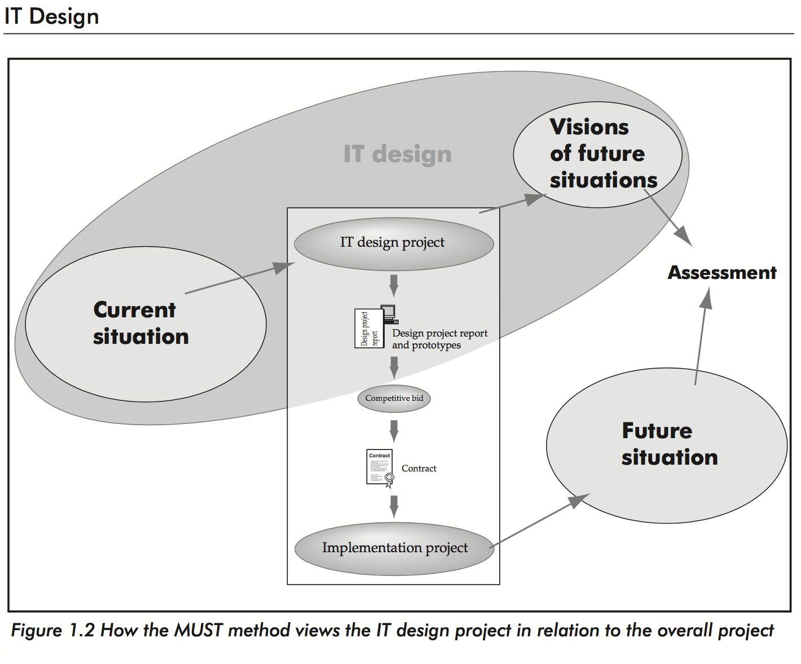
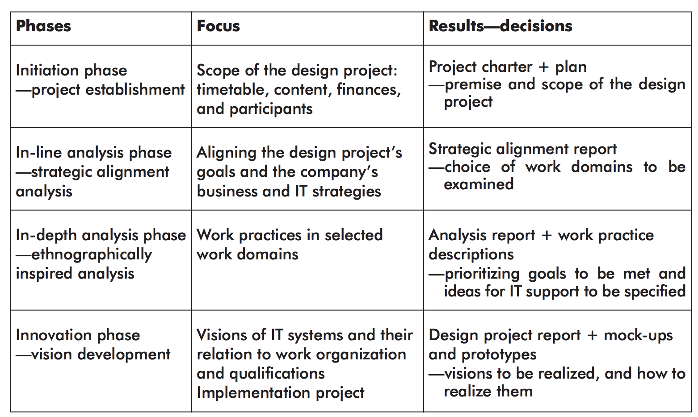
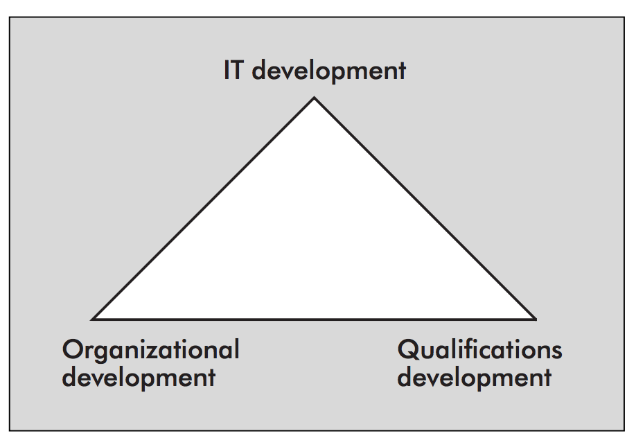
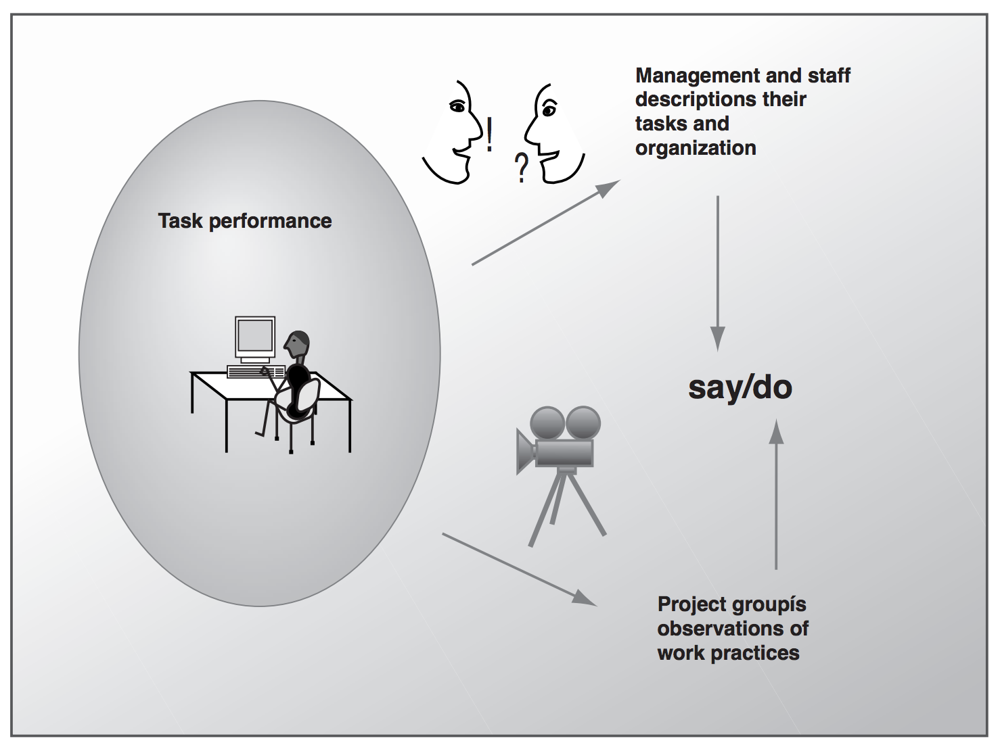

# IT Design

> Participatory IT Design, Chapter 1, 2

## What is IT Design

IT Design is inspired by the design traditions behind architecture. There, architects perform extensive study and design activities, forming the basis for a call for bids to choose a contractor for the construction.

The client's wishes and needs are analyzed, and the building's form and function are iterated upon over several iterations.

IT Design is similar; initial efforts of analysis and design form the basis for deciding which of the outlined visions for future IT usage best meet business goals and user needs for IT support in their work.

## IT Design Project

An IT Design Project is a project conducted at a company that reveals goals, defines problems, and indicates solutions, with the aim of designing sustainable uses of IT based on a specific problem within the company.

The IT design project produces a decision-making basis for the company regarding the potentials and opportunities for implementing IT usage that solve the problems.

The results of the design project provide a point of temperature for a subsequent call for tenders and an implementation of the design project's visions.

### IT Design Project as a TL;DR

Design projects identify problems, clarify goals and outline solutions.

### Parts of an IT Design project

In short, an IT Design Project will produce a foundation for deciding whether to undertake an implementation project or not.

A Design project involves:

- Analyzing the company's business and IT strategies.
- Analyzing the company's present goals, needs, and potentials.
- Designing one or more visions for overall change.
- Weighing the design visions in relation to the company's business and IT strategies in relation to different personnel groups, interdepartmental relations, and with regard to customers and suppliers.
- Setting down a strategy and plan for technical and organizational implementation, and **developing cost estimates** for implementing the visions.
- Guaranteeing continued feedback from the relevant actors.

### Why is an IT Design project conducted

Because:

- Management wishes to pursue certain business goals, or
- One or more groups within the company have a experienced a problem, or
- Somebody has a relatively clear idea of how a problem or new tass can be handled with the help of new uses of IT.

It is the design project's job to sort through the uncertainties of the current situation and show the best path forward.

### Result of an IT Design Project

The result is **a report, possibly supplemented by prototypes**.

This outlines **one or more coherent visions for change** in terms of technology, work organization, and required employee qualifications.

The report also includes an **evaluation of the *effects* of implementing the visions**, **a cost estimate**, along with a strategy and plan for implementing the visions.

**The report is the basis for a decision about an implementation project**. This is typically followed by a call for tenders and contract negotiations with the chosen supplier or suppliers that will be implementing the IT systems.

Indeed, the supplier may be the company's own internal IT department.

## An IT Designer

An IT Designer is a person with competencies in IT design projects and IT in general who, in cooperation with a company, plans and conducts a design project.

## The MUST method

The image above is a pretty good summary of MUST. It has four principles, four phases and primarily introduces the concepts *Vision*, *Phases* and *IT Usage*. It primarily use *Interviews*, *Observation* and *Workshops* as techniques for conduction work.

This is a method that views IT systems within the work organization context of which they will be part of. It considers what new qualifications will be required for users to contribute to desired changes. **And, it requires extensive participation of he people from the company**! This will be management and the future users of new IT systems, along with any internal IT designers who will be participating in the implementation.

The MUST method is skeptical of ready solution proposals! It requires that proposed changes are based on a firm knowledge of a company's existing organizational and work practices.

To accomplish this, MUST rests on *four* principles:

1. Coherent Vision.
2. Genuine User Participation.
3. Firsthand experience with work practices.
4. Anchoring Visions.

Using the MUST method, work is organized in phases.

The MUST method suggests a high level of user participation, emphasizing an anchoring with the relevant parties regarding the processing of the project group's intermediate and end products.

### MUST phases

The MUST method has four phases:

1. **Initiation**: Project establishment.
	- We must define and agree on *which problem* we will try to solve. We will produce an *overall plan* for *how* and *when*, including what each of us will contribute to the project.
2. **In-line analysis**: Strategic alignment analysis.
	- We will determine what is most *important* for the *organization*. We will clarify their strategies and goals and find out *how the defined problem and a possible IT-solution fits into it*. We will find out which work areas to focus on as well as how to measure whether or not the problem has been solved.
3. **In-depth analysis**: Ethnographically inspired analysis.
	- We will find out how they are doing it today and what they like/dislike about it. We will find out which requirements and needs they have, as well as which constraints there are. Do they have any wishes and/or ideas themselves? To keep/Not to keep?
4. **Innovation**: Vision development.
	- What can vi propose in terms of IT-systems and work areas, and which qualifications will it require of the users? How will it be rolled out and how much is it going to cost in terms of money and time? What are the advantages/disadvantages with each proposed solution, and what do we propose?

These are not iterative in the sense, that once you complete one phase, you move on to the next one. So it is more like the waterfall model.

**However**, you may have to go back and do a phase over if the decision-making foundation to which they contribute is found lacking!

### A MUST Phase

A *phase* is a collection of activities performed between two points in time, taking the design from one decision-making situation to the next.

### A MUST Activity

An *Activity* is a defined work process with a specific aim. An activity may be supported by technique and representation tools.

### A MUST technique

The techniques suggest ways of approaching the various activities of the phases.

### A MUST representation tool

The representation tools support the processing and presentation of knowledge contributed by the activities.

### Techniques and equivalent representation tools

|           Technique           |            Representation Tools            |
|-------------------------------|--------------------------------------------|
|        Baseline planning      |               Baseline plan                |
|            Review             |                 Summary                    |
|            Hearing            |                 Summary                    |
|           Interview           |                 Summary                    |
|       Document analysis       |                 Notes                      |
|      Functional analysis      |             Functional model               |
|         SWOT analysis         |        SWOT model Risk matrix           |
|          Observation          |                 Summary                    |
|  Thinking-aloud experiments   |                  Notes                     |
|           Workshops           |           Freehand drawing                                                            Collage                                                                     Dead Sea Scroll                                                             Affinity diagram                                                            Role list                                                                   Communication model                                                         Timeline                                                                    Design sketch                                                               Data model                       |
|       Future workshop         |      Open notes on big sheets of paper     |
|          Mapping              |     Diagnostic maps Virtual maps        |
|      Prompted reflection      |    Freehand drawing Notes Summary    |
|        Company visit          |                 Summary                    |
| Experimenting with prototypes |         Mock-ups Prototypes             |
|     Developing scenarios      |                 Scenario                   |

### Phases, their focus and results

## Common problems in IT projects (and why we need IT design)

Usually, IT projects exceed budget and timetable and/or are implemented without producing results that match the original intentions or solve the right problems.

Some things that benefit to this are:

- An unrealistic ambition level regarding the necessary organizational anchoring process or technical possibilities and limitation.

- The choice of technology is primarily guided by standalone technical solutions in identifying individual areas to be automated or supported.

- IT projects are undertaken as technical responses to problems that are basically organizational, without qualified interlocking of technical possibilities with organizational and human goals and needs.

- No systematic efforts are made to develop and anchor visions for overall change. There is a significant risk of the desired goals not being achieved when such visions are not anchored with management, with those who will be implementing the change, or with the users who will be working within the changed organization.

## Term: Standard system

A *standard system* is a system in the form of a product offered by a supplier to several customers (unlike a customized system, which is specially tailored to a customer). Standard systems may often be substantially modified and are sometimes referred to as generic systems. Standard systems can be adapted, for instance, by installing different preferences and parameters.

## Term: IT Usage

The term *IT Usage* is used rather than *IT systems* because an IT design project also needs to focus on the organization of the work which the IT systems will support and on the required user qualifications.

It is just a way to place focus on the users rather than on the system itself.

## Term: Vision

The result of a design project is one or more coherent visions for meeting the goals, needs, and potentials underlying a company's business and IT strategies. Visions describe future IT usage, including the IT systems' function, interfaces, ways of interaction, and technical platform. A vision also accounts for the work organization and required staff qualifications.

## How many resources such as time to invest in an IT Design Project

Typically one to six months and it involves resources corresponding to one to two man-months.

An IT Design project typically accounts for 1-5 percent of the total costs. It must be sufficiently comprehensive to develop knowledge that enables fundamental design decisions to be made before an implementation project begins.

## Uncertainty of IT Design Projects

This is due to four factors:

- **High complexity**: Many variables are not given in advance. They first need to be identified. And, **they are also often hard to isolate because they are interdependent**!

- **High mutability**: The problem is not clearly defined from the outset and **changes occur during the design process**. New requirements may emerge and new possible solutions appear.

- **High situation-dependency**: Although an IT design project may have features in common wih past projects, the project group always has to plan and manage the process **according to the specific conditions at hand**.

- **High risk of value conflicts**: Various parties involved in the IT design project, or those affected by its course and results, **often have conflicting interests**.

## Why IT Design is conducted prior to implementation

Well, because it is possible **and much cheaper** to remake decisions during the course of the design project rather than during the implementation project!

## Comparison between MUST and other methods

Compared to waterfall and evolutionary (e.g. iterative) models, MUST is designed to incorporate the best and avoid the worst aspects of these approaches (*hmm...*).

Prototyping approaches and waterfall models often doesn't concern themselves with clarifying the relations between the current project and business strategies as well as the relation to the work processes and organizational context in which the new IT system will operate.

These approaches are often isolated to the task at hand, presupposing that it has already been determined that the project is beneficial to the organization and will solve the problems it is put into the world to solve.

## Principles of the MUST Method

### Coherent Visions for Change

(Don't focus only on IT/Technology)

The point of this principle is to not focus solely on IT development and technology, but also take into account the required changes to work organization as well as the qualifications that users will need in order to perform their work using the new IT systems.

Ask yourself: How can I know what will work? IT aside, an organization is comprised of human beings.

Many times when using one of the other methodologies such as waterfall or agile, so much focus is placed on the IT side of things that when the new IT arrive, the expected improvements don't materialize because it isn't aligned with the users of the system.

Many IT project designers underplay or completely ignore this kind of problems due to their blind faith in technological progress.

In the final report, the decision-making foundation should consider the IT systems, the work organization, and the required qualifications.

**Coherent vision is especially important during the innovation phase**.

According to MUST, the most significant cause of failure of software systems is a lack of attention toward integrating IT systems and work organization.

Management may often be surprised by the need for staff training.

### Genuine User Participation (and Mutual Learning)

(have users contribute - and not just as informants, but actively, thoroughly participate).

Ask yourself: What do I need to learn?

It states that staff members who are directly affected **must actively participate in the project group's efforts**.

IT Designers need knowledge about the work environment that make up the design project's object field, and users need knowledge about technological options.

**It is all about mutual learning**.

Also, the users should have the right to influence their own working conditions which are often significantly affected by IT projects. It will definitely make them motivated and positive-minded regarding the IT project.

User participation increases the potential of visions produced by a design project to reflect the users' true situation and needs.

The degree to which user participation happens can vary wildly. Sometimes users may be involved only as informants. That is **not** what MUST refers to as genuine user participation. That's why MUST places "genuine" in front of user participation.

It is ultimately management who is responsible for allotting the time and information resources necessary for making user participation happen.

**During the initiation phase, it is decided which users will participate in the project group's work**.

MUST recommends two or three users as part of the project group. They should have knowledge of the involved work domains and professional respect among their co-workers.

They will participate **over the entire course of the design project**. This includes participation in project group meetings, information gathering and analysis, and possibly in developing the design project's products. They may even be assigned autonomous tasks!

In terms of mutual learning, the users have been selected because of their knowledge of the involved work domains. And, they often have experience with past reform measures which surely will be an asset.

### Firsthand Experience with Work Practices

This is when you experience the subject perform one or more tasks firsthand. Often you rely on information told to you by a current user, but sometimes it helps a lot when you observe someone directly to gain concrete experience with users' present work practices.

It is mainly realized by *Observation*, as the designers experience the work practice(s) they are in the process of changing.

**It is especially important to be aware of this principle during the in-depth analysis phase**!

It builds on the proposition that in order to understand any phenomenon, one needs to experience it firsthand.

There are three techniques to accomplish this:

- Observation
- In situ interviews
- Thinking-aloud experiments

All of them are followed by systematic analysis and presentation of the gathered information.

Sometimes, abstract measures are insufficient for testing the viability of an idea or a proposal. This is where firsthand work experience is great since it really validates/invalidates an idea right on.

#### The Say/Do Problem

The "Say/Do problem" highlights the difference between what people *say* they do, and what an outsider may observe them *actually doing*.

**In order to avoid or minimize say/do problems, it is important to alternate between information gathered with document analysis and interviews, on one hand, and by the techniques of observation, in situ interviews, and thinking-aloud experiments, on the other**.

#### Observation

Observation involves gaining firsthand experience of the area one wishes to understand.

It produces relevant and comprehensible descriptions that the observed subjects can evaluate. Thus, it must be based on their conceptuality.

Observation aims to describe, **not prescribe**. Accordingly, it is about *uncovering how things area really done* rather than how they *ought* to be done.

Observation is about studying and describing situations **from the perspective of the observed subjects**. The goal is to produce descriptions that document the work process as it is experienced by those involved, capturing their understanding of what works and what does not.

### Anchoring Visions

(Gaining support!)

This has to do with *informing* a target group about the design project's goals, visions and plans. Everyone not directly participating in the design project but who will be affected by the implementation (or will contribute to it) will be included.

This way, a common understanding of the results produced by the design project is obtained.

It's about "getting everyone on-board", especially those that are *not* part of the project group. This can be the end-users **but just as likely the steering committee or the people actually implementing the visions**!

It is not about "selling" the project groups solution proposals. It should be done throughout all phases of the project.

Just as importantly, the reasoning behind everything must be reported.

Thee simple anchoring rules:

1. The group *must* separate its suppositions (assumptions and hypotheses) from the information gathered! It must always be possible to trace back information to a source, whether it be audio, video or text.
2. The group needs to test its considerations and suppositions, not just its conclusions!
3. The group must give the design visions a usage-oriented perspective and visualize them in relation to usage situations.