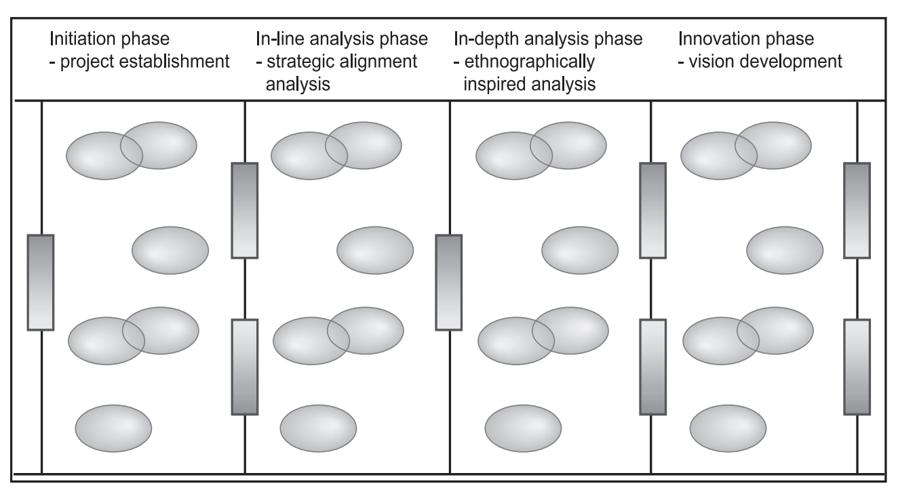
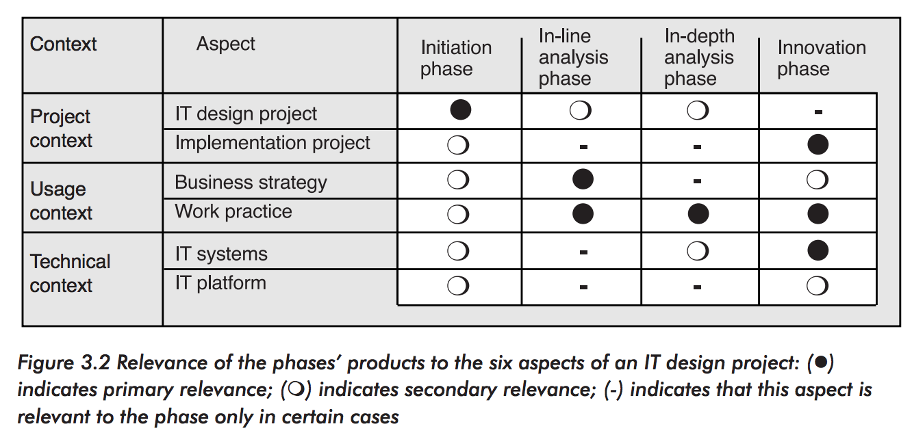
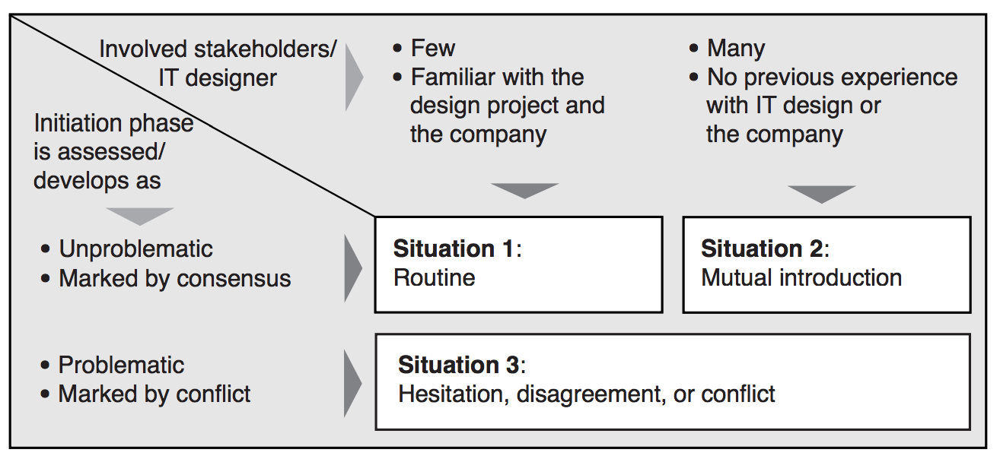
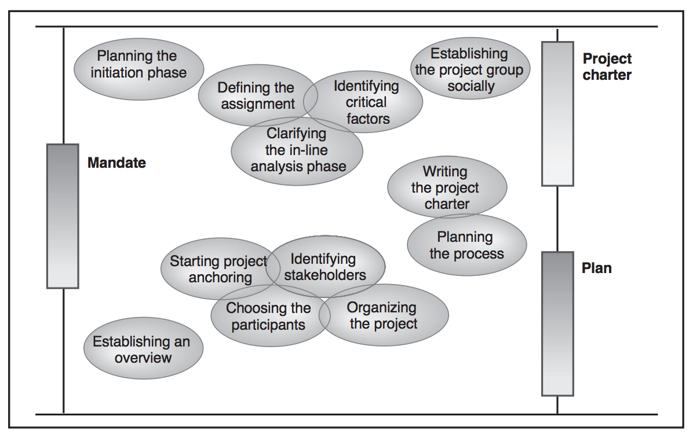
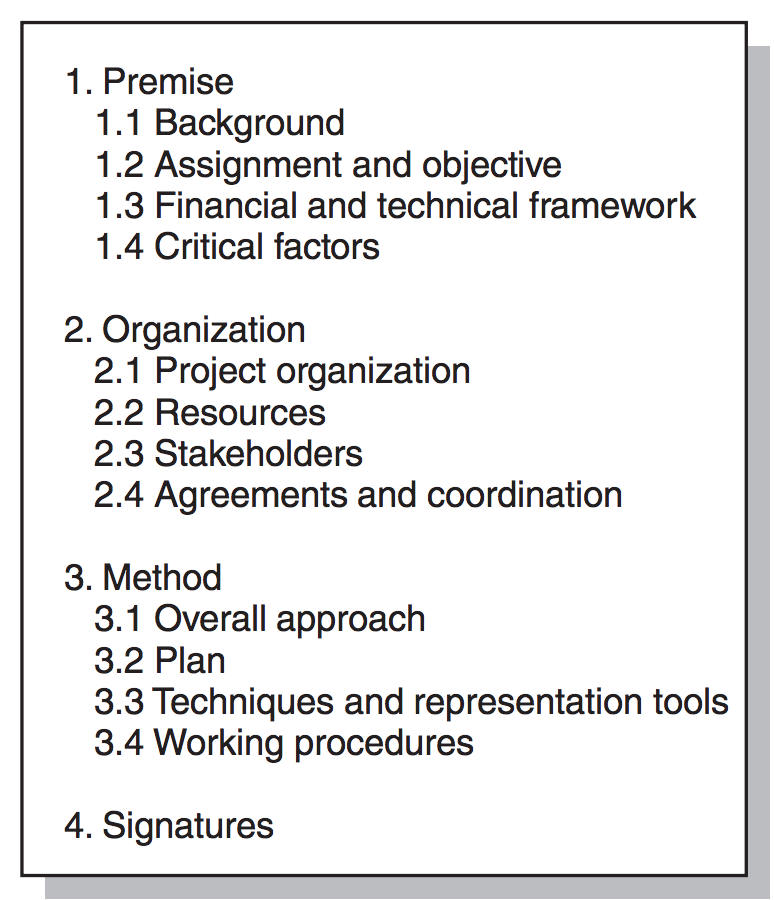

# IT Design

> Participatory IT Design, Chapter 3, 4 + section 9.1

## Baseline plan

The most important characteristics of a Baseline plan is:

- The design project moves chronologically from left to right.

- The design project is divided into four phases: Initiation, In-Line analysis, In-Depth analysis and Innovation

- A *phase* is **the period between two baselines**. The *baselines* are illustrated by **vertical lines**.

- A baseline **is a well-defined state in the course of a project**. This state is assessed by the planned intermediate and end products generated in the phase. These products are **represented by the boxes on the baselines**. **The products for phases 1-3 are sometimes called *intermediate products*, and the products for phase 4 are sometimes called *end products***.

- A baseline constitutes a decision-making point in the design project. The baseline's products constitute a foundation for the decisions that need to be made.

- Between the baselines, activities leading to a baseline's products are performed. **Activities are represented by oval balloons**. If activities are interrelated and performed in parallel or in extension of each other, **the relationship is shown by partially overlapping oval balloons**.

- A planned baseline has been achieved when the predefined criteria for its product have been met. The act of assessing whether a baseline has been achieved is not shown as an independent activity.

### A Baseline

A baseline constitutes a decision-making point in the design project.

As you can see from the illustration, the initial baseline (the left-most vertical line) comes at the very beginning before the initiation phase.

This baseline is based on a decision to carry out a design project that is set down in a mandate.

#### Products of Initiation phase

**It produces a *project charter* and a *plan* for the design project**.

These two intermediate products support decisions about the premise and scope of a design project, including factors as time, content, financing, and participants.

#### Products of In-Line Analysis phase

The In-Line analysis phase produces a *strategic alignment report*. This intermediate product supports clarification of the relation of the design project's objective to the company's business and IT strategies, as well as to other ongoing IT projects. Moreover, the report supports a decision about what work domains should be the focus of the future course of the design project.

#### Products of In-Depth Analysis phase

The In-Depth analysis phase produces an *analysis report*. This intermediate product supports a decision about which goals, problems, and needs to prioritize, as well as what ideas for IT support need to be designed in greater detail.

The analysis report may be supplemented by descriptions of work practices in the work domains studied.

#### Products of Innovation phase

The innovation phase produces a *final design project report*. This end product supports a decision about what design visions to realize and how to realize them.

The design project report may be supplemented by mock-ups and prototypes.

### Context

IT Design and Systems Development take place within what the book defines as the *project context*.

An IT designer's job in a design project is to produce intermediate and end products addressing the *project context*, *the usage context* and the *technical context*.

#### Project Context

This is the context for the entire project.

The *Project context* concerns the IT project as a temporal process - it runs for a constrained period of time.

The project context is divided into two aspects:

- The design project
- The implementation project

And it involves a wide network of actors from various departments (hopefully).

#### Usage Context

The *Usage context* involves the organizational context of the business context.

It is divided into two aspects:

- **Business Strategy**: A coherent vision must be viewed within the context of the business strategy that IT usage will support. It represents a company's overall business goals and its plans for meeting them.
- **Work practice**: An IT system constituting the technical component of a coherent vision should be viewed in the context of the work practice of its planned use. E.g. how it fits into the users' daily tasks and tools.

#### Technical Context

The *Technical context* involves **integrating the envisioned IT system(s) with the company's existing technical framework**.

The technical context is divided into two aspects:

- **IT-systems**: An IT system that is part of a proposed vision should be viewed in the context of existing IT systems and the company's business-based IT strategy
- **IT-platforms**: An IT system should be viewed in the context of the company's technical IT strategy in which they will function.

## Six aspects of an IT Design Project

They are:

- IT Design Project       *(Project Context)*
- Implementation Project  *(Project Context)*
- Business Strategy       *(Usage Context)*
- Work Practice           *(Usage Context)*
- IT Systems              *(Technical Context)*
- IT Platform             *(Technical Context)*

### IT Strategy

The company's usage of IT for achieving its business strategy. The IT strategy can be divided into a business-based IT strategy (focus on products) and a technical IT strategy (focus on tools):

#### Business-based IT strategy

(Product-focused)

This sets goals for and chooses and prioritizes among projected IT systems. It is often represented as a portfolio or product suite of projected IT systems. For example, *"we'll build software for project management"*.

#### Technical IT strategy

(Tool-focused)

This sets goals for and chooses and prioritizes among platforms of *hardware*, *networks*, *operating systems* and *development environments*.

For example, *"we'll use git"*.

## Initiation Phase - Project Establishment

This phase involves **clarifying and agreeing on the scope of the design project**.

What will the assignment involve? What conditions apply to solving it? How should the project group approach the assignment?

This is where the project group and steering committee meet and agree on issues such as objective, level of ambition, financial and technical constraints, project management and steering.

Whatever comes out of these meetings should be written down in a *project charter* which is a specification of the design project's premise, as well as a plan for carrying out the design project.

### What comes before initiation

It may come in various ways. It may be an initiative from management, it may come from a single person or department or it may be caused by a preceding activity such as an evaluation of the company's other initiatives, projects or strategic concerns.

**The reason for undertaking a design project is always the result of someone designating a goal, expressing a need, or experiencing a problem regarding IT, or the emergence of new ideas for IT systems or usages**.

### Objective of the Initiation Phase

The Objective is to clarify and foster a commitment for the premise and conditions of the design project in which resources will be invested. **This is what goes into the project charter**

It includes six elements:

- Clarifying the design project's level of ambition and financial/technical constraints. How much are we going to invest in this?
- Specifying the assignment that the design project as a whole will solve. Exactly what are we solving (and what are we *not* solving)?
- Organizing the project. Who does what? What is the relationship between the project group and its stakeholders?
- Planning *how* to conduct the project within the given scope. Which phases will be undertaken and when, which activities, techniques and representation tools will be used, etc.
- Increasing the understanding of the premise for all involved parties.
- Finally, writing a project charter that includes these agreements as well as a writing a plan for the design project.

### Motivation for the Initiation Phase

It pays to have clear agreements and understanding of project scope and constraints in advance!

Launching a project on loosely defined terms may quickly give rise to misunderstandings and can ultimately break a project down.

When it comes to design projects involving user participation, as it is with MUST, thorough preparation is especially relevant since it requires openness and dialogue about the premise and objective of the project.

### The Initiation TL;DR

- Initiation makes for a realistic premise
- It clarifies uncertainties and risks in the project
- It provides fixed points for steering the further course of the project
- It bolsters the project group's internal chemistry, forging team spirit and consensus about the design project's goals.
- It clarifies the division of labor between the project group and its stakeholders.
- The project charter promotes shared understanding of the scope of the project and provides a basis for clarifying potential internal and external conflicts.
- Initiation does not consume a lot of resources, and the resources it does consume are quickly made back.

**The Project Charter documents the premsie and scope of the entire project. The plan (for example a Baseline plan) describes what happens when**.

### Potential conflicts leading into Initiation

If situation 3 in the illustration above occurs, in which case there is a conflict, the initiation phase can be supplemented by interviews with the various stakeholders, freehand drawings focusing on disagreements and conflicts, or analyses and presentations of different stakeholder perspectives by diagnostic or virtual mapping techniques.

Basically, the book goes into great detail here with how you have to be socially sensitive.

## Possible Initiation Phase Activities

### Planning

The first thing is to plan for being able to write a project charter and a plan for the entire design project.

**Generally, planning is done with a baseline plan**. A baseline plan is great for getting an overview of the entire design project as well as which activities will happen when.

The image above is itself a baseline plan illustrating the potential activities of the initiation phase. Notice how it results in a *Project Charter* as well as a *Plan*.

### Defining the Assignment

Defining the assignment means:

- Clarifying *why* particular problems need to be solved
- *What* is involved (without going into great detail).

**It is crucial to be critical toward management's own definitions of problems and solution proposals**. They will often have detailed ideas for the IT systems they need. But more often than not, during the course of an IT design project, it becomes clear that the staff's initial ideas haven't been sufficiently analyzed.

**It is the IT designers who are responsible for critically examining such existing interpretations of problems and solution proposals - and the initiation phase provides the first opportunity to challenge and assess them**.

### Identifying Critical Factors

Critical factors are **risky conditions**.

There are two types:

- **Critical success factors**: Conditions and goals for the assignment that are requirements for success.
- **Critical preconditions**: Fundamental premises for the project that, if negatively affected or eliminated, put the project in a difficult situation. A good example of this is resources! We need time and money. And, we need to have management and staff onboard!

IT designers should identify and closely monitor critical factors.

The IT team can refer to these critical factors if disagreement, conflict, or problems occur among the stakeholders.

**SWOT Analysis can be used to identify critical factors**.

### Clarifying the In-Line Analysis Phase

This is also where the scope and nature of the In-Line analysis phase should be clarified!

That could vary involve as little as a single meeting (during the Initiation phase, even) or it may be a far larger task.

If it is clear what the company's business strategy is and it the design project's objective can be defined and linked to the overall strategy very clearly, the In-Line phase may be short.

**Generally, the more uncertainty involved, the greater the need for the In-Line phase**.

### Organizing the Project

This has to do with: *"Who does what?"*.

Most likely, there will be a *project manager*, leading the project team, and a *chairman* for the steering committee.

### Choosing the Participants

We obviously need someone to conduct the IT design project.

There are four categories:

- IT Designers
- Users
- Management
- Other stakeholders

It would be great if part of the steering committee is the head(s) of the affected department(s).

The users shouldn't be selected randomly. They should:

- Possess a good overview of the involved work domain.
- Enjoy broad respect and confidence among their co-workers.
- Be committed to the project. (both in terms of allotted time and motivation).
- Shouldn't be technology freaks - but not technophobes either.

If management doesn't take this seriously by excusing them from their day-to-day routines in order to support the project, no genuine user participation is achieved or it will leave to great amounts of overtime.

### Identifying Stakeholders

Stakeholders **are individuals and groups of people (organizational units, customers, suppliers, strategic partners, etc)**.

**Someone who have an interest in the design project's progress and results, or for whom the project group has a particular need**.

A stakeholder *may* have official or more hidden interests to maintain by the design project and, accordingly, may want to keep tabs on the project and be able to influence its progress and results (lobbyists, essentially).

Examples of potential stakeholders could be:

- Indirect users of IT systems
- System administrators and other IT managers
- People in charge of the technical and organizational implementation of the IT project
- Interest and Trade organizations
- Departments and projects within the company
- Trade groups within the company
- Suppliers and strategic partners
- Customers

Identifying stakeholders is the key to understanding:

- Who will be affected by the envisioned IT systems?
- What are their interests in the design project?
- On whom does the project group depend? What services and products require outside supply?

### Contents of the Project Charter

At a minimum, it should:

- Name all stakeholders and their interests in the design project.
- Specify the project group's needs and requirements.
- Documentation of the relation between stakeholders and the design project. This *may* include:
  - How to communicate
  - Who participates
  - The approval process of intermediate products

An example of its contents *could* be:

**The Project Charter is written by the project group and approved by the steering committee**.

### Contents of the plan

The plan can be entirely presented in the Project Charter or briefly described in it, but there is no doubt that it is one of the two main products of the Initiation Phase.

The plan **should visualize and review the planned design project**. **Baseline planning is the recommended planning technique**!

## Baseline Planning

The actual technique of developing a baseline plan has four steps:

1. Draw a baseline for each respective starting situation and desired end situation. Write an *acceptance criteria* for each desired end product (denoted *Kn*, for example: *"P1: Testing in a realistic setting"*) as well as a starting state (denoted *Pn*, for example: *"K1: Project group accepts the mandate"*).
2. Plot three baselines in between the first two baselines representing the beginning and end of the project.
3. For each phase, activities for taking the project from one baseline to the next are now designated, along with techniques and tools for performing these activities.
4. The amount of time for activities planned each baseline is estimated **and corresponding dates are added to the baselines**. Finally, **the completion date is checked against any possible specification in the project group's mandate**.

