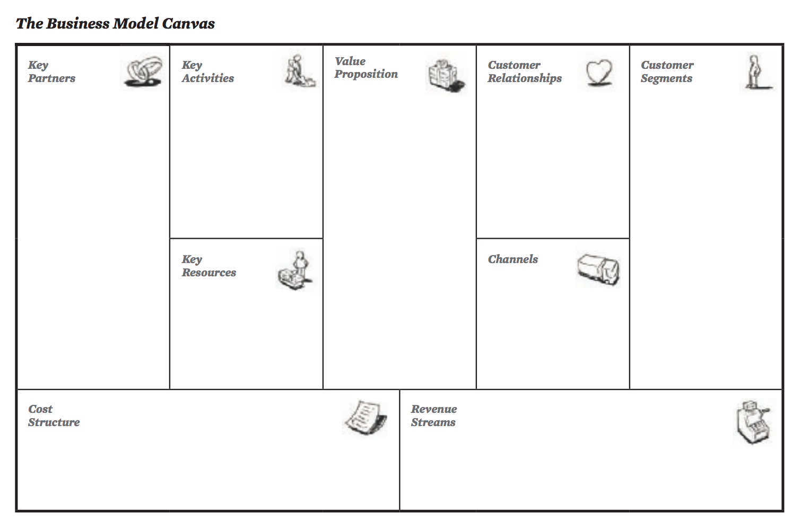
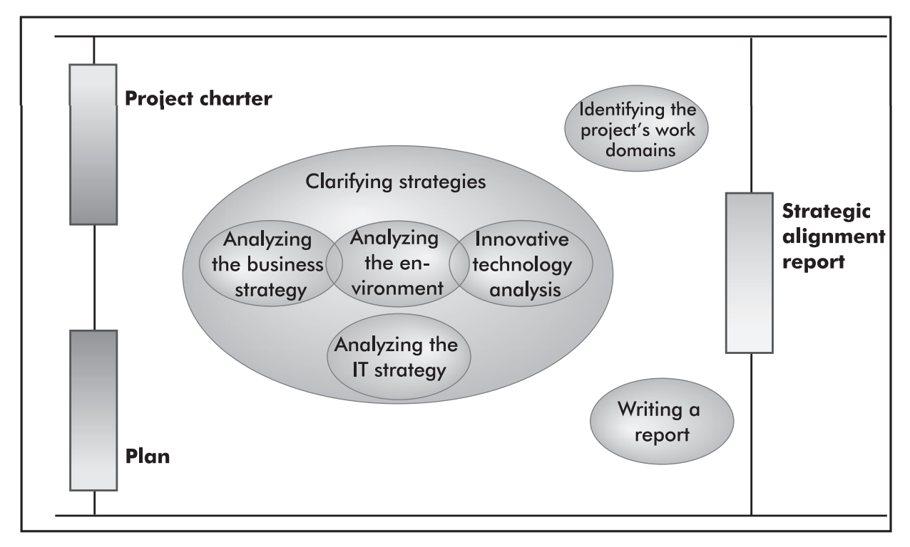
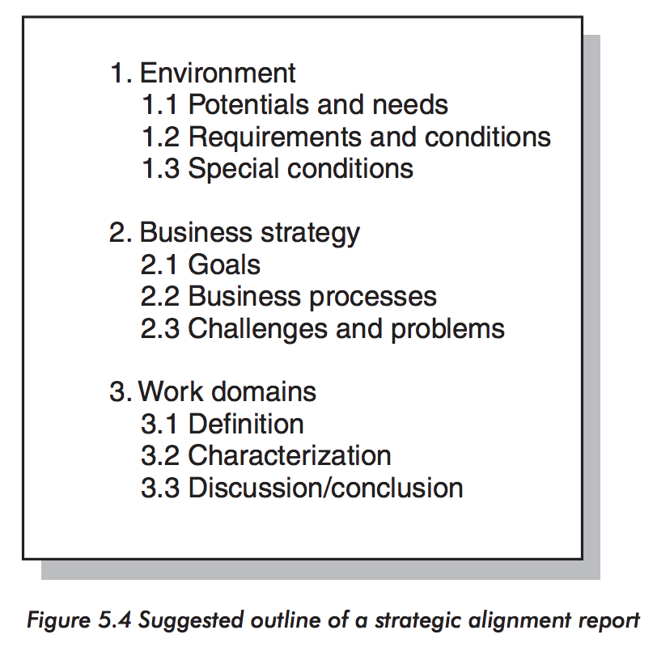

# Business Model Canvas

> Business Model Generation Chapter 1
>
> Participatory IT Design, Chapter 5

This is a shared language for describing, visualizing, assessing, and changing business models.

## Business Model

A Business model describes the rationale of how an organization *creates, delivers, and captures value*.

### Business Model Terms

#### Term: Customer Segments

(*For whom are we creating value? Who are our most important customers?*)

An organization serves one or several Customer Segments

#### Term: Value Propositions

(*What value do we deliver to the customer? Which one of our customer's problems are we helping to solve? Which customer needs are we satisfying? What bundles of products and services are we offering to each Customer Segment*)

It seeks to solve customer problems and satisfy customer needs with value propositions

#### Term: Channels

(*Through which Channels do our Customer Segments want to be reached? How are we reaching them now? How are our Channels integrated? Which ones work best? Which ones are most cost-efficient? How are we integrating them with customer routines?*)

Value propositions are delivered to customers through communication, distribution, and sales Channels

#### Term: Customer Relationships

(*What type of relationship does each of our Customer Segments expect us to establish and maintain with them? Which ones have we established? How costly are they? How are they integrated with the rest of our business model?*)

Customer relationships are established and maintained with each Customer Segment.

#### Term: Revenue Streams

(*For what value are our customers really willing to pay? For what to they currently pay? How are they currently paying? How would they prefer to pay? How much does each Revenue Stream contribute to overall revenues?*)

Revenue Streams result from value propositions successfully offered to customers.

#### Term: Key Resources

(*What Key Resources do our Value Propositions require? Our Distribution Channels? Customer Relationships? Revenue Streams?*)

Key resources are the assets required to offer and deliver the previously described elements...

#### Term: Key Activities

(*What Key Activities do our Value Propositions require? Our Distribution Channels? Customer Relationships? Revenue Streams?*)

...by performing a number of Key Activities

#### Term: Key Partnerships

(*Who are our Key Partners? Who are our key suppliers? Which Key Resources are we acquiring from partners? Which Key Activities do partners perform?*)

Some activities are outsourced and some resources are acquired outside the enterprise.

#### Term: Cost Structure

(*What are the most important costs inherent in our business model? Which Key Resources are most expensive? Which Key Activities are most expensive?*)

The business model elements result in the cost structure.

### Customer Segments

(*For whom are we creating value? Who are our most important customers?*)

**Customer Segments are the different groups of people or organizations an enterprise aims to reach and serve**.

A business model may define or or several large or small Customer Segments. An organization must make a conscious decision about which segments to serve **and which segments to ignore**.

#### How to split customers into sections

Customers should be split into separate groups if:

- Their needs require and justify a distinct offer.
- They are reached through different Distribution Channels
- They require different types of relationships
- They have substantially different profitabilities.
- They are willing to pay for different aspects of the offer.

#### Examples of Customer Segments

A Business Model can have different Customer Segments. They may have segmented Customer Segments, or they may have a single one such as a Mass Market or a Niche Market.

- Mass Market
- Niche Market
- Segmented
- Diversified
- Multi-sided platforms/markets

##### Mass Market

This is one large group of customers with broadly similar needs and problems. For example, in the consumer electronics sector, this is typically the most important customer.

##### Niche Market

This a specific, specialized Customer Segment. Value Propositions, Distribution Channels and Customer Relationships are all tailored to the specific requirements of a niche market.

We often find such customer segment in *supplier-buyer* relationships. For example, many car part manufacturers depend heavily on purchases from major automobile manufacturers.

##### Segmented

This is where multiple similar market segments are included, with different needs and problems. A bank, for example, may distinguish between large groups of low-income and high-income customers respectively. **Their needs and problems are similar, but varying**.

##### Diversified

This is where multiple unrelated market segments with **very different needs and problems** are served.

#### Multi-sided platforms/markets

This is where two or more **interdependent Customer Segments** are served. For example, a credit card company (VISA) needs a large base of credit card *holders* and a large base of *merchants* who accept those credit cards.

And, a free newspaper needs a large *reader* base as well as *advertisers* who are willing to place their ads in the paper.

So, this is a "Chicken or the egg" type situation where you need both. Pretty hard to do.

### Value Propositions

(*What value do we deliver to the customer? Which one of our customer's problems are we helping to solve? Which customer needs are we satisfying? What bundles of products and services are we offering to each Customer Segment*)

**Focus on Benefits versus features!!**.

**Think *Why-Why-Why**.

**Value Propositions are the products and services that create value for a specific Customer Segment**.

Some Value Propositions may be innovative and represent a new or disruptive offer while others may be similar to existing market offers, but wth added features and attributes.

#### Examples of elements that could be part of a Value Proposition

##### Newness

Some Value Propositions satisfy **an entirely new set of needs that customers previously didn't perceive because there was no similar offering**. The iPhone is a prime example of this.

##### Performance

Improving product or service performance has traditionally been a common way to create value. It gets increasingly more difficult, so you often have to combine this with other value propositions.

##### Customization

Tailoring products and services to the specific needs of **the individual customer** creates value.

##### "Getting the job done"

Sometimes, you are one of the only ones who *can* perform a job. In that case, it is an immensely strong value proposition. If you are the only one who can create quantum computers, you are the only one to call!

##### Design

A product may stand out because of superior design. For example, in the fashion industry and increasingly in the consumer electronics industry, design is a major factor!

##### Brand/status

Wearing a Rolex watch signifies wealth. On the other hand, wearing the latest "underground" brands may also be a status symbol.

##### Price

This one is easy. If you are cheaper than the competition, especially if your product is competitive, this is a major value proposition.

##### Cost reduction

Helping customers reduce cost is an important way to create value.

##### Risk reduction

Customers value reducing the risks they incur when purchasing products or services. For example, if you sell used cars, a one-year service guarantee reduces the risk of post-purchase breakdowns and repairs. An SLA guarantee partially reduces the risk undertaken by a purchaser of outsourced IT services.

##### Accessibility

Making products and services available to customers who previously had no access to them is a way to create value.

##### Convenience/Usability

If something that has traditionally been cumbersome becomes easier to do, this can create substantial value. For example, iTunes back in the days when you bought a physical CD or Netflix which disrupted services such as Blockbuster.

### (Distribution) Channels

This is how a company communicates with and reaches its Customer Segments to *deliver* a Value Proposition.

**It is essentially the company's interface with customers**.

#### Functions of channels

(*Through which Channels do our Customer Segments want to be reached? How are we reaching them now? How are our Channels integrated? Which ones work best? Which ones are most cost-efficient? How are we integrating them with customer routines?*)

- Raising awareness among customers about a company's products and services.
- Helping customers evaluate a company's Value Proposition.
  - For example, a Whitepaper.
- Allowing customers to purchase specific products and services.
  - For example, An online store
- Delivering a Value Proposition to customers.
  - The supply chain. Or in terms of a SaSS company, the app and the service sit provides.
- Providing post-purchase customer support.

#### Direct vs Indirect Channels

The trick is to find the right balance between these types of channels and integrate them in a way that creates a great customer experience (and maximizes revenue).

##### Direct Channels

Direct channels could be an in-house sales force or a Website.

Owned channels and especially direct channels have higher margins but can be costly to put in place and operate!

##### Indirect Channels

Indirect channels could be retail stores owned or operated by the organization.

Partner channels are indirect and span a whole range of options, such as wholesale distribution, retail or partner-owned web sites.

These lead to lower margins, but they allow an organization to expand its reach and benefit from partner strength.

#### Channel Phases

There are five:

1. **Awareness**: How do we raise awareness about or company's products and services?
2. **Evaluation**: How do we help customers evaluate our organization's Value Proposition?
3. **Purchase**: How do we allow customers to purchase specific products and services?
4. **Delivery**: How do we deliver a Value Proposition to customers?
5. **After sales**: How do we provide post-purchase customer support?

### Customer Relationships

(*What type of relationship does each of our Customer Segments expect us to establish and maintain with them? Which ones have we established? How costly are they? How are they integrated with the rest of our business model?*)

This describes the types of relationships a company establishes with specific Customer Segments.

Such relationships can be driven by the motivations:

- Customer acquisition
- Customer retention
- Boosting sales (upselling)

#### Categories of Customer Relationships

##### Personal Assistance

This is based on Human Interaction. The customer can communicate with a real representative of the company to get help during the sales process or after the purchase is complete. For example, through a call center or by e-mail.

##### Dedicated Personal Assistance

The stuff key account managers do. Here, a customer representative is dedicated to an individual client.

This represents the deepest and most intimate type of relationship and normally develops over a long period of time.

Typically, this is found when a company deals with a VIP customer.

##### Self-service

In this type of relationship, the company maintains no direct relationship with customers, but rather provide all necessary means for customers to help themselves through a self-service panel.

##### Automated services

This could be a chatbot or something that simulates a personal relationship in another way such as a list of recommended items based on the customers previous actions or purchases.

##### Communities

Many companies maintain online communities that allow users to exchange knowledge and solve each others problems.

##### Co-creation

Essentially user-generated content such as reviews. Or, on YouTube, you can create content in the form of videos. You can even become a YouTube partner.

### Revenue Streams

These represent the cash a company generates from each Customer Segment. Costs must be subtracted from revenue to create *earnings*.

If customers comprise the heart of a business model, Revenue Streams are its arteries. It cannot live without neither.

#### Different types of Revenue Streams

(*For what value are our customers really willing to pay? For what to they currently pay? How are they currently paying? How would they prefer to pay? How much does each Revenue Stream contribute to overall revenues?*)

1. **Transaction revenues** resulting from **one-time** customer payments
2. **Recurring revenues** resulting from **ongoing** payments to either deliver a Value Proposition to customers or provide post-purchase customer support.

#### Different ways to generate Revenue Streams

##### Asset sale

By simply selling the ownership rights to a physical product. You know, old-fashioned sales! For example, selling a book, music, consumer electronics, etc.

##### Usage fee

This is generated by the use of a particular service. For example, charging customers for the number of minutes spent on a phone. Or a hotel charging for the amount of nights rooms are used.

##### Subscription fees

This is generated by selling **continuous access to a service**. For example, a gym membership. Or a WoW membership. SaSS companies are prime examples of this.

##### Lending/Renting/Leasing

This is generated by **temporarily granting someone the exclusive right to use a particular asset for a fixed period in return for a fee**.

##### Licensing

This is generated by giving customers permission to use **protected intellectual property in exchange for licensing fees**. For example, patent holders grant other companies the right to use a patented technology in return for a license fee.

##### Brokerage fees

This derives from intermediation services performed on behalf of two or more parties.

For example, credit card providers earn revenues by taking a percentage of the value of each sales transaction executed between credit card merchants and customers. Brokers and real estate agents earn a commission each time they successfully match a buyer and seller.

##### Advertising

This Revenue Stream results from fees for advertising a particular product, service, or brand. We see this on Facebook, Google, Youtube, online news sites, etc., but also in the analogue world in free newspapers, TV networks, etc.

#### Pricing Mechanisms

There are two main types of pricing:

- Fixed pricing
- Dynamic pricing

#### Fixed Pricing

This is predefined prices based on static variables:

- **List price**: Fixed prices for individual products, services or other Value Propositions.
- **Product feature dependent**: Price depends *on the number or quality* of Value Proposition features
- **Customer segment dependent**: Price depends on the type and characteristic of a Customer Segment.
- **Volume dependent**: Price as a function of the quantity purchased.

#### Dynamic Pricing

Prices change based on market conditions:

- **Negotiation (bargaining)**: Price is negotiated between two or more partners depending on negotiation power and/or negotiation skills.
- **Yield management**: Price depends on inventory and time of purchase. For example, if you an airline wants to sell some remaining tickets for a flight, it may reduce the price to increase the probability of selling those seats.
- **Real-time-market**: Price is established dynamically based on supply and demand (stock exchanges).
- **Auctions**: Price is determined by outcome of competitive bidding.

### Key Resources

(*What Key Resources do our Value Propositions require? Our Distribution Channels? Customer Relationships? Revenue Streams?*)

This is what allows an enterprise to create and offer a Value Proposition, reach markets, maintain relationships and ultimately earn revenues.

The needed key resources depend greatly on the type of business model: A microchip manufacturer requires capital-intensive production facilities while a microchip designer focuses more on human resources.

#### Kinds of Key Resources

They can be:

- Physical
- Financial
- Intellectual
- Human

Key Resources can be owned or leased by the company or acquired from key partners.

##### Physical Key Resources

This includes physical assets such as manufacturing facilities, buildings, vehicles, machines, etc.

If you are a retailer like Wal-Mart, you really care about buildings where you can store the wares as well as machines to transport and package them.

##### Intellectual Key Resources

This could be brands, proprietary knowledge, patens, copyrights, partnerships and customer databases. Basically, knowledge!

For example, a resource could be a huge database of customer information. Proprietary software, developed over many years is an intellectual key resource too.

##### Human Key Resources

Every enterprise requires Human Resources (for now, muhahaha 😃).
In some business models, people are more important than others.

In creative- or knowledge-intensive industries, they are especially important.

##### Financial Key Resources

In some business models, financial resources are needed, for example a stock option pool for hiring key employees.

### Key Activities

(*What Key Activities do our Value Propositions require? Our Distribution Channels? Customer Relationships? Revenue Streams?*)

These describe the most important things a company must do to make its business model work!

Like Key Resources, they are required to actually create and offer a Value Proposition. You can have the best machine in the world, but if its not running, it isn't creating value!

#### Categories of Key Activities

##### Production

Actually designing, making and delivering a product in substantial quantities and/or of superior quality. This dominates the business models of manufacturing firms.

##### Problem Solving

Coming up with new solutions to individual customer problems. So, sitting down and thinking/discussing/prototyping. Everything that comes before production, basically.

##### Platform/Network

This has to do with platform management, service provisioning and platform promotion. If you have a platform such as ebay.com.

### Key Partnerships

This is the network of suppliers and partners that make the business model work.

#### Types of partnerships

(*Who are our Key Partners? Who are our key suppliers? Which Key Resources are we acquiring from partners? Which Key Activities do partners perform?*)

There are four:

- Strategic alliances between non-competitors.
- Coopetition: Strategic partnerships between competitors (Apple and Samsung for example).
- Joint ventures to develop new businesses.
- Buyer-supplier relationships to assure reliable supplies.

#### Why have partnerships

- **Optimization and economy of scale**: It probably optimizes the allocation of resources and activities to have a buyer-supplier relationship rather than the company trying to perform **every** activity by itself.

- **Reduction of risk and uncertainty**: Partnerships between possibly competing companies can help reducing risk. That just means more resources into the project! For example, Blu-Ray was a joint venture between multiple competing consumer electronics manufacturers.

- **Acquisition of particular resources and activities**: Rather than *owning* the resources that can perform activities, they can *buy* the activities of someone who has the key resources to perform them. For example, a phone company can buy one of their partners to build it.

### Cost Structure

(*What are the most important costs inherent in our business model? Which Key Resources are most expensive? Which Key Activities are most expensive?*)

Creating an delivering value, as well as maintaining Customer Relationships and generating revenue stream **all has cost!**

Thus, you have to decide how you are going to structure the costs of your company and how it plays together with your business model.

You always want to minimize costs, but low costs are more important in some business models than others.

#### Types of Cost Structures

The two most important are:

- Cost-driven
- Value-driven.

##### Cost-driven Cost Structure

Here, it's all about minimizing costs wherever possible. This means low price Value Propositions, maximum automation and extensive outsourcing.

For example, EasyJet or Ryanair are examples of such companies.

##### Value-driven Cost Structure

If a company is less concerned with the cost implications of a particular business model design and instead focus on value creation, they are value-driven. For example, luxury hotels falls into this category.

## Business Model Canvas - Visualized

Here it is!

## In-Line Analysis Phase

In the In-Line phase, the project group clarifies and adjusts the design project's goals **according to the company's business and IT strategies**, in order to **identify work domains for the design project to study as candidates for IT support**.

As a result, the work domains where IT system(s) will be used are selected!

This phase is largely conducted in dialogue with the company's management.

### Objective of the In-Line Analysis Phase

The project manager assumes responsibility for clarifying and adjusting the design project's objective in terms of the company's business and IT strategies, in order to **identify what work domains to focus on in the in-depth analysis phase**.

It is NOT intended to further develop business- or IT strategies but rather to clarify *existing* strategies and **critically examining the planned IT usage for advancing those strategies**.

If the company has no IT strategy - they probably don't - the project manager may encourage the development of one.

In list form, the objectives are:

- Identifying and clarifying the company's overall situation, environment, and business strategy.

- Clarifying the company's *possible* IT strategy, especially concerning the choices and priorities of this strategy in terms of planned IT usage.

- Clarifying how management and other involved parties understand the alignment of the company's IT usage and overall business strategy.

- Ensuring that the scope of the design project's IT usage harmonizes with the company's business and IT strategies - and if not, being prepared to critique the goals of the project.

- Identifying the work domains upon which the in-depth analysis should focus.

### Motivation for the In-Line analysis phase

(Apparently), it shouldn't be up to the top management to identify IT projects to match the company's business and IT strategies.

That responsibility must be shared by the managers of the design project and the subsequent implementation.

That way, **the design project avoids recommending the prioritization of the wrong solutions for the present situation**.

### The In-Line Analysis Phase TL;DR

- This is where we select the work domain(s) to focus on.
- This is where we analyze the company's business- and IT-strategy. Otherwise, we don't have any rationale for selecting one or more work domains.
- This is where we analyze the environment.
- It may be part of the Initiation phase, typically if the business model and IT-strategy is well-known already and it is quite obvious which work areas to focus on. In that case, it can be as little as a meeting. It may even be completely irrelevant, in which case it can be omitted entirely.
- This is where we write a Strategic alignment report, the product of the In-Line analysis phase.

## Possible Activities in the In-Line Analysis Phase

### Analyzing the environment

The environment includes factors such as:

- The company's general market situation
- Legislation that affects the company and its products/services.
- Customers
- Suppliers
- Competitors
- Familiar and new technologies

#### Techniques for analyzing the environment

- Document Analysis
- Interviews with environmental representatives
- SWOT analysis
- Function analysis

### Analyzing the Business Strategy

Also called a *top-down analysis*. First, the company's business strategy is analysed. From this, types of IT usage are located that can serve to realize and strengthen the business strategy.

The business strategy is considered in relation to the environment and its internal conditions.

**The analysis primarily involves document analysis of descriptions of the company's business strategy**. And, meetings and interviews with the company's management. You can throw some SWOT and functional analysis in there if you want to. But remember, there are children dying in Africa while you're at it.

### Analyzing the IT strategy

In many modern companies, the IT strategy can be seen as a result of analyzing the business strategy. For example, a business-based IT strategy may include some products-to-build, and hopefully the company has decided to build those based on that very business strategy.

Basically, analyzing the IT strategy is just comparing it with the Business Strategy and deciding if the two are aligned.

### Strategic Analysis

In this context, a Strategic Analysis focuses on how a given business strategy can be supported by IT.

### Innovative Technology Analysis

This examines how new technological potentials (*"VR is the golden weapon!"*) can radically impact (*"disrupt!!"*) and alter the business strategy, possibly creating whole new business ventures (*"Let's pivot!!"*).

This is basically an analysis where you try pack as many buzzwords into a section of text as possible. The more buzzwords you cram in, the more points you get by your CTO (who wrote some Java when he was in college but went on to study International Business. He recently stumbled upon the word *Disruption* and talks about it non-stop, even though he's several years late to the party by now).

### Writing a Strategic Alignment Report

This is the result of the In-Line analysis phase and is the foundation for decision making.

It will be the basis upon which work domains are selected and prioritized.

## Why-Why-Why

If we keep asking *Why*? We will eventually arrive at a feeling or a need that must be addressed (e.g., a benefit).

**We use it to translate features to benefits**.