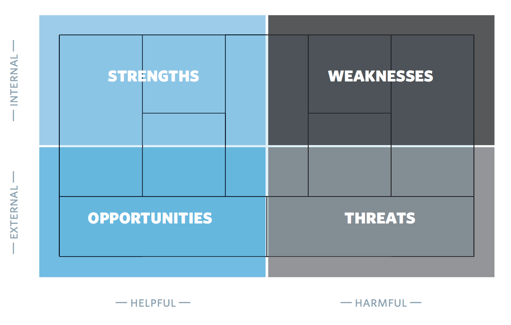

# Environment & Strategy

> Business Model Generation Chapter 4

## Environment

A Business Model is always designed and executed within an environment. Nothing is a silo.

You need to understand changes in the environment in order to help you adapt your model more effectively to shifting external forces.

This includes new customer needs, new technologies, etc. These are all things that should go into your mind when designing a business model.

### Main areas of the environment

1. Market forces
   - Market segments
   - Needs and demands
   - Market issues
   - Switching costs
   - Revenue attractiveness
2. Industry forces
   - Suppliers and other value chain actors
   - Stakeholders
   - Competitors (Incumbents)
   - New entrants (Insurgents)
   - Substitute Products and services
3. Key Trends
   - Regulatory trends
   - Technology trends
   - Societal and cultural trends
   - Socioeconomic trends
4. Macroeconomic Forces
   - Global market conditions
   - Capital markets
   - Economic Infrastructure
   - Commodities and other resources

### Market Forces

#### Market Issues

Identifies key issues driving and transforming your market from Customer and Offer perspectives.

Ask: (*What are the crucial issues affecting the customer landscape? Which shifts are underway? Where is the market heading?*)

#### Market segments

Identifies the major market segments, describes their attractiveness, and seeks to spot new segments.

Ask: (*What are the most important Customer Segments? Where is the biggest growth potential? Which segments are declining? Which peripheral segments deserve attention?*)

#### Needs and demands

Outlines market needs and analyzes how well the are served.

Ask: (*What do customers need? Where are the biggest unsatisfied customer needs? What do customers really want to get done? Where is demand increasing? Declining?*)

#### Switching costs

Describes elements related to customers switching business to competitors

Ask: (*What binds customers to a company and its offer? What switching costs prevent customers from defecting to competitors? Is it easy for customers to find and purchase similar offers? How important is brand?*)

#### Revenue Attractiveness

Identifies elements related to revenue attractiveness and pricing power.

Ask: (*What are customers really willing to pay for? Where can the largest margins be achieved? Can customers easily find and purchase cheaper products and services?*)

### Industry Forces

#### Competitors (Incumbents)

Identifies incumbent competitors and their relative strengths.

Ask: (*Who are our competitors? Who are the dominant players in our particular sector? What are their competitive advantages or disadvantages?Their main offers? Which Customer Segments are they focusing on? What is their Cost Structure? How much influence do they exert on our Customer Segments, Revenue Streams and Margins?*)

#### New Entrants (Insurgents)

Identifies new, insurgent players and determines whether they compete with a business model different from yours.

Ask: (*Who are the new entrants in your market? How are they different? What competitive advantages or disadvantages do they have? Which barriers must they overcome? What are their Value Propositions? Which Customer Segments are they focused on?*)

#### Substitute Products and Services

Describes potential substitutes for your offers - including those from other markets and industries. Products are set in this world to satisfy a *need*, and there may be many ways to do that.

Ask: (*Which products or services could replace ours? How much do they cost compared to ours? How easy is it for customers to switch to these substitutes?*)

#### Suppliers and other value chain actors

Describes the key value chain incumbents in your market and spots new emerging players.

Ask: (*Who are the key players in your industry chain? To what extent does your business model depend on other players?*)

#### Stakeholders

Specifies which actors may influence your organization and business model.

Ask: (*Which stakeholders might influence your business model? How influential are stakeholders? Workers? The government? Lobbyists?*)

### Key Trends

#### Technology trends

Identifies technology trends that could threaten your business model - or enable it to evolve and improve.

Ask: (*What are the major technology trends both inside and outside your market? Which technologies represent important opportunities or disruptive threats?*)

#### Regulatory trends

Describes regulations and regulatory trends that influence your business model.

Ask: (*Which regulatory trends influence your market? What rules may affect your business model? Which regulations and taxes affect customer demand?*)

#### Societal and cultural trends

Identifies major societal trends that may influence your business model.

Ask: (*Which shifts in cultural or societal values affect your business model? Which trends might influence buyer behavior?*)

#### Socioeconomic trends

Outlines major socioeconomic trends relevant to your business model.

Ask: (*What are the key demographic trends? How would you characterize income and wealth distribution in your market? How high are disposable incomes? What are the spending patterns in your market?*)

### Macro-economic forces

#### Global market conditions

Outlines current overall conditions from a macroeconomic perspective.

Ask: (*Is the economy in a boom or bust phase? What is the GDP growth rate? How high is the unemployment rate?*)

#### Capital markets

Describes current capital market conditions as they relate to your capital needs.

Ask: (*What is the state of the capital markets? How easy is it to obtain funding in your particular market? Is seed capital, venture capital, public funding, market capital, or credit readily available? How costly is it to procure funds?*)

#### Commodities and other resources

Highlights current prices and price trends for resources required for your business model.

Ask: (*How easy is it to obtain the resources needed to execute your business model? How costly are they? Where are prices headed?*)

#### Economic infrastructure

Describes the economic infrastructure of the market in which your business operates.

Ask: (*How good is the public infrastructure in your market?*)

### How a Business Model should evolve in light of a changing environment

Everything changes all the time. Painting pictures of the future based on trends makes it much easier to generate potential business models.

### Evaluating business models

Regularly assessing a business model is an important management activity that allows an organization to evaluate the health of its market position and adapt accordingly.

It may trigger incremental improvements to the model or even serious intervention.

## SWOT

SWOT asks four big, simple questions:

- What are the strengths?
- What are the weaknesses?
- What opportunities do we have?
- Which threats do we face?

Notice that two (strengths and opportunities) target positive stuff while two (weaknesses and threats) target negative stuff.

## PESTLE

PESTLE is a tool for figuring out the *impact* of trends in the business environment:

- **P**olitical
- **E**conomic
- **S**ocial
- **Te**chnological
- **L**egal
- **E**nvironmental