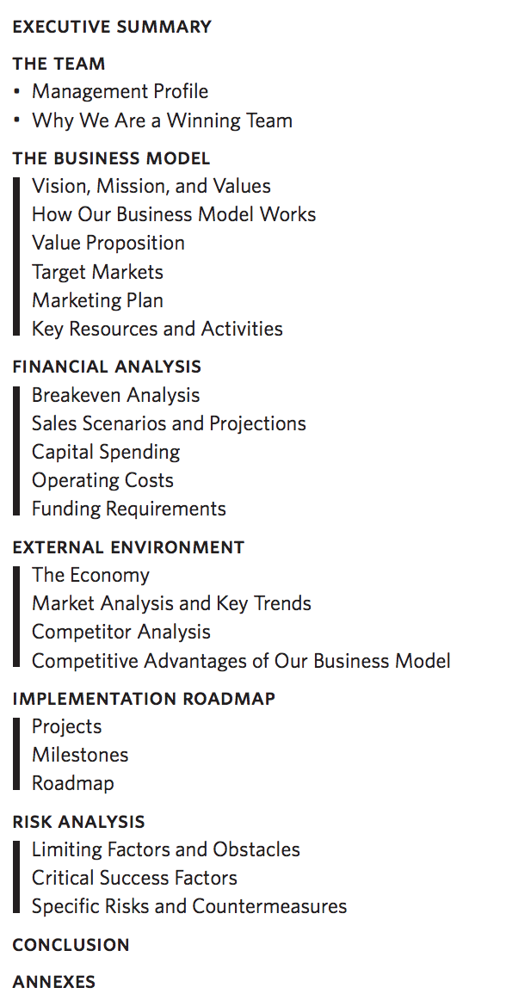
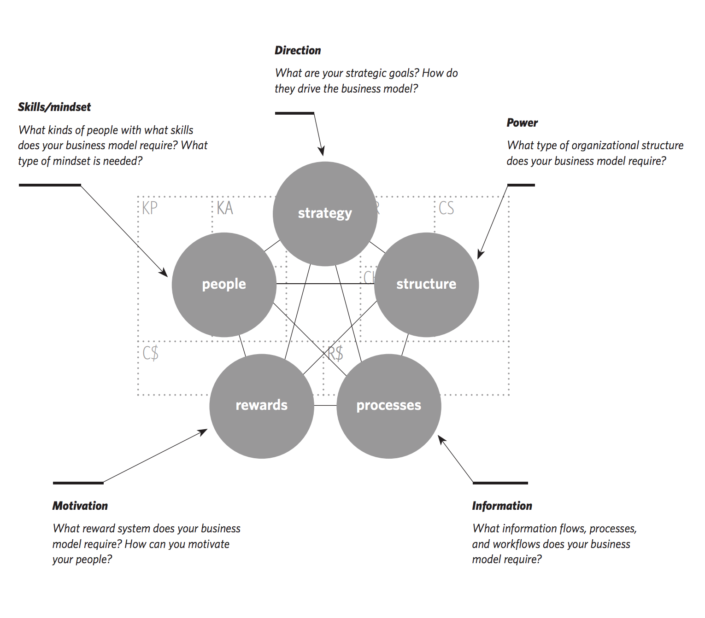

# Outlook

> Business Model Generation Chapter 6 (Outlook)

## Beyond-Profit models

Business Model Canvas can also be used for Non-Profits. Even non-profits must generate enough revenue to cover its expenses. So they need a business model.

### Categories of Beyond-Profit models

There are two:

- Third-party funded (enterprise) models
- Triple Bottom Line models

### Third-party Funded models

Here, the recipient of the product/service **is not the payer**.

Rather, these are paid for by a third party, which might be a donor or the public sector.

In this case, the financer becomes the main *customer* while the recipient becomes a mere receiver.

### Triple Bottom Line models

Wasn't really described.

## Business Plan

A business plan should have a five-section structure:

- The Team
- The Business Model
- Financial Analysis
- External Environment
- Implementation Roadmap
- Risk Analysis

### The Team

This is one element that venture capitalists care a great deal about. Is the team:

- Experienced?
- Knowledgeable?
- Connected enough?

Do they have successful track records?

When writing such a section, you should highlight *why* your team is the right one to successfully build and execute the business model.

### The Business Model

Here the Canvas should be used to provide readers with an immediate visual portrait of the Business Model.

Then, in text:

- Describe the Value Proposition
- **Show evidence of customer need**.
- Explain how you will reach the market
- Use stories.
- Highlight the attractiveness of your target segments to pique the reader's interest.
- Describe the Key Resources and Key Activities needed.

### Financial Analysis

This is important!

Here you:

- Estimate how many customer can be acquired.
- Make Pro Forma Calculations based on your Canvas Building Blocks.
- Use fancy stuff such as breakeven analysis, sales scenarios and/or operating costs.
- Total cost
- Revenue
- Cash flow projections

### External Environment

Here you describe **how your business model is positioned with respect to the external environment**.

**Summarize your business model's competitive advantages**.

### Implementation Roadmap

This is where you:

- Describe what it will take to implement your business model
- Describe *how* you will do it
- Include a summary of all projects and the overarching milestones.
- Outline the implementation agenda with a project roadmap **that includes Gantt charts**.

### Risk Analysis

This is where you **describe limiting factors and obstacles, as well as critical success factors**.

**You can use a SWOT analysis to identify these (threats and weaknesses)**.

## Example of a Business Plan

## Implementing Business Models in Organizations

So how do you actually take a business model and implement it within an organization?

There are five areas that should be aligned:

- Strategy
- Structure
- Processes
- Rewards
- People

### Strategy

(*Direction. What are your strategic goals? How do they drive the business model?*)

Strategy drives the business model!

If you want to grow 20 percent in new market segments, that should be reflected in your business model in terms of new Customer Segments, Channels or Key Activities.

### Structure

(*Power: What type of organizational structure does your business model require?*)

The characteristics of a business model determine the optimal organizational structure for its execution!

Does your business model call for a highly centralized or decentralized organizational structure?

### Processes

(*Information: What information flows, processes, and workflows does your business model require?*)

Operations run under a low-cost business model should be lean and highly automated!

If the model calls for selling high-value machines, quality processes must be exceptionally rigorous.

### Rewards

(*Motivation: What reward system does your business model require? How can you motivate your people?*)

A reward system must use appropriate incentives to motivate workers to do the right things! If we have a direct sales force to acquire new customers, the reward system should be highly performance oriented.

### People

(*Skills/mindset. What kinds of people with what skills does your business model require? What type of mindset is needed?*)

Some business models call for particularly entrepreneurial mechanisms to bring products and services to market. Such models must give employees significant leeway, which means hiring proactive, but dependable, free-thinkers.

## Organizational Structures

This has to with how employees are organized in departments as well as who manages the different departments.

Ask: *How are they organized?*

- By function?
- By geography?
- By business area?
- Who are the managers?
- How is success measured for each organizational unit (KPIs)?

### KPI

KPI = Key Performance Indicator. This is a measurable entity indicating performance.

Good KPIs typically means some form a reward (promotion/salary/bonus/etc).

## A Good problem definition

- **Is open! The answer is not contained within the question**
- Has to do with the business-related consequence of the problem you want to solve (or minimize).
- Is action-oriented and **measurable**. You have to be able to measure whether or not the solution has had an impact on the business in relation to the problem.
- Define exactly what rubber-words mean. What does "more efficient" mean? How about "improve"? Or "Help"? These are all very vague in terms of measurability.

Start with *How*.