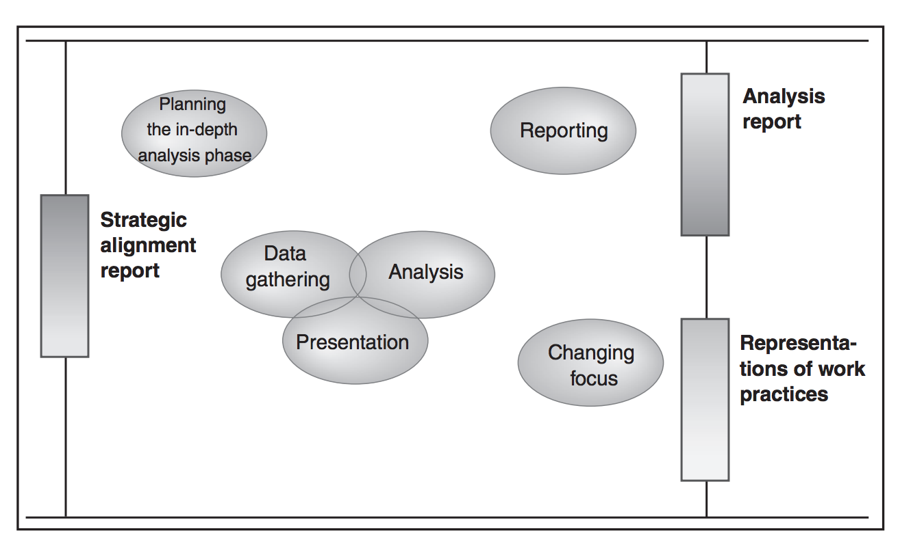
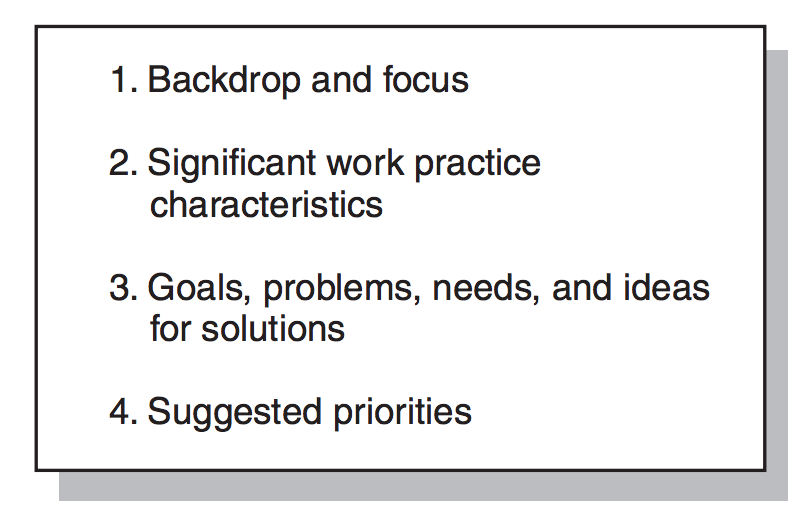
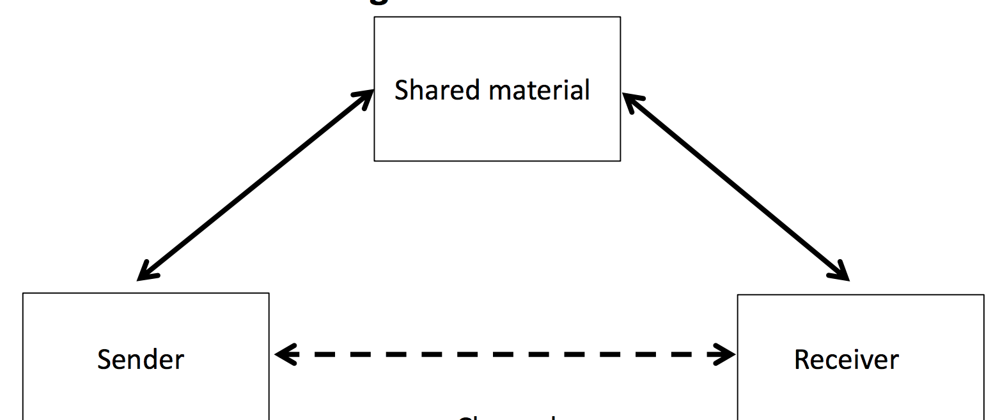
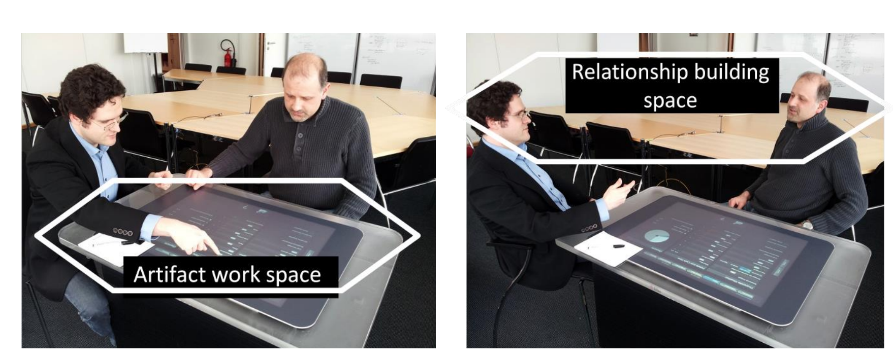

# In-Depth Analysis

> Participatory IT Design, Chapter 6
>
> Knowledge Management Without Management - Shadow it in Knowledge-Intensive Manufacturing Practices > Alexander Richter
>
> intuitive, Deliberative, and Calculative Models of Expert Performance, Hubert L. Dreyfus
>
> Creating, Reinterpreting, Combining, Cuing - Paper Practices on the Shopfloor, Alexander Richter
>
> Organizations and Work, Randall
>
> Making Work Visible, Suchman
>

The In-Depth analysis phase **thoroughly examines selected work domains**.

Its aim is to **establish a thorough understanding of present work practices and the rationales determining their form**.

The primary means for gaining such understanding are techniques enabling the project group to experience the users' work practices.

**This is done through ethnographically inspired techniques such as observation and in situ interviews, combined with other more intervention-oriented techniques**.

## Objective

The objective is a prioritization of the goals, problems, and needs for which the project group will develop design visions in the innovation phase.

We accomplish this **by studying the selected work domains and understanding the rationales determining present work practices**.

This phase insists that work practices need to be experienced firsthand (*"Firsthand experience with work practices"*).

Also, it insists that the knowledge of and interests in the users' own work situation can be effectively incorporated into the design team's efforts (*"genuine user participation"*).

## Motivation

(Usually) good reasons exist for why the day-to-day tasks at a company are performed the way they are, and the rationale behind them are super relevant to the design, also when management wants drastic change.

The design must **build on** existing traditions but also innovate on them. It should take what is good and leave what is outdated.

## Results

The final outcome is an analysis report and supplementary descriptions of present work practices.

## In-Depth Analysis TL;DR

- Analyze the selected work domains through **Observation**, **In Situ Interviews** and **Thinking-Aloud Experiments**.
- The basic activities are **Data Gathering, analysis and presentations**.
- Figure out what to keep and what to avoid. Especially which traditions are important which management may have forgotten about.
- Write an Analysis Report and Supplementary Descriptions of present work practices.
- The Analysis Report will include the most important representations from the In-Depth phase **as well as a prioritized list of goals, problems, needs, required new user qualifications and ideas for solutions**.
- Based on this analysis report, the steering committee decides which goals, needs, and ideas for IT support or changes to the work organization should be more closely examined during the innovation phase.

### Aim

The aim is a detailed and solid understanding and description of relevant existing work practices. This means existing practices, artifacts, people, systems, etc.

### Prioritization

We must prioritize goals and needs, problems and challenges so that we can focus on them in the innovation phase.

### End product

The end product is an Analysis report. This includes relevant descriptions of current procedures in relation to the current problem.

## Data Gathering

We've already selected actors and situations for in-depth study during in-line analysis.

When we gather data, **it is essential to gain concrete experience with the selected work domains**.

### Interviews

We use interviews to increase the level of detail in our knowledge. Specifically, we want to examine how an individual task contributes to the department's overall output.

### Workshops with Dead Sea Scrolls

Here, the participants can sketch out the workflow on large sheets of paper, outlining the tasks and people involved, as well as the necessary information base.

### Thinking-Aloud Experiments

**These are useful when observation isn't really an option**. Generally, when the issue involves understanding problems relating to the use of existing systems, Thinking-Aloud experiments will be suitable.

## Analysis activities

There are based on **Data gathering and processing (of gathered data)**.

This data may be audio recordings of interviews, transcripts, video clips, photos, personal notes, etc.

**The point is to process the data into a form that enables them to be used by the project group for broader communication**.

## Conclusion of In-Depth Analysis Phase

This should explicitly address their **readiness for change**.

**This means measuring the distance between the present situation and the desired goals of the project**, as well as judging it against experiences from past changes in the company and **attitudes toward change among the company's staff**!

## Presentation

Presentation is everything from notes from the first interviews to the final analysis report.

You take the primary information gained from data gathering, analyze it and incrementally advance it into an analysis report.

## Analysis Report

Here's a **suggested** outline of an Analysis Report:

It basically consists of the most important of the design team's representations tied together by text as well as a **prioritized list of goals, problems, needs, and ideas for solutions**.

### Ethnography

Field work. Studying "In the field".

It is immerse. What people *do* rather than what they *ought* to do. Basically, anthropology.

#### Why Ethnography is important

- Designers do often not know the situation they design for, e.g. *why* people do what they do.

- Use of technology is dependent on the context.

- **Understanding how somebody works is never isolated, but dependent on other work practices**!

- Designers are change agents: **They are not merely designing artifacts, but *interventions* to change practices**.

#### Ethnographic principles

It is not assumptionous: No hypothesis is to be tested, and no concepts are given. Detailed observation of people in natural settings.

### Selection and sampling

Look for:

- *How* is the work performed?
- *What* tasks does it involve?
- *Why* are they performed this way?

Look for deviations and breakdowns! What breaks the flow?

### Interviews (again)

We do interviews to understand the informant's *perspective*.

It is *their* words and *their* version.

You are there to learn, don't interrupt, don't answer your own questions. Listen and ask.

#### Best practices for interview questions

- Ask open questions.
- Be neutral. Don't say: "Do you think this is good?", but instead: "What do you think about this?"
- Be singular. Don't place multiple questions inside one.
- Be clear.

#### Kinds of Interviews

The slides describe three kinds:

- Structured interviews
- Informal interviews
- Semi-structured interviews

##### Structured interviews

These enable comparability (because the same questions are asked to all interviewees).

- These are structured and their contents are controlled.
- **Prevents from following interesting issues emerging during the interview**

##### Informal interviews

This would be part of participant observation.

- Maximal flexibility - questions emerge in the context.
- Allows the information to direct and/or shape the conversation
- Allows following interesting issues emerging during the interview
- Lacks systematic data collection. Harder to analyze.

##### Semi-structured interviews

This is perfect!

- An interview guide is prepared in order to make that *basically* the same information is obtained from a number of people by covering the same material.
- Enables modifications of interview guide - e.g. it can follow interesting issues raised during the interview. Eventually it will get back to the form.

### Observations

Why observe? To avoid Say/Do problems!

*"What people say, what people do, and what people say they do, are entirely different things!"*.

Why do they do this?

- They try to match the cultural expectation
- They don't have access to tacit knowledge.
- They don't have the vocabulary to talk about activities.

#### How to observe

Be passive (a fly on the wall).

Before you do, decide *what* to observe, *when* and *where*.

#### Observation focus

Should be:

- Based on the topic/problem definition

And focused on:

- Location
- People
- Events
- Artifacts

### Notes

You should note:

- Where, when who?
- Body language, gestures, other people present.
- Provide detailed descriptions
- Direct impressions and reflection

### Drawings and photos

Is good for supporting your memory

### Ethics

You should:

- Respect anonymity - No real names
- Keep data protected
- Blur faces in photos
- Invite participants to read your results
- Describe the aim of the study and that participation is optional

### Maps vs Scripts

Maps are **general references for orientation purposes, not as a prescribed sequence of actions**.

**Scripts are precomputed sequences for execution**.

### Programs and Antiprograms

Programs are **actions that are pre- or inscribed**.

Antiprograms are **actions in conflict with the programs**.

### Artifacts

These can be used for **communication through shared material**.

- To create and keep a shared understanding.
- In a way that participants can *edit*.
- As a memory of the previous cooperation.

Artifacts can be:

- Output of work
- Instruments through which work gets done!

#### Ecology of Artifacts

This has to do with **where things are**. In other words, the spatial distribution of artifacts.

They:

- Allow work to be done.
- Is part of *how* work gets done and mediated.

So they both come before work and exists as part of work.

#### Problems with artifacts

Do not forget the direct channel!

### Sociotechnical Systems

This is an **approach** to organizational work design that recognizes the interaction between people and technology in workplaces.

It is another word for Human-Computer interaction, except this is in a workplace context and between people and any kind of technology.

### Knowledge

Classification of knowledge:

- **Know-what**: Facts and state of things
- **Know-why**: Causal relationships between different elements. It depends on the ability to articulate a conceptual understanding of an experience.
- **Know-how**: How people understand and how they learn including their physical ability to produce some action. This is also called *procedural knowledge*.
- **Know-who**: Who knows what, why, and how

#### Tacit vs Explicit knowledge

#### Tacit knowledge

- Hidden and refers to intuitions, experiences, and insights
- Dissemination of tacit knowledge is difficult and only happens through people.
- **Is personal and can be easily lost if the key people of organizations leave them**.

**Tacit knowledge can be found in the form of values, ideas, beliefs, insight and innovation**.

#### Explicit knowledge

- Can be articulated and *codified*.
- Is easy to disseminate and can happen through information technology.
- Is impersonal, so it can be stacked through the organizational memories.

Explicit knowledge can be found in the form of **rules, policies, procedures, and manuals**.

## Knowledge Management Without Management - Shadow It In Knowledge-Intensive Manufacturing Practices

This is a Research Paper written by Alexander Richter and some other guys about using private devices in the workplace without formal approval of the IT department to solve problems. This means that people may overcome impracticalities and inefficiences by getting stuff done ("getting around the systems") with personal devices without management ever finding out about it and thus never figuring out that there is an issue. Simply, people "get around" inefficiencies of existing IT infrastructure.

For example, building a simple script to automate a task that formally require multiple manual steps. An employee might simply write it to make his/her daily tasks easier.

### Shadow IT

This is the voluntary use of private devices by employees without formal approval of the IT department.

In some work places, the use of such devices are even strictly forbidden - but still according to a survey with around 4000 employees, 52% of the participants indicated that they used their private devices for work related activities.

It occurs mostly in situations where existing the IT norms are perceived as inefficient by employees.

When employees rationalize their use of personal IT devices to facilitate work practices, it becomes part of their routine. It may shadow the fact that the flow of the task as intended by the company is inefficient and needs improvement.

The paper states: *Prior research has found that if the existing IT infrastructure is insufficient to enable the accomplishment of important jobs, there is a higher likelihood that individuals will be motivated to reach for alternative IT resources and tools to help them*.

### Problems of Shadow IT

When current employees using Shadow IT moves on from the organization, unofficial processes (that these employees has been using without management's approval) will leave too - most likely leaving a gap in terms of efficiency of execution of the task or even making the task impossible.

### Knowledge-Intensive Manufacturing Practices

With all this automatization going on in manufacturing companies, the topics of knowledge shift from purely craft-related knowledge with no automatization towards **knowledge about the technical aspects of the machines**.

This shift places some new requirements on the workers' knowledge. They no longer have the responsibility of producing the goods, but rather keeping the technical systems in a production environment within defined conditions of operation.

The increasing complexity demands better support by appropriate information system being available where and when they are needed. When they aren't, workers may depend on shadow IT to cover these missing pieces.

### How they gathered data

By observation first (3 researched observed employees from the repair and maintenance team during their work on the site). Then, nine semi-structured interviews with an average length of 67 minutes. They also analyzed diverse internal documents such as handbooks, work lists and process descriptions. Case study research is especially suitable for examining fields without comprehensive empirical material as is the case with Shadow IT.

### Findings

Beside the conclusion, they found that employees needed an average of two years experience before:

- They know their way around in the environment
- They are familiar with the conditions on most of the factory buildings, and
- They can troubleshoot autonomously.

Employees gain knowledge through mutual assistance provided by experienced colleagues or through systematic trial and error iterations over time.

The company's approach to learning is an ad-hoc one where younger employees are able to learn about the work practices from the more experienced employees. The company relies on "old-fashioned" paper artifacts in terms of maps, machine guidelines, etc. This is seen as cumbersome and thus increases the use of Shadow IT.

## Intuitive, Deliberative, and Calculative Models of Export Performance

This is a paper that discusses how we acquire skills. It holds the belief that skills are learned by responding to many (different) situations up against the belief that skills are learned by memorizing the rules of that skill (e.g. *NOT* learning-by-doing).

The second of the two, the situational one, is influenced by the dominant information-processing model of the mind, and takes skill to be the result of compiled rules.

The great thinkers of the past too support the belief that learning is about memorizing the rules.

What Plato found is that understanding a domain consists in having a *theory* of that domain. Such theory formulates the relationships between objective and context-free elements.

Descartes then assumed that all understanding consisted in forming and manipulating appropriate mental representations, that these representations could be analyzed into primitives, and that all phenomena could be understood as complex combinations of these primitive elements.

Basically, that branch of theory ends up with stating that knowledge is about reasoning and that knowledge comes from formalizing that knowledge an reasoning symbolically.

So that is far away from the authors' belief that knowledge acquisition is situational.

They ended up at a different model which has five stages.

### The Five-stage model of skill acquisition

1. Novice
2. Advanced Beginner
3. Competence
4. Proficient
5. Expertise

#### Stage 1: Novice

First, the task environment is broken down into context-free features (e.g. disassociated with the task domain) that the beginner can recognize without benefit of experience in the task domain.

The beginner is then given rules for determining actions on the basis of these features, like a computer following a program.

#### Stage 2: Advanced beginner

As novices gain experience actually coping with real situations, they begin to note examples of meaningful additional aspects of the situation. After seeing a sufficient number of examples, students learn to recognize them.

These can be referred to as *situational aspects*, recognized on the basis of experience, as well as to the objectively defined *nonsituational features* recognizable by the novice.

**For example, advanced beginner drivers use situational engine sounds as well as nonsituational speed in their gear-shifting rules. They shift down when the motor sounds like it is straining**.

#### Stage 3: Competence

At this point, the learner becomes overwhelmed of the number of potentially relevant elements of a real-world situation. The learner doesn't yet have a sense of what is important in any particular situation, and such performance becomes nerve-wrecking and exhausting.

So, people learn from here through instruction or experience to adopt a hierarchical perspective. By restricting themselves to only a few of the vast number of possibly relevant features and aspects, decision making becomes easier.

Prior to this stage, if the learned rules did not work out, the performer could rationalize that he or she had not been given good enough rules. Now he or she feels remorse if things do not work out.

If resistance is met at this point, it may lead to stagnation and ultimately to boredom and regression. Otherwise, there is no "turning back" from here. The learner becomes more and more emotionally involved in his or her tasks.

#### Stage 4: Proficient

This stage is only reached if experience is assimilated in this theoretical way and the performer's theory of the skill, as represented by rules and principles, **are gradually replaced by situational discriminations accompanied by associated responses**.

This is the point where plans are intuitively evoked and certain aspects stand out as important without the learner standing back and choosing those plans or deciding to adopt that perspective.

Still, though, the proficient learner may see the goal, but must still *decide* what to do. And to do that, they fall back on detached, rule-based determination of actions.

For example, the proficient driver may be driving on a rainy day and intuitively realize that the car is going too fast. The driver then consciously decides whether to apply the brakes or merely reduce pressure by some selected amount on the accelerator.

#### Stage 5: Expertise

Where the proficient performer *sees* what needs to be done, but *decides* how to do it, the expert not only knows what needs to be achieved but also knows how to achieve the goal. Granted, they rely almost entirely on intuition and hardly at all on analysis and comparison of alternatives.

Everyday, skilled decision making has been systematically overlooked in laboratory studies that study decision making outside natural context in which the decision maker experience-based expertise.

### This method vs Neural Networks

Turns out - This is the same mental model that Neural Networks are based on. And it goes against the core of modern philosophy - that there must be a theory of every aspect of reality. Because with these five stages, eventually the rules are set aside (and thus the theory).

Cognitive psychology, which deals with information-processing, then becomes irrelevant, based on this model, since information processing (e.g. reacting to events) becomes intuitive and automatic.

### Calculative Rationality

This is the kind of inferential reasoning exhibited by the novice, advanced beginner and competent performer. (Where the reasoning is inferred from context-free and situational rules)

### Deliberative Rationality

This is what experts exhibit. This is detached, reasoned observation of one's intuitive, practice-based behavior.

## Creating, Reinterpreting, Combining, Cuing - Paper Practices on the Shopfloor

Describes how paper still prevails on manufacturing shop floors, despite the advent of fancy digital technologies and the fact that tasks increasingly depend on real-time information.

It states that on the shopfloor, less routine work is required (due to automation). Rather, dynamic and efficient collaboration by highly skilled shopfloor workers is needed - they have be autonomous and flexible problem-solvers and decision-makers.

It concludes that paper *has* a place on the shopfloor of modern smart factories provided that the usage of paper artifacts is appropriately integrated with digital tools.

### Affordances

This denotes the possible actions provided to an actor by an environment.

It is seen as a way to bring materiality back into the analysis by highlighting technology's physical characteristics without succumbing to technological determinism.

Certain affordances are only visible to the trained eye rather than a novice.

Individuals must first *learn* affordances before they can gain awareness on them.

### Benefits of Paper

- Paper affords flexible cross-referencing between multiple documents, allowing users to spread out pages in physical space and to read and write across documents.
- Paper affords opportunities to interact and communicate with one another by physically passing and delivering documents.

### Conclusions

Is that the value of paper derives from its interactional affordances for the cooperative actors on the shopfloors.

Another benefit of paper in a development context is its low cost, considering the technological alternatives.

### Creating and Adapting Individual Information Spaces

The observation is that individuals or teams deliberately design their information spaces to match their requirements **by distributing the different documents in their physical environment**. These documents are usually low-content such that their entire content displays at once.

Also, it is *always-on*. The information is always in the field of vision and provides visual cues and reminders of unfinished documents and open tasks.

### Conclusions of the article

Paper is nice and all (check the reasons above). One thing is that it is hard to track the state on the production floor - how far are we with which tasks? Since everyone has their own paper-based check lists, managers must spend time figuring this out.

The article describes how several valuable paper practices has been identified that are "at risk in the process of digitalization".

## Organizations and Work

This is chapter 8 from some book. This has to do with researching an unfamiliar workplace. This is often what we do as IT designers when we perform ethnographic field study.

We (the fieldworkers) come as strangers.

Understanding workplaces may in some respects be akin to understanding other cultures and hence the "other".

While some believe that truly understanding a different culture is simply impossible, others believe that its hard but doable.

A workplace may be strange, but work in general is not. There will probably be certain commonalities that one can orient to as one prepares for the business of fieldwork!

### Fieldwork

Going to the field is about looking in certain ways at certain things and analyzing them with particular goals in mind. So its not just looking at things, but **looking in the right way at the right things with the right intentions**.

As such, the fieldwork will have a different hue depending upon the purposes at hand.

**This is also why it is really important that you know the goals in advance as well as which work functions to analyze ethnographically**.

Fieldwork is successful only when it is sensitively done, and that means through evoking and alluding, comparing and contrasting both what is seen in there here and now with what was seen an thought about in prior research.

### Social Organization

The term "socially organized" is meant to orient us to what it might mean for individuals to organize themselves in reference to others.

In a work context, social organization is the division of labor. "Who does what".

Plans are the ultimate measure of social organization. **Plans are not there to guide the individual but to ensure that what an individual does is in accord with what others before have thought would be an effective way of doing things**.

One has to assume that more or less all the activities that one might be interested in are socially organized. It is thus *how* they are socially organized that are interesting, not that they are.

### Egological arrangements of work

This describes how people determine their own courses of action in the here-and-now **by reference to what inters in the here-and-now are doing as well as what others in the past and in the future have, and will, do**.

### Planning, Plans and Procedures

Plans are important when investigating action in workplaces. *Any* discussion of work should consider plans and planning.

The brook stresses the view that plans are resources for situated action, but they **do not** determine its course in any strong sense. Rather, a plan is an abstract construction that needs to be applied in specific circumstances. It does not execute itself, and the relationship between a plan and an action is not a direct mechanical one.

This belief has let researchers to rethink how plan were to be understood: Not as having causal properties which determine *how* people work, but as resources for action.

The book gives an example from the world of office automation research where discrepancies were identified between what appeared to be simple, routine tasks according to the plan and then the concrete actions carried out by the staff due to the existence of *exceptions*. The employees creatively solved exceptions and dealt with contingencies - despite the simple formal office procedures on paper. **The studies even showed how it was often necessary to deviate from plans and improve on order the work done at all**!

### Ethnographic Orientation

When a shift came in how plans were thought about in systems design and it became very different what "routine" in the workplace might be, the term *ethnographic orientation* was coined. This is an orientation which sees procedural plans as accomplished products.

*"The procedural structure of organizational activities is the product of the orderly work of the office, rather than a reflection of some enduring structure that stands behind the work"*.

**It is super important to consider the "fit" of procedural models with the ways in which work is *actually* done**.

### CSCW

CSCW: Computer Supported Cooperative Work.

It came at a time where the apparent failure of automation in offices (due to the naive expectation that plans could be executed mechanically as described above) naturally led to a lot of studies of of many other contexts in which cooperative work existed and where automation was thought to offer a route to improvement.

Many researchers pointed out that good fieldwork requires appreciating the formal before one can appreciate the informal rather than dismissing the entire set of instructions, guidelines and rule books because they are "fictions".

You cannot see the work "for what it is" without knowing the underlying plans.

**This is the prevalent view today**!

In sum, fieldworkers should neither be fooled by plans nor ignore them. Plans are part of work and thus part of what needs to be understood when looking at work. **The important issue for design is the degree to which the gap between plan and execution**.

### Paperwork

Paperwork is:

- Integral to the socially organized patterns of work.
- Representative of organizational objects and actions.
- A sediment of an organization's activities, inquired into and used for accountability.
- Politically important as reflected in regulated access which in turn describes the hierarchical order organizations.
- Has a procedural implicativeness in it (as in a form implies what is next and what has gone before).

### Information Lifecycle

One way a researcher can get around an organization is by following the lifecycle of the key information in that organization.

All organizations can be seen as having an information lifecycle.

One can learn a great deal quickly simply by planning the early stages of the fieldwork around the lifecycle of the information used by the company. This will help the fieldworker learn where that information comes from, where it goes, and what uses it gets put to throughout.

### The Flow of Work

The Flow of Work can be thought of as the temporal, and more specifically, the sequential and concurrent organization of work activities.

### Awareness of Work

This refers to the way in which work tasks are made available to others, in the sense of being visible, traceable and noticeable.

This is basically a label for the various ways people in a workplace can see what is going on.

### Awareness and the Sense of Organization

Workers are normally well aware of their work as part of some larger institution and that their work activities are the work of and represent the organization.

### The Egological

One of the most obvious problems that workflow type technologies have is that they cannot be designed to encompass the delicate web of mutual understanding that coheres a work team.

The tasks performed by any one individual form an interdependent part of larger sequences of tasks done by others within a work group and a workflow may only support some of these.

**One way the fieldworker can unpack the egological is to examine work according to the questions participants might ask themselves as they do it, notably *"What must I do next?"***.

### Professional Vision (Expertise)

This invokes in particular the ability to distinguish between "normal" and "abnormal". This is for the professionals in their field. The social distribution of expertise becomes apparent when professionals express the opinion that one of their colleagues is better at spotting something than others.

### Local Knowledge

This has to do with how knowledge is bound to the specifics of particular work places.

Where it may be presumed that it is the processes that are producing efficiency, it may be that it is only in conjunction with local knowledge that tasks can be efficiently performed.

### "Bibles"

The term *Bible* is used here as a name for files, books, etc, in which individuals keep large amounts of information that is relevant to their work and is not readily obtainable elsewhere. These are very useful resources for an awareness of the information that workers find useful, but their existence is not always recognized by the organization.

### Normal Natural Problems/Troubles

As stated, what the problems of work are and how they are dealt with are **not the same**.

Work, wherever it is, involves dealing with troubles. It is the stuff or work which makes all work more or less familiar to us. These troubles change day-by-day, week-by-week. This is what we call *Normal Natural Troubles*.

### Conclusion to the chapter

Problems at work are normal for work.

Part of the way in which troubles are managed is not only through the minded behaviors of individuals in the workplace **but through the material properties of the setting**.

## Making Work Visible

This is an article by Lucy Suchman.

She starts with the tagline: *"How people work is one of the best kept secrets in America"*.

It describes this dilemma:

The better the work is done, the less visible it is to those who benefit from it.

At the same time, if we bring such work forward (that has been kept secret) and render it visible, it may call into question the grounds on which it is rewarded, both symbolically and materially.

So, there may be some interest around the workers for keeping these practices secret.

### Stereotyping others work

**Our representations of work involve perspectives and interests, but work has a tendency to disappear at a distance, such that the further removed we are from the work of others, the more simplified, often stereotyped, our view of their work becomes**.

The relation between our own social location and our view of others is in part what sustains boundaries among organizational actors, including boundaries between professional designers of technology and technology users.

This could be management, who assumes a task to be nontrivial and routine, simply because they are distanced from the execution of it. Hence it is important to remove that distance and actually observe (firsthand experience with work practices).

### Making work visible in terms of system design

The goal of making work visible for system design **is to develop more appropriate technologies from the point of view of those who will be using them**.

### A central concern for IT Designers and analysts

A central concern for IT Designers and analysts is the relation between normative accounts of how work gets done and specific work practices. By definition, normative accounts represent idealizations or typifications. That's not how the world works!

When the normative representations are generated at a distance rom the sites at which the work they represent goes on, it will probably not only be idealized but also stereotyped and trivialized.