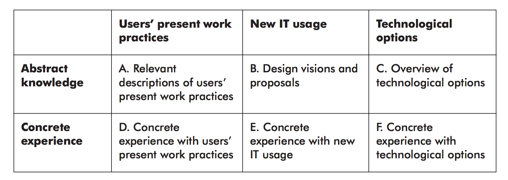
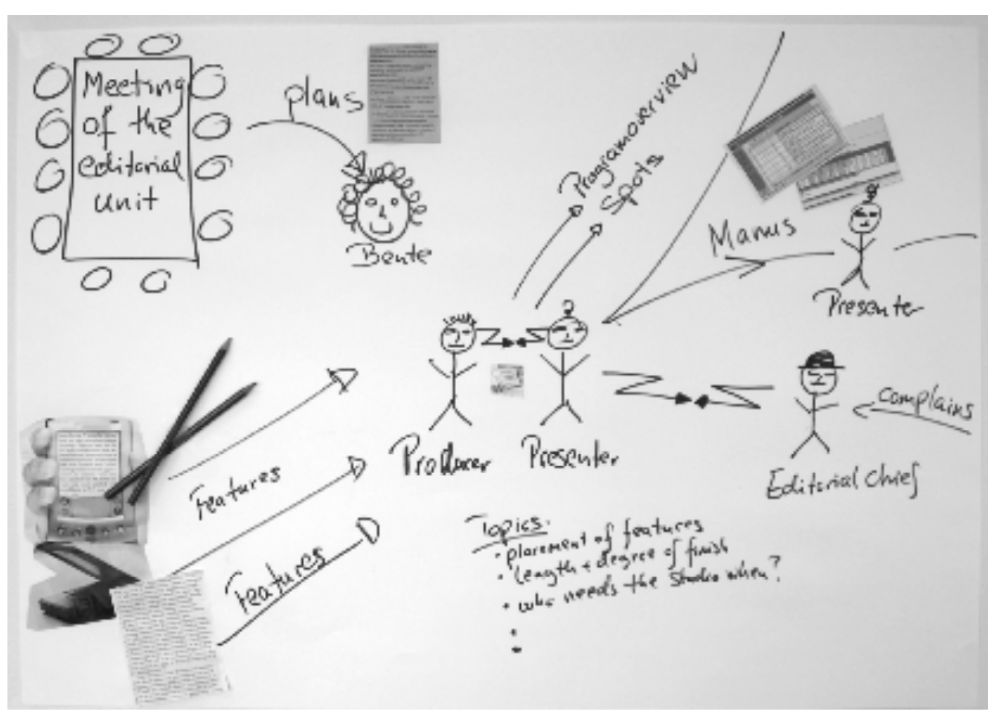

# An Overview of Techniques

> Participatory IT Design, Chapter 8, 9
>

The knowledge areas *A-F* is:

## Boehm's model of Risk Management

This is a model that MUST relies on that is based on three overall activities:

- Risk evaluation
- Risk control
- Crisis Management

### Risk Evaluation

Risk Evaluation identifies risk factors potentially threatening the successful completion of a project.

Such risk factors need to be analyzed and prioritized in order to focus on the most critical elements of each one.

The *size* of each risk **is a product of the probability of the risk becoming real and the size of the potential loss**.

First, a strategy for the critical risk factors is determined.

### Risk Control

Then, action plans are devised for realizing the risk-management strategy.

The risks are managed by the respective action plans.

If an action plan fails, or a different risk factor exceeds **a set threshold**, the project is designated as critical. This is where crisis management comes in.

### Crisis Management

When a project becomes critical, the most important principle is to focus attention on the crisis situation in order to get the project under control with swift, concentrated measures.

### Who has responsibility of Risk Management

The project manager has the day-to-day responsibility.

## Data Gathering

In MUST, data gathering is all about gaining insight into concrete experiences.

It may involve concrete experience of users' present work practices, or technological options, or of newly proposed systems.

**So, it is all about knowledge areas *D*, *E* and *F***.

We use:

- In Situ Interviews
- Observation
- (Thinking-Aloud) Experiments with Prototypes

This makes the IT designers personally involved in problems encountered by the users who they are designing for.

**Data gathering cannot be planned in detail**. Rather, one should be prepared to pursue interesting aspects that surface during the course of events.

### Focus areas

Focus on:

- Work functions (why are the business processes and tasks performed?)

- Tasks (what do the tasks involve?)

- Work process (how is the work process carried out?)

- Flow of information (what information is used, created, transmitted, and by what means?)

- Time sequence (Who does what when and what are the preliminary and end results?)

- Communication structure (who communicates what with whom and by what means?)

- Coordination of tasks (Who handles the coordination of tasks and by what means?)

- Breakdowns and exceptions in the work process.

- Preservable traditions (what works well?)

## Technique overview

### Baseline planning

Good in phases: *1, 2, 3, 4*.
Representation: Baseline plan

It centers on dividing a design project, in terms of time and content, into a number of baselines, which indicate when selected intermediate products must have arrived at a specific, well-defined state.

The period between two baselines is called a phase. We have four of them in MUST.

**At each baseline, the plan is critically assessed, possible changes are implemented, and the subsequent phase is planned in greater detail. This is the Risk Management part of MUST**.

The results of baseline planning are documented in the form of a baseline plan.

The actual technique of developing a baseline plan has four steps:

1. Draw a baseline for each respective starting situation and desired end situation. Write an *acceptance criteria* for each desired end product (denoted *Kn*, for example: *"P1: Testing in a realistic setting"*) as well as a starting state (denoted *Pn*, for example: *"K1: Project group accepts the mandate"*).
2. Plot three baselines in between the first two baselines representing the beginning and end of the project.
3. For each phase, activities for taking the project from one baseline to the next are now designated, along with techniques and tools for performing these activities.
4. The amount of time for activities planned each baseline is estimated **and corresponding dates are added to the baselines**. Finally, **the completion date is checked against any possible specification in the project group's mandate**.

### Review

Good in phases: *1, 2, 3, 4*.
Good for principles: *Genuine User Participation, Anchoring Visions*.
Representation: *Summary*

A *Review* is an effective technique to assess some intermediate delivery. The project group may decide to submit a draft of an intermediate product (such as a report or plan) to a review.

The *Review* is just a meeting that lasts for a few hours. There, the reviewers' task is to point out what is good about the project, as well as its possible errors or shortcomings.

#### Conditions for a Review

A separate description should be made of the **requirements that the product needs to meet**.

That way, the reviewers know which criteria to review the product on.

#### Roles in a Review

- **Creator**: The project group. Makes the product and specifies requirements for the product. Listens and answers questions during the review. Fixes errors and shortcomings after the review.

- **Reviewers**: Have competency regarding the product and isn't part of the project group. Points out positive/negative aspects. Do not propose solutions. Approve or demand a new review or reject the product.

- **Reporter**: Reports the reviewer's evaluations with keywords. Provides a clear conclusion.

- **Moderator**: Directs the meeting. Make sure that all reviewers have their say. Ensures that the requirements are in order.

#### Steps of a Review

1. The creator is responsible for distributing the product and setting the requirements.
2. The reviewers should be knowledgeable about what they are asked to evaluate. Three to four reviewers should be suitable.
3. The reporter is a member of the project group.
4. The moderator must also be impartial and should be familiar with the technique to ensure an effective reviewing process.

The meeting lasts a few hours.
The reviewers point out what is good as well as any errors and shortcoming.

The creator should **listen** to the reviewers comment and **refrain from depending his or her results or starting a discussion**.

### Hearing

Good in phases: *1, 2, 3, 4*.
Good for principles: *Genuine User Participation, Anchoring Visions*.
Representation: *Summary*

Really good for Anchoring Visions.

A *Hearing* is where employees in the company gets the opportunity to review and comment on significant products of the design project before final decisions on them are made!

This may be by oral communication at a meeting or by exchanging written information.

Good choice when the situation calls for communication with actors who do not directly participate in a design project - to get Genuine User Participation.

#### Form of a Hearing

The project manager prepares a 15-minute (for example) presentation that sketches out the project group's understanding of problems, needs, and ideas.

Then comes the discussion with inputs from the people present.

### Interview

Good in phases: *1, 2, 3, 4*.
Good for principles: *Genuine User Participation*.
Knowledge Areas: *A, B, C (Descriptions of current work practices, discussion of design visions and proposals, overview of technological options)*
Representation: *Summary*

These are used to effectively and systematically gather information from staff, management, customers and other stakeholders.

They aim at understanding how the information performs his or her work, what the work involves, and why it is performed the way it is.

### In Situ Interview

Good in phases: *3, 4*.
Good for principles: *Firsthand experience of Work Practices*.
Knowledge Areas: *D, E, F (Concrete experience of current work practices, concrete experiences with proposed visions, concrete experience with technological options)*
Representation: *Summary*

This is interviews that takes place while the user is at his/her desk (or whatever), performing a task.

### Preparing for Interviews/In Situ Interviews

We must prepare:

- Whom to interview
  - This is entirely dependent on how far the design project has advanced. In initiation, it may be with management representatives. In the in-line analysis phase, it may be relevant to interview external and internal customers plus suppliers, as well as a broad selection of people handling different functions. In the in-depth phase, people who represent the work domains you focus on. Here, it is better to conduct In Situ Interviews.
- Topics for the interview
  - This involves writing an *Interview Guide*. This guide is referred to during the interview and may be forwarded to the interviewees beforehand.
- How the project group should organize and conduct the interviews.
  - Who interviews whom, a plan for analyzing and reporting back on the interviews, and an overall time table for conducting the interviews.

#### Executing interviews

It is good if there are two interviewers since they can support the other in asking questions. And, one can concentrate on the interview while the other takes notes.

#### Recording Interviews

Is always recommended! The course of a qualitative interview is highly unpredictable and an interview may take unexpected turns.

If no recording is made, the interviewers should take notes in keyword form.

#### Processing Interviews

You should always write an interview summary. It is typically while writing down the results of the interview that ideas for further questions or design ideas occur and valuable insight is gained.

### Document Analysis

Good in phases: *1, 2, 3*.
Knowledge Areas: *A, C (description of work practices, description of existing technological options)*
Representation: *Notes*

Document analysis is about reading documents, while noting interesting and relevant information.

- In the initiation phase, it is used to gain an initial overview of the company by studying annual reports and organizational diagrams

- In the In-Line analysis phase, it is used to analyze strategies and related projects or initiatives that are relevant to the design project.

- In the In-Depth analysis phase, it is used to study documents used **in selected work processes** more closely, including plans.

#### Documents for Analysis in Initiation

- Annual Report
- Company presentations on the Internet
- Commemorative publications
- Organizational diagrams

#### Documents for Analysis in the In-Line phase

- Business Strategy
- IT Strategy
- Project descriptions

#### Documents for Analysis in the In-Depth phase

- Work descriptions
- Meeting records
- Manuals
- Work documents
- Forms
- Rules and procedures

### Functional Analysis

Good in phases: *2*.
Good for principles: *Coherent Vision, Anchoring Visions*.
Knowledge Areas: *A (Descriptions of current work practices)*
Representation: *Functional Model*

This is a technique for **analyzing work functions**. **Especially useful in the In-Line analysis phase when analyzing the business strategy and the environment**.

It starts off from the company's overall business strategies, and the aim of the analysis **is to identify the work functions upon which the design project should focus**.

It results in a functional model, which is really good for presenting and discussing strategy-oriented representations and considerations with management representatives.

#### Concepts of a Functional model

**The *Environment* for a specific work function within a company will be the other departments of the company**.

Functional analysis is performed by alternating among interviews, document analysis and functional modeling.

Functional analysis should be performed on three levels:

1. On an overall organizational level to get a overview. Here, the environment and overall function are analyzed.
2. On a middle level, breaking down the organization into internal functions.
3. On a base level, breaking down those functions of the organization that are the subject of the design project into subfunctions/work domains.

#### Functional models

- Each box in the model corresponds to a function.
- Each circle/oval indicate a company's environment.
- Arrows illustrate logical relations (typically information flows) between functions, as well as between functions and environment.

### SWOT Analysis

Good in phases: *1, 2*.
Good for principles: *Coherent Vision, Genuine User Participant, Anchoring Visions*.
Knowledge Areas: *A, C (Descriptions of current work practices, descriptions of technological options)*
Representation: *SWOT Model/Risk Matrix*

SWOT analysis charts the company's overall strategic and **competitive** situation, while providing an overview of the design project's **risk factors**.

SWOT analysis starts from an evaluation of the competitive state of the industry. The company's strengths and weaknesses, as well as opportunities and threats in the industry, are assessed accordingly.

SWOT is an acronym for Strengths, Weaknesses, Opportunities and Threats.

**It is especially useful in the Initiation phase to support identifying critical factors**!

But also for supporting analyzing the environment and the business strategy.

### Risk Matrix

The Risk Matrix categorizes risk factors according to their **consequences and probability**.

If a risk factor has a high probability of occurring, it is placed at the right side of the matrix.

If a risk factor has a high consequence, it is placed in the top of the matrix.

So, if we have something in the top-right corner, it has high consequences and has a high probability.

**We can take everything from *weaknesses* and *threats* in a SWOT model an place them in a Risk Matrix** and then analyze their probability.

### Observation

Good in phases: *1, 3*.
Good for principles: *Coherent Vision, Firsthand Experience of Work Practices*.
Knowledge Areas: *D, E, F (Concrete experience of current work practices, concrete experiences with proposed visions, concrete experience with technological options)*
Representation: *Summary*

Observation (ethnographic analysis) provides Firsthand Experience of Work Practices that cannot be gained by techniques such as interviews and thinking-aloud experiments.

#### Participatory vs Passive Observation

- In **Passive Observation**, we are a "fly on the wall".

- In **Participatory Observation**, the observer is drawn *into* the performance of the observed work.

#### Execution of Observation

According to the main course book, it is recommended that observation is performed by a single person (to cause as little disturbance as possible).

### Thinking-Aloud Experiments

Good in phases: *3, 4*.
Good for principles: *Coherent Vision, Genuine User Participation, Firsthand Experience of Work Practices*.
Knowledge Areas: *D, E, F (Concrete experience of current work practices, concrete experiences with proposed visions, concrete experience with technological options)*
Representation: *Notes*

This is where someone is performing a task *while* they talk through what they talk through what they are doing or thinking.

- In the In-Depth phase, it can be used as the informant goes through his/her daily work
- In the Innovation phase, it can be used while testing mock-ups or prototypes.

It is awesome for getting firsthand experience with the visions for IT usage during the innovation phase!

### Workshops

Good in phases: *3, 4*.
Good for principles: *Coherent Vision, Genuine User Participation, Firsthand Experience with Work Practices, Anchoring Visions*.
Knowledge Areas: *A, B (descriptions of work practices, discussion of visions and proposals)*
Representation:
*Freehand drawings*
*Collages*
*Dead Sea Scrolls*
*Affinity Diagrams*
*Role lists*
*Communication models*
*Timelines*
*Design sketches*
*Data models*

These are perfect for Genuine User Participation!

Here, users and IT designers are working together to produce a joint result according to some theme.

**They are also great when the project group is developing sketches of future IT usage (coherent visions)**.

#### Freehand Drawing

Freehand drawings are representations of the current work practices in the form of "childlike" drawings on large sheets of paper or the like.

The idea is to present an overview of the work domain that is being studied.

It gives participants in the project group an opportunity to test their understanding of the work domain.

#### Collages

Collages are a special kind of freehand drawing.

These offer a lively, tangible image that includes people by name, represents documents by copies of forms, and illustrates working tools with clippings from magazines, sections of screenshots, and so forth.

#### Dead Sea Scroll

This shows the **chronological progress of a business process**.

**They are useful for establishing a joint understanding and overview of complex workflows**.

They are written on a roll of paper about a meter wide, corresponding in length to the extent of the workflow - up to 10 meters.

It provides a holistic understanding of an overall case flow or workflow.

#### Role List

A role list **is an overview of the roles or functions performed by a person in a specific job or by a specific department**.

#### Communication model

A communication model **describes the communication between a person or a small working group and its context**.

- Who communicates with whom?
- By what medium do they communicate?
- About what do they communicate?

We typically use those to analyze work domains whose complexity derive from a high level of communication and coordination of work (lots of interdependent tasks).

#### Timelines

A timeline illustrates the flow of conversations involved in tasks performed over a period of time.

#### Design Sketches

These can offer the first suggestions for elements of a cohesive design proposal and serve as starting points for further design efforts.

In the innovation phase, design sketches can provide a comprehensive overview of the elements of a coherent design vision.

### Future Workshop

Good in phases: *3, 4*.
Good for principles: *Coherent Vision, Genuine User Participation*.
Knowledge Areas: *A, B (descriptions of work practices, discussion of visions and proposals)*
Representation: *Open notes on big sheets of paper*

This an especially useful technique when large groups of staff in a company participate in a design project.

It aims to create **a first joint proposal for changing a situation that a group of people find unsatisfactory**.

This can take anything from half a day or up to two days. It concludes by developing a plan for implementing the ideas that are assessed as realistic.

The aim is to provide all the participants opportunities for expressing their dissatisfactions with the current situation and/or freely generate ideas for alternatives.

#### Phases of a Future Workshop

1. Preparation
   - The project group picks a theme for the workshop. For example: *"New technology to support communication with clients and suppliers"*. The invitation should state the objective, lay out the theme, and describe the structure, theme, and place.
2. Critique
   - This begins by everyone being ask to **critique the current situation in keyword form**.
	 - The point is to get some brainstorming going and to get the participants to make new connections.
3. Fantasy
   - This is where ideas and utopian proposals for the future situation **without any kind of restrictions** is made.
	 - Like the previous phase, this too is filled with brainstorming.
4. Realization
   - Here, the utopian proposals are presented and combined. A vote is taken to determine which proposals to continue debating in the workshop. They are evaluated to assess whether they can be realized under the present conditions at the company or whether new conditions should or could be established.
5. Follow-up
   - The project group writes a report summarizing the critique, visions, and plan. In addition, the group is responsible for following up on the plan or for handing over aspects of it that lie beyond the project group's field of competency to others in the company.

### Mapping

Good in phases: *3, 4*.
Good for principles: *Genuine User Participation, Anchoring Visions*.
Knowledge Areas: *A, B, C (descriptions of work practices, discussion of visions and proposals, description of technological options)*
Representation:
*Virtual Maps*
*Diagnostic Maps*

Mapping is a technique for treating a problematic situation by sketching out **alternative solution models for the situation**, and assessing what it will take to solve the problem.

Mapping can contribute to Anchoring Visions **by creating argumentation for the relevance of the proposed solutions (diagnostic mapping) and for efforts required to realize the solution proposals (virtual mapping)**.

#### Diagnostic mapping

This techniques focuses on analyzing (diagnosing) **problematic situations**.

Possible problems, causes, and consequences of each problematic situation are outlined, along with any ideas for solutions.

**This can used in the in-depth analysis phase** to create **relations between problems and ideas/solutions**.

You divide the problems up and place them inside boxes:

- **Causes**: What is causing the problem? What are the reasons we are having this problem?

- **Consequence**: What are the most negative consequences of the problem? What consequences and additional problems does the original problem entail? What effects of the problem are we unwilling to accept?

- **Ideas for solutions**: What potential solutions to the problem can we come up with? What do we imagine would eliminate or remedy the problem?

#### Virtual mapping

This technique focuses on testing the **ideas for change** (design solutions) before an attempt is made to implement them.

This is focusing on solution proposals, actions, consequences, and evaluations.

This can be used in the Innovation phase to create **relations between potential solutions and ways of realizing them**.

### Prompted Reflection

Good in phases: *3*.
Good for principles: *Genuine User Participation*.
Knowledge Areas: *A (descriptions of work practices)*
Representation:
*Freehand drawings*
*Notes*

This is a technique to use when facing a work practice that the IT designers **are having a hard time grasping**.

Prompted reflection has four overall activities:

- Preparation/Initiation
  - Select a theme and a group of staff members to participate in a series of workshops. Choose participants who can provide knowledge, experience, and interests that have been hard to uncover by techniques such as interviews and document analysis.
- Workshops
  - At workshops, people draw and do RUC-stuff.
- Analysis
  - here we analyze the RUC-stuff from the workshops.
- Discussion of results

You select a theme and then organize a workshop with two or more staff members. These then make drawings of their work on a big sheet of paper and explain it to the others.

The IT designer then use those drawings, notes, etc, to support his/her own reflections on the work practice.

Finally, the IT designer presents his or her representations to the workshop participants and the rest of the project group for evaluation and correction of errors and shortcomings.

### Company Visit

Good in phases: *4*.
Good for principles: *Genuine User Participation, Firsthand Experience with Work Practices*.
Knowledge Areas: *C, F (description of technological options, experience with technological options)*
Representation: *Summary*

A visit to **another company using the relevant new IT usage** may generate a wealth of ideas for the design project.

It enables the functionality, required infrastructure, or work organization to be studied.

#### Kinds of Company Visits

- Studying suppliers' sales material describing their systems. This is a good way to gain an initial overview of the different products on the market.

- Witnessing supplier demonstrations of their systems, either with the suppliers or at fairs and expos. Here, the focus will usually be on a system's functionality and interface.

- Studying descriptions and reviews of systems in various trade magazines. Available reviews may offer more critical views of the system.

- **Organizing tests of vertical prototypes. This offers the advantage of the company's own staff gaining experience with a technological option. Such experience will often be limited to a first impression**.

### Experimenting with prototypes

Good in phases: *4*.
Good for principles: *Coherent Vision, Genuine User Participation, Anchoring Visions*.
Knowledge Areas: *B, E (Description of visions and proposals, Experience with visions and proposals)*
Representation:
*Mock-ups*
*Prototypes*

When experimenting with prototypes we can produce concrete experience relevant to the further design efforts.

Even a simple prototype or mock-up will quickly and inexpensively have specific tangible qualities resembling the envisioned IT usage.

#### Horizontal (mock-ups) vs Vertical prototypes

- A **Horizontal prototype/mock-up** has no functionality. It can only be tested in an artificial setting. This is also called a mock-up. These are perfect early on in the innovation phase. Quick and inexpensive to make and change.

- A **Vertical prototype** is more complete within a defined area of the design and can be tested in real work situations to yield valuable experience about the expediency of its construction, content, and usage contexts.

It is super good for coherent vision since it enables evaluation the client's readiness for change. How ready is the company for the change expressed in the coherent vision and concretized in selected areas by the prototypes?

### Developing Scenarios

Good in phases: *4*.
Good for principles: *Coherent Vision, Anchoring Visions*.
Knowledge Areas: *B, E (Description of visions and proposals*
Representation: *Scenarios*

These support building coherent visions and thus helps anchoring these visions.

Scenarios visualize the practical application of a proposed IT system. This are prose-style representations **exemplifying** a work practice under **future use of the system**.