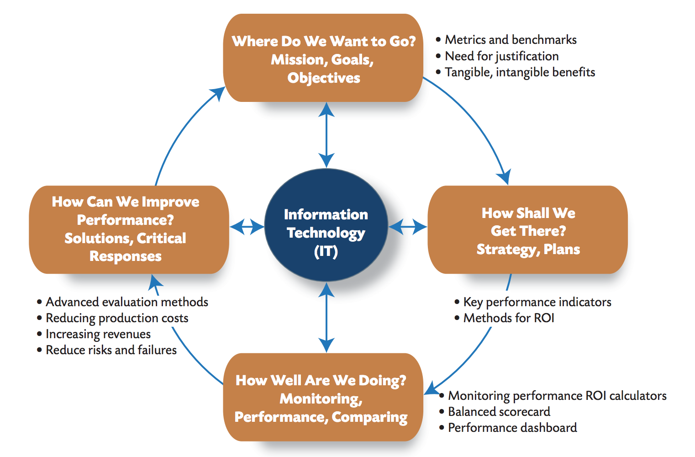
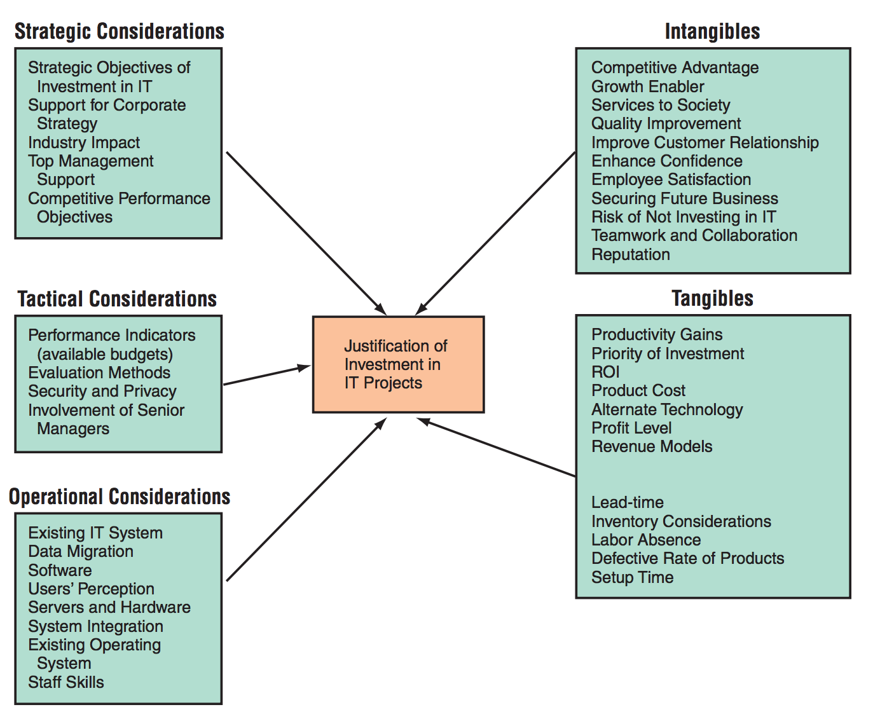
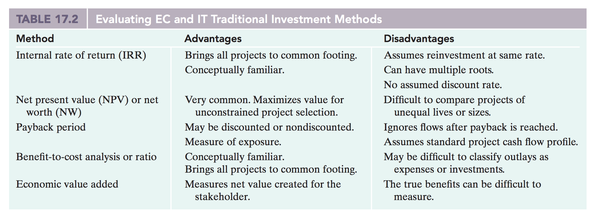
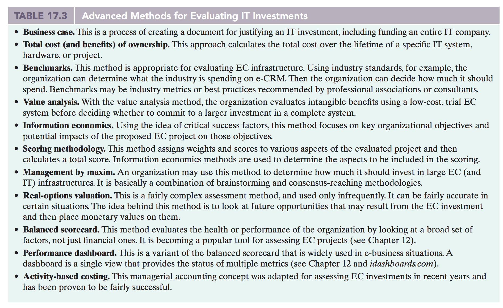

# Information Technology Economics

> Information Technology Economics, Chapter 17
>

## IT-Performance model

The focus is on measuring and justifying IT investments and the benefits of their implementation.

The above is the *business performance management cycle and IT model*.

## Productivity Paradox

It is hard to demonstrate that the heavy investments in IT (over 2 billion per year in the beginning of the 21st century) have increased productivity at the national level.

**A guy called Fisher reports that only 8 percent of total IT spending actually delivers value**.

**The discrepancy between how much we invest in formation technology and the output at the national level has been called the productivity paradox**.

### Productivity

We can define productivity as outputs divided by inputs!

Outputs are calculated by multiplying the amount of units produced (for example, amount of built cars) by their average value.

#### Labor productivity

If inputs are measured simply as hours of work, the resulting ratio of outputs to inputs is *labor productivity*.

#### Multifactor productivity

If other inputs - investments and materials - are included, the ratio is known as *multifactor productivity*.

### Explaining the Productivity Paradox

There are multiple possible explanations:

1. Problems with data or analyses hide productivity gains from IT
2. Gains from IT are offset by losses in other areas
3. IT productivity gains are offset by IT costs or losses

In many cases, these problems large reflect problems with the *administration* of IT, rather than with the technologies themselves. Often, these problems are controllable through **better planning or more effective management techniques**.

### Direct impact

*Direct impact* is stuff such as direct cost savings, revenue generation, major organizational change, and partial success and failures.

This reflects the things that are obvious.

### Second-order Impact

Stuff that has *direct impact* may result in *second-order impact* which is reflected in things like greater market share, strategic advantage, new or improved business processes, and/or better customer service.

These second-order impacts are very difficult to assess and may first occur after a long time period.

## Evaluating IT Investments

Justifying an IT investment means comparing the costs of each project against its **benefits** in what is known as a **cost-benefit analysis**

### Cost-Benefit Analysis

A Cost-Benefit analysis is frequently assessed by *Return Of Investment (ROI)*.

### Why the need to justify IT-investments

After the dot-com bubble crash, companies are more aware of their investments in IT.

But at the same time, according to the book:

- 65% of companies lack the knowledge or tools to do ROI calculations
- 75% have no formal processes or budgets in place for measuring ROI
- 68% percent do not measure how projects coincide with promise benefits six months after completion

Also, companies now realize that IT is not necessarily the solution to all problems. Therefore, IT projects must compete for funding and resources with other internal and external projects.

### When should new IT not be formally justified

There are cases for which formal evaluation may not be needed:

- When the value of the investment is relatively small for the organization
- When the relevant data is not available, inaccurate, or too volatile
- When the IT project is mandated - it must be done regardless of the costs and benefits involved.

### The IT justification process

There are five areas that must be considered in the justification of IT projects.

1. Strategic Considerations
2. Tactical Considerations
3. Operational Considerations
4. Intangibles
5. Tangibles

In words, the major steps are:

- Lay an appropriate foundation for analysis, and then conduct your ROI
- Conduct a good research on metrics and validate them
- Justify, clarify, and document the costs and benefits assumptions
- Document and verify all figures used in the calculation
- Make figures as realistic as possible and include risk analysis
- Do not leave out strategic benefits, including long-term ones. Is the project really bolstering the company's competitive and strategic advantage?
- Be careful not to underestimate costs and overestimate benefits
- Commit all partners, including vendors and top management

### The problem of Intangible Benefits

Many IT projects generate intangible benefits such as:

- faster time to market
- customer satisfaction
- greater organizational agility
- easier distribution

These are desirable benefits, but it is difficult to place an accurate monetary value on them.

For example, many people would agree that e-mail improves communication, but it is not at all clear how to measure the value of this improvement.

Such intangible benefits are complex, yet substantial. **They are common when knowledge workers are involved**.

You may feel like ignoring intangible benefits, but doing so implies that their value is zero which may lead the organization to reject IT investments that could substantially increase revenues and profitability.

### Handling Intangible Benefits

We can tackle this problem by making *rough estimates* of monetary values for all intangible benefits and then conduct a financial analysis, such as ROI, on both the tangible and the intangible benefits.

But, if a technology is acquired because decision makers assigned too high a value to an intangible benefit, the organization could find that it has wasted valuable resources. On the other hand, if it has been estimated too low, the investment may be rejected and then the organization may find that it lost market share to competitors who did implement the technology.

## Transaction costs

These cover a wide range of costs that are associated with the distribution (sale) and/or exchange of products and services.

### Categories of Transaction costs

1. **Search costs**: Buyers and sellers incur costs in locating each other and locating specific products and services.
2. **Information costs**: For buyers, this includes costs related to learning about the products and services of sellers and the basis for their cost, profit margins and quality.
3. **Negotiation costs**: Buyers and sellers need to agree on the terms of the sale. Negotiation costs result rom meetings, communication-related expenses, exchanges of technical data, legal costs, etc.
4. **Decision costs**: For buyers, decision costs result from the evaluation of sellers and their internal processes, such as purchasing approval, to ensure that they meet the buyer's policies.
5. **Monitoring costs**: Buyers and sellers need to ensure that the goods and/or services purchased translate into the goods and services exchanged.

## Revenue Models

When preparing the business case for IT investment, **we should examine potential additional revenues**.

### Kinds of Revenue Models

There are plenty:

- **Sales**: Companies generate additional revenue from selling merchandise or services over their web sites. For example Wal-Mart.

- **Transaction fees**: A company receives a commission based on the volume of transactions made.

- **Subscription fees**: Customers pay a fixed amount, usually monthly, to get some type of service.

- **Advertising fees**: Companies charge others for allowing them to place a banner on their sites.

- **Affiliate fees**: Companies receive commissions for referring customers to others' web sites.

- **Other revenue sources**: For example, allowing people to play games for a fee.

## Return on Investment (ROI)

This is the most common traditional tool for evaluating capital investments.

It is a measure of *percentage* - the higher, the better.

### Calculating ROI

Divide net annual income attributable to a project by the cost of the assets invested in the project.

## Using Net Present Value (NPV)

Cost-benefit analyses are often calculated using NPV. This compares the total value of the benefits with the associated costs.

In a NPV analysis, **future values of benefits are converted to their present-value equivalent**.

Then, the present value of the future benefits can be compared to the costs required to achieve those benefits, in order to determine **whether the benefits exceed the costs**.

**If a project has an NPV greater than zero, it may be a candidate for acceptance**.

### Where NPV works well

It works well in situations where the costs and benefits are well defined (e.g. tangible) - so that it is not difficult to convert them into monetary value.

## Internal Rate of Return (IRR)

If you have an investment that produces a number of cash flows over time, the *internal rate of return (IRR)* can be used.

It is defined to be **the discount rate that makes the NPV of those cash flows equal to zero**.

Some companies set a minimum acceptable IRR based on their own cost of capital and the minimum percentage return they'd like to see from their investments.

## Payback Period

The payback period is the point at which the yearly benefits of a project equal the costs.

## Comparison of Traditional Investment Methods

## Methods for Justifying IT Investment

The methods are generally categorized into:

- **Financial approach**: These methods consider only impacts that can be monetary-valued. They focus on incoming and outgoing cash flows as a result of the investment made. **NPV and ROI are examples of financial-approach methods**

- **Multicriteria approach**: These methods consider *both* financial impacts and non-financial impacts that cannot (easily) be expressed in monetary terms. These methods employ quantitative and qualitative decision-making techniques. For example, *Information economics* and *value analysis* are examples.

- **Ratio approach**: These methods use several ratios such as IT expenditures vs total turnover to assist in IT investment evaluation.

- **Portfolio approach**: These methods apply portfolios to plot several investment proposals against decision-making criteria. These methods are more informative compared to multicriteria methods and generally use fewer evaluation criteria.

None of these approaches are perfect or universal. You need to look at the advantages and disadvantages of each and choose one that applies to the specific situation.

### The Business Case Approach

This is a common method used to justify investments **in large IT projects or even in entire new companies**.

A *business case* is a **written document** that is used by managers **to garner funding for one or more specific applications or projects**.

Its purpose is not only to get approval and funding, **but also to provide the foundation for tactical decision making and technology risk management**.

### Total Cost of Ownership (TCO)

This is an important approach to IT cost evaluation.

**It is a formula for calculating the cost of owning, operating, and controlling an IT system over its life cycle**.

The cost includes:

- acquisition cost (hardware and software)
- operations cost (maintenance, training, support, installation, downtime, etc)
- control cost (security, standardization)

### Total Benefits of Ownership (TBO)

**These benefits cover both tangible and intangible benefits**.

By calculating and comparing both TCO and TBO, one can compute the payoff of an IT investment:

*Payoff = TBO - TCO*.

## Metrics, Measurements and KPIs

### Metrics

Metrics need to be defined properly with a clear way to measure them.

For example, if a metric is *revenue growth*, if must be measurable in some unit such as total dollars or percentage change over time.

### Key Performance Indicators (KPIs)

These are quantitative expressions of critically important metrics (known as critical success factors).

These frequently deal directly with performance, such as sales.

### Balanced Scorecards

The *balanced scorecard* is a method of evaluating the overall health of organizations and projects by looking at metrics in four areas:

- Finance
- Customer Satisfaction
- Learning and growth for employees
- Internal business processes

## Managerial issues with IT

Managers need to be aware of and responsive to the following issues:

1. **Constant growth and change**: IT keeps getting better and faster. It creates both major opportunities *and* large threats as its impacts ripple across almost every aspect of the organization and its environment.

2. **Shift from tangible to intangible benefits**: The economic justification of IT applications will increasingly depend on the valuation of intangible benefits such as increased quality or better customer service. It is much more difficult to accurately estimate the value of intangible benefits prior to actual implementation! Managers need to use assessment methods that bring intangible benefits in the decision-making processes for IT investments.

3. **Not a sure thing**: IT offers opportunities for improvements, but the benefits are not automatic. Managers need to actively plan and control implementations to increase ROI.

4. **Chargeback**: Users have little incentive to control IT costs if they do not have to pay for them at all. It is good to have a chargeback system that has the primary objective of encouraging user behaviors that correspond to organizational behaviors.

5. **Risk**: Investments in IT can be more risky than investments in other areas (because of intangible benefits, etc). The level of risk must be evaluated before committing to IT projects.

## Key takeaways

- Enterprises have limited resources. So, they cannot embark on all projects at once. So, **IT projects must be evaluated against competing demands for funds and time**.

- It is difficult to prove that the spending on IT has increased national or industry productivity. This is called the productivity paradox.

- Evaluating IT investment requires finding the total costs of ownership (TCO) and the total benefits of ownership (TBO) and subtracting the costs from the benefits. The value of information to an organization should be part of that calculation.

- **The major difficulty in evaluating IT investment is assessing the intangible benefits**.

- To include intangible benefits in IT justification, one may attempt to quantify them, to list them as arguments, or to ignore them.

- NPV and ROI methods work well **with tangible benefits**.

- When intangible benefits are involved, one may try to use **value analysis, information economics, benchmarks, management by maxim, real-option valuation, balanced scorecard and activity-based costing**.

- Chargeback systems may be used to regulate the use of shared information systems.