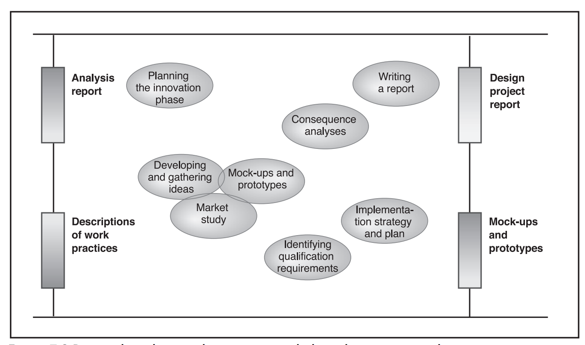
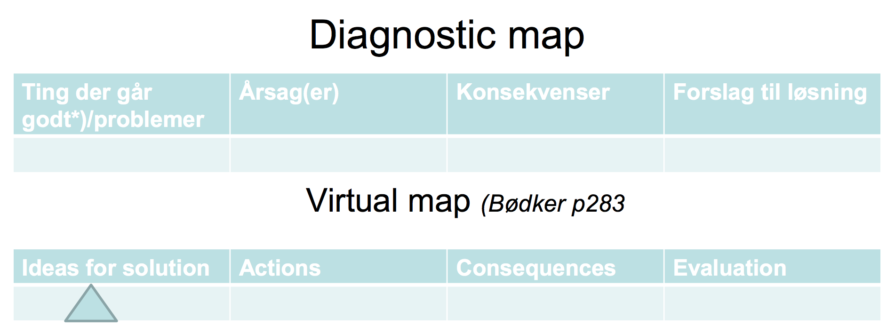
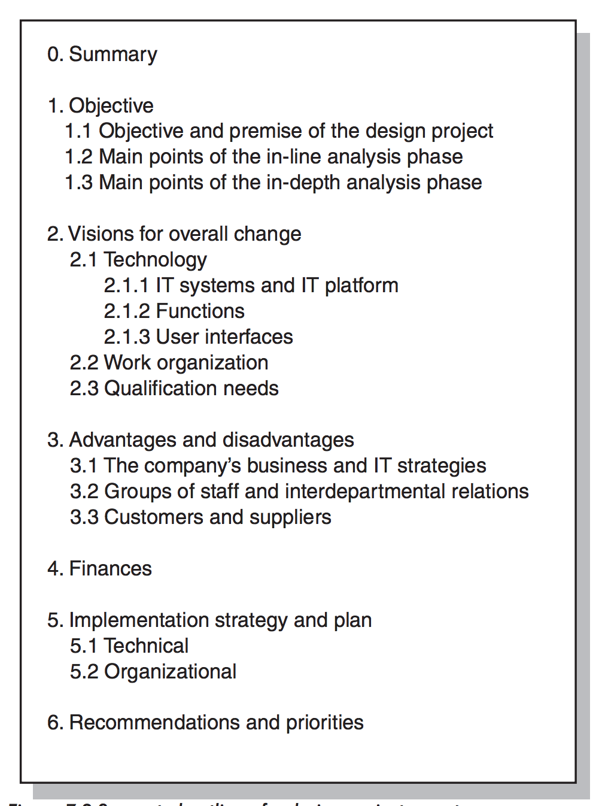

# Innovation Phase

> Participatory IT Design, Chapter 7
>

This is the final phase of a design project. Here, the project group **develops visions for overall change**.

## Aim

The aim is to develop **one or more coherent visions for meeting the goals, needs, and opportunities identified in the in-depth analysis phase**.

This/These must correspond to the company's Business- and IT strategies.

It also includes an **evaluation of the advantages, disadvantages, and costs of implementing a design vision for the company as a whole and for different groups of the staff**.

## Objective

The objective is to prepare users and management for forthcoming changes and to **provide a viable foundation for decision making in the form of a Design Project Report**.

The Design Project Report also serves to document the rationale behind the visions for change.

## Possible Phase Activities

### Planning

To plan the innovation phase, we break it down into a series of activities.

We then decide which techniques and representation tools best support these activities.

### Validating ideas with users and stake holders (Anchoring Visions)

Have users try the new way with horizontal or vertical prototypes.

Go from diagnostic map (as-is) to a virtual map (to-be).

### Market Study

This is where we find out **whether standard systems exist that meet a company's needs that are revealed in the in-depth analysis phase**.

We can do this by organizing a company visit.

Then, the potential systems should be demonstrated or tested **in as realistic a setting as possible**. If possible, future users should try performing their everyday tasks using the proposed system with the organization's own data!

### Developing and Gathering ideas

The starting point my be either ideas and requirements for **work organization** or ideas and requirements for **technology**, including requirements for **compatibility with other existing or planned IT systems**.

We can use techniques such as:

- Virtual mapping
- Drawings
- Collages
- Scenarios

Obviously the visions must be judged against any economic or technological limitations and adjust the requirements accordingly.

### Mock-Ups and Prototypes

These are very good for simulating selected elements of envisioned IT systems prior to their implementation.

Vertical prototypes (functional prototypes) are great for illustrating the functionality of the proposed IT systems.

They help the project team evaluate the relationship between technological requirements and readiness for change in the organization.

### Identifying Qualification Requirements

Here we assert that future users acquire the qualifications and skills necessary to use the new technology within the proposed work organization.

An obvious example of these skills is to be able to actually operate the IT systems.

**Results require habitual changes - these require follow-ups**.

There are some practical tips:

- Create super users
- Local ambassadors
- Continuous Follow-ups
- Courses (internal and/or external)

### Consequence Analyses

This is where identify advantages and disadvantages that can be predicted to result from implementation of the design visions.

We could supplement this with a SWOT analysis, for example.

#### Discovering advantages and disadvantages

It is often easy to identify advantages since these have been discussed throughout the design project.

However, identifying the disadvantages can be difficult.

One way to do so is by testing mock-ups and prototypes as well as conducting reviews of scenarios with users outside the project group.

**Use of new technology always entails certain disadvantages. If the project group is not able to describe any of these, it looks like the project group is unable to critique its own solutions**.

Examples of potential disadvantages:

- Problems in the organizational implementation of the design visions
- Changes to the work organization and work practices (such as job cuts and staff reorganization)
- Costs of training, etc
- New routines in using proposed systems that present no immediate advantages to the user. If a system forces the user to perform tasks in a different way, it will probably be a bit annoying, at least in the beginning.

### Implementation Strategy and Plan

**Risk management is an important element of the strategy for an implementation project**.

#### Incremental (Phased)

When risks are assessed as high and time is not of the essence, we may opt for an incremental strategy in which the design visions are gradually realized. Then, the experiences will be continually evaluated and the projected adjusted accordingly.

#### Pilot Projects

In a pilot project, part of the system would be installed at the company for a short period of time, enabling selected aspects of its functionality to be tested.

Organizational changes can then be tested according to a similar strategy, where experience is generated through experimentation of a test that runs over a limited period of time.

#### Plunge

If the company is significantly pressed for time, it amy involve instant or rapid implementation, but this of course entails greater risk since it cannot be monitored and gradually adjusted during implementation.

#### Plan

We follow up on the implementation strategy with a general plan for activities to be carried out under the company's implementation project.

## Writing a Design Project Report

The Design Project Report:

- Sums up the background of the Design Project
- The results of the Initiation, In-Line, and in-Depth phases
- Presents one or more visions for overall change and an order of priority among them.
- Includes an analysis of foreseeable advantages and disadvantages.
- Contains a financial estimate as well as a proposed strategy and plan for technical and organizational realization of the vision(s) with the highest priority.

## Results of the Phase

The main result of the phase is a design project report, **which may be supplemented by mock-ups and prototypes illustrating ideas central to the proposed IT systems**.

The company is now ready to decide if it should proceed with an Implementation project!

## Initiation TL;DR

- Results in a Design Project Report.
- Proposed Vision for change are developed.
- They are evaluated in terms of advantages, disadvantages and costs of implementing in a cost-benefit analysis.
- When we develop and gather ideas, we can use techniques such as:
  - Virtual mapping
  - Drawings
  - Collages
  - Scenarios
- We also identify the qualification requirements needed to ensure that future users has the qualifications an skills necessary to use the new technology within the proposed work organization
- Finally we create an Implementation Strategy and Plan