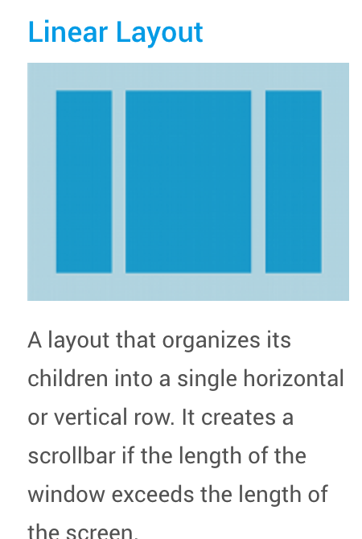
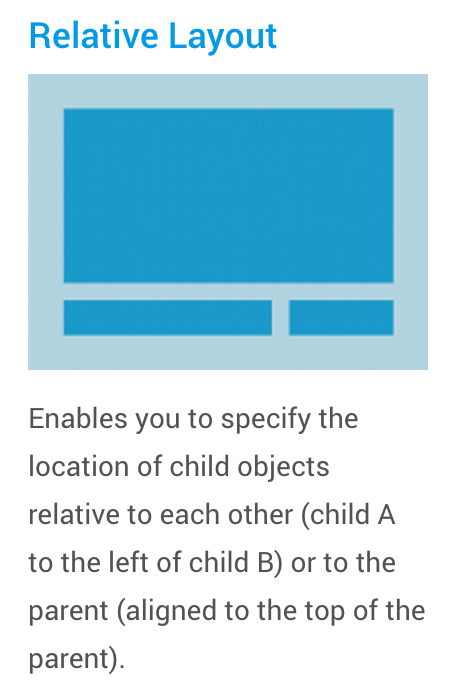
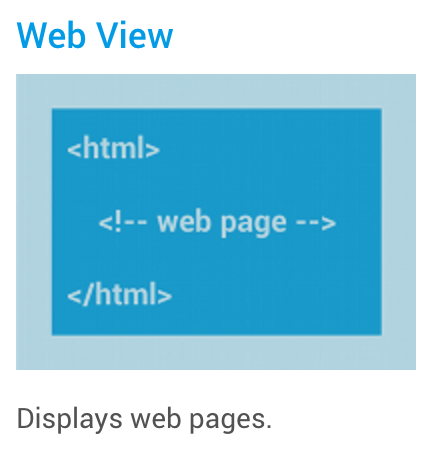

# Android UI

> [Declaring layouts in Android](https://developer.android.com/guide/topics/ui/declaring-layout.html)

## Layouts

A layout defines the **visual structure** for a user interface. For example, the UI for an Activity or app widget.

### Ways to declare layout in Android

#### In XML

Android provides a straightforward XML vocabulary.

#### Instantiate layout elements at runtime

Your app can create `View` and `ViewGroup` objects programmatically.

### Write the XML

Each layout file must contain **exactly one** root element, which must be a `View` or a `ViewGroup` object.

Here's an example:

```xml
<?xml version="1.0" encoding="utf-8"?>
<LinearLayout xmlns:android="http://schemas.android.com/apk/res/android"
              android:layout_width="match_parent"
              android:layout_height="match_parent"
              android:orientation="vertical" >
    <TextView android:id="@+id/text"
              android:layout_width="wrap_content"
              android:layout_height="wrap_content"
              android:text="Hello, I am a TextView" />
    <Button android:id="@+id/button"
            android:layout_width="wrap_content"
            android:layout_height="wrap_content"
            android:text="Hello, I am a Button" />
</LinearLayout>
```

### Placement of XML files

You must palce it in your Android project's `res/layout/` directory, so it will properly compile.

### Loading the XML layout

Do this within the `onCreate()` callback in the related `Activity`. In the following example, the layout file is called: `main_layout.xml`:

```java
public void onCreate(Bundle savedInstanceState) {
    super.onCreate(savedInstanceState);
    setContentView(R.layout.main_layout);
}
```

### Attributes in XML

Much of this is just like you know it from HTML (Except, of course, of the android namespace (android:attributename)).

But Android really likes "layout parameters", something that you rarely see in modern HTML.

#### ID

An ID attribute uniquely identifies the `View` within he tree. This ID is referenced as an integer, but the ID is typically assigned in the layout XML as a string, in the `id` attribute.

The syntax is:

```xml
android:id="@+id/my_button"
```

The `+` symbol means that this is a new resource name that must be created and added to our resources.

#### Importance of ID's

They become especially important in relative layouts where sibling views can define their layout relative to another sibling view, identified by its unique ID.

### Layout parameters

Layout parameters are XML atrributes named `layout_something`.

## Common Layouts

There aredifferent layout types built into Android:

### Linear Layout



A Linear layout organizes ints children into a single horizontal or vertical row. It creates a scrollbar if the length of the window exceeds the length of the screen.

### Relative Layout



Enable you to specify the location of child objects relative to each other (child A to the left of child B) or to the parent (aligned to the top of the parent).

### Web View



Simply displays web pages.

## Dynamic layouts with An Adapter

You can build dynamic layouts by subclassing `AdapterView`

With such you can build stuff like single column lists or a scrolling grid of columns and rows.