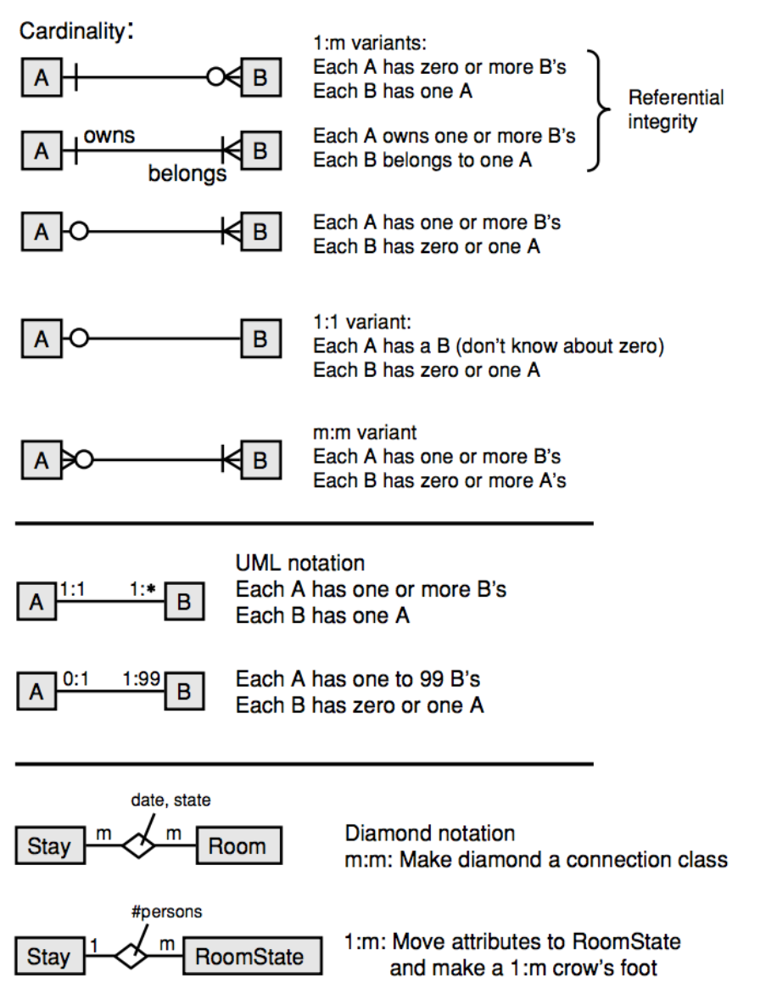

# Data modeling and presentation
> Lauesen 3.1-3.2 and 16.1-16.5

## Gestalt laws
A *gestalt* is something we perceive as a unit or an object.

### Meaning
**The word *gestalt* is German and means a figure or a shape**.
A gestalt law say what we intuitively perceive as a coherent unit or object, without any training or conscious effort.

### Law of proximity
The law of proximity states that:
*Pieces that are close together are perceived as belonging together*.

In the image above, we perceive example A as four columns of bubbles to the left and four horizontal rows to the right. Bubbles that are close together seem to form a shape. It is the *law of proximity* that is at work.

Consider this example:

In the example above, we find the page numbers in left side of the first box as being related to the right column because of their proximity to it, even though they are actually related to the left-hand column.

By connecting the row with dots we use the law of good continuation to make it clear that the numbers are related to the entries to the left of the numbers.

### Law of closure
The law of closure states that:
*The area inside a closed line is perceived as a shape*.

Consider example C. We see four "wings" or triangle shapes. We do this because their encapsulating lines is *closed*.

But the law of closure also is at work here:

We see the "OK" button as related to the other options inside the frame, not only because of the law of proximity, but also because of the law of closure. The OK button might do something completely unrelated to the radio buttons at the left, but we don't see it that way.

### Law of good continuation
The law of good continuation states that:
*Pieces on a smooth line are perceived as belonging together*.

Check out example D. A clear "path" is clearly seen even though it is made up of individual pieces.

### Law of similarity
The law of similarity states that:
*Things that look alike are perceived as belonging together*

On the image, we perceive the small crosses as a single, weak gestalt. So, even though the crosses might be far away from each other (and thus not caught by the law of proximity), we find them related due to the law of similarity.

We could also have used color to signal the similarity.

### Law of parallel movement
The law of parallel movement states that:
*Things that move in parallel are perceived as belonging together*

This one ararely plays a role on user interfaces which tend to be semi-static.

## Data modeling
### The E/R Model

Entities has attributes. That is like classes with fields. You know this already. Underlined ones are primary keys. Attributes with a dotted underline is foreign keys.

**Try to convert m:m relationships to 1:m relationships with connection classes as always!**

### Enumeration notation
In BSDB, the preferred notation for enumerations is:
`attr (member1 | member2 | ...memberN)`

### Subclasses in E/R modelling
E/R modelling doesn't have the notation of subclasses.

There are some ways to come around that:

However, don't use subclasses in E/R diagrams unless it is very important.

### Cardinality

Notice how the circle means optional and the vertical line means mandatory.

## Data dictionary
Used for describing data that an E/R model cannot describe. For example, special cases or how the names in the data model relate to the application domain.

A data dictionary is a verbal data description and has:

- A name of the entity.
- A description
- A list of attributes, their types and a description of them.
- Examples