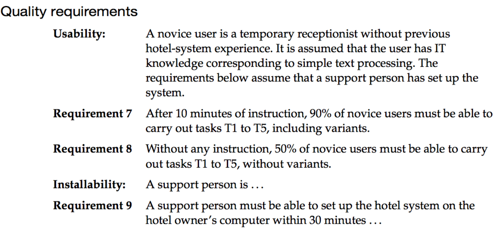
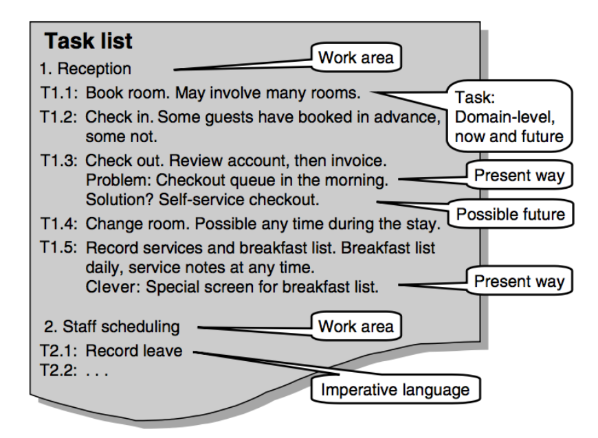
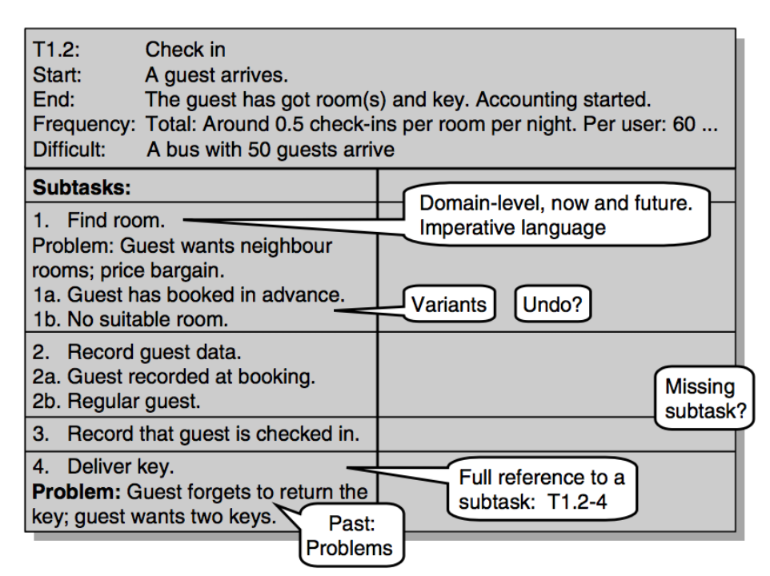

# Analysis, visions and domain description

> Lauesen 5

In this chapter, it's all about the BDSA stuff about requirements elicitation and understanding the application domain.

**In BSDB, *Requirements Elicitation* is called *Systems Analysis*.**

## Concepts

### Systems Analysis

Like Requirements Elicitation in BDSA. Here we figure out why a system is needed, the functional/non-functional requirements, who the users are and generally obtain knowledge about the application domain.

### Vision

We need a vision of what the new system will do. *How* will the goals be met. *Who* will use the new system and *which* tasks will they carry out? Vision is part of the requirements elicitation. It's basically just obtaining enough knowledge that we can construct a mental image of the product we're building.

**The two most important documents are the data model and the task descriptions**.

### Requirements analysis (not really part of the BSDB scope)

In BDSA, functional requirements are paired with requirements for technical interfaces and quality assurances which combined makes up the non-functional requirements.

Here, the functional requirements are strictly task-related ("fit for use") where quality requirements could be:



## Data model and data description

Data modeling is a presentation-independent map of the data stored in a computer system. In OO, it is called a class model.

It specifies the persistent data to be stored in the system and the relationships between the data.

### Data model


In BSDB, this data model is based on an E/R diagram which you already covered [here](./data_modeling_and_presentation.md)

### Data description

Data descriptions too are covered [here](./data_modeling_and_presentation.md) as data dictionaries. A verbal description of each entity.

## Task descriptions

A task description explains a user task in some detail. One way to do so is **simply to list the tasks by their name**.

We need them to ensure that the user interface can support the tasks in both simple and complex cases. It is like something in between use cases and scenarios in OOA.

## Annotated task list



An annotated task list divides tasks into several **work areas**. **Kind of like actors in a use case diagram, except rather than calling it "receptionist" or "manager", we'd write "reception" or "management" - the actor is the department, not a person**.

### Notation

- We use **T** for *Task*.
- We use a number for the work area.
- We use a number for the task within the work area.
- We add notes about special situations to deal with (edge cases)

### Domain level

**We only describe what the user and computer do together - the Human-Computer interaction**.

We don't talk about what the computer shows on the screen, which functions the user clicks and so on.

### Language

**We use imperative language**.
Rather than write *"User books room"*, we write *"Book room"*.
This way, we hide who is doing what.

### Don't use now or future (unless...)

We try to hide whether this is how it is done today or how it will be done in the future

**unless**:

- If there is a problem in the way it is done today.
  - See the *"Problem"* and (proposed) *"Solution"* under task T1.3 above.
- If there is a particularly **clever** way of doing it today.
  - See the *"clever"* section at T1.5.

## Task description template



This is Lauesens take on *use cases*. Rather than descripe what the actor does and what the system does, **instead it only describes what they do *together*.**

The template is:

### Task header

- Each task has a **number and a name** (like tasks in the annotated list).
  - For example, *"T1.2: Check in"*
- Each task has a **start**. What initiates the start of the task? Also known as a *trigger* which is probably a better word for it.
- Each task has a **end**. What triggers the end of the task? **Also take care of failures and write them here**. They too should trigger the end of the task.
- Each task has a **frequency**. **It lists the total AND per user**. How often is the task carried out?
  - For example, *"Total: 20 check-ins per day. User: 5 check-ins per day."*.
- Each task has a **Difficult**: Shows a scenario where the task is hard.
  - For example, *"A bus with 50 guests arrive"*.

### Subtasks

**This is the central part of the template**.

It is like tasks in the annotated task list, except they aren't prefixed with *"T"*. Instead, they are just listed ordered. Like annotated task lists, they too  have problems and proposed solutions. See the image above.

#### Variants

This is what is different from annotated task lists. Here, we list the main task numbered, and then below it list all variants with a suffixed ascending letter.
For example:

```text
1. Book room
1a. Guest has booked in advance
1b. No suitable room.
```

#### Referring to tasks and subtasks

We use the notation:
T[task number]-[subtask number]

For example: T1.2-4 which means *"Task 1.2, subtask 4"*.

#### Special variant - Undo

We must always consider *Undo* - The user should at any time be able to cancel what he has done or undoing the task after having completed it.

### Other task headers

- Sometimes *trigger* is used instead of *start*.
- Sometimes *goal* or *purpose* is listed. It is similar to *end* and may replace it.
- Sometimes *User* or *Actor* is used. Which kind of users will carry out the task? Lauesen wants us to use *work area* rather than actors.
- Sometimes *Precondition* is listed: Soemthing that must be fulfilled before the task can start. For example: *"Precondition: The guest must have booked in advance"*.

### Optional subtasks

A task can be suffixed with (optional) to explicitely state that it is optional:


### Task sequence

Even though the tasks are enumerated, **no sequence is prescribed**.

It *is* a good idea to show a typical sequence, **but it doesn't mean that it is the only one**.

## Work area and user profile


This is where we describe the work areas and user profile as well as the general conditions of the work.

### Work area

Here we describe *how* the departments tasks are carried out. Are they standing, are they frequently interrupted, etc.

This is a textual description of the environment.

### User profile

We can list as many user profiles as we feel believe will execute the tasks.

The notation is:

- **User profile**: Is it a student job? Temporary job? Highly specialized?
- **IT knowledge**: How much IT knowledge does the person have?
- **IT attitude**: What is the persons attitude towards IT?
- **Domain knowledge**: How much application domain knowledge does the person have?
- **Domain attitude**: Is it the career of the persons life or just temporary?
- **Physical abilities**: May the person have any physical handicaps?

## Good, bad and vague tasks


There are some rules for defining "good" tasks:

### Closure rule

Each user task must be closed: It must finish with a meaningful goal. A true task should run *from trigger to closure*, preferably without breaks.

### Session rule

Small, related tasks performed in the same work session without breaks should be grouped together under a single task description.

Some tasks are closed when looked upon individually, but they belong together and are carried out in a single session, so they should be described as a single task.

### Domain level rule

Describe what user and computer do **together**. **Hide who does what with imperative language**.

### Don't program rule

Don't go into detail with *how* the task is performed, the exact sequence of steps involved, under which conditions something is done, etc.

### Examples of good and bad rules

#### "Manage rooms" - bad

It is not closed and is an on-going activity.

#### "Enter guest name and address" - bad

There is no closure to this task. It is usually part of something else. Users won't feel that they have achieved anything just by doing that.

#### "Book a guest" - good

It is closed and results in something meaningful.

## High-level tasks

It is often a good idea to define high-level tasks which is a long activity that has several smaller, closed tasks such as booking, checking in and checking out. A high-level task could then be *"A stay at the hotel"*.

## Vague tasks and how to deal with it


Sometimes tasks are vague, and there is nothing you can do about it. Like, monitoring a nuclear plant. There is no clear start or end and the task isn't *closed*. Lauesen is OK with this, and simply asks us to "break the rules" and write them up anyway as in the illustration.

## Scenarious and Use cases

### Vivid scenarios


These are descriptions of a fictional situation in the application domain.

These give us good intuition about the work area.

### Case scenarios

This is scenarios from UML (*"A scenario is an instantiation of a use case"*).

### Use case

A use case is a kind of task description, but **where it is made explicit what the computer does and what the human does**. The work is split between the two.

#### Use case diagrams

These are the use case diagrams from UML.


#### Use case models/descriptions

This is Lauesens take on a textual use case:


