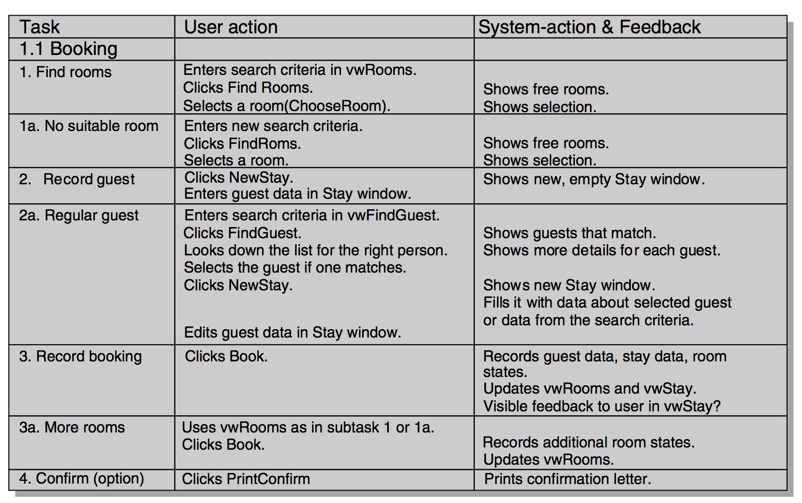

# Functional design

> Lauesen 7

In functional design, **we add functions to the virtual windows**.

## Steps

- We identify the necessary *semantic functions* and *search functions*. We design the details of any non-trivial data entry functions.
- We turn the virtual windows into final *screens*.
- We identify the necessary functions to *navigate* between screens.
- We design the presentation of the functions: push buttons, menus, icons, drag-and-drop, etc. **This is the *syntactic design* of the functions**.

## Semantic functions and searching

To identify system functions, we take the tasks one by one and manually carry them out by means of the virtual windows.

### Procedure

1. Place the virtual windows on a desk. Imagine that they are on a huge computer screen.

2. Look at an important and frequent task.

3. Look at the first subtask and imagine how you would carry it out. Which virtual windows would you have to look at, and which fields would you have to fill in? **The system functions you identify in this way are semantic functions, search functions and non-trivial data entry functions. We don't care about navigation yet**!

4. When you identify a button, give it a name and write it down besides the virtual window where it was needed. Write a short description of what it should do (a *mini-spec*).

5. Look at the next subtask and imagine how to carry it out. Identify system functions (buttons), but try to reuse the buttons you have defined already.

6. When you are through all subtasks and variants, the system should be able to support the entire task. Review what you have defined.

7. Look at the remaining tasks one by one in the same way.

8. Review the entire set of functions. Check whether it is possible for the user to switch between two or more tasks at the same time. **Check that standard functions are provided such as Undo, Print and Data exchange**.

### Mini-specs

Mini-specs is simply short, clear descriptions of a feature that a virtual window supports in terms of **what the computer must do** Here's a list of examples:

Again, it describes the computer's actions, especially in terms of the E/R changes it will make.

## Standard functions

There are some task variants that are common to all domains:

- **Undo**: The user should be able to undo all semantic functions, prefably also after having completed the task.
- **Print**: There is often a need for printing varous things.
- **Data exchange**: Often there is a need for exchanging data with other programs (*"export as csv"*, etc).

## Actions and feedback (use cases)

We can write use cases for each task if we want to:

### Comparison with traditional use cases

Traditionally, use cases are made very early as part of requirements elicitation or analysis and before prototyping. Lauesen wants it to go *after* creating virtual screens.

## A good Undo strategy

1. Identify the functions to undo.
2. Support slips - people hit the wrong button sometimes, it happens.
3. Support exploration. The Undo button let's users get out of a mess.
4. Support domain mistakes. A user might intentially make change, but later find out that it was the wrong decision and need to revert it.
5. Prevent slips and domain mistakes for non-reversible functions. "Are you sure?" is always a good way to fight slips.

### What to undo

#### For navigation

*Close*, *Cancel* and *Back* is often enough.

#### For data entry

Chronological undo. Roll back time using saved data.
Track changes: accept/delete single change.

## Single-page vs Multi-page platform

- A **Single-page platform** is like the web. The app shows only 1 page at a time on the screen. A good metaphor is a Book.

- A **Multi-page platform** may show several, potentially overlapping pages at the same time. Examples are typical OS's like Windows or MacOS. A good metaphor is a Desktop.

## Terminology

### Screen

The word *screen* may mean the physical computer screen, a workspace or a page shown by the application. Lauesen refers to "pages" (or *Views*) when he is using the term "screen".

### Page

A page (or a View) is the largest gestalts that the application shows. That's a horrible definition.

### Window

On a multi-page platform, we often call the pages *windows*. A part-screen workspace is also called a window.

### Frame

We use the word *frame* to denote a rectangle within a page. Frames cannot overlap, but the user may on some platforms drag the borders between frames.