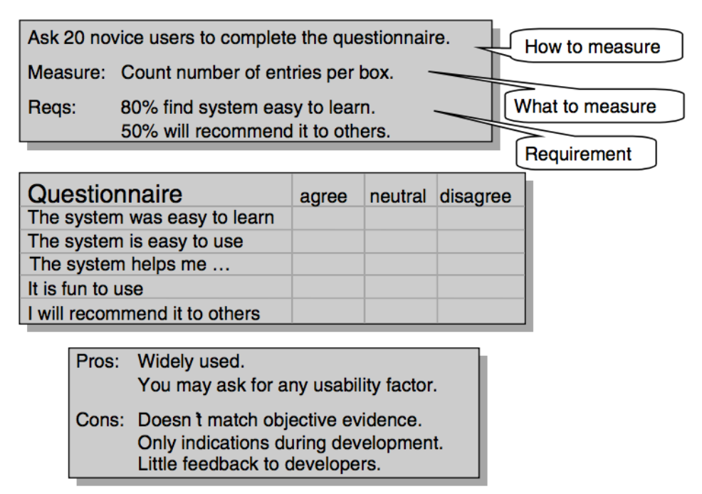

# Templates

## Annotated Task list

<table>
	<caption>Task list</caption>
	<tr>
		<td><strong>[num]. Text Here</strong></td>
		<td></td>
	</tr>
	<tr>
		<td><strong>T[num].[num]</strong> Text here</td>
		<td>Text Here</td>
	</tr>
</table>

## Task Description

<table>
	<caption>Task descriptions</caption>
	<tr>
		<td><strong>T[num]</strong></td>
		<td>Text here</td>
	</tr>
	<tr>
		<td><strong>Start:</strong></td>
		<td>Text here</td>
	</tr>
	<tr>
		<td><strong>End:</strong></td>
		<td>Text here</td>
	</tr>
	<tr>
		<td><strong>Frequency:</strong></td>
		<td>
			<strong>Total:</strong>
			[Text Here]
			 <strong>User:</strong>
			[Text Here]
		</td>
	</tr>
	<tr>
		<td><strong>Difficult:</strong></td>
		<td>Text here</td>
	</tr>
	<tr>
		<td><strong>Subtasks:</strong></td>
		<td></td>
	</tr>
	<tr>
		<td><strong>[num].</strong> Text here (optional) 
		<strong>Problem:</strong> Text Here 
		<strong>Solution?:</strong> Text Here 
		<strong>Clever:</strong> Text Here 
		<strong>[num]a.</strong> Text Here 
		<strong>[num]b.</strong> Text Here 
		</td>
		<td></td>
	</tr>
</table>

## Work area and user profile

<table>
	<caption>
	[WORK AREA NAME] 
	<em>[Description]</em>
	</caption>
	<tr>
		<td><strong>User profile</strong></td>
		<td><strong>IT Knowledge</strong></td>
		<td><strong>IT Attitude</strong></td>
		<td><strong>Domain knowledge</strong></td>
		<td><strong>Domain attitude</strong></td>
		<td><strong>Physical abilities</strong></td>
	</tr>
	<tr>
		<td>Text here</td>
		<td>Text here</td>
		<td>Text here</td>
		<td>Text here</td>
		<td>Text here</td>
		<td>Text here</td>
	</tr>
</table>

## Design Defects

<table>
	<caption>Design Defects</caption>
	<tr>
		<td><strong>D100.</strong></td>
		<td>Text here</td>
	</tr>
</table>

## Subtasks vs Visible data vs Virtual Windows

<table>
	<caption>Relation between subtasks, visible data and virtual windows</caption>
	<tr>
		<td><strong>T[num]</strong></td>
		<td>Text here</td>
		<td></td>
	</tr>
	<tr>
		<td><strong>Start:</strong></td>
		<td>Text here</td>
		<td></td>
	</tr>
	<tr>
		<td><strong>End:</strong></td>
		<td>Text here</td>
		<td></td>
	</tr>
	<tr>
		<td><strong>Frequency:</strong></td>
		<td>
			<strong>Total:</strong>
			[Text Here]
			 <strong>User:</strong>
			[Text Here]
		</td>
		<td></td>
	</tr>
	<tr>
		<td><strong>Difficult:</strong></td>
		<td>Text here</td>
		<td></td>
	</tr>
	<tr>
		<td><strong>Subtasks:</strong></td>
		<td><strong>Visible data:</strong></td>
		<td><strong>Virtual windows:</strong></td>
	</tr>
	<tr>
		<td><strong>1.</strong> Text here 
		<strong>Problem:</strong> Text Here 
		<strong>Solution?:</strong> Text Here 
		<strong>Clever:</strong> Text Here 
		<strong>1a.</strong> Text Here 
		<strong>1b.</strong> Text Here 
		</td>
		<td></td>
		<td></td>
	</tr>
</table>

## Use cases

<table>
	<caption>Use cases</caption>
	<tr>
		<td><strong>Task:</strong></td>
		<td><strong>User Action:</strong></td>
		<td><strong>System-action:</strong></td>
	</tr>
	<tr>
		<td><strong>[NUM].[NUM] Text here</strong></td>
		<td></td>
		<td></td>
	</tr>
	<tr>
		<td>1. Text here</td>
		<td>Text Here.</td>
		<td>Text Here</td>
	</tr>
</table>

## CREDO

<table>
	<caption>Data model versus virtual windows</caption>
	<tr>
		<td></td>
		<td><strong>Entity:</strong></td>
		<td>Entity1</td>
		<td>Entity2</td>
		<td>Entity3</td>
		<td>Entity4</td>
	</tr>
	<tr>
		<td><strong>Virt. window:</strong></td>
		<td></td>
		<td></td>
		<td></td>
		<td></td>
		<td></td>
	</tr>
	<tr>
		<td>Room1</td>
		<td></td>
		<td><code>CREDO</code></td>
		<td><code>CREDO</code></td>
		<td><code>CREDO</code></td>
		<td><code>CREDO</code></td>
	</tr>
</table>

<table>
	<caption>Data model versus tasks</caption>
	<tr>
		<td></td>
		<td><strong>Entity:</strong></td>
		<td>Entity1</td>
		<td>Entity2</td>
		<td>Entity3</td>
		<td>Entity4</td>
	</tr>
	<tr>
		<td><strong>Task:</strong></td>
		<td></td>
		<td></td>
		<td></td>
		<td></td>
		<td></td>
	</tr>
	<tr>
		<td>Task1</td>
		<td></td>
		<td><code>CREDO</code></td>
		<td><code>CREDO</code></td>
		<td><code>CREDO</code></td>
		<td><code>CREDO</code></td>
	</tr>
</table>

## Measuring Task Time

<table>
	<caption>Task time</caption>
	<tr>
		<td><strong>[SYSTEM NAME]</strong></td>
		<td></td>
	</tr>
	<tr>
		<td><strong>Users:</strong></td>
		<td>Text here</td>
	</tr>
	<tr>
		<td><strong>Task 1:</strong></td>
		<td>Text here</td>
	</tr>
	<tr>
		<td><strong>Measure:</strong></td>
		<td>Text here?</td>
	</tr>
	<tr>
		<td></td>
		<td></td>
	</tr>
	<tr>
		<td></td>
		<td></td>
	</tr>
	<tr>
		<td><strong>Requirements:</strong></td>
		<td>
			Task 1: [num] succeed 
			Task [n]: [num] out of [num] must succeed within ___ min. 
		</td>
	</tr>
</table>

## Measuring with Opinion Polls

<table>
	<caption>Ask [num] users to complete the questionnaire</caption>
	<tr>
		<td><strong>Measure:</strong></td>
		<td>Text here</td>
	</tr>
	<tr>
		<td><strong>Requirements:</strong></td>
		<td>
			[num]% Text here 
			[num]% Text here 
		</td>
	</tr>
</table>

<table>
	<caption>Questionnaire</caption>
	<tr>
		<td></td>
		<td>Agree</td>
		<td>Neutral</td>
		<td>Disagree</td>
	</tr>
	<tr>
		<td>The system was easy to learn</td>
		<td></td>
		<td></td>
		<td></td>
	</tr>
	<tr>
		<td>The system is easy to use</td>
		<td></td>
		<td></td>
		<td></td>
	</tr>
	<tr>
		<td>The system helps me [TEXT HERE]</td>
		<td></td>
		<td></td>
		<td></td>
	</tr>
	<tr>
		<td>It is fun to use</td>
		<td></td>
		<td></td>
		<td></td>
	</tr>
	<tr>
		<td>I will recommend it to others</td>
		<td></td>
		<td></td>
		<td></td>
	</tr>
</table>

## Measuring with Score for understanding

<table>
	<caption>
		Ask [num] [SYSTEM NAME] users what these error messages mean: 
		[ERROR NAME 1] 
		[ERROR NAME 2] 
		Ask them also: 
		<em>[QUESTION]</em>
	</caption>
	<tr>
		<td><strong>Measure:</strong></td>
		<td>Assess answers on scale A-D</td>
	</tr>
	<tr>
		<td><strong>Requirements:</strong></td>
		<td>
			[num]% of answers marked A or B
		</td>
	</tr>
</table>

## Measuring with Guideline adherence

<table>
	<caption>
		Ask an expert to review the UI and identify deviations from [GUIDELINE NAME HERE].
	</caption>
	<tr>
		<td><strong>Measure:</strong></td>
		<td>Number of deviations per sreen.</td>
	</tr>
	<tr>
		<td><strong>Requirements:</strong></td>
		<td>
			At most [NUM] deviations per screen.
		</td>
	</tr>
</table>

## Data dictionary

<table>
	<caption>
		Data dictionary
	</caption>
	<tr>
		<td><strong>D[Num]: Class: [Name]</strong></td>
		<td></td>
	</tr>
	<tr>
		<td>Description</td>
		<td></td>
	</tr>
	<tr>
		<td><strong>Examples:</strong></td>
		<td></td>
	</tr>
	<tr>
		<td>a.</td>
		<td>Text Here</td>
	</tr>
	<tr>
		<td>b.</td>
		<td>Text Here</td>
	</tr>
	<tr>
		<td><strong>Attributes:</strong></td>
		<td></td>
	</tr>
	<tr>
		<td>[Num]. [Name]</td>
		<td>
			[Type] 
			[Description]
		</td>
	</tr>
	<tr>
		<td>[Num]. [Name]</td>
		<td>
			[Type] 
			[Description]
		</td>
	</tr>
</table>