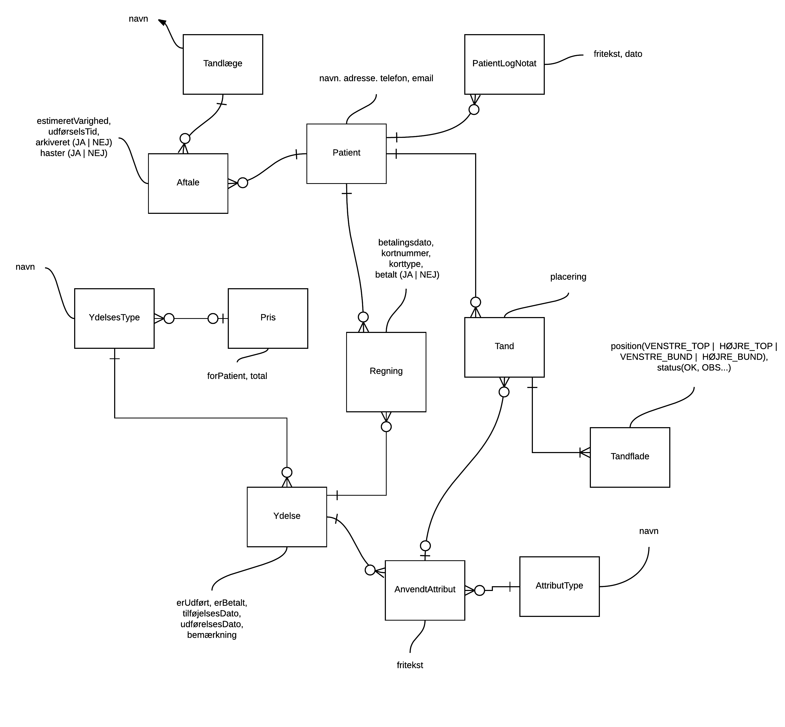
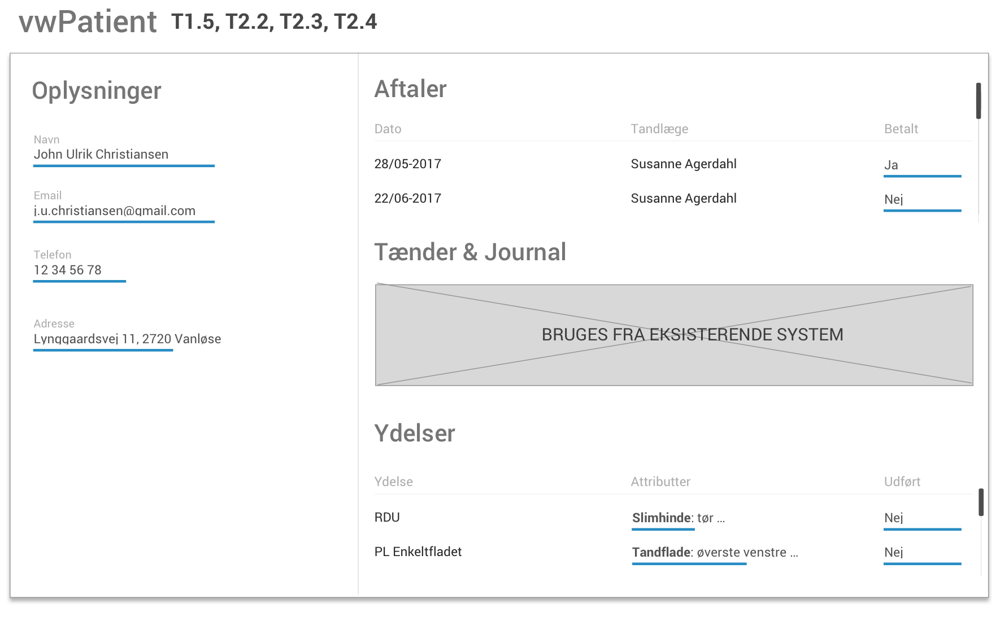
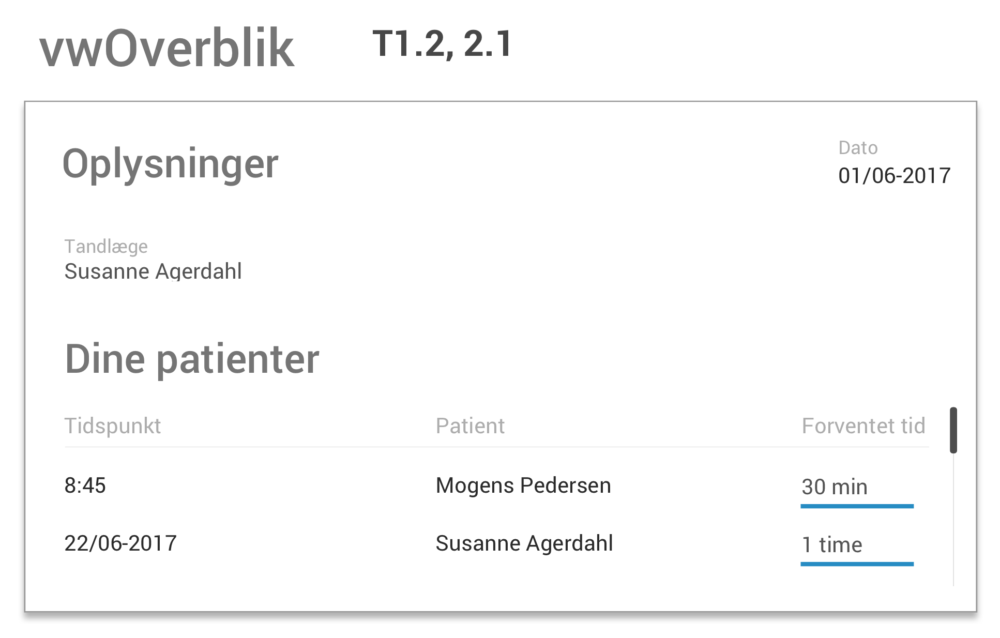
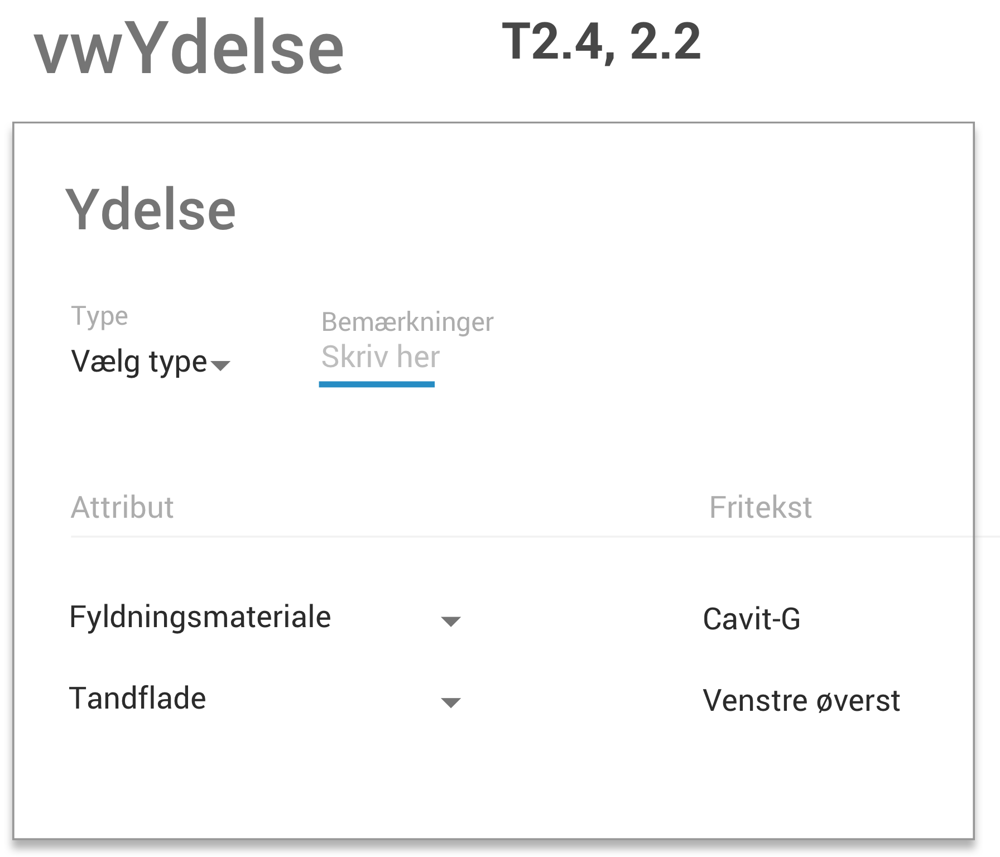
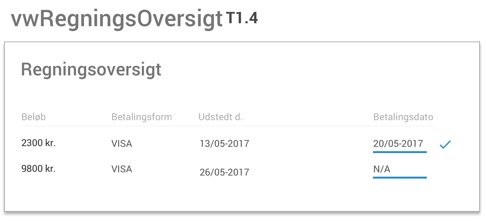
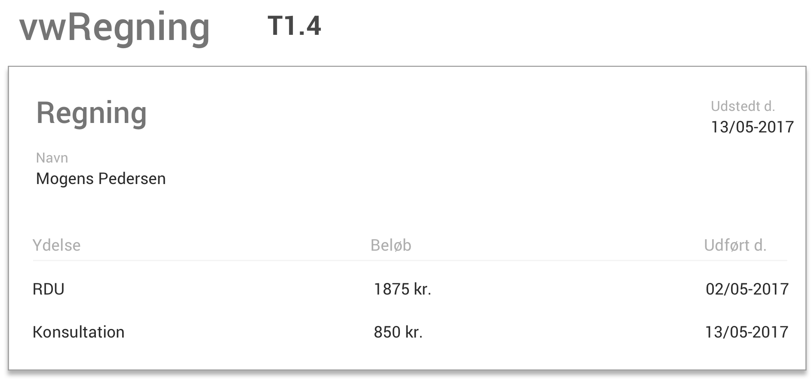

# Eksamen - Systematisk Design af Brugergrænseflader (Summer 2017)

> Frederik Wessberg Rasmussen (frra@itu.dk)

## Opgave 1 - Task descriptions (Annotated)

<table>
	<caption>Annoteret opgaveliste</caption>
	<tr>
		<td><strong>1. Reception</strong></td>
		<td></td>
	</tr>
	<tr>
		<td>
			<strong>T1.1</strong> Aftal tid<br>
			<strong>Start</strong>: Kundeopkald eller personlig henvendelse<br>
			<strong>Svært</strong>: Ikke-eksisterende kunde. Det kan være svært at estimere tid ud fra kundens egne ord.
		</td>
		<td>
			Patienten er måske kendt af klinikken i forvejen<br>
			<strong>Problem</strong>: Det kan være svært at vide hvor akut henvendelsen er uden kendt patienthistorik.
		</td>
	</tr>
	<tr>
		<td><strong>T1.2</strong> Omlæg aftale</td>
		<td>
			I tilfælde af en ændring af tid, er den nye tid måske ikke kendt. Det skal være muligt at sætte tiden til ubestemt, men så sætte en process igang, så kunden kontaktes igen.<br>
			<strong>Problem</strong>: Det kræver manuelt arbejde løbende at skulle rykke kunden for ny tid.
			<strong>Løsning?</strong>: Send SMS og/eller e-mail løbende for at rykke for at aftale ny tid.
		</td>
	</tr>
	<tr>
		<td><strong>T1.3</strong> Afslut tid</td>
		<td>
			Når patientens aftalte tid med klinikken er enten overstået eller i tilfælde af en permanent aflysning af patientforløbet, registreres dette. Der rykkes stadig for eventuel manglende betaling.
		</td>
	</tr>
	<tr>
		<td>
			<strong>T1.4</strong> Ekspedér kundebetaling<br>
			<strong>Start</strong>: Kunden ankommer i skrænken<br>
			<strong>Svært</strong>: Problemer med betalingen. Løsning?: Send regning ud pr. mail.
		</td>
		<td>
			Modtag betaling fra kunden ved skrænken med VISA-/Dankort for de udestående betalingsydelser, klinikken har udført.
		</td>
	</tr>
	<tr>
		<td><strong>T1.5</strong> Besvar kundeopkald</td>
		<td>
			Et kundeopkald kan være generelt eller med henblik på at udføre en af de øvrige opgaver.<br>
			<strong>Smart</strong>: Klinikassistenten kan tilføje noter til patientjournalen/loggen hvis opkaldet kommer fra en eksisterende patient.
		</td>
	</tr>
	<tr>
		<td><strong>2. Tandlægerne</strong></td>
		<td></td>
	</tr>
	<tr>
		<td><strong>T2.1</strong> Få Dagsoverblik</td>
		<td>
			Det skal være muligt at få en kort oversigt over dagens patienter, hvor lang tid deres behandlinger er estimeret til og et kort overblik over deres situation.<br>
			<strong>Smart</strong>: Vis tandskemaet under patientens navn, så tandlæge og klinikassistent hurtigt kan skabe sig et overblik.
		</td>
	</tr>
	<tr>
		<td><strong>T2.2</strong> Tilføj ydelse</td>
		<td>
			Tandlægen skal kunne tilføje en ydelse til patientens journal. Denne kan være markeret udført eller ej.
		</td>
	</tr>
	<tr>
		<td><strong>T2.3</strong> Tilføj journalnotat</td>
		<td>
			Tandlægen skal løbende kunne nedskrive tanker, hvad der er prøvet, vigtige bemærkninger og lignende som lognotater.
		</td>
	</tr>
	<tr>
		<td>
			<strong>T2.4</strong> Udfør ydelse<br>
			<strong>Start</strong>: Efter patientenbesøg.
		</td>
		<td>
			Når en ydelse er udført, skal det være muligt at registrere dette.<br>
			<strong>Vigtigt</strong>: Det skal være muligt at ændre på status for patientens tænder. (<em>OBS</em>, <em>PL</em>, etc).
		</td>
	</tr>
</table>

## Opgave 2 - E/R model



Denne datamodel antager følgende (for overskuelighedens skyld):

- Alle ydelser koster det samme for alle patienter.
- Mængden af en pris, som det sygeforsikringen dækker,er ens for alle patienter.
- Man kan ikke have en aftale uden en tilknyttet tandlæge

## Opgave 3 - Virtuelle vinduer

Her er først en oversigt over hvilke dele af datamodellen der fremgår i hvilke planlagte virtuelle vinduer.

- **vwPatient**: (`Patient`, `Tand`, `Aftale`, `YdelsesType`)
- **vwOverblik**: (`Tandlæge` `Aftale`)
- **vwYdelse**: (`AnvendtAttribut`, `Ydelse`)
- **veRegningsOversigt**: (`Regning`)
- **Regning**: (`Ydelse`)

Det ses her, at der er ret meget synlig data i `vwPatient`, men eftersom *Patient*-vinduet vurderes til at være det mest hyppigt anvendte og desuden centrum for flere dele af patientkonsultationer, vurderer jeg at det er i orden.

Her er de på grafisk form:











## Opgave 4

For at præsentere lister i Android, har vi brug for at opbygge et dynamisk layout ved hjælp af en `Adapter`.

Det fungerer sådan, at vi først og fremmest deklarerer et *template*, f.eks. `list_item.xml`, som fortæller noget om *hvordan* hvert enkelt liste-element skal se ud i brugerfladen.

Vi lader dernæst Adapteren om at hive selve dataen, altså den data vi vil føde vores listeelementer med, ud af en collection (typisk en listelignende datastruktur, f.eks. `array`) og populere listen ud fra mængden af elementer i kollektionen. Er der 10 elementer i kollektionen, vil listen indeholde 10 elementer.

Typisk vil vores *template* også præsentere selve dataen fra listen. Det er det mest hyppige use case.
Det kan enten gøres via deklarativ *data binding* eller imperativt, som jeg vil vise et eksempel på her:

Vi opretter et `list_view.xml` template:

```java
...

<ListView
	android:layout_width="match_parent"
	android:layout_height="wrap_content"
	android:id="@+id/foo_list">
</ListView>
```

Dernæst opretter vi et `list_item.xml` template:

```java

<?xml ...>
<RelativeLayout xmlns:android="...">

    <TextView
        android:layout_width="match_parent"
        android:layout_height="wrap_content"
        android:id="@+id/foo"/>

</RelativeLayout>
```

Vi har nu behov for at nedarve fra `Adapter` eller en af dens subklasser og implementere den logik der, når Android systemet kalder den, supplerer Android med reel data fra en kollektion og eventuelt også manipulerer indholdet af et vores liste-elementer.

F.eks.:

```java
class FooAdapter extends BaseAdapter {
  // Boilerplate
  ...

  @Override
  public View getView(int position, View convertView, ViewGroup parent) {

    View view = convertView;

    if(view == null) {
      LayoutInflater inflater = LayoutInflater.from(MainActivity.this);
			view =
         inflater.inflate(R.layout.foo, null);
    }

    TextView fooView = (TextView) view.findViewById(R.id.foo);
    Foo fooData = aCollection.get(position);

    if (g != null) {
       fooView.setText(fooData.getBar());
    }
    return view;
   }
}
```

## Opgave 5 - Lifecycle

En Aktivitet er ikke bare statisk. I stedet gennemgår en aktivitet mange faser fra den i første omgang initialiseres til den til sidst destrueres.

Dette er vigtigt at huske på, da en aktivitet snildt kan blive pauset, f.eks. når telefonens skærm slukkes og telefonen puttes i lommen, for senere at aktiveres igen når telefonen kommer frem igen.

De er implementeret som en række `callbacks`, som du kan overskrive hvis du ønsker at introducere logik for det konkrete callback.

Det er påkrævet, at `onCreate()` implementeres, som er hvor de mest essentielle komponenter af aktiviteten initializeres (f.eks. views og data).

Et eksempel på anvendelsen er her:

```java
public class MainActivity extends Activity {

		...
    @Override
    protected void onCreate(Bundle savedInstanceState) {
        super.onCreate(savedInstanceState);
        setContentView(R.layout.activity_main);

        // Setup logik her!
        MyLogic.initialize();
        fooBar();
    }
		...
}
```

Øvrige, vigtige lifecycle callbacks er:

- `onStart()`: Kaldes når aktitiviteten bliver synlig for brugeren.
- `onResume()`: Kaldes lige før aktiviteten begynder at interagere med brugeren. Her er aktiviteten på toppen af aktivitetens-stakken.
- `onPause()`: Kaldes npr aktiviteten taber fokus, (f.eks. når der trykkes på *Tilbage* knappen).
- `onStop()`: Kaldes når aktiviteten er i færd med at stoppe, f.eks. fordi den er ved at blive destrueret (men ikke nødvendigvis).
- `onRestart()`: Kaldes når aktiviteten skal til at genstarte.
- `onDestroy()`: Kaldes lige før en aktivitet bliver destrueret.