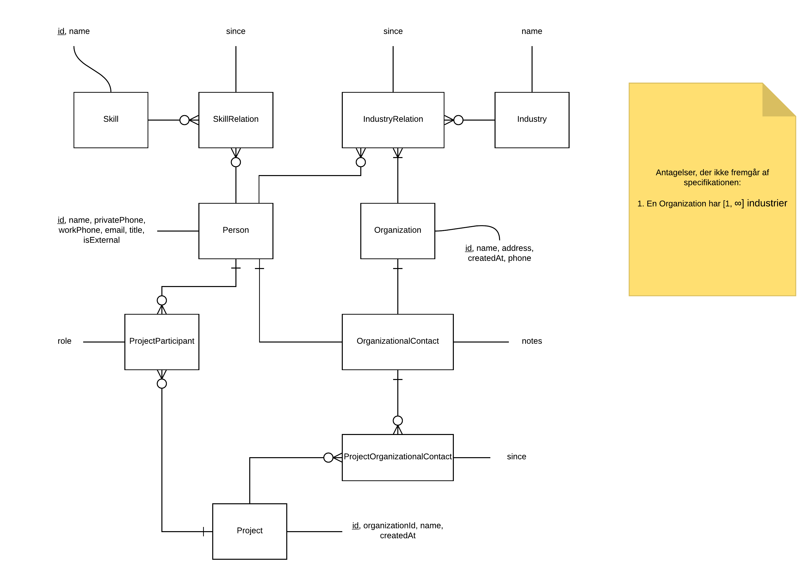
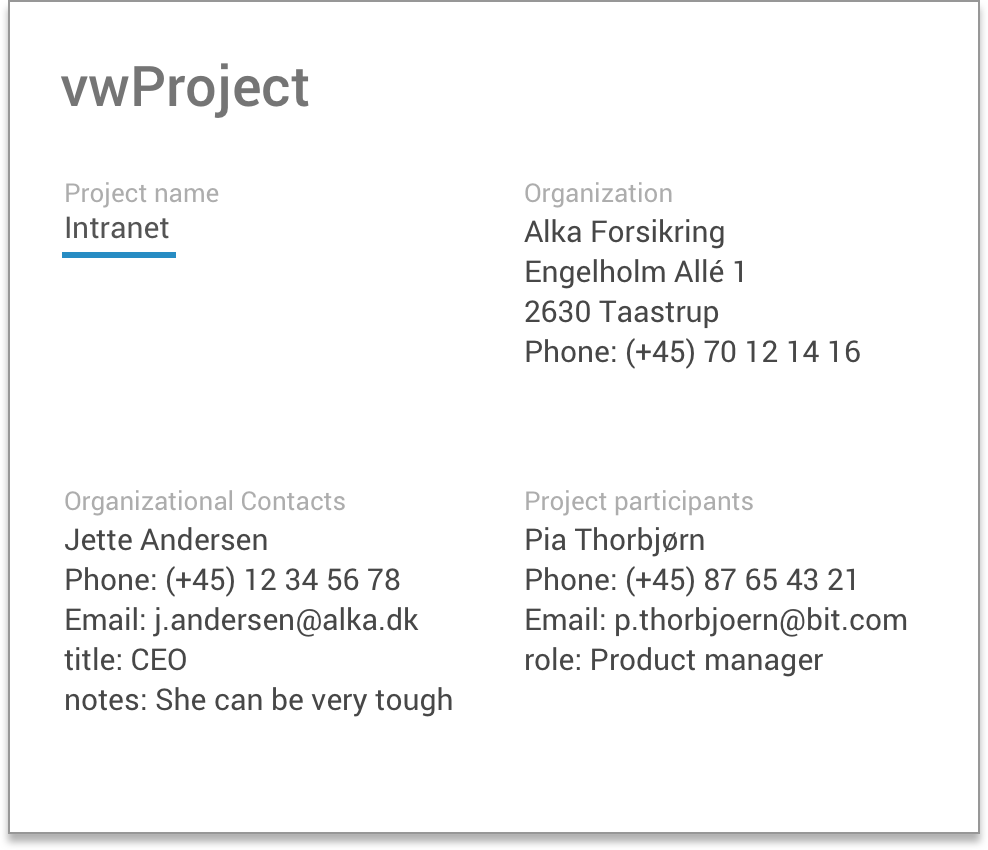
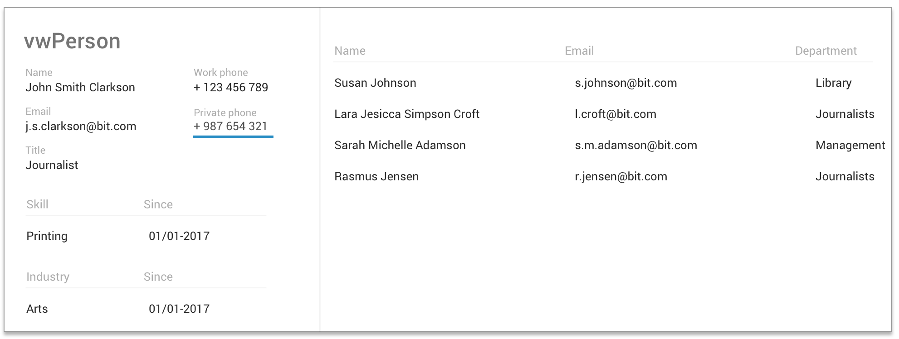
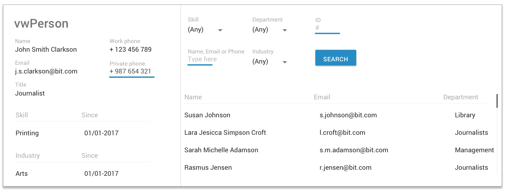

# Systematisk Design af Brugergrænseflader (Summer 2017)

## Opgave 1: Metodeforbedring

Der er bestemt plads til forbedring hos BIT:

Det er godt, at de laver hurtige skitser af hvordan nogle skærmbilleder skal se ud, Men der er en række problemer:

- De ønsker primært at teste for *understandability* når de tester prototypen med marketing, men de begår en fejl når de forklarer hvordan billederne tænkes at virke. I stedet bør de lade testbrugerne, marketingfolkene, forklare og redegøre for, hvad de ser på billederne. På denne måde kan udviklerne bedre sikre sig, at brugergrænsefladen er intuitiv og forståelig. De bør altså anvende *Score for Understanding*.

- BIT laver produkter til journalister, men tester prototypen med marketing, som altså ikke er typiske brugere af værktøjerne. I stedet for dette, bør de anvende testpersoner, der er eksperter i domæneområdet, altså journalister der repræsenterer deres kunder. Hvad der er intuitivt for marketing, som i øvrigt har været med til at kravspecificere produktet, er ikke nødvendigvis intuitivt for slutkunderne.

- Det er godt, at udviklerne og til tider marketing udøver en heuristisk evaluering af *usability* ud fra designdokumentet, men dette er langt fra tilstrækkeligt, da en heuristisk evaluering har ca. en 50% hit-rate. De bør i stedet diskutere hvilke usability faktorer de ønsker at optimere for og udøve usability tests, der er gode til at optimere på de udvalgte kriterier. Jeg vil argumentere for, at *Understandability* og *Ease of Learning* re de 2 vigtiste usability faktorer og derfor anbefale at teste for *Problem counts* med en think-aloud test med slutbrugerne efterfulgt af den førnævnte *Score for Understanding* test for at optimere deres metode.

## Tasks

<table>
	<caption>Annotated Task list</caption>
	<tr>
		<td><strong>1. Journalist</strong></td>
		<td></td>
	</tr>
	<tr>
		<td><strong>T1.1</strong>RegisterProject</td>
		<td>May involve additional useful customer knowledge. The project participants will gain industry knowledge. Idea: Add industry to employee's Set of industry expertices.</td>
	</tr>
	<tr>
		<td><strong>T1.2</strong>AddSkill</td>
		<td>May reuse an existing skill or create a new one</td>
	</tr>
	<tr>
		<td><strong>T1.3</strong>FindEmployee</td>
		<td>Users may want to search by skill or any of the Person's attributes</td>
	</tr>
	<tr>
		<td><strong>2. Library</strong></td>
		<td></td>
	</tr>
	<tr>
		<td><strong>T2.1</strong> CommitSkill</td>
		<td></td>
	</tr>
	<tr>
		<td><strong>T2.2</strong> ChangeSkill</td>
		<td>It should be possible to select an existing skill and add it to the Person's skillset</td>
	</tr>
	<tr>
		<td><strong>T2.3</strong>NotifyEmployee</td>
		<td>The Librarian should be able to easily give a reject reason for a skill suggestion</td>
	</tr>
</table>

## Datamodel

For at understøtte data modellen er her en data dictionary over de entiteter, der ikke er helt selvfølgelige:

<table>
	<caption>
		Data dictionary
	</caption>
	<tr>
		<td><strong>D1: Class: <code>SkillRelation</code></strong></td>
		<td></td>
	</tr>
	<tr>
		<td>The relation betweem a <code>Person</code> and a <code>Skill</code>. An employee obtains new skills with time. Thus, it is useful to have this relation with a <code>since</code> attribute.</td>
		<td></td>
	</tr>
	<tr>
		<td><strong>Examples:</strong></td>
		<td></td>
	</tr>
	<tr>
		<td>a.</td>
		<td>The skill with name <em>"Programming"</em> since the 1st of January 2016</td>
	</tr>
	<tr>
		<td><strong>Attributes:</strong></td>
		<td></td>
	</tr>
	<tr>
		<td>1. <code>Since</code></td>
		<td>
			Type: <code>Date</code> 
			The Date at which the Person obtained the skill.
		</td>
	</tr>
</table>

## Virtuelle vinduer

Her er første iteration i plan-form. "`+`" betyder antallet `[1, N]`, "`*`" betyder antallet `[0, N]` mens alt andet betyder antallet `[1, 1]`:

<table>
	<caption>Virtual windows plan - 1st iteration</caption>
	<tr>
		<td><strong>Subtasks:</strong></td>
		<td><strong>Visible data:</strong></td>
		<td><strong>Virtual windows:</strong></td>
	</tr>
	<tr>
		<td><strong>T1.1</strong> RegisterProject</td>
		<td><code>Organization</code>, <code>OrganizationContact</code>+, <code>ProjectParticipant</code>+</td>
		<td>Project</td>
	</tr>
	<tr>
		<td><strong>T1.2</strong> AddSkill</td>
		<td><code>Person</code>, <code>SkillRelation</code>+, <code>IndustryRelation</code>+</td>
		<td>Person</td>
	</tr>
	<tr>
		<td><strong>T1.3</strong> FindEmployee</td>
		<td><code>Person</code>*, <code>Project</code>*, <code>Industry</code>*, <code>Skill</code>*, <code>Organization</code>*</td>
		<td>Search</td>
	</tr>
</table>

Vi ser her, at både vinduet *Person* og vinduet *Search* behandler `Person` entiteten. Eftersom BIT ønsker at lade medarbejderne indskrive deres kompetencer som en del af deres daglige opgaver, kan vi passende flytte søgemekanismen sammen med CV-sektionen, således at de deler samme virtuelle vindue.

Vi lander derfor på den endelige plan:

<table>
	<caption>Virtual windows plan - final iteration</caption>
	<tr>
		<td><strong>Subtasks:</strong></td>
		<td><strong>Visible data:</strong></td>
		<td><strong>Virtual windows:</strong></td>
	</tr>
	<tr>
		<td><strong>T1.1</strong> RegisterProject</td>
		<td><code>Organization</code>, <code>OrganizationContact</code>+, <code>ProjectParticipant</code>+</td>
		<td>vwProject</td>
	</tr>
	<tr>
		<td><strong>T1.2</strong> AddSkill</td>
		<td><code>Person</code>, <code>SkillRelation</code>+, <code>IndustryRelation</code>+</td>
		<td>vwPerson</td>
	</tr>
	<tr>
		<td><strong>T1.3</strong> FindEmployee</td>
		<td><code>Person</code>*, <code>Project</code>*, <code>Industry</code>*, <code>Skill</code>*, <code>Organization</code>*</td>
		<td>vwPerson</td>
	</tr>
</table>

Her er den grafiske version af de endelige 2 virtuelle vinduer:

## Søgevindue

Vi udvider nu *vwPerson*'s 2. kolonne med udviddet søgefunktionalitet.

Da vores datamodel understøtter genbrugelige og filtrérbare `Skill` og `Industry` entiteter, er det nu nemt at filtere en søgning.

Vi kan derfor opdele højrekollonen af `vwPerson` i 2:

- En sektion (øverst), hvor søgekriterierne kan indskrænkes. Der er 2 fritekstfelter. Et, hvor der kan søges på navn, email eller telefonnummer, og et andet, hvor der kan søges på et bestemt ID.
- En sektion (nederst), der viser resultatet af søgningen.

For at optimere på *understandability* og *ease of learning* har jeg fravalgt live-søgning og i stedet tilføjet en dedikeret søgeknap. Her er resultatet:

