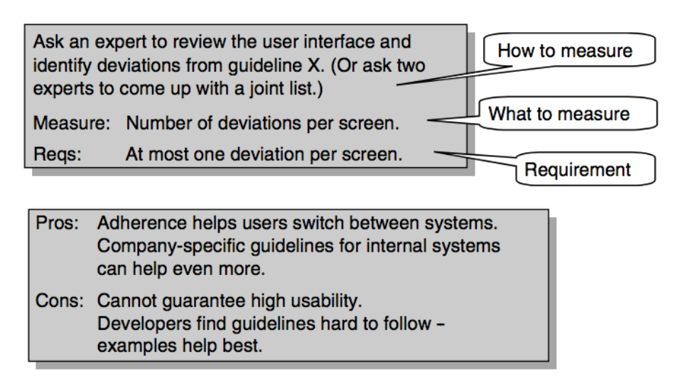

# Usability Testing
> Lauesen 1.4-1.6

We find usability problems with usability testing.

## Think-aloud test

Here, the user tries to carry out realistic tasks using the real system or a mock-up of it and explains his/her thoughts about what he/she is doing and why while doing it.

This can be done both with the real system (or something close to it) and with prototypes and mock-ups.

#### Conducting a Think-aloud testing

##### Facilitator
The test leader is called **the *facilitator*.**.
If using a paper-based mock-up, he/she would take paper windows away when they "close" and bring them up when they open.

##### Advantages of paper-based mock-ups
These can be used early in development, even before development has started, to quickly validate a user interface and identify missing tasks before ever commencing work.

##### Log keeper
The *log keeper* is the one who notes down what happens, in particular the problems the user encounters.

##### Observer (optional)
A possible third person can observe how the test proceeds and help the other two as the need arises.

### Planning a Usability test

#### Test users
We need to find the right test users! This means users that might be typical to the program or has domain knowledge in the field. For example, if we are building a website like *"Rejseplanen"* for getting transportation instructions, our users should not have extensive IT knowledge, but rather be "common people".

Also, on the other hand, if we produce an application for a highly specialized domain and present it to regular people, they will identify usability problems that wouldn't be usability problems for the users that has experience in that domain.

#### Test tasks
Choose realistic and meaningful test tasks.

A good test task meet these criteria:

- Something the user would do in a real work situation.

- It must be closed; A full piece of meaningful work.

- It must be stated without hidden help or hints on how to carry out the task.

#### The testers knowledge of the system
The tester must know how to use the system. Otherwise the tester won't be able to understand what the user attempts and where he/she misunderstood something.

### Carrying out the test

1) First we describe the *purpose* of the test. That way, the user will be less nervous and more blunt.

2) Then we give the user the first task and ask him/her to carry it out. While doing it, the user will *think aloud* by explaining what he/she does and why.

3) Observe and listen to the user. Write down brief notes on what happens, particularly when something caused problems.

### Reporting
After the test, you write a list of the problems the user encountered. **It is important that you do this soon! (<12 hours after)** so that the encountered problems are fresh in your memory.

## Heuristic Evaluation
An alternative to *think-aloud* testing is Heuristic Evaluation.

Here, we let a usability specialist look at the screens and point out problems.
This *can* lead to false positives - usability defects encountered that the target users might not identify.

### First law of usability
**Heuristic evaluation has only 50% hit-rate.**

### Performing Heuristic Evaluation

We can let a usability specialist or other team members look at the screens and use their sound judgement and earlier experience to identify defects.

*Or*, they can use a list of *heuristic guidelines*.

### Heuristic guidelines
These are guidelines that lists *best practices* and indicators of bad usability.
For example, such a guideline could be that the screens should not be too crowded (though I find that very vague - "too crowded" in relation to what?).

Either each evaluator delivers his/her own list of detects, or we may ask all of them to reach agreement and come up with a common list.

### Problems with heuristic evaluation
Heuristic Evaluation commonly finds **lots** of problems, but **approximately half of them are false in the sense that they don't cause problems to real users**.

It would be a waste of time trying to correct these false problems - but we don't know which of them are false!

Also, **heuristic evaluation misses about half of the severe problems that real users encounter**.

## User Review
User review is a form of heuristic evaluation but where instead of identifying problems or performing tasks, a discussion is had between the user/usability specialist and the team members. You go through the screens with the expert user, show how they are to be used and discuss how various tasks are carried out, what is missing, etc.

**Such reviews are important for finding missing functionality**.

**User reviews are not good for finding ease-of-use problems**: The expert user knows too much to encounter all the ease-of-use problems that would block typical users.

## Testing TL;DR
- Review with expert users to find missing functionality.

- Use Heuristic Evaluation with caution. Correct the problems that you intuitively feel are real and let usability tests decide for the rest.

- Always make usability tests to find the true problems.

## Usability measurements and requirements

### Usability factors
These are the ones listed [here](./introduction_and_usability.md#usability-factors)

### Measurements
To figure out how far we are in these directions, we must be able to measure the dimensions, but the usability factors don't say how to do this.

### Requirements and targets
Once we know how to measure the dimensions, we may set the requirements.

**We might say that we want a maximum of 9 usability problems**. **This would be a *requirement*.**

We could then also have a *target* for how many usability problems we "hope" to identify.

### Why measure usability

- It is practically impossible to correct all usability problems. Usability measurements can help us determine when the system is good enough.

- It allows us to compare our system to other systems in terms of measured usability problems. Which one has less?

- If we want to extend an application, we can clearly see whether usability should be improved or not by looking at the measurements.

## Measuring with Task Time (Performance Measurement)
Traditionally we measure usability by the amount of time taken by a user to carry out various tasks. **This is also called performance measurement**.

#### Which usability factors are they good for
They are good for:
- Ease of learning
- Task efficiency
- (Ease of remembering) - If we can perform the test again later on, we'll see if the task time is shorter.

#### Props and cons of Task time (Performance Measurement)

##### Pros

- Task times can measure many usability factors.

##### Cons

- You need a functional system to do it. This is only available late in the development problem and at that point it can be very expensive to change the system to improve user performance.

- We get too little feedback for developers. The *why* of it. If the test fails, we know that it failed, but we don't know why it took so long for the users.

### Choosing the numbers
When doing requirements, how do we select the right target and maximum values? For example, how do we decide if 18 out of 20 should succeed or that the user must complete the task within 5 minutes?

**This is a subjective assessment of cost versus benefit, combined with experience about what is possible**.

### Open targets
**If we don't know the targets early on, we can leave the targets open and later see what is possible**.

## Measuring with Problem Counts
Instead of measuring task times, we can use *think-aloud* tests and list the usability problems. This can be done early in development with a prototype of a user interface.

#### How to carry out the measurement of problem counts
We have a pool of test users perform the same tasks - thinking aloud - and we record a list of all the problems they encounter. For each problem we also record the users who encountered it, and how **severe** it was to each user.

#### What to measure
We not only measure critical/severe problems, but also medium problems.

#### Which usability factors are they good for
They are good for:
- Fit for use
- Ease of learning
- (Ease of remembering) - By having consecutive Problem count tests, we can see how many second-time problems the users may encounter.
- Subjective satisfaction - We can hear from the user's comments along the way whether or not he/she likes it.

#### Pros and cons of Problem counts
##### Pros
- Good for measuring ease of learning.
- Can be done early during system development and even on a paper prototype.
- It gives good feedback to developers.

##### Cons
- Doesn't say anything about task *efficiency*.

## Measuring with Keystroke/Mouse Click/Tap counts
Keystroke counts can to some extent help us specify and **measure task efficiency**.

#### What to measure
We count the number of keystrokes, mouse clicks or finger taps.

#### Requirements
We decide the maximum number of keystrokes, mouse clicks or taps for the system to be good enough.

We also specify the total response time - the time the system takes to respond to the first keystroke, plus the time to respond to the second one, and so on.

#### Calculating the task time
An example could be:

This tells us not only something about task time, but also the amount of required input from the user.

#### Pros and cons of Keystroke counts
##### Pros
- No users needed.
- Possible early. A mock-up is sufficient.

##### Cons
- Only covers task efficiency.
- It's not sure that the users find the fastest way.

## Measuring with Opinion polls
Here, we ask a number of users to complete a questionnaire.

#### How
We ask users about their opinion, using something like a Likert scale: agree, neutral, disagree. We could add more steps if we want.

We would then ask for the user's opinion on many matters. For example, if the system is easy to use or learn or whether or not it helped the user do to something faster than they are accustomed to.

#### What to measure
We just count the number of people that have marked each of the boxes.

#### Requirements
It's up to us. We could, for example, say that 80% must agree that the system is easy to learn and 50% must agree that they will recommend it to others, etc.

### SUMI
SUMI is an approach for questionnaires. It has 50 questions you can ask for *any* system. It also has a standard set of weights for these questions so it ends up with one single number to characterize the usability.

#### Which usability factors are Opinion polls good for?
- Fit for use - We can let the users state whether their tasks are well supported.
- Subjective satisfaction

All other measurements are pretty hard to define here since the user might not know what he/she wants or whether or not he/she actually was efficient in performing a task (in relation to what?) and so on.

#### Pros and cons of opinion polls
##### Pros
- We can ask for any usability factor.

- They are excellent for identifying fit for use.

##### Cons
- Doesn't match objective evidence.
- Only gives indications during development.
- Doesn't provide much feedback to developers.

## Second law of usability
**There is little correlation between subjective satisfaction and objective performance**.

## Measuring with Score for understanding
This is good for Understandability. We simply ask the users how they *believe* the system works and see if it correlates with the actual functionality.

#### What to measure
We assess how correct the answers are, for instance as exam marks on the scale from A to D.

#### Requirements
We could say that 80% of answers gets marks A or B.

#### Pros and Cons of Scoring for understanding
##### Pros

- Easy way to test Understandability
- It is the best way to cover error messages.
- It is useful both early and late in development.

##### Cons
- It only measures understandability.

## Measuring with Guideline adherence
Another way to test if if the user interface follows some recommended guideline, for example a style guide.

A style guide could state, for example, that each window must have a cross in the top right corner (like Microsoft Windows).

#### How
We ask an independent expert to check out the UI and identify any deviations from the guidelines. Since there is often doubt about what a guideline means, it might be better to have more than one expert look at the interface.

#### What to measure
We count the average number of deviations per screen.

#### Requirements
A target could be only 1 deviation per screen.

#### Which usability factors are guideline adherence testing good for?
- Ease of learning - if the users are accustomed to a specific kind of UI, it helps them learn the interface faster if it follows the guidelines.
- Ease of remembering (of the same reason)
- Understandability (of the same reason)
- Subjective satisfaction

#### Pros and cons for guideline adherence testing
##### Pros

- It helps users switch between systems.
- Following the guidelines may optimize ease of learning and subjective satisfaction

##### Cons
- It cannot guarantee high usability.

## How do we decide which usability measure to use?
We should combine them!

If we are the developers (and not the buyers):

- For non-critical daily use systems, **ease of learning** and **understandability** are the most important factors.
	-	**Problem counts** + **Score for understanding** are the two best tests here!

- For a web system to attract customers, **subjective satisfaction** is important.
	- **Opinion polls** with many test subjects are great here.

- For time-critical tasks, **task efficiency** is important.
	- We could use **keystroke counts** and **task time** tests here.

Generally we say that Ease of learning implies ease of remembering. These two things are rarely tested for directly.

## Severity classes

