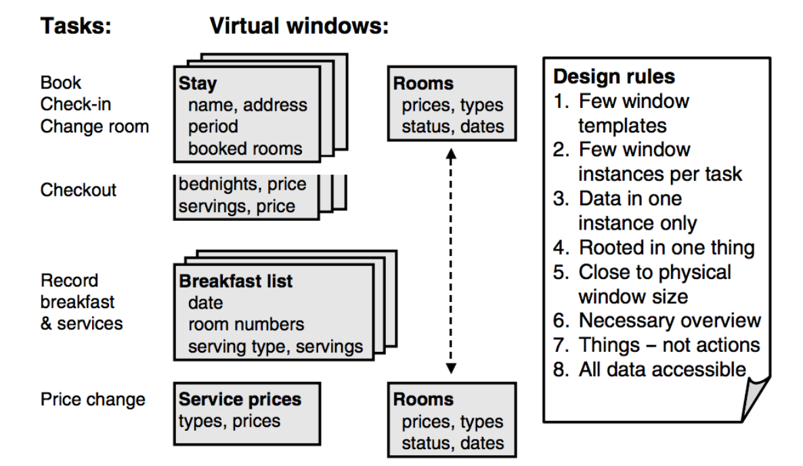
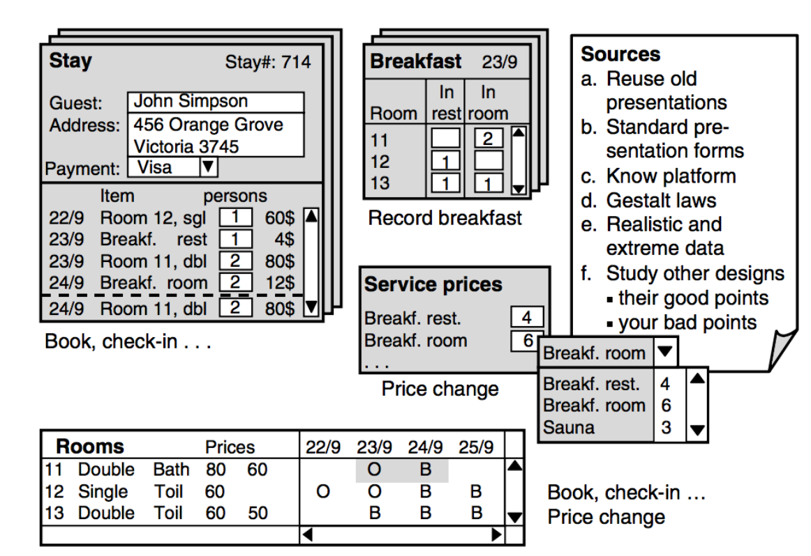

# Virtual Windows

> Lauesen 6

A virtual window is a user-oriented presentation of persistent data. **They show data, but have no buttons, menus or other functions**.

Later, we allocate functions to them, and finally they become computer screens, web pages, etc.

## The basic idea of virtual windows

Create **as few virtual windows as possible** while ensuring that:

1. All data is visible *somewhere*
2. Important tasks need only a few windows

First, we make a plan of *what* should be in each window, and then we make a detailed graphical design of the windows. Finally we check with users that they understand the windows, and we check against the task descriptions and the data model that everything is covered.

## Planning the virtual windows

Here's the procedure:

1. Look at an important and frequent task. Imagine the data the user would like to see to accomplish this task.

2. Group the data into a few virtual windows and outline the contents of each window.

3. Look at the next task and imagine the data the user would like to see to accomplish it.

4. If this task reuses data that are in the already planned virtual windows, consider reusing these windows.

5. If the task uses additional data that logically relates to a planned virtual window, consider expanding this window. Otherwise, define new virtual windows with the additional data.

6. Continue from step 4 with the next task until all tasks are properly supported by the data.

### Variants

- When outlining the contents of a virtual window, some designers just list the fields to be seen while others make more or less finished grapical outlines. **Both are okay!**
- For tasks with many steps and many kinds of data, treat the steps one by one as if they were separate tasks.
- If the result seems messy or too complex, redo the planning and start with another task.

## Rules

1. **Few window templates**: Keep the total number of windows as small as possible. Try to reuse window templates across tasks.

2. **Few window instances per task**: For each task, the user should access few window instances.

3. **Data in one window instance only**: Avoid redundant views of the same data item in several window instances. **Especially avoid having the option to *edit* the same data in several windows**.

4. **Rooted in one thing**: A virtual window usually shows data about one object and objects related to the object. For example, data about a given person and his stays on a hotel.

5. **Virtual windows close to final screen size**: This is very dated, but it states that a virtual window should try have the same screen dimensions as the final product will have, even though modern design techniques are responsive. The point is, if you're building a mobile app, respect the form factor in your windows.

6. **Necessary overview of data**: The virtual windows must provide overviews of many data, even though the user may need only part of these data.

7. **Things, not actions (window names should be nouns)**: Remember, don't be actionable. Display data. Don't call a window *"Create stay"*, but instead just *"Stay"*.

8. **All data accessible**: Usually all data from the data model must be visible and modifiable through *some* virtual window. Otherwise we probably lack a virtual window and probably also a task.

## Graphical Virtual Windows

Here it comes - the ugliest UI ever:

### Design procedure

1. For each virtual window in the plan, make a detailed graphical design, but only of the data representation. Son, don't add buttons, menus or other functions.

2. Fill in the windows with **realistic data**. **This is important since they may need more space than you expect**.

3. Fill in the windows with **extreme, but realistic data**. This way we test the limits of our window design.

4. If the windows don't look right, you may have to change the plan for the windows.

## Design defects

While designing the virtual windows, maintain a list of *design defects* and update it after doing usability testing to validate the design.

## Checking against task descriptions

It is important to check against the task descriptions that all tasks are covered by the virtual windows.

We can do so by mapping tasks to the data it has a relation to and the windows that presents that data. See the image above for an example.

### Checking procedure

1. For each task, go through its steps one by one imagining that you are the user.
2. Note down in column 2 which data the user would need to see to carry out the subtask.
3. Note in column 3 the virtual windows that hold these data.
4. Note down what is missing, for instance necessary search criteria or other forms of overview.
5. Put the missing things on the *defect* list.

## CREDO Check/CRUD Check

Credo stands for **C**reate, **R**ead, **E**dit, **D**elete, **O**verview.
So, its kind of like CRUD, except they apparantly wanted to switch out *PUT* with *Edit* and added *Overview*.

By comparing the virtual windows to the task descriptions, we need to also check the virtual windows against the data model. We do this with a CREDO matrix.

### CREDO Matrix

We use it to make sure that all data in the data model actually can be handled through one of the virtual windows and that all data in the virtual windows can be retrieved from the database.

Each column of the matrix corresponds to a data model entity and each line corresponds to a virtual window.

#### Usage of the CREDO letters

- **C**: Creation of the entity might be done through the virtual window.
- **R**: Reading (seeing/getting) all attributes of the entity is possible through the window. **Write a small *r* and make a footnote if it is possible for some attributes, but not for all**.
- **E**: Editing all attributes of the entity is possible through the window, includint seeing the old value. Write a small *e* and make footnote if it is possible for some attributes, but not for all.
- **D**: Deleting the entity might be done through the window.
- **O**: Overviewing several entities or somehow searching for them is possible through the window.

The *O* thing is what makes it a CREDO check and not a CRUD check.

## Reviewing virtual windows, task descriptions ad data models

### Review procedure for high-level test

1. Arrange a meeting with one or few expert users of the system. Plan for one to two hours depending on the number of virtual windows to review.
2. Either give the experts the virtual windows before the meeting or present them at the meeting. Explain briefly what the windows are supposed to show.
3. Listen to the expert user's comments.
4. Ask whether the windows show realistic situations, whether data is missing, whether there are more complex situations that may be difficult to show, whether the tasks can be supported with these window.
5. If you have alternative solutions, show them too and ask for comments.
6. Extract the essential usability defects and write them in the defect list.
7. You may invite the experts to outline alternative solutions, but make sure you check them carefully later.

### Review procedure for understandability test

1. Arrange a meeting with one or two ordinary users of the system. Plan for one or two hours depending on the number of virtual windows to review.
2. At the meeting, show the windows one by one. You may explain what the system is about, **but not what the windows show**.
3. Ask the users: *"What do you think this window shows? Is it a situation you recognize?"*
4. Ask about things you are not certain the users understand correctly.
5. If the user has a reasonable understanding of the windows, put several windows at the desk and ask the user to show how he/she would use them to carry out some task.
6. Extract the essential usability defects and write them in the defect list.

## Virtual windows for searching

Apparently, buttons are okay as long as they are "search" buttons.
[!Virtual windows for searching](./assets/virtual_windows_searching.png)