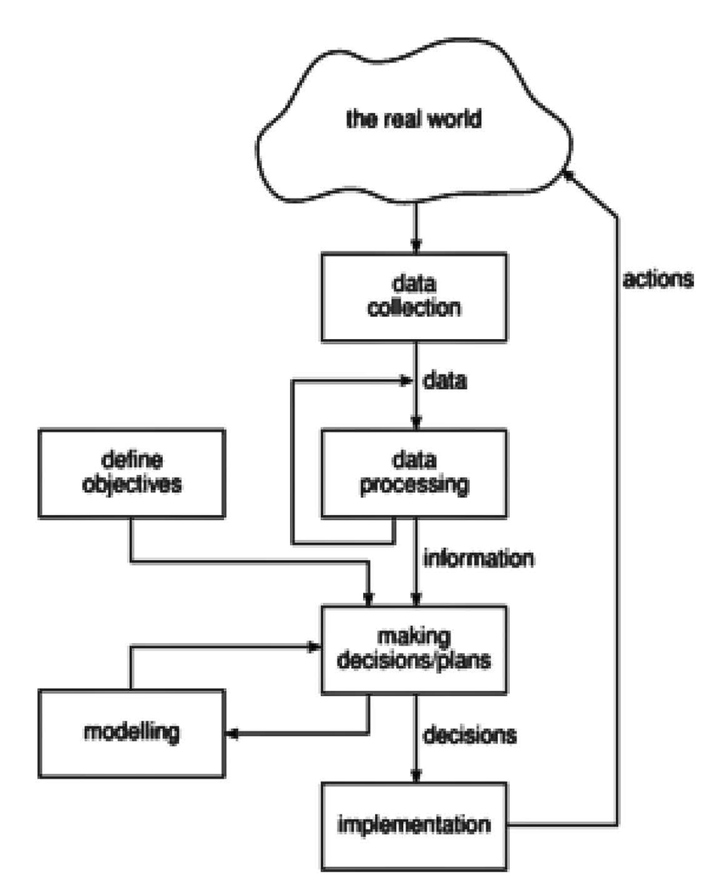
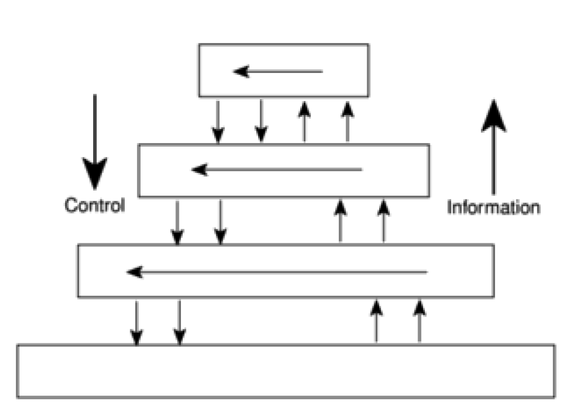
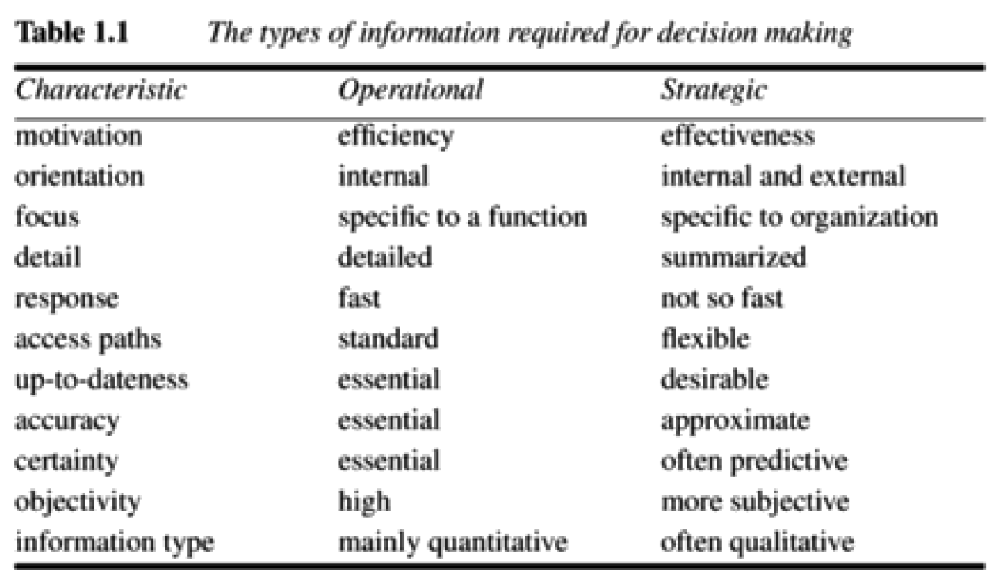

# Chapter 1 - Introduction to Software Project Management

> > [SPM] Chapter 1

## Project

A project is **a planned activity** that **is not routine (yet)**.

### A Project is not a routine

It is **non-routine**:
A job that is repeated a number of times **is NOT a project**.
The first time you do a routine task, it is most likely a project - it hasn't become routine yet. But when you repeat that task, it has become routine and thus isn't a project any longer.

### A Project in bullets

- Non-routine tasks are involved
- Planning is required
- There are specific objectives to be met, or a specified product to be created.
- A project **has a predetermined time span**, either absolute or relative.
- **The work is carried out for someone other than yourself**. Weird, but okay.
- Work involves several specialisms.
- Work is carried out **in several phases**.
- The available resources for use on the project are constrained.
- The project is large or complex.

## Difference between Software projects and other kinds of projects

While many techniques of general project management are applicable to Software project management, there *are* characteristics to Software Project Management that are different.

**One way of perceiving software project management is as the process of making visible that which is invisible**.

### Invisibility

When a physical artifact such as a bridge or road is being constructed, the progress made can actually be seen. **With software, progress is not immediately visible**.

### Complexity

Per dollar, pound or euro spent, software products contain more complexity than other engineered artifacts. I would add *may* here, because that is a very bold statement.

### Flexibility

Software systems are likely to be subject to a high degree of change.

## Activities covered by Software Project Management

### The feasibility study

This investigates whether or not a project is worth starting.
This is where general requirements of the proposed system is gathered.

The probable developmental and operational costs as well as the value of the benefit of the new system are estimated.

Such a feasibility study could be treated as a project in its own right, depending on its size.

### Planning

*If* the feasibility study determines that the project is viable, then we can proceed with planning the project.

We would start with formulating **an outline plan** for the whole project, and **a detailed one for the first stage**.

We would produce detailed plans for the later stages as they approached.
This is because the detailed plans may depend on the outcome of the prior stages.

### Execution

This is where we actually execute on the project.

#### Typical project execution lifecycle

This is listed as a waterfall model, but it could easily be an iterative approach, going back and forth between these activities, often in parallel.

1. **Requirements Analysis**
	- This is where we find out in detail what the users require of the system that the project is to implement.
2. **Specification**
	- Detailed documentation of what the proposed system is to do.
3. **Design**
	- A design that meets the specification has to be drawn up. This will be in two stages - **One will be the external/UI design** (buttons, menus, etc), and **the other will be physical design** - how are data and software procedures structured internally.
4. **Coding**
	-	Where the magic happens.
5. **Verification and validation**
	- Here we do careful testing to make sure that the requirements are fulfilled (and that the stakeholders agree).
6. **Implementation/Installation**
	- This has to do with implementing the system in the stakeholders environment. User manuals are written, maybe users are trained, data and system parameters are set up to work well with the system.
7. **Maintenance and support**
	- Once the system has been implemented, there will be a need of correcting errors as well as extensions and improvements to the system. These may be seen as projects in their own right.

## Categorizing Software Projects

Software projects are different and can be categorized.

### Information systems vs Embedded Systems

#### Information systems

These systems interfaces with the organization.

For example, a *stock control system* would be an information system that controls when the organization reorders stock.

An operating system would be an information system too.

#### Embedded systems

These interfaces with a machine.

A *process control* system may control the air conditioning equipment in a building.

A machine for a washing machine would also be an embedded system (though "Smart" washers and "Smart" fridges are on the rise and they are very combinations).

### Objectives versus Products

Projects may aim to produce a *product* or they may aim to meet certain *objectives*.

For example, **reaching a Service Level Agreement would be an objectives-driven project**.

### Projects often have two stages

1. An **objectives-driven project**, which results in a course of action that involves creating a new software application to meet the identified requirements.
2. An **product-driven project** to actually create the software product that meets those requirements.

## The project as a system

### System

A system **is a set of interrelated parts**.

It will normally be **part of a larger system** and will itself comprise *subsystems*.

### Environment

The system is located in an environment. This will be made up of things that can affect the system, but over which the system has no direct control. For example, the bankruptcy of a dependent supplier for something a system depends on would be happening in a system's *environment*.

### Open vs Closed systems

#### Open systems

Open Systems are those that **interact with the environment**. Nearly all systems are open.

Here we must take into account the fact that outside changes in the environment may affect the system itself.

#### Closed systems

Close systems are those that do **NOT interact with the environment**.

### Suboptimization

Is a **situation**, not a process (even though the word really sounds like it).

If a system is *working* but **is having detrimental effect on the overall system** (for example, is very efficient but hard to maintain), we have a sub-optimization.

Another way to explain it is that **one part of the overall system works only for itself and not for the benefit of the entire system**.

### Sociotechnical systems

**Software projects belong to this category of systems**:
Any software project requires both technological organization as well as organization of people.

**Therefore, software project managers need to have both technical competence and the ability to interact persuasively with other people**.

## Management

A Software Project Management involves the following activities:

- **Planning**: Deciding what is to be done.
- **Organizing**: Making arrangements.
- **Staffing**: Selecting the right people for the job.
- **Directing**: Giving instructions.
- **Monitoring**: Checking on progress.
- **Controlling**: Taking action to remedy hold-ups.
- **Innovating**: Coming up with new solutions.
- **Representing**: Liaising with users, etc.

## Problems with Software Projects

From the manager's perspective:

- Poor estimates and plans
- Lack of quality standards and measures
- Lack of guidance about making organizational decisions
- Lack of techniques to make progress visible.
- Poor role definition
- Incorrect success criteria

From the team members' perspective:

- Inadequate specification of work.
- Management ignorance of IT
- Lack of knowledge of application area.
- Lack of standards.
- Lack of up-to-date documentation
- Preceding activities not completed on time.
- Lack of communication lead to duplication of work.
- Lack of commitment
- Narrow scope of technical expertise
- Changing requirements
- Changing software environment
- Deadline pressure
- Lack of quality control
- Lack of training

## Management control

### The project control cycle

Management is the process of setting objectives for a system and then monitoring the system to see what its true performance is.

But it isn't just about detecting, for example, how many items has been processed by something, it's about taking that data, and turning it into useful information, depending on the set objectives. For example: "amount of items processed by person per day".

### Objectives

In order to have a successful software project, the manager *and* the team members must know what will constitute success. **This will make them concentrate on what is essential to project success**.

There is a need for well-defined objectives that are accepted by all people across different departments.

#### Project authority

This is the person or people who has the overall responsibility for setting, monitoring and modifying objectives.

##### Project steering committee

Another name for the Project authority. This committee holds ceremonies to discuss or alter the objectives.

#### Project manager vs Project authority

The project manager has the responsibility for running the project on a day-to-day basis, but has to report to the steering committee at regular intervals. **Only the steering committee can authorize changes to the project objectives and resources**.

### Measures of effectiveness (effective objectives)

An effective objective is **concrete and well-defined**.

#### A bad objective

If it becomes *"to improve customer relations"*, that is just too abstract. What does improve mean in this context? And it isn't a clearly measurable objective. We want to know at which point we have succeeded.

#### A good objective

If the objective becomes *"Reduce customer complaints by 50%"*, it is both concrete, easily measurable and very clear when we've succeeded.

### Sub-objectives and goals

We may need to break objectives down into smaller ones that are **dependent on one another**.

For example, the main objective A depends on achieving B, C and D first.

**Sub-objectives are called goals**, steps on the way of achieving an objective.

## Stakeholders

These are the people who have a stake or interest in your project.

**These must be identified as early as possible, because you need to set up adequate communication channels with them right from the start**.

### Stakeholders have different objectives

All of the stakeholders might not have the same objectives! The end users might be concerned with the ease of use of the system, while their managers might be interested in the staff savings the new system will allow.

### Internal vs External stakeholders

Stakeholders might be internal to the project team, external to the project team but within the same organization, or completely external to the organization:

#### External Stakeholders

These might be customers/users who, in many situations, are bound on a legally binding contract.

### Theory W

The W stands for "Everyone a Winner".

Here, the manager concentrates on creating situations where all parties involved in a project benefit from it and therefore have an interest in its success.

I guess you could also call it win-win.

## Requirements specification

The objectives of the project are carefully defined in terms of the **functional requirements**, **quality requirements** and **resource requirements**.

Sometimes, the quality requirements and resource requirements are mashed together as *non-functional requirements*.

- Functional requirements define what the system must be able **to do**. **Systems analysis and Systems design focus on providing functional requirements**.

- Quality requirements has to do with the attributes of the system that isn't directly related to what the system must do, but rather *how* it is to do it. Examples of those are requirements for maximum response time, reliability and ease of use.

- Resource requirements has to with how much the organization is willing to spend on the system. There is usually a trade-off between this and the time it takes to implement the system.

## Information and control in organizations

### Small projects

With small projects, the project leaders are likely to be working very closely with the other team members and might even be carrying out many of the non-managerial tasks themselves. Here, they probably have a good idea of what is going on at all times.

### Larger projects

When projects are larger, many separate teams will be working on different aspects of the project and the overall managers of the project are not going to have day-to-day direct contact with all aspects of the work.

This is why the need for clear organizational structures becomes visible as projects grow larger.

## Hierarchical management structure

Here, information flows up the organizational structure, and control flows down.

We see it in **lots** of projects and organizations.

Here, project team members will each have a group leader who allocates them work and to whom they report progress.

The group leader, and every other group leader, will report to a manager at the next higher level. And so on, and so on, right up to the top.

If a group at some level has an issue, that can't be resolved there, for example a request for more resources, this issue will be referred to the next higher level of management.

Instructions may be formulated and passed down to a lower level. Here, the information will be interpreted and formulated into a more detailed plan to fulfil the directive. As the directives filter down the hierarchy, they will be expanded into more detail at each level.

### Danger

At each higher level, information will be received by fewer people. **There is a danger that managers at higher levels might be overloaded with too much information**.

### Levels of decision making and information

Decisions can be grouped at three levels:

- Strategic
- Tactical
- Operational

#### Strategic decision making

This is about deciding objectives.

#### Tactical decision making

This is about taking the tactical steps needed to ensure that the objectives will be fulfilled. This will typically be the decision making that is going on at the project leader level.

#### Operational decision making

This relates to the day-to-day work of implementing the project.

### What kind of information is needed for taking strategic vs operational decisions

The kind of information we need, as well as the form of it, may differ greatly depending on whether we ne need to take strategic or operational action on it.

## Measurements

It can be tricky to measure software. Software measurements can be divided into *performance measures* and *predictive measures*.

### Performance measures

These measure the characteristics of a working system to validate that we in fact respect the quality requirements.

### Predictive measures

The problem with performance measures is that we cannot do those measurements before we have a working system. *Predictive* measures are taken during development to "predict" what the performance of the final system will be.

### KLOCK

A KLOCK is one thousand lines of code.

### Summary

- Projects are by definition non-routine. There are more uncertainty involved than normal undertakings.

- Software projects are similar to other projects, but have some unique attributes, for example the relative invisibility of many of their products.

- A key factor in project success is having clear objects. Stakeholders may have different objectives, so there is a need for a recognized overall project authority.

- For objectives to be effective, they must be measurable and concrete.

- Where projects involve many different people, effective channels of information have to be established.