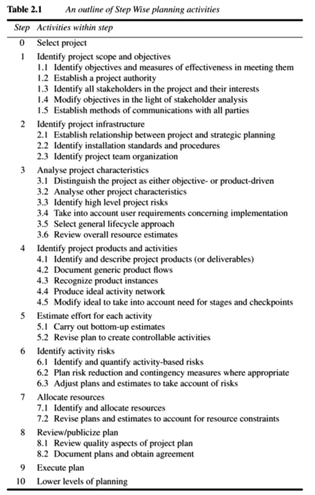
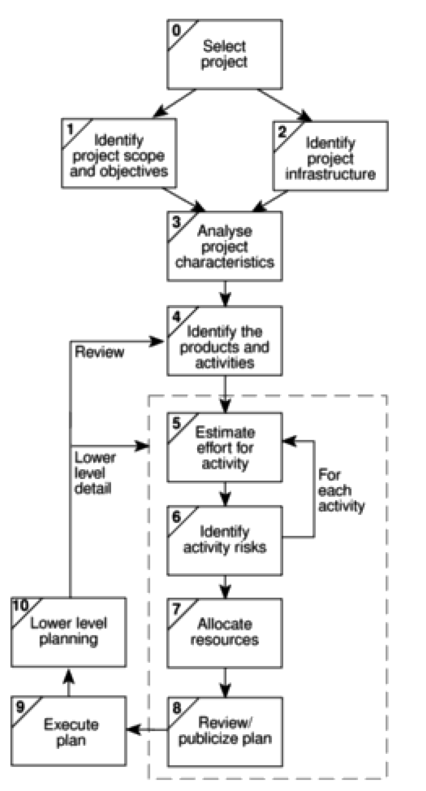
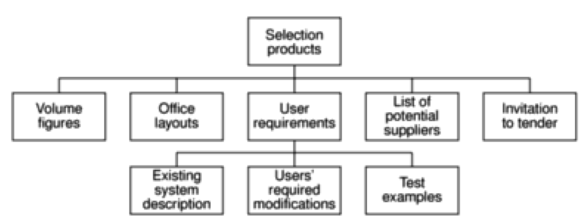
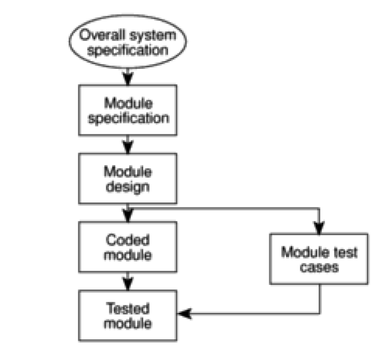
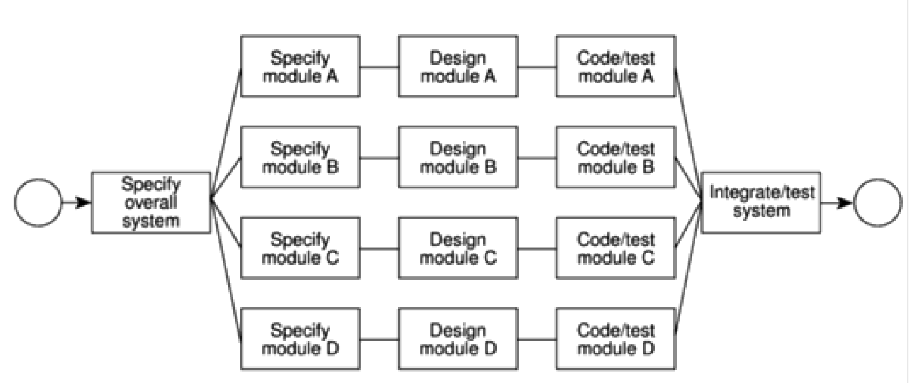

# Chapter 2 - Step Wise: an overview of project planning

> > [SPM] Chapter 2

## Step Wise

Step Wise is **a framework of basic steps in project planning**.

Step Wise only covers the planning stages of a project and not monitoring an control.

## Prince 2

Prince 2 is a set of project management standards. Step Wise is compatible with it, but has a much smaller scope.

## Project Planning

A major principle of project planning is to **plan in outline first and then in more detail as the time to carry out an activity approaches**.

## Step Wise planning activities

## Step 0: Select project

This is called step 0, and not step 1, since it is outside the main project planning process.

This is where we decide if the project is worth undertaking ("feasible").

## Step 1: Identify project scope and objectives

This is where we ensure that all the parties to the project agree on the objectives and are committed to the success of the project.

### Step 1.1 Identify objectives and practical measures of the effectiveness in meeting those objectives

As discussed in the notes for chapter 1, we need to identify concrete and measurable objectives. Some that we can easily validate in terms of whether or not (and when) we were successful in fulfilling them.

### Step 1.2 Establish a project authority

We need to decide for an overall project authority so that there is unity of purpose among all those concerned.

### Step 1.3 Identify all stakeholders in the project and their interests

Essentially all the parties who have an interest in the project needs to be identified.

### Step 1.4 Modify objectives in the light of stakeholder analysis

The project objectives may have to be changed in order to gain the full cooperation of all concerned. This *can* mean adding new features to the system in order to give a stakeholder group some benefit. This would be to assure their commitment to the project.

### Step 1.5 Establish methods of communication with all parties

The communication channels and channels are agreed upon here.

## Step 2: Identify project infrastructure

There are usually some kind of existing infrastructure into which the project can fit. The project leader who does not already know about this structure needs to find out all about it.

### Step 2.1: Identify relationship between the project and strategic planning

An organization needs to decide **the order in which its projects are to be carried out and how this project fits within it**.

These strategic decisions must be documented in a strategic business plan or in an information technology plan that is developed from the business plan.

### Step 2.2: Identify installation standards and procedures

There needs to be defined some **development procedures**.

**Change control** and **configuration management** standards should be in place to ensure that changes to requirements are implemented in a safe and orderly way.

**Procedural standards** lay down the quality checks that need to be done at each point of the project life cycle or these may be documented in a separate *quality standards and procedures* manual.

The project manager should be aware of any **project planning** and **control standards**. These will relate to *the way* the project is controlled. An example could be that the way the hours spent by team members on individual tasks should be recorded on time-sheets.

### Step 2.3: Identify project team organization

Project leaders may have some control over the organizational structure of the project team, but most often, the organizational structure will be dictated to them.

## Step 3: Analyse project characteristics

Here we make sure that the appropriate methods are used for the project.

### Step 3.1: Distinguish the project as either objective- or product-driven

Generally, as system development advances, it tends to become more product-driven, although the underlying objectives always remain and must be respected.

### Step 3.2 Analyse other project characteristics (including quality based ones)

Is this an information system or a process control system, or does it have elements of both? Is it a safety-critical system?

### Step 3.3 Identify high level risks

These are important! What are the risks that threaten the successful outcome of the project?

### Step 3.4 Take into account user requirements concerning implementation

Most likely, the clients will have their own procedural requirements. Make sure to take these into account.

### Step 3.5 Select general lifecycle approach in the light of the above

For example, a prototyping approach might be used if the user requirements are not clear.

### Step 3.6 Review overall resource estimates

Once all of the major risks have been identified and the broad project approach has been decided upon, this is when we re-estimate the effort and other resources required to implement the project.

## Step 4: Identify project products and activities

This is where the detailed planning of the individual activities takes place.

### Step 4.1 Identify and describe project products (or deliverables)

**We want to ensure that there are no activities that do not produce a tangible product**. Making sure we have identified all the things the project is to create helps us to ensure that all the activities we need to carry out are accounted for.

#### Product Breakdown Structure (PBS)

The products will form a hierarchy. The main products will have sets of component products, which in turn might have sub-component products and so on.

These relationships can be documented in a Product Breakdown Structure (PBS).

It looks like a class hierarchy, except it just includes the work products (project products/deliverables).

Products at the bottom of the PBS should be documented by *Product Descriptions* which contain:

- The name/identity of the product.
- The purpose of the product.
- The derivation of the product (the other products from which it is derived).
- The composition of the product.
- The form of the product.
- The relevant standards.
- The quality criteria that should apply to it.

### Step 4.2: Document generic product flows

If some of these project products depend on others to be completed first, it would be a great idea to portray them in a Product Flow Diagram (PFD).

#### Product Flow Diagram (PDF)

### Step 4.3 Recognize product instances

Where the same generic PFD fragment relates to more than one instance of a particular type of product, we should try to identify each of those instances.

The theory doesn't state anything about reducing redundancy here, though I would assume that you would want to minimize the amount of instances.

### Step 4.4 Produce ideal activity network

If one product should be generated from another, **there must be one or more activities that carry out the transformation**.

We can create an *activity network* if we identify these activities. This will show the tasks that have to be carried out and the order in which they have to be executed.

What's important here is that the networks doesn't care about resource constraints. It must be assumed that resources are available for everything, and an activity will start as soon as the preceding ones upon which it depends have been completed, and everything else can happen in parallel.

**They must be "ideal"**.

**The reason is that we want to encourage the formulation of a plan that will minimize the overall duration for the project**.

### Step 4.5 Modify the ideal to take into account need for stages and checkpoints

This is when we make the ideal activity network constructed in the previous point more realistic. We modify it by dividing the project into **stages** and introducing **checkpoint activities**.

**These are activities that draw together the products of preceding activities to check whether they are compatible**.

A checkpoint could potentially delay work on some parts of the project.

## Step 5: Estimate effort for each activity

### Step 5.1: Carry out bottom-up estimates

Some of the top-down estimates of effort, cost and duration will already have been done by now in Step 3.6. But here, **staff effort** and **probable elapsed time needed for each activity** will need to be produced.

The individual activity estimates of effort **should be summed to get an overall bottom-up estimate**.

The activities on the activity network can be annotated with their elapsed times so that the overall duration of the project can be calculated.

### Step 5.2 : Revise plan to create controllable activities

Individual activities might be estimated to take quite a long time!
If an activity involving, say, system testing, is to take 2 weeks, it might be difficult after six weeks to judge accurately whether 50% of the work is completed. **Here it is better to break this down into a series of smaller sub-tasks**.

## Step 6: Identify activity risks

### Step 6.1 Identify and quantify activity-based risks

Here we look at each activity in turn and assess the risks to its successful outcome - but more importantly the seriousness of each risk and the likelihood of it occurring have to be determined.

### Step 6.2 Plan risk reduction and contingency measures where appropriate

We might be able to reduce or completely avoid the identified risks. Contingency plans specify action that is to be taken if a risk materializes. An example could be to use contract staff if a member of the team is unavailable at a key time because of illness.

### Step 6.3 Adjust overall plans and estimates to take account of risks

We can change our plans and add new activities to reduce risks. For example training courses for developers in a new programming language if that will be required to build the new system. That would be a risk if the developers haven't used it before.

## Step 7: Allocate resources

### Step 7.1 Identify and allocate resources

Here, the kind of staff needed for each activity is recorded. The staff available for the project are identified and are provisionally allocated to tasks.

### Step 7.2 Revise plans and estimates to take into account resource constraints

Some staff might be needed for more than one task at the same time, and in this case, **an order of priority is established**.

Ensuring someone is available to start work on an activity as soon as the preceding activities have been completed might mean that they are idle while waiting for the job to start and are therefore used inefficiently.

## Step 8: Review/publicize plan

### Step 8.1: Review quality aspects of the project plan

It might be revealed that an earlier activity was not properly completed and needs to be reworked. This can transform a project that appears to be progressing satisfactorily into one that is badly out of control.

So, it is really important to know that when a task is reported as completed, it really is. Therefore, **quality reviews are really important**! **Each task should have exit requirements**. These are quality checks that have to be passed before the activity can be signed off as completed.

### Step 8.2 Document plans and obtain agreement

Here, the plans are carefully documented. Here we make sure that all parties agree to the project commitments that they are required to fulfil according to the plan.

## Steps 9 and 10: Execute plan and lower levels of planning

As each activity becomes due, plans will need to be drawn up in greater detail.

## Conclusion

Any planning approach should have the following elements:

- The establishment of project objectives.
- The analysis of the characteristics of the project.
- The establishment of an infrastructure consisting of an appropriate organization and set of standards methods and tools.
- The identification of the products of the project and the activities needed to generate those products.
- The allocation of resources to activities.
- The establishment of quality controls.