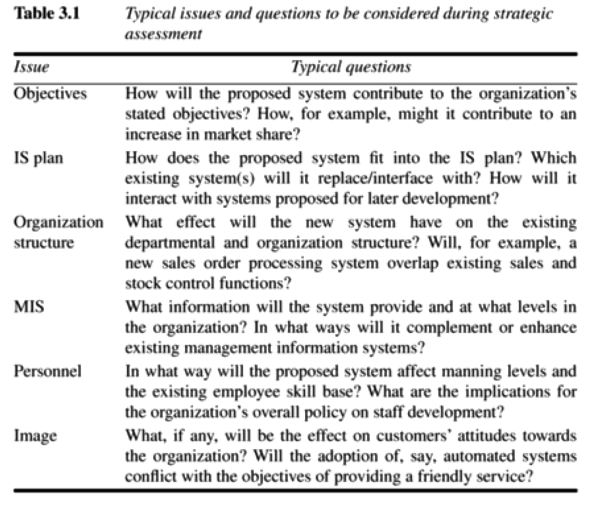
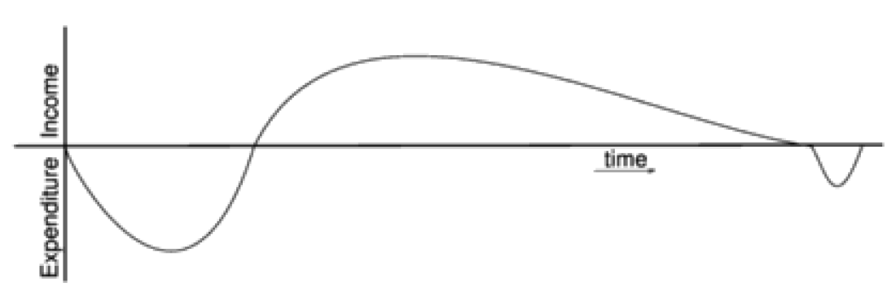
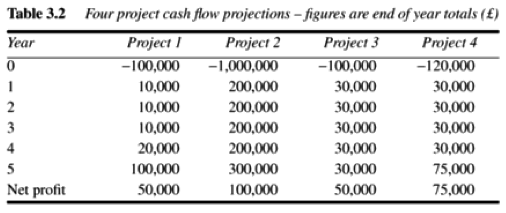
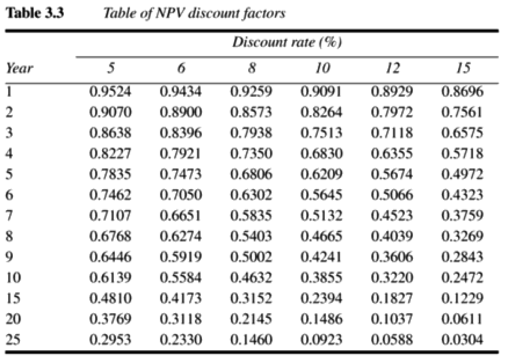
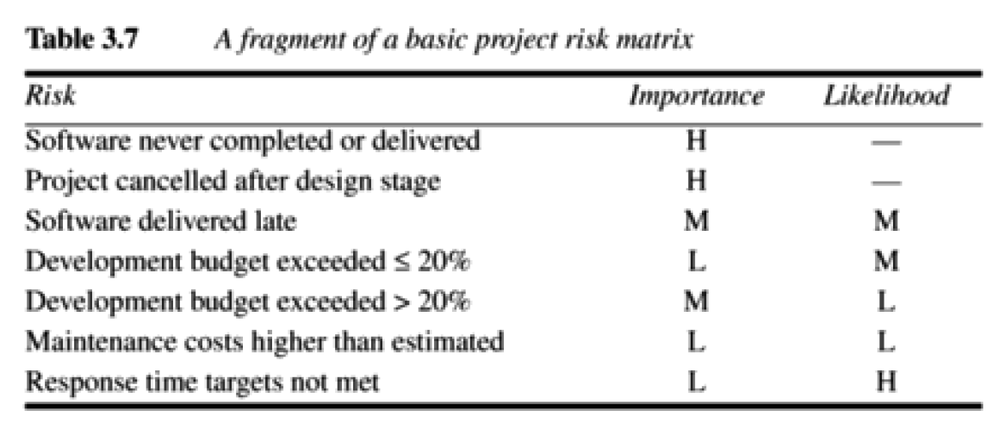
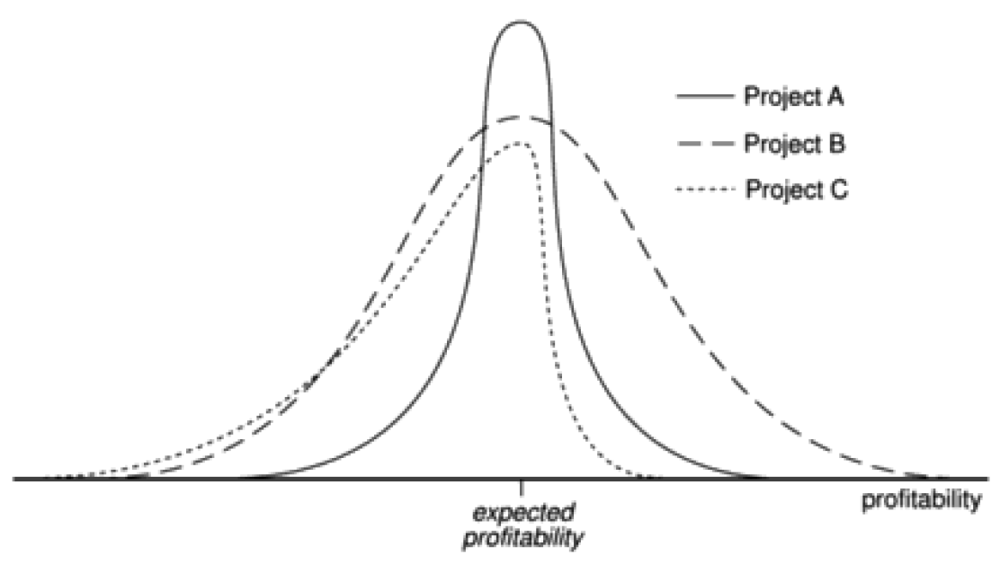
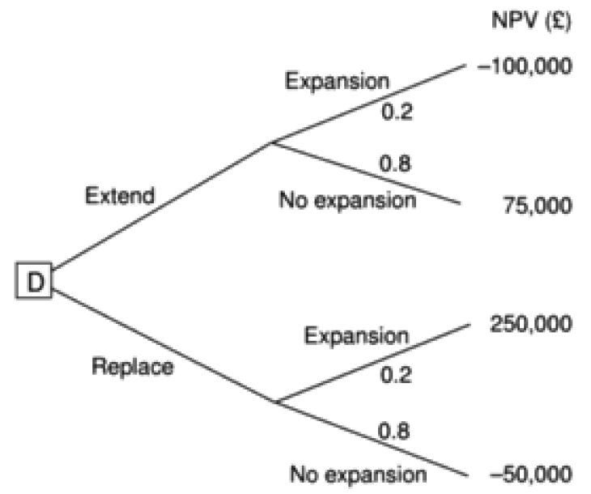

# Chapter 3 - Project evaluation

> > [SPM] Chapter 3

Project evaluation has to do with Step 0 of the Step Wise activities.

This is where we decide whether or not to proceed with a project.

## Strategic assessment

### Programme management

A *programme*, in this context, is **a collection of projects that all contribute to the same overall organizational goals**.

A well-defined programme *goal* must be clear, and then the project under consideration must be evaluated according to how it contributes to this programme goal. Its viability, timing, resourcing and final worth can be affected by the programme as a whole.

**In order to carry out a successful strategic assessment of a potential project, there should be a strategic plan clearly defining the organization's objectives**. This provides the context for defining the programme and programme goals. This will be context through which the individual project will be assessed. In many cases, it will be a *programme director* and *programme executive* rather than a project manager who will be responsible for the strategic assessment of a proposed project (in large organizations).

**Even when there is no explicitly defined programme, any proposed project must be evaluated within the context of the organizations overall business objectives**.

## Typical issues and questions to be considered during strategic assessment

## Portfolio management

The proposed project will form part of a *portfolio* of ongoing and planned projects and the selection of projects must take account of the possible effects on other projects in the portfolio - competition for resources and branding for example.

## Technical assessment

Technical assessment consists of evaluating the required functionality **against the hardware and software available**. The constraints may influence the cost of the solution and must be taken into account in the cost-benefit analysis.

## Cost-benefit analysis

By comparing the expected costs of development and operation with the benefits of having it in place, we are doing a cost-benefit analysis.

We assess whether the estimated costs are exceeded by the estimated income (and other benefits).

There might be more candidate projects than can be undertaken, so we typically want to prioritize projects in terms of which ones add most value relative to cost.

**A cost-benefit analysis consists of two steps**:

### Identifying and estimating all of the costs and benefits of carrying out the project

Here we include development costs of the system, operating costs and the benefits that are expected to result from the operation of the system.

### Expressing these costs and benefits in common units

We must evaluate the **net benefit**, which is **the difference between the total benefit and the total cost**. So, we express each cost and each benefit in monetary terms.

### Categorizing costs

It is helpful to categorize costs according to where they originate in the life of the project.

- **Development costs** include salaries and other employment costs of the staff involved in the development project and all associated costs.

- **Setup costs** include the costs of putting the system into place. This is mainly the cost of new hardware and equipment, but it will also include staff training.

- **Operational costs** consist of the continuous expense of operating the system once it has been installed.

### Categorizing benefits

Can be hard to quantify in monetary terms.

- **Direct benefits** are the ones that result directly from the operation of the proposed system, such as a reduction in salary bills through automating processes that previously required manual labor.

- **Assessable indirect benefits**: These are **secondary benefits**, such as increased accuracy through the introduction of a more user-friendly interface. We need to be able to measure it, so we could measure the reduction in the amount of errors and thus reduced labor which ultimately leads to a reduction in salaries.

- **Intangible benefits** are very difficult to quantify. These might be enhanced job interest which leads to less staff leaving the company and thus lower recruitment costs.

## Cash flow forecasting

While it is important to estimate overall costs and benefits, it is just as important to forecast the cash flows that will take place and their timing.

**It will indicate when expenditure and income will take place**.

Forecasting cash flow needs to be done early in the project's life cycle, and that can be very hard.

**When forecasting, you should ignore the effects of inflation since taking inflation into account would increase the uncertainty of the forecasts**.

## Cost-benefit evaluation techniques

There are some different techniques to use when evaluating cost-benefit of a project.

### Net profit

**The net profit of a project is the difference between the total costs and the total income over the life of a project**.

A simple net profit table, as seen in the image, doesn't care about the timings of the cash flows, only the yearly cash flow.

The best project might be the one that results in the biggest net income down the path, though it will have less profit in the first years. Whether this is a good thing depends on the project and its expected duration. Also, a project might require a bigger investment up front (such as Project 2) and may not be the best bets.

### Payback period

The payback period is the time taken **to break even** or **pay back the initial investment**.

**Normally, the project with the shortest payback period will be chosen**. No one likes being in debt.

### Return On Investment (ROI)

The ROI is also known as the *accounting rate of return (ARR)*.

**It provides a way to compare the net profitability to the investment required**.

A simple, straight forward way of calculating ROI is:

*ROI = (average annual profit / total investment) * 100*.

#### Disadvantages of ROI calculation

1. It takes no account of the *timing* of the cash flows.
2. It compares the rate of return with the current interest rates, but these bear no relationship to the interest rates offered and charged by banks since it takes no account of the timing of the cash flows.

Of these reasons, the ROI can be very misleading.

### Net Present Value (NPV)

NPV = wealth added. If NPV > 0, accept.

The net *present* value is a project evaluation technique **that takes into account the profitability of a project and the timing of the cash flows that are produced**.

You would, strictly speaking, say that if the NPV > 0, then you would **accept** the project - it would be profitable.

**KEY POINT: The NPV indicates how much *more* money you earn by investing the money in the project than letting them sit in the bank and grow with the interest rate**.

#### Discount rate

Future cash flows is discounted by a percentage known as the discount rate.

It is based on the view receiving £100 today is better than having to wait until next year to receive it **because the £100 next year is worth less than £100 now** (because it can be put in the bank and grow with the interest rate).

**If we put £90 in the bank today and it was £100 after a year, we would say that the discount rate was 10**.

The present value of any future cash flow may be obtained by applying the formula:

*present value = value in year t / (1 + r)^t*.

where *r* is the discount rate as a decimal value and *t* is the number of years into the future that the cash flow occurs.

#### Obtaining the NPV for a project

The NPV for a project is obtained by discounting each cash flow - negative and positive - **and summing the discounted values**.

It is normally assumed that any initial investment takes place immediately (in year0) and **is not discounted**.

All later investments are assumed to take place at the end of each consecutive year.

#### Difficulties with NPV

The hard ting is to select an appropriate discount rate. The rate might be fixed, but other times, the rate might fluctuate. The calculations must reflect this.

#### Disadvantages of NPV

It might not be directly comparable with earnings from other investments or the costs of borrowing capital. Such costs are usually quoted as a percentage interest rate.

### Internal Rate of Return (IRR)

#### Short version

One way to say it is that the IRR is the discount rate that makes the NPV equal 0. We can then solve the discount rate(r) in an equation. If it is greater than the actual discount rate, accept the project.

#### Long version

The internal Rate of Return **attempts to provide a profitability measure as a percentage return that is directly comparable with interest rates**.

We think: ("What discount rate would we have to have in order to break-even?"). So, by solving the discount rate in the equation where *NPV = 0*, we know what it takes for the project to profitable. We must then compare the solved discount rate with the actual one. If the solved one is greater than the actual one, the project should be accepted.

To calculate it, you set the NPV equal to 0 and solve R for this equation:

*0 = up-front investment + (income for year / (1 + R))*, and then you compare the solved value of *R* with the discount rate *r*.

If *R* > *r*, then the project should be accepted.

#### Problems with IRR

IRR does not indicate the absolute size of the return. A project with an NPV of £100,000 and an IRR of 15% can be more attractive than one with an NPV of £10,000 and an IRR of 18% - the return on capital is lower, but the net benefits are greater.

Also, under certain conditions, it is possible to find more than one rate that will produce a zero NPV, but here you should take the lowest value and ignore the others.

### What is missing with NPV and IRR

You must also take into account the problems of funding the cash flows.

Also, there will always be risk inherent in investing in a project, and we might need to undertake a more detailed risk analysis.

Also, we need to consider other projects in the organization. If a project is funded, then how about other worthy projects?

## Risk evaluation

This has to do with evaluating the risks of undertaking a project before proceeding with it.

### Risk identification and ranking

We should attempt to **identify and quantify the potential effects of risks**.

#### Risk checklist

This is a checklist of identified risks as well as its relative importance and likelihood. The importance and likelihood are two things that must be separately assessed.

### Project Risk Matrix

A project risk matrix takes a risk checklist and lists the risks in the first column, the importance in the 2nd and the likelihood in the 3rd:

Here, *H* stands for High, *M* stands for Medium, *L* stands for Low and *-* stands for exceedingly unlikely.

**This kind of evaluation is of course great if the organization or investor doesn't want to make high-risk investments**!

### Risk and NPV

**The more risky a project the higher the discount rate**. The investor would like a good return for an investment along the way if it is of high risk.

### Cost-benefit analysis in risk identification

An alternative to the Project Risk Matrix is to consider the possible outcome of each risk, estimate the probability of it occurring and the corresponding value of the outcome.

So, rather than having a single cash flow forecast, we would have a set of cash flow forecasts, each with an associated probability of occurring.

**The final value of the project is obtained by summing the cost or benefit for each outcome weighted by its corresponding probability**.

**It can be hard to assign probabilities to the occurrence of each scenario without extensive study**!

### Risk profile analysis

This uses sensitivity analysis to construct risk *profiles*.

This is where each of the parameters that affect the project's cost or benefits are altered to see how sensitive the overall profitability is to each factor. For example, we could vary one of the estimates by plus or minus 5% and then recalculate the expected costs/benefits. By repeating this, we can evaluate the *sensitivity* of the project to each of these factors.

**Those that are most sensitive will be the ones that are most important for the success of the project**.

If we want an easy way to evaluate the chances of a particular outcome occurring, **we can use a Monte Carlo simulation**.

### Decision Trees

It is a a great way to model and analyse how easily extended the system is, in terms of NPV.

## Conclusion

- Projects must be evaluated on strategic, technical and economic grounds.

- Economic assessment involves identifying *all* costs and income over the lifetime of the system, **including its development and operation** and checking that the total value of benefits exceeds total expenditure.

- Money received in the future is worth less than the same amount of money in hand now (which may be invested to earn interest).

- Cost-benefit analysis and decision trees provide tools for evaluating expected outcomes and choosing between alternative strategies.

- Discounted cash flow techniques such as NPV and IIR is used to evaluate the present value of future cash flows taking account of interest rates and uncertainty.