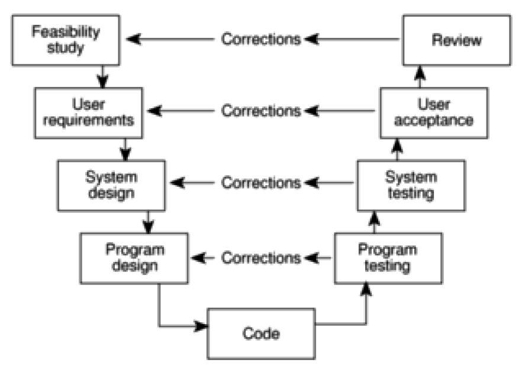
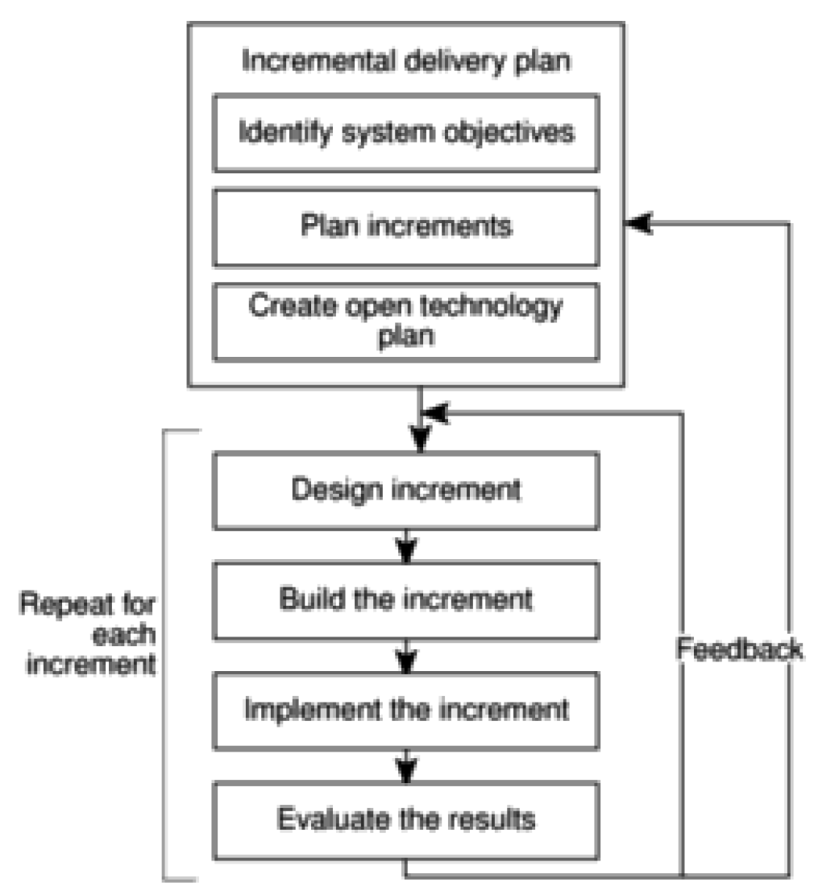
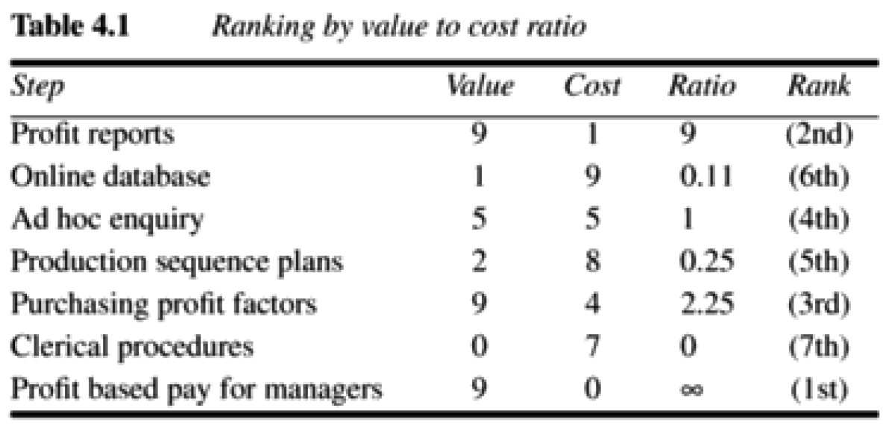

# Chapter 4 - Selection of an appropriate project approach

> > [SPM] Chapter 4

It is important to spend some time looking for any characteristics of a new project that might make us take a different approach from that used on previous projects.

## Choosing technologies

The outcome of a technology analysis might include the language, framework(s) and knowledge-based system tools.

This will have indirect effects on other aspects of a project:

- Training requirements
- Type of staff to be recruited
- The development environment, both software and hardware
- System maintenance

### Analyse project characteristics

#### Data orientated system

A Data orientated system is one that will have a considerable database.

#### Control orientated system

A control orientated system is an embedded control system.

#### General package

A general package is one that is applicable to many things, such as a word or spreadsheet editor.

#### Application specific package

Is one that is applicable to a specific application domain, such as an airline seat reservation system.

Ask yourself:

- Is a data orientated or a control orientated system to be implemented?
  - Many systems today has parts of both.

- Will the software that is to be produced be a general package or application specific?

- Is the system to be implemented of a particular type for which specific tools have been developed?
  - This has to do with trying to detect some of the features of the proposed system that points to some specific technological decisions. For example, if it is real-time chat app, you might want to use web sockets! If it is going to make heavy use of computer graphics, the language will probably be C++ or something similar.

- Is the system to be created safety-critical?

- In what kind of software/hardware environment will the system operate?

## Reducing uncertainty

The greater the uncertainties at the beginning of the project, the greater the risk that the project will be unsuccessful.

Here's some of areas of uncertainty and how we might remedy it

### Product uncertainty

Here we **ask how well the requirements are understood**. I would add that, rather than ask "*do* you understand this?", we ask: "*How* do you understand this?" - Just asking if someone understands something doesn't say anything about whether or not the understanding is right or wrong.

### Process uncertainty

The process might be new (to the organization or unproven in general), and this will probably introduce uncertainty. There's not much to do here if the process is newly developed other than don't use it. If it is tried and true but new to the organization, uncertainty can be reduced by hiring someone who are familiar with the process in practice.

### Resource uncertainty

Examples are the lack of available staff of the right ability and experience or simply the sheer size of a project. The larger it is, the larger the amount of required resources and thus uncertainty which leads to higher risk.

## Selecting a life cycle approach

There are different kinds of life cycle approaches. A life cycle, again, is a model of stages that development of a project undergoes. Some works well for some kinds of systems and less well for others.

A general recommendation by the book, it seems, is SSADM (Structured systems analysis and design method).

But safety-critical systems, as one example, might call for very expensive measures such as having independent teams develop parallel systems with the same functionality.

And, if the requirements are imprecise, a *prototyping approach* should be considered.

If the environment in which the system is to be implemented is changing often, then *incremental delivery* should be considered.

So, the point here is that the approach to the software development life cycle will be influenced by the kind of system at hand.

## Technical plan contents list

All the practical requirements that results from asking these questions can be formally specified in a technical plan.

Such a plan may be showed to the customer, but the primary reason is to help the software house itself.

An example structure of such a plan could be:

1. Introduction and summary of constraints:
	(a) Character of the system to be developed.
	(b) Risks and uncertainties of the project.
	(c) User requirements concerning implementation.
2. Recommended approach:
	(a) Selected methodology or process model
	(b) Development methods
	(c) Required software tools
	(d) Target hardware/software environment
3. Implementation:
	(a) Required development environment.
	(b) Required maintenance environment.
	(c) Required training.
4. Implications:
	(a) Project products and activities. These will have an effect on the schedule duration and overall project effort.
	(b) Financial - This report will be used to produce costings.

## Process model

A process model is a combination of activities. Their combination results in a specific outcome. In other words, in other to achieve an outcome, one or more activities must be executed. It is these, and their order, that constitutes a process model.

## Choice of process models

A major part of planning is to choose the development methods to be used and them slotting them into an overall process model.
These methods should not only be selected, but *how* they should be applied should also be specified.

### Structured methods

An example of a structured method is the Object Oriented Analysis approach (which you learned a great deal about in BDSA). These are made up of sets of steps and rules with carefully documented work products along the way. This kind of approach is very resource costly, but it does lead to a less error prone and a more maintainable final system.

An alternative to structured methods are Rapid Application Development (RAD)

## Rapid Application Development (RAD)

Many customers are most concerned with getting **working** business applications delivered **quickly** and **at less cost** and often see structured methods as unnecessarily bureaucratic and slow.

**A response to this has been Rapid Application Development (RAD)**.

### Joint Application Development (JAD) workshops

These are workshops where developers AND customers work together **intensively** for 3-5 days and identify and **agree on fully documented business requirements**.

This is based on the belief that the reason for month-long negotiation typically is the time-consuming formal reports, proposals and counter-proposals that are sent back and forth. By working together intensively to form the business requirements, it should be possible to progress much faster.

## Fire-boxing

This is where the scope of a project is rigidly constrained by a pre-agree and relatively close absolute deadline. Requirements that have to be omitted in order to meet this deadline are considered in later time-boxes.

## The Waterfall model

The classical, sequential "one-shot" approach to development with only little space for going back to an earlier stage. Instead, flow should really be downwards with only few exceptions.

It is one that makes a lot of sense intuitively and that we all wish we could use in practice, but in reality, requirements change all the time, and we need to be able to back and forth.

## The V-process model

The V-process model is an extension of the waterfall model, but where the "testing" part of it is the extension.

If defects are found, it causes a loop back to the corresponding development stage and a reworking of the succeeding steps.

## The spiral model

The Spiral is an iterative, risk-oriented model.

The model goes through these four phases, iteratively:

1. Determine objectives.
2. Identify and resolve risks.
3. Development and Test.
4. Plan the next iteration.

## Software Prototyping

A *prototype* is a working model of one or more aspects of the projected system. It is constructed and tested quickly and inexpensively in order to test out assumptions.

Prototypes can be classified as throw-away, evolutionary or incremental. We only consider software prototypes here (not paper-and-pen prototypes)

**The Incremental/Iterative approach is based on the Spiral model and is the basis for almost all agile methods**!

**Which each iteration, the system scope is extended. The system is not built, it is grown**.

### Trow-away prototypes

These are only used to test out some ideas and is then discarded when the development of the actual system has started. A prototype may be developed in different software or even on a different hardware platform.

### Evolutionary prototypes

Here, the prototype is developed and modified until it is finally in a state where it can become the operational system.

### Incremental prototypes

This is not "really" prototyping. The operational system is developed and implemented in small stages so that the feedback from the earlier stages can influence the development of the later stages ("Agile development"). An entire system can, and will forever be an incremental prototype.

### Pros of using prototypes

- Learning by doing.

- Improved communication. Instead of having the users read full manuals, the users can see for each new version what has changed. Also, they doesn't have to imagine any functionality. Right from the start, they can test it out in action.

- Improved user involvement.

- Clarification of partially-known requirements.

- Reduced need for documentation

### Cons of using prototypes

- Users might misunderstand the role of the prototype. They might expect it to be as robust as an operational system (though I think they are right to do so in terms of an incremental prototype).

- (Additional expense). The overall cost of the project MAY grow if we use prototypes due to the time and staff we use to produce them. This may be true, but most likely isn't because prototyping probably eliminates errors and missing requirements that would otherwise have taken additional development time in the long run.

### Requirements of a prototype

For something to be a prototype:

- It must be specified what the developer(s) hope to learn from the prototype.
- There must be a plan for how the prototype is evaluated.
- The learnings of the the prototype must be reported.

### How far we take a prototype

Not considering the incremental prototypes, a prototype will (in early all cases) not represent the whole of the application. Instead it will simulate an aspect of the application.

#### Mock-ups

This might just be copies of the screens that the system is to use. The screens cannot actually be used, only interpreted.

#### Simulated interaction

Here, we simulate some functionality of the system, even though it hasn't been implemented. For example, some API call where we instead just present mock data so that we can test the interaction without considering the backend-stuff yet.

#### Partial working model

Some features are prototyped fully, but not in detail.

### What is being prototyped

Is it UX (Human-Computer interface) or pure functionality?

### Prototyping tools

*Application building tools* makes prototyping easier.

## Incremental delivery

Analogous to incremental prototypes.

### Advantages with incremental delivery

- Feedback from early increments can influence the later stages

- The possibility of changes in requirements is small since the timespan between the design of a component and its delivery is much shorter.

- The users get the benefits earlier than with a conventional approach.

- Early delivery improves cash flow since you get ROI early on.

- Feature-creep will be less likely since users know that they get more than one opportunity to make their requirements known.

- Job satisfaction increases for developers since they see their labor bearing fruit at regular, short intervals.

### Disadvantages with incremental delivery

- Developers might be more productive working on one large system than on a series of smaller ones.

- Later increments might require the earlier ones to be modified.

## Planning an incremental delivery

This is like strategic planning, except at a much more detailed level where the attention is given to increments of the application rather than whole applications.

### identify system objectives

We will start by declaring some functional goals:

- Objectives the system is intended to achieve
- Jobs the system is to do.
- Computer/Non-computer functions to achieve them.

Many of these will have been given by the functional requirements.

We also declare some measurable quality characteristics such as reliability, response time and security.

Requirements may change, but the objectives should not!

### Plan increments

Here we can plan out the individual increments.
There are some guidelines:

- **Steps typically should consist of 1% to 5% of the total project**.

- Non-computer steps can be involved, but they **must** deliver direct benefits to the users.

- **An increment should take one month or less.**

- Value-to-cost ratios may be used to decide priorities.

#### Value-to-cost ratios

These can be used to establish the order in which increments are to be developed.

The customer rates each increment with a score in the range 1-10 in terms of its value.

The developers also rate the cost of developing each increment, but in the range 1-10.

Then, by dividing the value rating by the cost rating, we get a rating which indicates the relative value for money of each increment.

### Create open technology plan

For the system to be extendible, portable and maintainable, it will require the use of:

- A standard high-level language
- A standard operating system
- Small modules (yeah!)
- Variable parameters, such as organization name, department names, pricing, etc.
- A standard database management system

## Selecting the most appropriate process model

In general, where uncertainty is high, we should use an evolutionary approach such as incremental delivery. One example could be that the users' requirements are not clearly defined.

Where requirements are relatively certain, but there are many complexities, we should go for an incremental approach.

**When deadlines are tight, then either an evolutionary or an incremental approach is favored over a waterfall strategy**!

## Rational Unified Process

This is an iterative process, based on UML.
Each iteration have 4 phases:

1. Inception
	- Models the scope of the system. We perform initial cost and budget estimations
2. Elaboration
	- Here we focus on domain analysis. Define the basis architecture for the system.
3. Construction
	- Here the bulk of development happens.
4. Transition
	- The phase where the system goes from development to production.