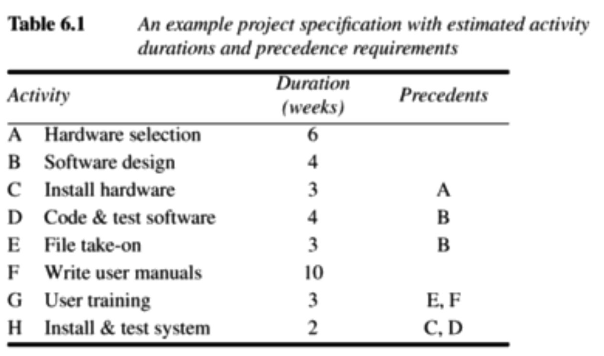

# Chapter 6 - Activity planning

> > [SPM] Chapter 6

A schedule for at project must also include the start and completion times for each activity.

This will enable us to:

- Ensure that the appropriate resources will be available precisely when required.

- Avoid different activities competing for the same resources at the same time.

- Produce a detailed schedule showing which staff carry out each activity.

- Produce a detailed plan against which actual achievement may be measured.

- Produce a timed cash flow forecast.

- Replan the project during its life to correct drift from the target.

## Objectives of activity planning

In addition to providing project and resource schedules, activity planning also achieves a number of other objectives:

- **Feasibility assessment**: Is the project possible within required timescales and resource constraints? We need a detailed plan before being able to forecast a realistic completion date.

- **Resource allocation**: What are the most effective ways of allocating resources to the project, and *when* should they be available?

- **Detailed costing**: How much will the project cost and when is that expenditure likely to take place?

## When to plan

**Planning is an on-going process of refinement**, each iteration becoming more detailed and more accurate than the last.

Throughout the project, until the final deliverable has reached the customer, monitoring and replanning must continue to correct any drift that might prevent meeting time or cost targets.

## Project schedules

Before work commences, the project plan must be developed to the level of showing dates when each activity should start and finish and how much of each resource will be required.

**When the plan has been refined to this level, we call it a project schedule**.

## Projects and activities

- A project is composed of a number of interrelated activities.

- A project may start when at least one of its activities is ready to start.

- A project will be completed when all of the activities it encompasses have been completed.

- The duration of an activity **must** be forecastable.

## Identifying activities

There are 3 ways to identify activities:

### The Activity-based approach

This consists of creating a list of all the activities that the project is thought to involve.

This could be the result of a brainstorming session or from an analysis of similar past projects.

#### Work Breakdown Structure (WBS)

This is a way to ensure that tasks are not double-counted or omitted.

It works like this:

1. Identify the main tasks required to complete a project.
2. Break those down into a set of lower-level tasks.
3. Continue recursively.

**Activities are added to a branch if they directly contribute to the ask immediately above**.

### The product-based approach

This is used in PRINCE 2 and Step Wise.

This is where we create a Product Breakdown Structure (PBS) and a Product Flow Diagram (PFD).

This is great for precedence requirements as it indicates for each product which other products are required as inputs.

We can transform a PDF into an ordered list of activities by identifying the transformations that turn some products into others.

You can see how it is automatically ordered in terms of precedence relationships. You can't do a *processing specification* before you've done *requirements specification* in the example diagram above.

### The hybrid approach

Here, a WBS may be based upon the project's products which is in turn based on a simple list of final deliverables.

So, we extract the activities list from the PBS.

## Sequencing and scheduling of activities

One way of presenting a schedule for a small project is to use a bar chart:

Such a bar chart also takes precedence relationships into account. We can see it as a timeline. Activity C follows activity B in the diagram above - because Andy cannot work on both at the same time (and C may depend on B).

## Network planning models

These are models that model the project's activities and their relationships **as a network**.

In the network, time flows from left to right.

The two most well-known are:

- The Critical Path Method (CPM)
- Program Evaluation Review Technique (PERT)

A later thing has come, which is a variation of both, and it is called **Precedence networks**.

It is what the majority of computer applications use. Most people call of them CPM in daily speech.

## Formulating a network model

We represent activities and their interrelationships **as a graph**.

The *links* (edges) are **arrowed lines**, and the *nodes* (vertices) are **circles**, representing the events of activities starting and finishing. We write the activity name along the edges/links.

Here's an example of a Critical Path network:

## Constructing CPM networks

All activities have durations, and the edges in the graph represents activities. **But don't add durations to the edges**!

Nodes are events and has **no duration**. They are the outcomes of the previous activities. **They are instantaneous points in time**.

**Nodes are numbered sequentially from left to right**!

**A network may NOT contain loops**! You cannot "go back". The flow must always be from left to right.

### Source node

The *Source node* is the event of the project becoming ready to start.

### Sink node

The *Sink node* is the event of the project becoming completed.

### Dangle

A Dangle is a node which has no edge to a later node, but doesn't represent the end of the network.

For example:

**This is illegal**!

It looks like the end of a sequence, but isn't!

### Dummy activities

Dummy activities are shown as dotted lines. They have no duration and use no resources! **They can be used when two activities share the same start and end nodes**

### Lagged activities

Where activities can occur in parallel **with a time lag between them** we represent these with pairs of dummy activities!

## Adding the time dimension

### CPM conventions

It is very common to divide each node into 4 quadrants where the upper one indicates the event number, the left shows the earliest possible start date and the right shows the latest possible start date.

### The forward pass

This is carried out **to calculate the earliest date on which each event may be achieved and the earliest date on which each activity may be started and completed**!

Dates indicate the end of a period, and the project therefore starts in week zero (which would be the beginning of week 1).

Here's how to do the forward pass in the example model above:

- Activities A, B, and F may start immediately, so the earliest date for event 1 is week 0! The earliest start date for all 3 activities is also zero.

- Activity A will take 6 weeks, the earliest it can finish is week 6. Therefore, the earliest we can achieve event 2 is week 6.

And so on...

Notice how the earliest start date is written in the left quadrant as stated. And notice also how the duration of each activity is written using *=[weeks]* along the edges.

### The backward pass

Like the forward pass, we use this, but to **calculate the LATEST date at which each event may be achieved, and each activity started and finished, without delaying the end date of the project**.

### The *slack*

The *slack* is **the difference between the earliest date and the latest date for an event**. It is a measure of how late an event can be without affecting the end date of the project.

### Identifying the critical path

Any event with a slack of zero is critical - Any delay on such event would delay the whole project. The *critical path* is a path through all critical nodes in the network.

We must pay particular attention to activities on the critical path. In planning, if we can shorten the critical path, the overall duration of the project will be shortened.

### Activity float

Whereas events have slack, activities posses *float*.
The float is the difference between the earliest start date of an activity and its latest start date. It tells us by how long the activity's start or completion may be delayed without affecting the end date of the project.

### Free float

Free float is the time by which an activity may be delayed without affecting any subsequent activity. This is calculated as the difference between the earliest completion date for the activity and the earliest start date of the succeeding activity.

### Interfering float

This is the difference between *total float* and *free float*. Once the free float has been used, this tells us by how much the activity may be delayed without delaying the project end date - even though it will delay the start of subsequent activities.

### Shortening the project duration

The critical path shows us where we must look to save time if we are trying to bring forward the end date of the project.

As we reduce activity times along the critical path, we must continuously check for any new critical path emerging and redirect our attention where necessary.

When we cannot reduce the critical path duration any further, we can try to find time savings by increasing the amount of parallelism in the network and the removal of bottlenecks.

### Identifying critical activities

When an activity uses up all of its float - it becomes critical, even though it was originally a non-critical activity.

Common practice is to identify near-critical paths (those with a total float of less than, say, 10% of the project's uncompleted duration).

## Precedence networks

Precedence networks does not use links and nodes such as CPM, but rather **use boxes as nodes**, and these represent activities/work items! The links represent dependencies.

The boxes can both contain task descriptions and duration estimates. The links *may* contain a duration, denoting a lag between the completion of one task and the start of the next.

One of the benefits of them is that they can represent parallel lagged activities:

Notice the "weights" of the links, denoting the lag duration.

### Analyzing precedence networks

We do it the same way as CPM. We do a forward and backward pass to calculate earliest and latest start and finish dates and then identify the critical path.