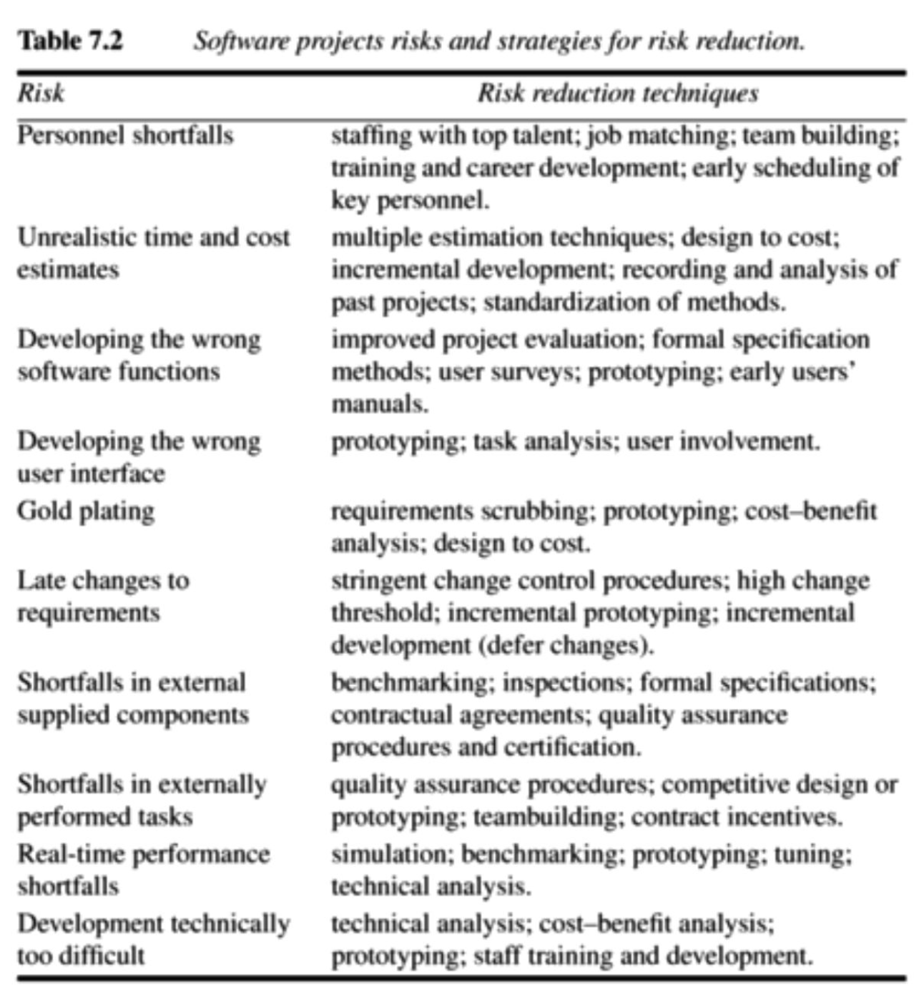
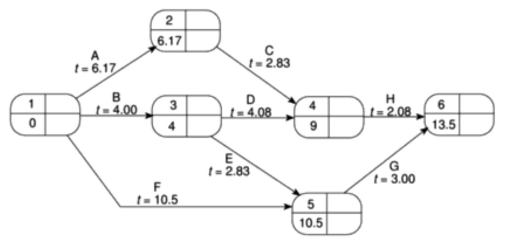
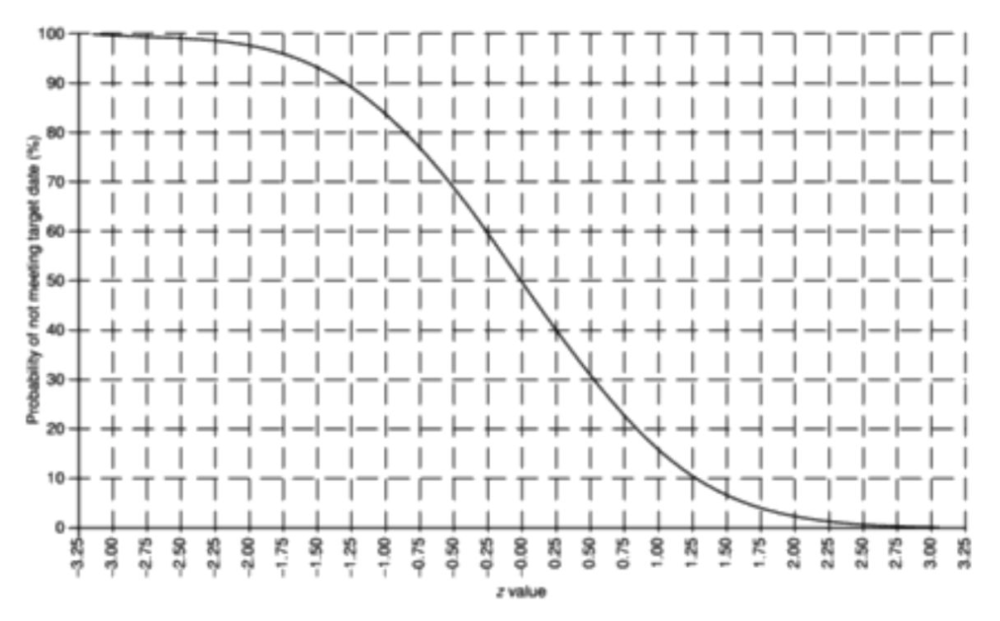
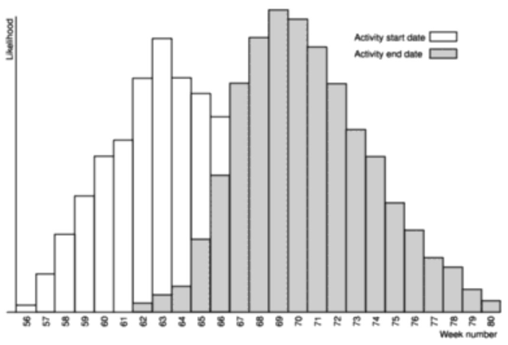

# Chapter 7 - Risk management

> [SPM] Chapter 7

Ideally, we want to remove risks altogether from critical path activities, but at least we want to minimize them.

## 3 kinds of risks

- Those caused by the inherent difficulties of estimation
- Those due to assumptions made during the planning process
- Those of unforeseen/unplanned events occurring.

## Assumptions

Assumptions will put the plan(s) at risk if they are not valid. At each step of the way, it is important to explicitly list all assumptions that have been made and identify what effects they might have on the plan if they are inappropriate!

## Eventualities

The majority of unexpected events can be identified! For example, one of the programmers might take maternity leave, the required hardware might not be delivered on time, etc. If we consider these eventualities and plan for them, we reduce risk.

## Managing risk

The whole point of risk management is to avoid or minimize the adverse effects of unforeseen events by avoiding the risks or drawing up contingency plans for dealing with them.

### Risk identification

This is where we list all of the risks that can adversely affect the successful execution of the project.

#### Risk factors

- **Application factors**: The *kind* of application might on its own tell us something about the risks.

- **Staff factors**: The experience and skills of the staff involved plays much into the risks. The more experienced a developer is with the technology that has been selected for the project, the less likelihood of errors.

- **Project factors**: If the project objectives isn't well defined and absolutely clear to all members of the team *and* the stakeholders, this will pose a risk to the success of the project.

- **Project methods**: If we are using methods such as PRINCE 2 or SSADM which are either underdeveloped, new or new to the organization, this will pose a risk - there is a lack of experience with the methodology.

- **Hardware/Software factors**: If new hardware is to be developed, it will pose a higher risk than one where we can rely on existing hardware that we already know to work.

- **Changeover factors**: If the project relies on external organizations that cannot be directly controlled, this poses a risk.

- **Environment factors**: Changes in the environment can affect a project's success (such as a change in taxation regulations).

- **Health and safety factors**: People may get sick or even die (I wanted to sound dramatic). We should take health and safety factors into account as these pose a risk to the project.

### Risk estimation

This is where we assess the likelihood and impact of each hazard.

### Risk evaluation

This is where we rank risks and determine risk aversion strategies.

### Risk planning

This where we draw up contingency plans and add these to the project's tas structure.

### Risk control

This is where we react to problems throughout the project.

### Risk monitoring

This is an ongoing activity where we monitor particular risks as the project proceeds.

### Risk directing/Risk staffing

This is where we direct staff to manage or avert risk somehow.

## Risk-oriented staff

All project staff must be risk-oriented and provided with an environment where they can freely discuss the risks that might affect a problem. It can be seen as a negative attitude when team members identify potential risks - but it should be the standard and expected of every team member!

## Risk analysis

When we have identified the risks that might affect our project, this is the time when we want to assess their **importance**. A major risk is that the project is delivered late while a minor probably is that some of the documentation will be delayed by a day or two.

### Risk likelihood

The probability of a hazard's occurring is known as the *risk likelihood*.

Notation-wise, this is represented as a probability.

### Risk impact

The effect that the resulting problem will have on a project, if it occurs, is known as the *risk impact*.

Notation-wise, this is represented in monetary terms.

### Risk exposure

The *importance* of the risk is known as the *risk value* or *risk exposure*.

It is calculated as:

*risk exposure = risk likelihood  * risk impact*.

### Scoring risk

We often use a simple scoring technique to provide a quantitative measure for assessing each risk where the likelihood and impact of each risk is scored on a scale between 1-10 where the most **likely** hazard receives a score of 10 and the least like a score of 1.

### Compound risks

Some risks will be dependent on others. Where this is the case, they should be treated together as a single risk.

### Risk Reduction Leverage (RRL)

Some risks can be reduced or avoided by taking action on them. This may have a cost. So we want to compare the costs of taking action with the benefits of reducing the risk. Obviously, if we were building a Safety-critical system, we would aim to minimize or avoid all risks, no matter the cost.

One method for calculating the Risk Reduction Leverage is the equation:

*RRL = (REbefore - REafter) / risk reduction cost*.

Where *REbefore* is the original risk exposure value and REafter is the expected risk exposure value after taking action. The *risk reduction cost* is the cost of implementing the risk reduction action.

**An RRL > 1 indicates that we can expect to gain from implementing the risk reduction plan, because the expected reduction in risk exposure is greater than the cost of the plan**.

The higher the leverage value, the more worthwhile it will be to plan the risk reduction action.

### Risk reduction cheat sheet

## Using PERT to evaluate the effects of uncertainty

PERT is very similar to the CPM technique (Critical Path Method), but instead of using a single estimate for the duration of each task, PERT requires three estimates:

- **Most likely time**, denoted *m*
- **Optimistic time**, denoted *a*.
- **Pessimistic time**, denoted *b*

PERT then combines these 3 estimates to form a single expected duration, *te*:

*te = (a + 4m + b) / 6*

An advantage to this approach is that it places an emphasis on the uncertainty of the real world.

So, as you can see, it is in principle a CPM but where the durations are floating point numbers following the formula above.

The PERT technique uses a 3-step method:

1. Calculate the standard deviation of each project event (*s = (b - a) / 6*) where *b* is pessimistic time and *a* is optimistic time.

2. Calculate the *z* value value for each event that has a target date. This is equivalent to the number of standard deviations between the node's expected and target dates. The formula is: *z = (T - te) / s* where *te* is the expected date and *T* is the target date.

3. Convert *z* values to probabilities. This is done using the graph:

You simply pick out the percentage that matches the value of *z*.

### Advantages of PERT

It focuses attention on the uncertainty of forecasting.

## Monte Carlo simulation

This is an alternative to PERT. It is more flexible.

We use it to evaluate the risks of not achieving deadlines.

The basis of the technique is the calculation of event times for a project network a large number of times, each time selecting activity times randomly from a set of estimates for each activity. We then display the results as a graph:

