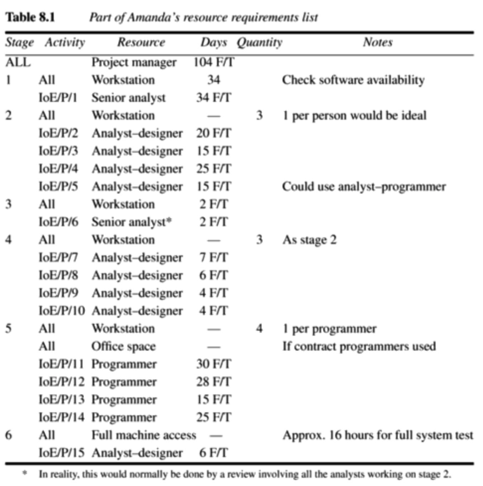

# Chapter 8 - Resource allocation

> [SPM] Chapter 8

We obviously need to allocate resources for the planned activities.

## Resources

A resource is any item or person required for the execution of the project. It can be anything from paper clips to personnel.

Some resources, such as a project manager, will be required for the duration of the whole project, whereas other resources such as a software developer might only be required for a single activity.

### Resource categories

#### Labor

This will primarily be members of the development project team (the project manager, system analysts, software developers, quality assurance team, support staff, etc).

#### Equipment

Things like computers, desks and chairs

#### Materials

Things that are consumed, rather than equipment being used. Not that relevant for software projects, but we may require, for example, a bunch of DVD-ROM's that can be "consumed".

#### Space

Normally, we already have office space, but if any additional contracted staff is to be used, then office space will need to be found.

#### Services

Some specialist services may be required (for example telecommunications services).

#### Time

Time is one of the most important resources.

#### Money

Money is a **secondary resource**. It is used to buy other resources and will be consumed as the other resources are used!

## Identifying resource requirements

Here's an example of a list of resources needed.

### Prioritizing activities

It is helpful to prioritize activities so that resources can be allocated to competing activities in some rational order.

The priority must always be to allocate resources to critical path activities and *then* to those activities that are most likely to affect others.

## Creating new critical paths

Scheduling resources might create new critical paths. Delaying the start of an activity because of lack of resources will cause that activity to become critical if this uses up its float! And, a delay in completing one activity can delay the availability of a resource required for a later activity. If the later one is already critical, then the earlier one might now have been made critical.

## Factors when allocating resources

### Availability

We need to know whether a particular resource will be available when required.

### Criticality

Allocation of more valuable resources, such as experienced personnel, to activities on the critical path often helps in shortening project durations or at least reduces the risk of overrun.

### Risk

Identifying those activities posing the greatest risk, and knowing the factors influencing them, helps to allocate resources. Allocating the most valuable resources, such as experienced personnel, to the highest risk activities, is likely to have the greatest effect. But, the most valuable resources are typically also more expensive.

### Training

It might be an option to allocate junior staff to appropriate non-critical activities when there is sufficient slack for them to train and develop skills.

## Work plan

A precedence network is a great planning tool, but not the best way of publishing and communicating project schedules. Instead, we need a work plan.

A work plan is a list or a graph indicating which resources are allocated to which activities and when.

## Cost schedule

This is where we produce a detailed cost schedule showing weekly or monthly costs over the life of the project.

### Categories of costs

#### Staff costs

This includes staff salaries as well as other direct costs of employment such as the employer's contribution to social security funds, holiday pay and sckness benefit.

#### Overheads

This includes space rental, interest charges and other costs that cannot be directly related to individual projects.

#### Usage charges

For example, payment for CPU hours on AWS and other external services that the organization relies on for a project. This is normally taxated on an "as used" basis.

## Successful project scheduling is not a simple sequence

Most often, when you change in the cost schedule, this will have an impact on the activity plan and/or risk assessment. It is a back-and-forth discipline between all of these.