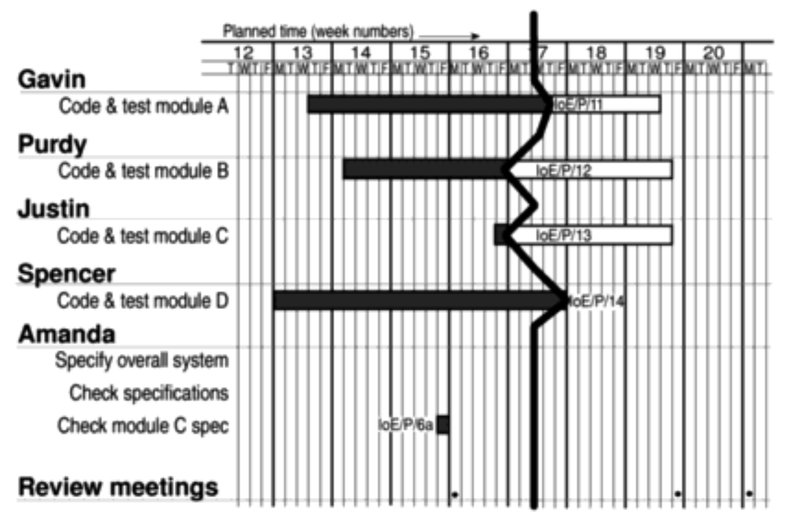

# Chapter 9 - Monitoring and Control

> [SPM] Chapter 9

When we have schedules ready, we must focus on ensuring progress!
We need to monitor what is happening and compare that with the actual schedule. Where necessary, we must revise our plans and schedules to bring the project as far as possible back on target.

## Responsibility

The overall responsibility of ensuring satisfactory progress on a project is often the role of the *project steering committee* or *Project Board*.

If we think about the project reporting structure in a typical project, individual team members will report directly to the team leader who then collates reports on their section's progress and forward summaries to the project manager. The project manager can then create project-level reports for the steering committee who can take action upon it.

## Setting checkpoints

Checkpoints may be regular (monthly, for example) or tied to specific events (such as the production of a deliverable).

## Taking Snapshots

How often team leaders or project managers collection information varies with the experience of the staff.

In general, weekly collection of information from staff carrying out activities is often a good idea. **It ensures that information is provided while memories are still relatively fresh**.

## Collecting data on partially finished tasks

It can be difficult to estimate how much work is needed when a task is partially done.

### Weekly time sheets

This is a sheet where jobs are broken down into activity level and requiring information about work done in addition to time spent.

## The Traffic-light Method

This avoids asking for estimated completion dates. Instead it asks for *estimates of the likelihood of meeting the planned target date*.

It has the following steps:

1. Identify the key (first level) elements for assessment in a piece of work.
2. Break these key elements into constituent elements (second level).
3. Assess each of the second level elements on the scale:
	- *green* for "on target".
	- *amber* for "not on target but recoverable".
	- *red* for "not on target and recoverable only with difficulty".

It does not estimate work done, only tell something about whether or not we are on track.

## Visualizing progress with a Gantt Chart

A Gantt chart is **an activity bar chart** indicating scheduled activity dates and durations frequently augmented with activity floats.

It also has a *Today* cursor which provides an immediate visual indication of which activities are ahead or behind schedule!

## Visualizing progress with a Slip Chart

It is very similar to a Gantt chart. The more the slip line bends, the greater the variation from the plan.

A very jagged slip line indicates a need for rescheduling.

## Visualizing progress with a Ball chart

This is another way of showing whether or not targets have been met.

The circles indicate start and completion points for activities.

The circles initially contain the original scheduled dates.

Whenever revisions are produced these are added as second dates in the appropriate circle until an activity is actually started or completed.

The circles will only contain two dates: **the original and most recent target date**.

## Visualizing progress with the Timeline chart

The charts described so far does not clearly show the slippage of the project **completion date**.

The Timeline chart records and displays the way in which targets have changed throughout the duration of the project.

Planned time is plotted along the horizontal axis, and elapsed time down the vertical axis.

The (potentially) jagged lines going down the chart represent scheduled activity completion dates - and how they change.

### Baseline Budget (BCWS)

This is the original budgeted cost for an item.

## Earned Value Analysis

This is based on **assigning a value to each task or work package**.

The value **is the original budgeted cost for the item (the baseline budget)**.

A task that has not started is assigned the value zero, and when it has been completed, it is credited with the value of the task.

**The total value credited to a project at any point is known as the Earned Value or Budgeted Cost of Work Performed (BCWP)**.

### How to assign earned value to uncompleted tasks

There are a few techniques:

#### The 0/100 technique

Here, a task is assigned a value of zero **until it is completed**.

#### The 50/50 technique

Here, a task is assigned 50% of its value as soon as it is started and of course 100% when it ends.

#### The milestone technique

Here a task is given a value based on the achievement of milestones that have been assigned values as part of the original budget plan.

## Setting up the Baseline budget

The baseline budget is based on the project plan and shows the forecast growth in earned value through time.

**It is commonly measured in person-hours or workdays**!

### Actual Cost to date (ACWP)

Keeps track of the accumulated costs

### Budget variance

This is calculated as *ACWP - BCWS*. It indicates the degree to which actual costs differ from those planned!

### Schedule variance

This is calculated as *BCWP - BCWS*. It indicates the degree to which the value of completed work differs from that planned.

### Cost variance

This is calculated as *BCWP - ACWP*. It indicates the difference between the budgeted cost and the actual cost of completed work.

### Performance ratios

These are *value-for-the-money* indicators. A value greater than one indicates that work is being completed **better than planned**. A value less than one means that work **is costing more than and/or proceeding more slowly than planned**.

#### Cost Performance Index (CPI)

Calculated: *CPI = BCWP/ACWP*.

#### Schedule Performance Index (SPI)

Calculated *SPI = BCWP/BCWS*

## Prioritizing monitoring

We should especially focus on these kinds of activities:

- Critical Path activities - Any delay in those will cause a delay in the completion date for the whole project!

- Activities with no free float - Any delay in those will at least delay some subsequent activities and may (but not necessarily) push the completion date for the project.

- High risk activities - They are most likely to overrun or overspend.

- Activities using critical resources - If an activity is very expensive, staff or other resources might be available only for a limited period!

## Keeping the project on track

There are some things we can do to keep the project on track or minimize the delay:

### Shorten the critical path

The overall duration is determined by the current critical path. If the completion date has been pushed, we can see if we can shorten any activities on the critical path to get the completion date to where it was. Overtime is one of the ways to do that.

### Reconsider precedence requirements

Could we parallelize more than we do already? Is there something that may not necessarily be required to depend on some previous activities anyway? This way, we can bring the completion date closer.

We could subdivide an activity into several parts, some of which may still be dependent on something preceeding it, but the other parts could be developed in parallel.