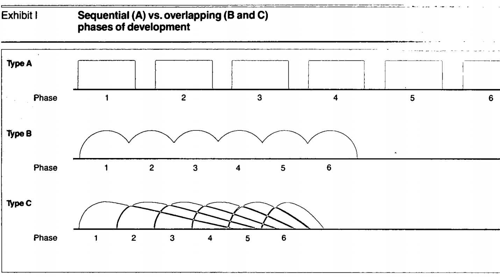

# The new new product development game

> [The new new product development game](https://learnit.itu.dk/pluginfile.php/166159/course/section/88120/1986%20-%20the%20new%20new%20product%20development%20game.pdf)

It is from 1984, but already here it states that companies are discovering that the old, sequential approach to developing new products won't get the job done, at least not fast enough.

The traditional sequential or "relay race" approach to product development, isn't fast-paced and flexible enough.

**What we need today is constant innovation in a world of constant change**.

## Sequential vs overlapping phases of development

## Holistic approach

*"The ball gets passed within the team as it moves as a unit up the field!*.

### Characteristics of the holistic approach

- Built-in instability
- Self-organizing project teams
- Overlapping development phases
- Multilearning
- Subtle control
- Organizational transfer of learning

#### Built-in instability

The process starts by signaling a broad goal or a general strategic direction.
By not handing out a clear-cut work plan, it offers the project team a wide measure of freedom. Also, it sets very challenging goals. The reason for this is that many believe creativity is born by pushing people against the wall and pressuring them to the extreme.

#### Self-organizing project teams

The project team creates its own dynamic order. It takes initiatives and risks and develops an independent agenda.

This self-organizing team concept only works if the group has:

- Autonomy
- Self-transcendence
- Cross-fertilization

##### Autonomy

The external involvement is limited to providing guidance, money and moral support at the outset. The team is free to set its own direction.

The top management then effectively acts as a "venture capitalist". So, it's a lot like a start-up company within the project group!

##### Self-transcendence

The project team starts with the guidelines set forth by top management, but then "takes over" and sets its own goals and keep on elevating them throughout the development process.

##### Cross-fertilization

The team should be diverse in terms of functional specializations, thought processes and behavioral patterns.

It is important that the team is together, preferably in one room, since the cross-fertilization only begins when they interact with each other.

#### Overlapping development phases

The reason for not overlapping development phases has traditionally been to reduce risk. But, a bottleneck in one phase can slow or even halt the entire development process.

Instead, by doing it in parallel, the group can "absorb" the vibration/noise generated throughout the development process.

#### Multilearning

Multilearning is when learning manifests itself along two dimensions:

- Across multiple levels (individual, group and corporate)
- Across multiple functions.

In this kind of environment, people will have to learn (directly or indirectly) skills that may be slightly off their primary skill-set.

It also has to do with a working environment that encourages for learning.
We want *drive* for learning.

#### Subtle control

Management establishes enough checkpoints to prevent instability, ambiguity and pure chaos.

It's a fine balance, because at the same, management must avoid the kind of rigid control that impairs creativity and spontaneity.

This could also mean exchanging members of the group along the way to balance it out. For example, if things are getting to radical, one of the group members could be replaced by an older, more conservative employee.

#### Transfer of learning

It is important that the group is able to transfer their learnings from the project group to the rest of the organization so that valuable learnings can be used in future projects.

To do so, we would assign key individuals from the project to future ones so that the transfer could happen through "osmosis".

## Limitations of the Holistic approach

- It requires extraordinary effort on the part of all project members throughout the span of the development process.

- It may not apply to organizations where product development is masterminded by a genius who makes the invention and hands down a well-defined set of specifications for people below to follow.