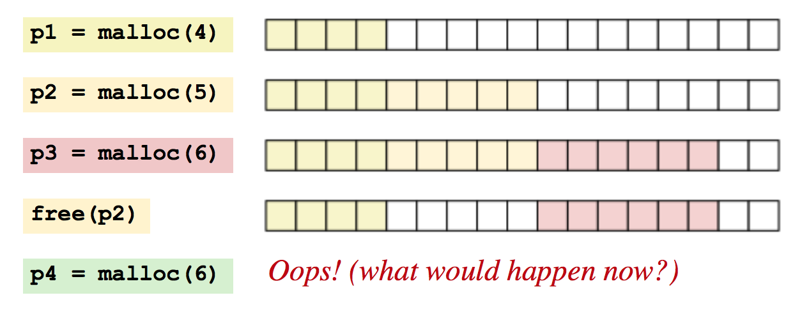

# Exam answers

## Question 1

### 1. A

*Explain the difference between logical and arithmetic shifting*.

#### 1.A Written solution

A *Logical* shift is a bitwise operation that shifts all the bits of its operand.
These can be useful to perform multiplication or division in an efficient way.

Bit-shifting is just multiplying and dividing by powers of two to add or remove digits.

With *Logical* shifts, a number's sign bit is not preserved. And, a number's exponent is not distinguished from its significand. Instead, every bit is simply moved a given number of bit positions. All empty bit-positions will be filled with zeros.

An *Arithmetic* shift is like a *Logical* shift, except for the important difference that vacant bit-positions are not simply filled with all zeroes when shifting to the right. Instead, the leftmost bit - which will usually by the sign bit for signed integers - will be replicated to fill in all the vacant positions.

#### 1.A Exam version

Bit Shifting is just moving every bit one or more positions to the left or to the right.

This has some nice properties. For example, we can use it ti perform multiplication and division.

Say we had the number 1010<sub>2</sub> which is equal to 10<sub>10</sub>

If we perform a left-shift by 1, we move everything to the left by one and fill out the hole in the right side by an additional zero:

1010 << 1:
 1010
10100

Now, 10100<sub>2</sub> is 20<sub>10</sub>, so we've effectively multiplied the number by 2!

This means that we can do multiplication in binary simply by performing a left-shift.

Now, say we were to perform a right shift by 1:

1010 >><sub>L</sub> 1:
1010
01010

0101<sub>2</sub> is equal to 5<sub>10</sub>, so we've effectively divided the number by 2!
This means that we can do division in binary by performing a right-shift.

While this works, notice how we just added a leading zero. This is fine for unsigned numbers, e.g. ones that we know to be positive.

But with Two's-complement, we use the leading bit to indicate if it is a positive or a negative number. We call it the sign bit. If it is 1, we know that it is a negative number. If it is a zero, we know that it is a positive number.

So, if we just add leading 0s, and if we have a negative number (where the sign bit is 1), all of a sudden it becomes positive. So that is not good!

Arithmetic right shifts solves this by filling the holes with the sign bit, rather than by 0s:

In Two's-Complement, if this was a 4 bit system, *1010* is equal to *-6<sub>10</sub>*.

1010 >><sub>A</sub> 1:
1010
11010

1101 is equal to *-3<sub>10</sub>* which is the expected result of the division.

### 1. B

*Write a C program that takes a long and computes its absolute value. Describe the steps you are taking to compute the absolute value*.

#### 1. B Written solution

```c
int main(int argc, char **argv) {
	// The first argument will be the integer to compute the absolute value of
	int raw = argv[1];

	// The target for the absolute value
	unsigned int target;

	// Create a mask that is equal to all 1s if the sign bit is set.
	int const mask = raw >> sizeof(int) * CHAR_BIT - 1;

	// Compute the absolute value
	target = (raw + mask) ^ mask;

	printf("%d", target);

	return 0;
}
int v;           // we want to find the absolute value of v
unsigned int r;  // the result goes here 
int const mask = v >> sizeof(int) * CHAR_BIT - 1;

r = (v + mask) ^ mask;
```

#### 1. B Exam version

The written solution is wrong and confusing. I'm sorry. I've added two different versions of the solution - and one of them is outside of the `main` function. And, in the example, I take the size of an `int`, even though you are asking for a `long`. So let me do it in another way:

If we want to take the absolute value of *n*, and it is represented by a `long` with in Two's-Complement, what we need to do first is to create a bit mask that contains all 1s for a negative number or all 0s for a positive number.

To do that, we have to perform an arithmetic right shift of *n* by the amount of bits it has - minus 1.

The amount of bits in a long is equal to the size of a long in **bits**. If we know that the word size of the system is 8 bytes, we can simply take the sizeof(long), which gives us a 8 bytes, and then multiply by the word size, which gives us 64.

Now, we right shift arithmetically 63 times - one less than the size in bits. Because arithmetic right shifts preserve the sign bit, we get a bunch of 1s.

All-1s is always equal to *-1* in Two's-Complement. Likewise, all-0s is always equal to *0* in Two's-Complement.

We then XOR (^) the number, *n*, with the mask. This is effectively a NOT for the mask for negative values, and a no-op for positive values.

Finally we subtract the XOR from the mask to get the absolute value.

For positive values, the XOR with all 0s would get the original binary string, and since the mask is all-0s, the difference between XOR - mask would be identical to the original value and thus give the same result.

For negative values, the XOR of *n* with the mask would be equal to *NOT x + 1* in Two's-Complement.

## Question 2

### Question 2. A

*What is a stack canary?*.

#### 2. A Written solution

A *Stack canary* is a technique for preventing malicious attempts at causing an overflow in the heap and overriding memory spots that the program shouldn't be able to access.

This can happen since any program that prompts for user input has an input buffer that it stores the input in. But this buffer is at all times of a specific length. Not only can it be filled, it can also be overflowed.

With the Stack canary technique, a random value, the *canary*, is placed between the local variables and the return address of a function call. It builds on the principle that local variables are stored on the call stack, which stores the return address of the function.

Before the functon returns, the program checks that the canary hasn't been altered.

An attacker can still get around a stack canary by gaining control of a pointer that the attacker can then use to write the return address directly.

#### 2. A Exam version


### Question 2. B

*Can they be used as a counter-measure for the exploits you designed in Assignment 2? Explain your answer.*.

#### 2. B Written solution

Yes, they can. In Assignment 2, we didn't use any Stack canaries and could easily exploit it.

We could have checked the canaries for manipulation before returning from the function calls to ensure that the return address(es) hadn't changed, which would have avoided any of the exploits we made.

#### 2. B Exam version

Stack canaries would have been our saviour.

In Level 1, we provided as many *AA* pairs as the size of the buffer. We read the size of the buffer from the assembly code and new precisely how many positions in memory that was allocated.

Then, immediately after the *AA*s in the input, we gave another return address (45 19 40). Then, when executing the function, the CPU "returned" to that address, effectively invoking a completely different function.

Had we had a stack canary before the return address, it would have been the canary that was overwritten. Before returning, we could have checked it to see if it had changed or not.

## Question 3

*Consider the logfind tool from Assignment 3*.

### Question 3. A

*Desribe the glibc functionalities you use in your program*.

#### 3. A Written solution

- `Malloc`: Allocates the given size of bytes of memory and returns a pointer to the allocated memory location.

- `strlen`: Computes the length of the given string. It attempts to compute the length, but never scans beyond the first `maxlen` bytes of s.

- `strncmp`: Performs a lexicographical comparison between two null-terminated strings.

- `glob`: Searches for all the pathnames matching the given pattern according to the rules used by the shell.

- `fopen`: Opens the file whose matching the given location and associates a stream with it.

- `fclose`: Disassociates the named stream from its underlying file.

#### 3. A Exam version

// TODO: Er der noget at tilføje her?

### Question 3. B

*Using gprof to profile your program, describe how your program performs when the size of the input sequence is varied from 1 word to 10 words. Discuss how time is spent during the execution of your program. Does performance depend on the order of the words?*.

#### 3. B Written solution

Due to short circuiting conditions, the order in which the interpreter stumples upon conditions in boolean AND/OR operations matter. With OR, the operation terminates as soon as a condition is met that is truthy. With AND, all of the conditions must be checked for truthiness.

Therefore it makes sense to sort the conditions differently based on the kind of operation to perform. For AND operations, we want it to terminate as quickly as possible. So if we provide the most uncommon words first, there is a greater chance that a falsy condition is met as one of the first ones and that the operation will terminate.

For OR operations, it is the other way around - we want to have the most common words in front since the OR expression will terminate as soon as it stumples upon a truthy one.

#### 3. B Exam version

The function that is most easily optimizable is the `matcLine` function.
It performs a loop in which it compares the received line with all of the words to match on.
If the OR flag is set, it will break the loop as soon as it finds a match.

We can optimize the average run-time of this, though it will still be O(n), by sorting our strings such that the words that are most common (e.g. most likely to appear in the line) are checked first. Because this will also mean that there is a greater chance of `break` happening sooner than later.

For AND, it is the other way around. If we sort by the least common (e.g. most UNlikely to appear in the line) words, as soon as a word is seen that isn't matched, it will break the loop.

Another thing that limits execution speed is the part where it needs to open a stream to files. This produces an underlying system call which is significantly more slow than executing instructions that sit in memory.

## Question 4

### Question 4. A

*What is an implicit free list?*.

#### 4. A Written solution

When performing manual memory allocation, as we do in C, the *free list* is a convenient data structure for building dynamic memory allocation. where unallocated regions of memory is connected in a *linked list*.

With *implicit* free lists, we store the length and whether or not the block is allocated for each block. That can be pretty wasteful if store the information in two words, so instead we take advantage of the fact that some low-order address bits are always 0 if the blocks are aligned. And, instead of storing the 0-bit for all of them, we use that one as a flag to determine if the block is allocated or free.

Implicit free lists are easy to implement, but may take O(n) for allocation which makes it inefficient for usage with `malloc()` or `free()` operations.

#### 4. A Exam version

If we treat the heap as one huge linked list,


We can break each block into block as this:


If we impose a double-word alignment constraint (8 bytes), then the block size is always a multiple of 8 and the 3 low-order bits of the block size are always zero. Thus, we need to store only the 29 high-order bits of the block size, **freeing the remaining 3 bits to encode other information**. In this case we are using the least significant of these bits - the *allocated bit* - to indicate whether the block is allocated or free.

We break the blocks into:

- A header containing the size as well as a bit indicating if it is allocated or not
- A payload, where we store the actual data, and
- Optional padding

The reason why we call it a linked list is because we can use the "size" field in the header to know for how long to "jump" when traversing the list for a free block. This is also the reason why it is implicit - it doesn't actually contain any pointers to the remaining notes, but we can traverse it using just the size.

When we want to find a free block, we traverse the list until we find a block that is free and has enough size to fit whatever payload we want to fit within it.

We can do a *first-fit* traversal, where we essentially traverse the full list until we find one. This works well, but for large heaps, we may end up traversing for a long time.

We can do a *next-fit* traversal where we start from the previous fit. This can be faster, but if we ended up somewhere last time because there were blocks that were free but didn't have space for the payload, and the new payload you are trying to store could have been fitted within them, you get memory fragmentation.

We can also do *best-fit* traversal which eliminates fragmentation, but will be slow since it must traverse until it finds a perfect fit.

We can improve upon this with an *explicit free list* which is a doubly linked list.

Here, each block also has a predecessor and successor link, and **it only links free blocks**.

So if *n = total number of blocks*, and *n<sub>f</sub> = total number of free blocks*, traversal with an explicit free list is only O(n<sub>f</sub>).

However, we may still end up traversing for a long time if there are many free blocks.

Instead, we can use a segregated free list, which is a bunch of explicit free lists divided into size classes. This is neat because we just choose the size class that matches whatever we want to store and then we should be able to immediately find an available block.

### Question 4. B

*Describe your design and implementation of a heap checker in Assignment 4*.

#### 4. B Written solution

(None)

#### 4. B Exam Version

The assignment is about producing a heap consistency checker. It needs to check:

- Whether there are any free blocks
- If any free blocks escaped coalescing.
- If any allocated blocks overlap

It's all about having the best combination of space utilization and throughput.

## Question 5

### Question 5. A

*What is virtual memory?*.

#### 5. A Written solution

Virtual Memory is a memory management technique that sits on top of physical memory that treats the main memory as a cache. This simplifies memory management greatly by providing each process with a uniform address space and protects the address space from corruption by other processes. This makes processes memory-decoupled from each other and serves as a mapper between physical- and virtual memory locations.

#### 5. A Exam version

Virtual Memory is a memory management technique that treats main memory as a cache for an address space stored on disk. It keeps only the active areas in main memory and transfers data back and forth between those as needed.

It simplifies memory management greatly by providing each process with a uniform address space and protects the address space of each process from corruption by other processes.

We want to be able to always target the full address space of *2<sup>64</sup>*. Now, that is equal to 16 exabytes and no computers have that. We may have something like 256MB RAM on older computers which is equal to a physical address space of *2<sup>28</sup>*. So instead, we *translate* virtual addresses to physical addresses inside memory.

The most simple version of this would be

CPU <sub>va</sub> -> MMU <sub>PA</sub> -> Main memory <sub>Data</sub> -> CPU.

Where the CPU generates a virtual address which is converted t o the appropriate physical address.

More precisely, it works like this:


When we have a page miss, a page fault exception is triggered which invokes a page fault exception handler in the kernel.

The kernel selects a victim page inside the DRAM cache and replaces whatever there is on it with the new Virtual Page. It moves that Virtual Page down onto the disk if it is dirt (e.g. if it has changed), otherwise it just clears it.

Each and every process has its own virtual address space as well as a separate page table inside memory!

Multiple virtual pages can be mapped to the same shared physical page, without a problem! You can define shared memory regions, e.g. regions that can be shared between processes.

This also greatly simplifies linking and loading code since shared libraries always start at the same address.	

### Question 5. B

*What is a Translation Lookaside Buffer?*.

#### 5. B Written Solution

The Translation Lookaside Buffer (TLB) is a small, virtually addressed cache. Since mapping between virtual and physical memory can be challenging and the lookups are repeated often, it makes sense to cache these mappings so that the CPU can access it directly from within that cache rather than computing the mapping again.

#### 5. B Exam Version

Vis på tavlen sammen med Virtual Memory. Du har allerede dækket det i det forrige svar.

### Question 5. C

*What happens when there is a page fault?*

#### 5. C. Written solution

When a Page Fault happens, a program attempts to access a memory page that the virtual address space of the process doesn't know about. It *may* be accessible by the process, but the memory management doesn't know about it since it isn't mapped to any virtual memory location.

These faults not necessarily errors, but can also trigger the OS to attempt to figure out where that memory lives and will read the page from disk and finally reconfigure the virtual addressing system provided to the process to perform the mapping to the actual location.

### 5. C Exam version

A *page fault* happens when a virtual page isn't cached in main memory but rather sits in virtual memory on the disk. When a *page fault* exception is triggered, the page fault exception handler in the kernel is invoked. It will then select a *victim page* (if there isn't space) inside cached memory and replace it with the virtual page from disk. If that virtual page is dirty, e.g. it is different from the one on disk, it must be copied over to disk to preserve the changes.

### Question 5.D

*Give an example of a C program that generates a segmentation fault*.

#### 5. D Written solution

A segmentation fault (*"segfault"*) happens when a process attempts to access a memory location that doesn't belong to it.

They most often happen because of pointer errors in dynamic memory allocation. But they can also happen if we attempt to write to a read-only memory location as in this example:

```c
int main(void) {
    char *s = "foobarbaz";
    *s = 'bazbarfoo';
}
```

This will produce a segmentation fault on memory protected systems since it attempts to modify a string literal (which is read-only)

#### 5. D Exam Version

When we get a segmentation fault, we are doing something wrong with memory.
If we try to dereference a *null* pointer, we get a segmentation fault.

If try to read or write from a part of memory we dont have access to or that is read-only, we too get a segmentation fault. For example:

```c
char *str = "Foo"; // Compiler marks the constant string as read-only
*str = 'b';
```

Now, when you declare a pointer of type char and you provide it with a string, it is stored in read-only block, generally in the data segment of virtual memory. You can make `*str` point to something else, but you cannot change the actual value associated with that specific virtual memory page.

## Additional questions section

### What is a string in C

In C, we can express the abstract idea of a string with an array of characters and with a pointer.

#### String as an array

```c
char str[] = "foo";
```

This is an array in memory of *["F", "o", "o", "\0"]* where the "\0" character is the nul character and indicates the end of the string.

Since strings are really just arrays, we can access each character in the array like we use to `str[1]`.

#### String as a pointer

We can also declare a string as a *pointer to some characters*:

```c
char *str = "Foo";
```

This is *not* an array of characters, but instead a pointer to some read-only memory location containing the string-literal.

### What is the difference between little endian and big endian

With Big Endian, you store the most significant byte in the smallest address. So with big Endian, you read the bytes from left to right.

With Little Endian, you store the *least* significant byte in the smallest address. So with Little Endian, you read the bytes from right to left.

### What does "least" and "most" significant bit mean

THe least significant bit is the bit determining whether the number is even or odd. This is typically the right-most bit, if the bit vector is represented from left to right.

The most significant bit is then the left-most - the one we use for sign in Two's-Complement.

### How does the Stack work

The stack is built in Last-in, First-out.

We can push and pop elements onto the stack.

The stack grows from bottom and up. It grows toward lower stack addresses.

### What is internal and external fragmentation

Internal fragmentation:


happens when an allocated block is larger than the payload. There is simply too much space. For example, the implementor of the allocator might impose a minimum size on allocated blocks that is greater than some requested payload.

External fragmentation:



This is when there *is* enough aggregate free memory to satisfy an allocate request, but no single free block is large enough to handle the request.

### What can you do to get additional heap memory (coalescing)

We can try to create some larger free blocks by merging (called coalescing) free blocks **that are phyiscally adjacent in memory**.

If this doesn't help, the allocator can ask the kernel for additional heap memory with the `sbrk` function.

### How do you coalesc free bocks (and false fragmentation)

When an allocated block is freed, there might be other free blocks adjacent to it. This can cause something called **false fragmentation**, where there is a lot of available memory chopped up into small, unusable free blocks.

To avoid false fragmentation, the allocator must merge adjacent free blocks in a process called *coalescing*.

It is easy to coalesc the next block: We just follow the link of the current block to the next one. If the next one is free, and adjacent to the current one, we can coalesc them!

But, what if we would coalesc the previous block? We don't have any reference to it with an implicit free list. With an Implicit free list, we would have to search the entire list until we reached the current block, in which case we'd know that the block we looked for was the previous one.

A technique that can be used for constant-time coalescing of the previous block with implicit lists is one with something called *Boundary Tags*.

The idea is to add a *footer* (the boundary) tag **at the end of each block**, where the footer is a replica of the header.

This means that each block includes a footer that represents the status of the previous block!

With it, we can easily see if we can coalesc depending on whether the left-adjacent and right-adjacent blocks are free.

### What is a Virtual and Physical page

Say we have a 32-bit machine with 256MB of RAM and the pages are 4kB of size.

Then we have a virtual address space of *2<sup>32</sup>* and a physical address space of *2<sup>28</sup>*.

And due to the page size of 4kB we have 4096 addresses or 12 bits per page.

All virtual addresses are then 32 bits of size, but 12 of them goes to the page *offset* (because of the 4kB page size) and the remaining becomes the virtual page number.

Likewise, all physical addresses are then 28 bits of size, but 12 of them goes to the page *offset* because of the 4kb page size, and the remaining becomes the *physical* page number.

Notice that the page size will always be the same.


And now, inside the pages, the Virtual page number may be wildly different from the physical page number - but the offset is identical.

*When* we do the translation, we don't care about the offset - only the page number.

### What is an exception

An *exception* is an abrupt change in the control flow in response to some change in the processor's state.

System exceptions come from the CPU or from the kernel. For example, page faults or memory access violations (segfaults) come from the CPU!

The kernel provides system calls as one type of exception.

### What are Interrupts

These are asynchronous exceptions which happen as a result of signals from I/O devices that are external to the CPU!

pecifically, an I/O device triggers interrupts by signaling a pin on the processor chip and placing onto the system bus the exception number that identifies the device that caused the interrupt.

When the processor notices that the interrupt pin has gone high, it reads the exception number from the system bus and then calls the appropriate interrupt handler. When the handler returns, it then returns control to the next instruction (the instruction that would have followed the current instruction in the local flow, had the interrupt not occurred).

### What are Traps and System Calls

These happen synchronously as a result of executing the current instruction.

Traps happen when a user program wants to use the kernel for something (such as reading a file (`read`) or creating a new process (`fork`)). A `syscall` instruction provides the user program controlled access to request a specific service *n*. It causes a trap, and eventually it returns control to the next instruction.

### What are Faults

Faults are things like page faults. These result from error conditions that a handler *might* be able to correct. When such fault occurs, the processor transfers control to the fault handler. If it is able to correct the error condition, it returns control to the faulting instruction. Otherwise, the handler returns to an `abort` routine in the kernel that termiantes the application program that caused the fault!

### What are aborts

Aborts are **unrecoverable** fatal errors. This may be hardware errors such as when DRAM or SRAM bits are corrupted. Abort handlers never return control to the application program.

### How do you read a file

First, you need to call `open()` with the filename as well as what you want to do with the file. You then get a File Descriptor `fd` back which you must pass as a descriptor when you later want to read or write to that file.

When you open a file, a *descriptor* is a unique index that uniquely identifies that access to the file. This allows multiple uses of the same file simultaneously.

To the kernel, all open files are referred to by File Descriptors (non-negative numbers). When we open an existin g file or create a new file, the kernel returns a file descriptor to the process!

So, when we want to read or write a file, we identify the file with the file descriptor that was returned by `open()` or `create()` function call, and use it as an argument to either `read()` or `write()`

The `read(int fd, void *buf, size_t n)` function copies at most *n* bytes from the current file position of a descriptor *fd* to a memory location *buf*.

It may be the case that read actually ends up reading less bytes than we asked it to. One reason may be that while reading it encounters an EOF while reading.

### How do the kernel represent open files

It uses three related data structure:

- *Descriptor table*: Each process has its own separate *descriptor table* whose entries are indexed by the process's open file descriptors. **Each open descriptor entry points to an entry in the *file table*.
- *File table*: The set of open files is represented by a file table **that is shared by all processes**. Each file table entry consists of:
  - The current file position
	- A reference count of the number of descriptor entries that currently point to it. Closing a descriptor decrements the reference count in the associated file table entry. The kernel will delete the file table entry when the reference count becomes 0.
	- A pointer to an entry in the *v-node table*.
- *V-node table*: This is also shared by all processes. Each entry contains most of the information in the `stat` structure.

### What is the Standard I/O in C

The C language has a standard library, `libc`, that makes it easier to work with I/O.

It has:

- `fopen` and `fclose` function for opening and closing files.
- `fread` and `fwrite` for reading and writing bytes
- `fgets` and `fputs` for reading and writing strings
- `scanf` and `printf` for sophisticated formatted I/O

It models an open file as a *stream*. This is a pointer to as tructure of type `FILE`.

**Every C program begins with three open streams**:

- `stdin`
- `stdout`
- `stderr`

These correspond to:

- standard input
- standard output
- standard error

respectively.

### What is a process

When we run a program, we are presented with the illusion that our program is the only one currently running.

A process is what provides us with this illusion.

### How is a virtual address space organized


(Remember that the stack is also just part of memory. Thus we need a stack pointer to know at which position in memory the stack is located)

### Can you explain how the hardware is generally organized in a system

(Yes)

### How do you detect overflow

An arithmetic operation is said to overflow when the full integer result cannot fit within the word size limits of the data type.

**Anytime we add two positive values and come up with a negative result, we have an overflow condition!**.

**And, anytime we add two negative values and come up with a positive result, this too is an overflow condition**!

### Can you explain how the stack looks

