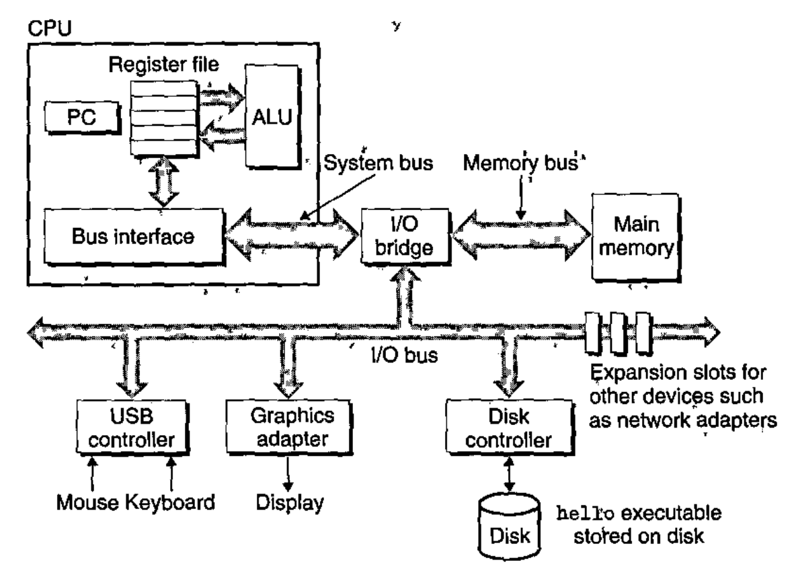
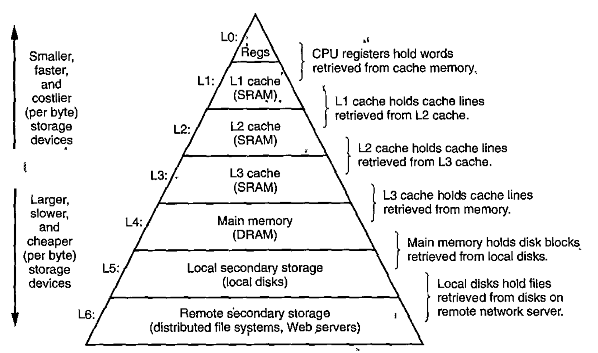
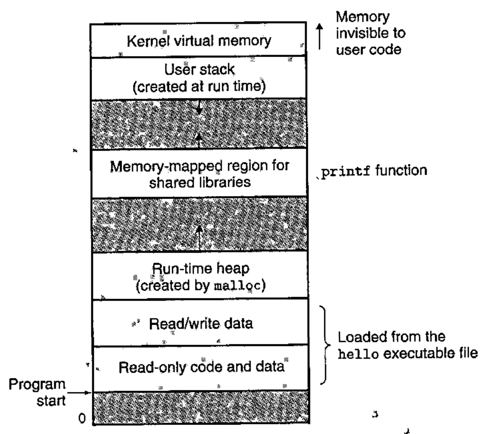

# Lecture 1

> CS:APP, Chapter 1

## Computer System

A Computer System consists of hardware and systems software that work together to run application programs.

## Bits vs Bytes

### Bit

A bit is a 0 or a 1.

### Byte

A *byte* is an 8-bit chunk.

### Source Program / Source File

This is the file containing the language-specific language (for example, the C-code).

#### A Source Program is a sequence of bits

A Source Program is really a sequence of bits, each with a value of 0 1, organized in 8-bit chunks called *bytes*.

Each byte has an integer value that corresponds to some character.

For example, one byte could have the integer value 35 (which corresponds to the character *#*).

Each text line is terminated by the invisible *newline* character `\n` which is represented by the integer value 10.

### Text files vs Binary files

*Text Files* are files that consist exclusively of ASCII or Unicode characters.

### Different contexts

The same sequence of bytes might represent an integer, a float, a number, a character or a machine instruction depending on the context. For example, with ASCII, we've just decided that the byte with the integer value 10 is a newline and that the byte with the integer value 35 is a *#*.

## A program's journey from Source program to Executable Object Program (binary)

The `gcc` compiler reads a source file and translates it into an executable object file.

Such a translation is performed in a sequence of four phases.

### Four phases

They are:

- Preprocessing
- Compiling
- Assembling
- Linking

### Preprocessing

Here, directives (things that starts with '#') are replaced accordingly.
For example, `#include<stdio.h>` is replaced with the contents of the `stdio.h` file.

The result is typically a new C program with the `.i` suffix.

### Compilation

Here, the compiler (cc1) translates the preprocessed text file into a new text file with a `.s` suffix. This is an **assembly-language** program.

**This describes low-level machine-language instructions in a textual form**.
This is useful because it provides a common output language for different compilers for different high-level languages.

### Assembling

Here, the assembler (as) translates the `.s` file into machine-language instructions. It packages them in a form called `relocatable object program` and stores the result in the object file with a `.o` suffix.

**This is a binary file**. It is by no means humanly readable.

### Linking

Here, the relocatable object program is merged with the relocatable object programs for all of the functions from the standard library that is called within the program. For example, `printf` is part of the standard C library. This must be merged ("linked").

This results in an executable object file (or simply *executable*) that can be loaded into memory and executed by the system.

## Why we need to understand how compilation works

- **Optimizing program performance**: In order to make good coding decisions in our C programs, we do need a basic understanding of machine-level code and how the compiler translates different C statements into machine code. Is a `switch` statement always more efficient than a sequence of `if-else` statements? Are pointer references more efficient than array indexes? And so on.

- **Understanding link-time errors**: When you are trying to build an application, what does it mean when the linker reports that it cannot resolve a reference? What happens if you define two global variables in different C files with the same name? And so on.

- **Avoiding security holes**: Really important!!! To avoid things like buffer overflow vulnerabilities, you have to understand the need to carefully restrict the quantity and forms of data the program accept from untrusted sources.

## Hardware Organization of a typical system

This is one example of an organization of a system based on the Intel family of systems.

### Buses

A *bus* is an electrical conduit **that carry bytes of information back and forth between components**.

They are typically designed to transfer fixed-size chunks of bytes known as *words*.

The size of these words varies between systems:

- For 32-bit systems, these word-sizes are 4 bytes (4*8=32)
- For 64-bit systems, these words are 8 bytes (8*8=64).

### I/O Devices

Input/Output devices are the system's connection to the external world.

Examples of I/O devices are:

- a Keyboard
- a Mouse
- a Display
- a Disk drive

#### How an I/O Device is connected

An I/O Device is connected to the I/O Bus by a *controller* or a *adapter*.

#### I/O Bus

An I/O Bus is just a bus like any other bus, except this one is strictly for transfering chunks of bytes from the I/O devices.

#### Controllers vs Adapters

Controllers are chipsets in the device itself or located on the motherboard (which is the systems main printer circuit board).

An adapter is a *card* that plugs into a slot on the motherboard. If the motherboard doesn't have the controller, an adapter can be bought and added to the motherboard with this functionality.

Regardless, the purposes of each is to transfer information back and forth between the I/O bus and an I/O device.

### Main Memory

This is a **temporary storage device** that holds **both a program and the data it manipulates** while the processor is *executing* thre program.

It consists of a collection of *Dynamic Random Access Memory (DRAM)* chips. This is logically organized as a linear array of bytes, each with its own unique address (array index) starting at zero.

The amount of memory required by a program varies according to the used data types. a `short` requires 2 bytes while types `int` and `float` requires 4 bytes and types `long` and `double` require 8 bytes.

### Processor

The *central processing unit (CPU)*, simply called the processor, is the interpreter that **interprets/executes instructions stored in main memory**.

Within it is the *Program Counter (PC)*. Which is basically a cursor: At any point in time, it points at the address of some machine-language instruction in main memory!

Whenever it has executed an instruction it points to, it updates the program counter to point to the next instruction and continues executing - and so on.

#### Processor executing steps

1. The processor reads the instruction from memory pointed at by the program counter (PC)
2. It interprets the bits in the instruction
3. It performs some simple operation dictated by the instruction
4. It updates the PC to point to the next instruction.

#### Supported operations

There are only a few of these simple instructions that the CPU can execute.

These revolve around main memory, the *register file*, and the *arithmetic/logic unit (ALU)*.

Some of the operations that the CPU may carry out at the request of an instruction are:

|    Operation    |                                                              Description                                                        |
|-----------------|---------------------------------------------------------------------------------------------------------------------------------|
|     *Load*      |                Copy a byte/word from main memory into a register, overwriting the previous contents of the register             |
|     *Store*     |                    Copy a byte/word from a register to a location in main memory, overwrite existing if required.               |
|    *Operate*    | Copy contents of two registers to ALU, do an arithmetic operation on them, store result in a register, overwriting if required  |
|     *Jump*      |                Extract a word from the instruction itself and copy that word into the PC, overwriting if required               |

#### Register file

The *register file* is a small storage device that consists of a collection of word-size registers, each with its own unique name.

#### Arithmetic/Logic unit (ALU)

The *ALU* computes new data and address values.

### Processor instruction architecture vs microarchitecture

Naively, A processor appears to be a simple implementation of its instruction set architecture, but it actually uses far more complex mechanisms to speed up program execution!

We can distinguish the processor's instruction set architecture from its *microarchitecture* which describes how the processor is actually implemented.

## What happens when we run a compiled `C` program

Simplified (a lot), here's what happens:

1. The shell program is executing its instructions, waiting for us to type a command
2. We enter the name of the executable. Along the way, the shell program reads each one into a register and stores it in memory.
3. We hit `enter` on the keyboard. The shell knows that we are done typing and begins loading the executable file. To do so, it executes a sequence of instructions that copies the code and data object file from disk to main memory.
	- Using a technique called *direct memory access (DMA)*, the data travels directly from disk to main memory without ever passing through the processor
- Once it is loaded into memory, the processor begins executing the machine-language instructions in the program's `main` routine.

## Caches Matter

**Notice how a system spends a lot of time moving information from one place to another!** Especially from disk to memory. But then also instructions are copied from main memory into the processor. Or, from main memory to a display device.

**A disk drive might be 1000 times larger than main memory, but it might take 10000000 times longer to read a word from disk than from main memory**!!

**And, going further, even though a typical *register* file stores only a few hundred bytes of information, the processor can read data from the register file almost 100 times faster than from memory**!!

And this gap is only increasing since processors is getting faster at a more rapid pace than memory in the industry.

### Dealing with the processor-memory gap (cache memory)

Faster storage devices called *cache memories* (L1, L2, L3) are included and serve as temporary staging areas for information that the CPU is likely to need in the near future. This is neat, because then the CPU doesn't have to go to main memory to access the information again. It is essentially a local cache.

And, they can hold tens of tousands of bytes and can be accessed nearly as fast as the register file.

#### L1 vs L2 vs L3

The L1 is fastest and closest to the CPU.
The L2 is much marger than the L1 cache, but it may take up to 5 times longer for the CPU to access it. This is still much better than the access time to main memory, though.

#### The idea behind it

The idea is that a system can get the effect of both a very large memory and a very fast one by having a memory cache as close to the CPU as possible.

**We can be aware of these cache memories and exploit them to improve program performance by an order of magnitude!!**

## Hierarchy of fast storage

Notice how the register, L0 cache is at the very top, and the caches get increasingly slower as we go down the hierarchy.

**The main idea is that storage at one level serves as a cache for storage at the next lower level**.

For example, the *register file* is a cache for the *L1* cache, and the *L1* cache is a cache for the *L2* cache and so on. Really clever!

## The Operating System manages the hardware

A program doesn't really access the hardware. Instead, it relies on the OS to do so.

The OS is a layer of software interposed between the application program and the hardware.

So, if a program wants to manipulate/utilize the hardware, it must go through the OS.

The OS has two primary purposes:

1. To protect the hardware from misuse
2. To provide applications with simple and uniform mechanisms for manipulating complicated and often wildly different low-level hardware devices.
	- It does this through the fundamental abstractions *processes*, *virtual memory* and *files*.

### Processes

The OS provides the illusion that the program is the only one running on the system, and that the processor executes the instructions for that program, one after the other, uninterrupted.

This is an illusion provided by the notion of a process. A *process* is the OS's abstraction for a running program.

There can be multiple running processes at the same time, concurrently. They look as if they have exclusive use of the hardware - but they do not. Instead, the instructions of one process are interleaved with the instructions of another process.

A CPU core can only run one instruction at a time! But in multi-processor or multi-core systems, processors can more effectively execute multiple processes concurrently by having the processor switch among them. Much like in us humans, it does it by *context switching*.

This context switching happens so fast that it looks as if they are running concurrently.

Each of the processes has a *staste*, known as a *context*, which includes information such as the current program counter values (so it can resume from where it left off last time), the register file and the contents of main memory.

### The Kernel

The *kernel* is the one that manages the transition from one process to another. It is the portion of the OS **that is always resident in memory**!

If a program requires something of the OS, for example to read or write a file, it performs a *system call*

#### System call

A *system call* instruction is a call that tranfers control to the kernel which then performs the requested operation and returns back to the program that initated the call.

### Threads

A process can have multiple control flows, or multiple execution units, called *threads*. Each of these run in the context of the process.

- It is easier to share data between multiple threads than between multiple processes
- Quite important for concurrency, for example in network servers (if using blocking calls)
- Can also make programs run faster when multiple processors are available

### Virtual Memory

This is an abstraction that provides each process with the illusion that it has exclusive use of the main memory!

#### Virtual Address Space

A process has a view of memory called its *virtual address space*.

The areas that make up the virtual address space are:

- *Program code and data*: Code begins at the same fixed address for all processes. Then, they are followed by data locations that correspond to global C variables. This is **fixed in size once the process begins running**.
- *Heap*: The code and data areas are followed immediately by the run-time *heap. This is **not fixed-size**, but instead **expands and contracts dynamically at run-time as a result of calls to functions such as `malloc` and `free`**.
- *Shared libraries*: This holds the code and data for shared libraries such as the C standard library.
- *Stack*: This is the *user stack* that the compiler uses to implement function calls. This one also expands and contracts dynamically during excecution - each time we call a function, the stack grows. And, each time we return from a function, it contracts.
- *Kernel Virtual Memory*: This is the region of the address space that is reserved for the kernel (which isn't tied to a specific process but rather lives as part of the OS at all times). Application programs **are not allowed to read or write the contents of this area!**. They must specifically invoke the kernel to perform these operations.

### Files

A *file* is a sequence of bytes. That is all it is! Actually, even I/O devices are modeled as files.

## Communication with other systems using Networks

Systems are generally not isolated, but instead linked to other systems by networks. Even a network can be viewed as just another I/O device. The system copies a sequence of bytes from main memory to the network adapter. From there, the data flows across the network to another machine. It could just as easily have ended up at a local disk drive, for example. That's the beauty of the abstraction of the I/O devices.

## Multi-core processors

Multi-core processors have sevevral CPUs (referred to as *cores*) integrated onto a single integrated-circuit chip.

Typically, these cores has their own L1 and L2 caches but then shared higher-level caches (L3 and up) as well as the interface to main memory (so if all of them ask main memory for new stuff at the same time, bottlenecks can occur).

## Hyperthreading

This is a technique that allows a single CPU to execute multiple flows of control by having more than one program counter and register file while still only having the same amount of cores. The smart thing about Hyperthreading (HT) is that whereas a convential processor requires around 20000 clock cycles to shift between different threads, a HT-enabled processor can do this on a cycle-by-cycle basis!!

## Single-Instruction, Multiple-Data (SIMD) Parallelism

One instruction can actually cause multiple operations to be performed in parallel in a mode known as SIMD parallelism. This means that you could add, say, 8 pairs of single-precision floating point numbers in parallel!

## Arithmetic Logic Unit (ALU)

This is an electronic circuit that performs arithmetic and bitwise logical operations on integer binary numbers.

## Floating-point unit (FPU)

This guy performs arithmetic operations on floating point numbers!