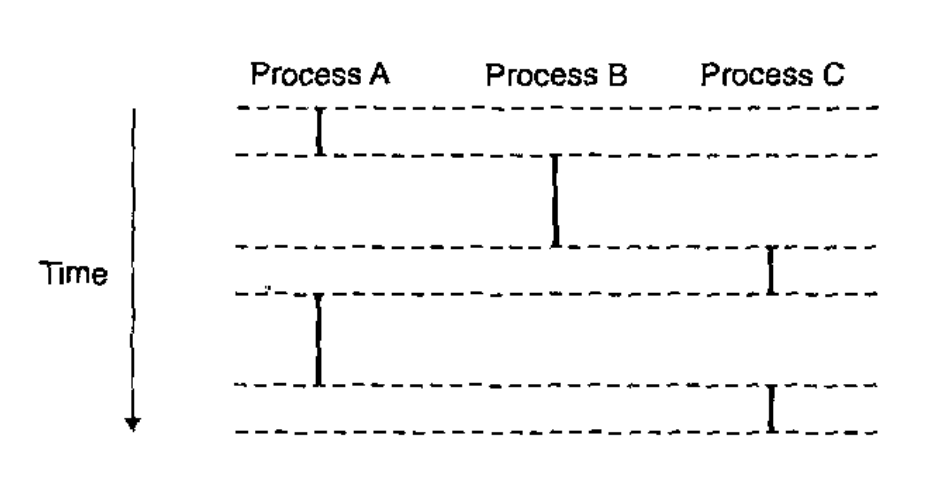

# Lecture 10

> CS:APP, Chapter 8.1 - 8.4

## Control transfer

The control flow typically follows the transition *a0, a1, ..., an -1*. For where each *ak* is the address of some corresponding instruction. Each transition is called a *control transfer*.

## Exceptional Control Flow (ECF)

However, abrupt changes to this smooth flow can happen. For example, with jumps, calls and returns. These are all very typical.

But other times, such changes can come from system state, and often in such cases, the change is not related to the execution of the program. For example, a hardware timer goes off at regular intervals and must be dealt with. And, packets arrive at the network adapter and must be stored in memory.

And, parent processes that create child processes must be notified when their children terminate.

When a system reacts to these changes by making abrupt changes in the control flow, it is called *exceptional control flow (ECF)*.

It is on top of ECF that basic mechanisms such as I/O, processes, and virtual memory are built.

Most importantly, ECF is the basic mechanisms for implementing concurrency. An exception handler that interrupts the execution of a program requires ECF. Threads whose execution overlaps in time requires ECF.

Whenever software makes *nonlocal jumps* (jumps that violate the usual call/return stack discipline) in response to error conditions, which is the case with `try/catch/throw` statements, it is based on ECF.

## Exceptions

An *exception* is an abrupt change in the control flow in response to some change in the processor's state.

At the software level, the term *exception* has been adopted by languages such as Java and C++ where it is used also.

### System exceptions

Each type of possible exception **in a system** is assigned a unique nonnegative integer *exception number*.

Some of these may come from the hardware manifacturer of the processor while others can come from the developers of the OS *kernel*.

Some of the ones built in to the CPU include:

- division by zero
- page faults
- memory access violations
- break-points
- arithmetic overflows

Some of the ones on the kernel include:

- System calls
- Signals from external I/O devices

### Jump table

At system boot time, the OS allocates and initializes a jump table called an *exception table* such that entry *k* contains the address of the handler for exception *k*.

At run time, the processor detects that an event has occurred and determines the corresponding exception number *k*. It then triggers the exception by making an indirect procedure call through entry *k* in the exception table to the corresponding handler.

### Differences between exceptionsand procedures

They are much alike in that they perform a jump and that they push the return address on the stack before branching to the handler. But, the return address is either the current instruction or the next instruction.

It also pushes additional processor state onto the stack. One such thing could be the `EFLAGS` registers containing the current condition codes, among other things.

## Classes of Exceptions

Remember. Exceptions !== Errors.

There are four classes:

- `interrupts`
- `traps`
- `faults`
- `aborts`

### Interrupts

These occur asynchronously **as a result of signals from I/O devices that are external to the processor**.

Specifically, an I/O device triggers `interrupts` by signaling a pin on the processor chip and placing onto the system bus the exception number that identifies the device that caused the interrupt.

When the processor notices that the interrupt pin has *gone high*, it reads the exception number from the system bus and then calls the appropriate interrupt handler. When the handler returns, it then returns control to the next instruction (the instruction that would have followed the current instruction in the local flow, had the interrupt not occurred).

### Traps and System Calls

These occur *synchronously* as a result of executing the current instruction.

These also return control to the next instruction after the exception handler has finished executing.

Traps are used especially when a user program wants to use the *kernel* for something. This is called a *system call.

Typically, a user program requests a service from the kernel such as:

- reading a file (`read`)
- creating a new process (`fork`)
- loading a new program (`execve`)
- terminating the current process (`exit`)

To allow controlled access, processors provide a special `syscall n` instruction which a program can execute when it wants to request a specific service `n`. Executing such a call causes a trap to an exception handler that decodes the argument and calls the appropriate kernel routine.

For the programmer, it looks like any procedure call. But at the system level, the implementation is quite different. A system call runs in *kernel mode* which allows it to execute privileged instructions and access a stack defined in the kernel.

### Faults

Faults are what you might typically think of when you hear the term *exception* as a programmer. These result from error conditions that a handler might be able to correct. When a fault occurs, the processor transfers control to the fault handler.

*If* the handler is able to correct the error condition, it returns control to the faulting instruction. Otherwise, the handler returns to an `abort` routine in the kernel that terminates the application program that caused the fault.

#### Page fault exception

One example of a fault is the *page fault exception*. This occurs when an instruction references a virtual address whose corresponding page is not resident in memory and must therefore be retrieved from disk. The page fault handler loads the appropriate page from disk and then returns control to the instruction that caused the fault.

### Aborts

Aborts result from **unrecoverable** fatal errors. This would be hardware errors such as when DRAM or SRAM bits are corrupted.

Abort handlers **never** return control to the application program.

## Processes

When we run a program on a modern system, we are presented with the illusion that our program is the only one currently running in the system. It appears to have exclusive use of both the processor and the memory.

It appears to execute the instructions one after the other without interruption.

These illusions are provided to us by the notion of a process.

Each program in the system runs in the *context* of some process.

The context consists of the state that the program needs to run correctly, including the program's code and data stored in memory, its stack, the contents of its general-purpose registers, its program counter, environment variables, and the set of open file descriptors.

A process has:

- An independent logical control flow that provides the illusion that our program has exclusive use of the processor
- A private address space that provies the illusion that our program has exclusive use of the memory system.

### Launching a process

Each time a user runs a program, a new process is created in which the program will be run.

### Logical Control Flow

Notice how processes take turns using the processor (even though all of them live under the impression that they have full access to the CPU and memory at all times).

This logical flow transfers control between processes sequentially.

### Concurrent flow

This is a logical flow whose execution overlaps in time with another flow.

This is also known as *multitasking*.

### Private Address Space

In order for a process to be able to provide each program with the illusion that it has exclusive use of the system's address space, it must be given a private address space that is its' own. It is *private* in the sense that a byte of memory associated with a particular address in the space **cannot in general be read or written by any other process**.

### Context Switches

The OS kernel implements multitasking using a higher-level form of exceptional control flow known as a *context switch*.

The kernal maintains a *context* for each process. **This context is the state that the kernel needs to restart a preempted process**. It contains:

- The values of objects such as the general-purpose registers
- Floating-point registers
- The program counter
- User's stack
- Status registers
- Kernel's stack
- Various kernel data structures such as a page table, a process table and a file table.

#### Processor Modes

- **Supervisor mode**: Supervisor mode may provide access to different peripherals, to memory management hardware or to different memory address spaces. It is also capable of interrupt enabling, disabling, returning and loading of processor status
- **User mode**: is restricted in all the areas that makes the supervisor mode notable. A process in user mode can enter supervisor mode via a system call.

#### Scheduling

At any time, the kernel can decide to preempt the current process and restart a previously preempted process.

This decision is known as *scheduling*. Some code called the *scheduler* inside the kernel takes care of this. When it selects a process to run, the kernel has *scheduled* that process. The process of stopping the current process and transfering control to the new process is done using a mechanism called a *context switch*.

A context switch:

1. Saves the context of the current process.
2. Restores the saved context of some previously preempted process.
3. Passes control to this newly restored process.

### Process IDs

Each process has a unique nonnegative *process ID (PID)*.

The `getpid` function returns the PID of the calling process while `getppid` returns the PID of the *parent* process.

### Process States

From a programmer's perspective, we can think of a process as being in one of three states:

- *Running*: The process is either executing on the CPU or waiting to be executed and will eventually be scheduled by the kernel.
- *Stopped*: The execution is suspended **and will not be scheduled**. A process stops as a result of receiving a *SIGSTOP*, *SIGTSTP*, *SIGTTIN* or a *SIGTTOU* signal, and it remains stopped until it receives a *SIGCONT* signal at which point it becomes running again.
- *Terminated*: The process is stopped permanently. This will happen if:
	1. It receives a signal whose default action is to terminate the process
	2. Returning from the main routine `void main ()`
	3. Calling the `exit` function.

### Reaping Child processes

Terminated processes aren't automatically removed immediately. Instead, it is kept around in a terminated state until it is *reaped* by a parent process. When it does this, the kernel passes the child's exit status to the parent and then discards the termianted process, at which point it ceases to exist.

**Until a terminated process is reaped it is called a *zombie***.

### Putting a process to sleep

The `sleep` function suspends a process for a specified period of time.

The `pause` function puts the calling function to sleep indefinetly until a signal is received by the process.

## Signals

A *signal* is a small message that notifies a process that an event of some type has occurred in the system.

Signals are sent from the kernel - sometimes at the request of another process.

Examples are:

|  ID  |     Name     |  Default Action  |         Corresponding Event         |
|------|--------------|------------------|-------------------------------------|
|  2   |    SIGINT    |    Terminate     |Interrupt (e.g. ctrl-c from keyboard)|
|  9   |    SIGKILL   |    Terminate     |   Kill program (cannot override)    |
|  11  |    SIGSEG V  | Terminate & Dump |       Segmentation violation        |
|  14  |    SIGALR M  |    Terminate     |             Timer signal            |
|  17  |    SIGCHL D  |      Ignore      |    Child stopped or terminated      |

### Sending a signal

A Kernal *sends* a signal to a destination process **by updating some state in the context of the destination process**.

## Take-Aways

- An *exception* is a transfer of control to the OS in response to some event.

- A process has its own address space and thread of control.

- Signals function as process-level exception handling.